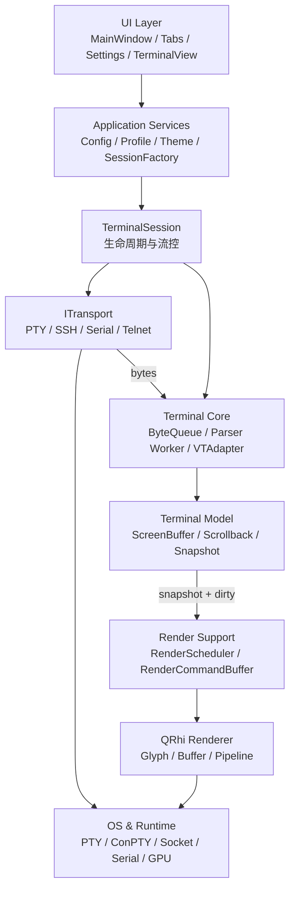
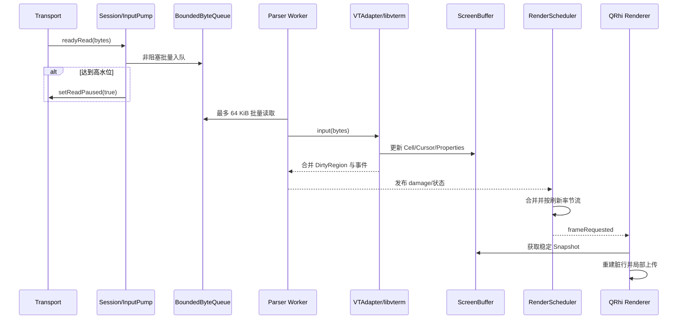
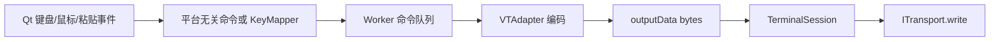
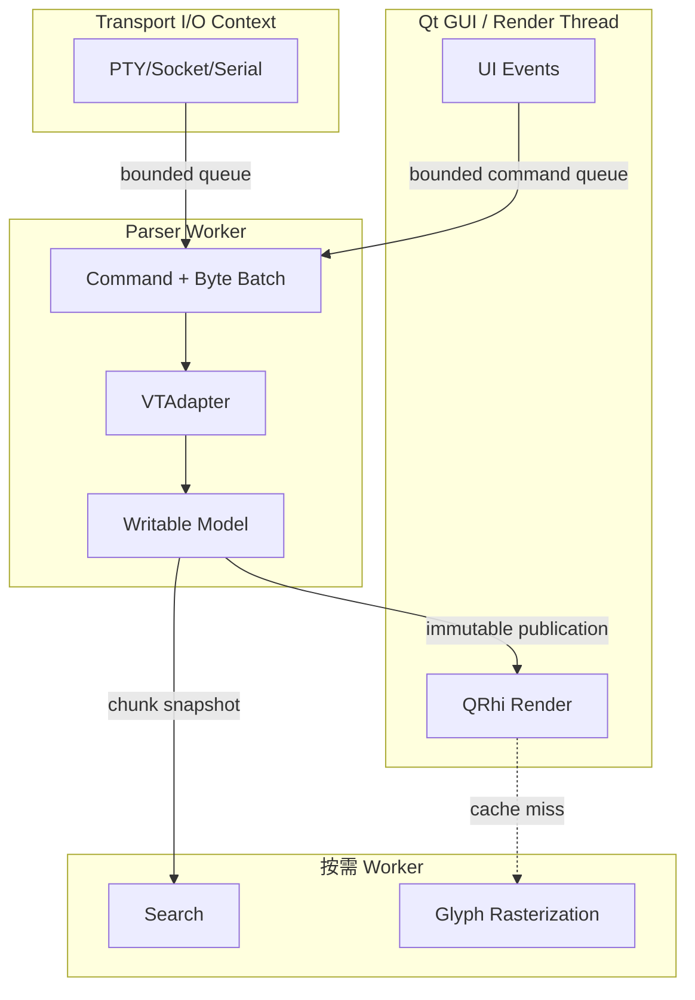
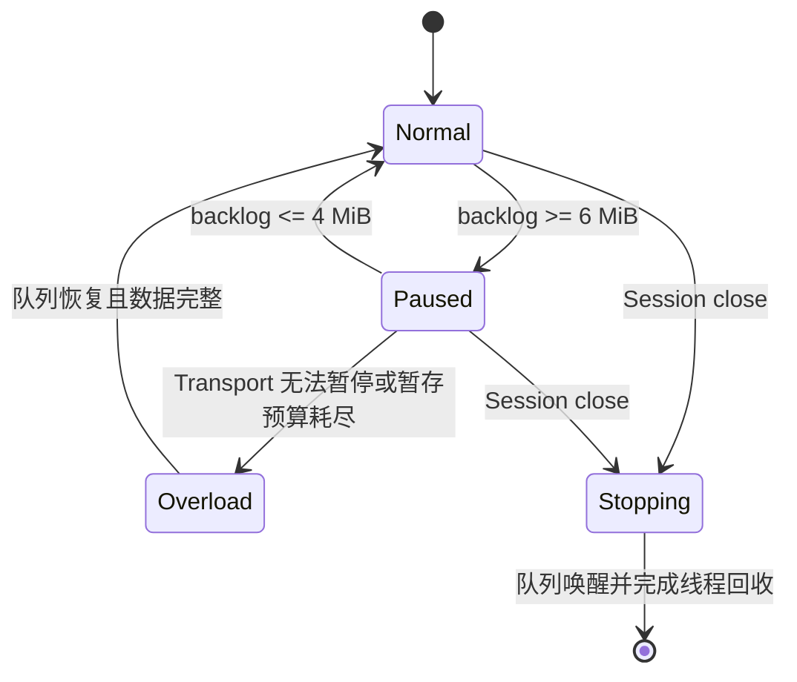

# NovaTerm 统一架构设计

NovaTerm 的统一架构文档集中在本文件；文档索引、配置与主题、渲染架构、路线图及阶段实施说明仍位于 [architecture/README.md](architecture/README.md)。

本文件合并自原 `docs/ARCHITECTURE.md`、`docs/architecture/NovaTerm_Architecture.md` 和 `docs/01_Architecture.md`，完整保留三者内容。

该文档集包含：

- 当前实现与目标架构；
- 分层、数据流、线程、所有权、生命周期和背压设计；
- Profile、Session、配置和主题系统；
- QRhi 增量渲染与 Glyph/GPU 管线；
- P0～P7 路线图及每个阶段的独立实施文档。

`docs/` 中原有的设计和 P0～P3 实施记录继续作为历史资料保留；发生冲突时，以本文件、`docs/architecture/` 配套文档和当前源码为准。

## 1. 愿景与范围

NovaTerm 是基于 Qt 6、libvterm 和 QRhi 的跨平台 GPU 终端。核心目标是：协议解析与 UI 解耦、不同 Transport 共享同一数据通路、持续高输出下 UI 可响应、增量 GPU 渲染、百万行可控 Scrollback。

本文同时描述三类内容：

- **当前实现**：P0～P5 已完成；P5 已完成 Linux Vulkan/OpenGL、Windows D3D11/D3D12 与 Windows 30 分钟长稳验收，macOS Metal 和真实高刷硬件仍待补充；
- **近期目标**：P6；
- **P7**：系统资源查询，SSH 远端资源监控面板与系统信息窗口已作为内置功能落地；
- **下一个大版**：引入 AI MCP（Model Context Protocol）接口，作为 Session 内置的受控只读上下文与工具调用通道。

## 2. 架构原则

1. Parser 单写，Renderer 和 Search 只读。
2. libvterm 类型只能存在于 VTAdapter 实现边界。
3. 核心层（`src/core/`）不依赖任何 UI 框架。Qt 类型（QObject/信号槽、QString、
   QByteArray、QVector、QKeyEvent、QRegularExpression 等）只能出现在 `src/coreqt/`
   门面层及以上；核心层用标准库等价物（std::string(UTF-8)、std::vector、
   std::mutex、ByteView、NovaTerm::Key 等）。目标是核心可在无 Qt 环境编译、
   测试、复用，为替换 UI 框架留出空间。
4. Transport 只处理字节和连接状态，不理解终端 Cell。
5. Renderer 不理解 ANSI、SSH 或配置文件格式。
6. 所有跨线程队列必须有上限、统计和停止语义。
7. 通过不可变快照或版本化共享数据跨线程，不共享无保护可变对象。
8. 先建立正确性测试和基线，再优化。
9. UI Theme、Terminal Scheme 和 Font Config 分离。
10. Session 是运行期资源和生命周期边界，Profile 是创建模板。
11. 每个阶段保持可构建、可测试、可回退定位。

## 3. 系统分层



### 3.1 UI Layer

负责窗口、标签、设置、输入事件、选择和用户反馈。UI 不解析 ANSI，不持有 libvterm，不实现 Transport 缓冲策略。每个终端标签的 `TerminalView` 拥有并驱动一个 `TerminalSession`（1 View : 1 Session），Session 内聚合 Core、Transport 与 InputPump；竞争窗口中的未入队输入由 `SessionInputPump` 暂存，不由 `TerminalView` 保存。

快速连接侧栏保持按连接类型分组，使用无内框的单列树：分组为文件夹图标与标题，会话为设备图标、名称和次要连接信息两行。会话名称与分组标题文字左对齐，分组位置不变；叶子条目收回额外层级缩进及图标宽度差。委托按字体度量计算行高（分组至少 28、会话至少 38 个逻辑像素，文字高度外保留 5 像素余量；会话字号为 10 逻辑像素，度量与绘制一致），长文本省略并通过悬停显示完整内容。名称/主机搜索忽略大小写，隐藏无匹配分组并显示无结果提示，不修改历史记录。展开时左右边距各 8，控件间隔 8；折叠后保留 40 像素侧栏。新建按钮使用局部紫色强调，列表颜色跟随深浅主题，保留键盘焦点、双击重连与右键编辑/删除。

SFTP 文件列表使用紧凑行高 24 个逻辑像素，减少图标上下留白；表头高度与文字、
图标大小保持不变。
首列附加左边距为 1（Ela 默认
为 11），使图标与文件名向左靠近边框。通过 `ElaTreeWidget::setItemHeight()`
和 `setItemLeftPadding()` 局部设置，保留原有主题与其他树控件的默认布局。
会话名称通过 `SftpPanel::windowTitle` 发布，并合并为「SFTP 传输 — 会话名」，不加
「会话：」前缀，面板内不再显示重复的会话标签。会话和语言变化时同步刷新；最小宽度按完整纯文本标题、
拖动柄、按钮及布局边距计算，左右折叠时仍允许收窄到 40 个逻辑像素。
系统资源面板采用相同的标题发布与最小宽度策略，显示「系统资源 — 连接信息」，
移除面板内的会话标签及其分隔线；信息图标位于 CPU 指标行最右侧，与占用条
垂直居中，内存和交换分区的容量文字仍在各自行右侧。
分区列表行高为 22 个逻辑像素，纯文本首列取消左边距，与上方「路径」标题对齐；
容量列保持右对齐。
面板内 CPU、内存、交换标签使用 12 个逻辑像素字号；百分比、容量、网速、网卡、
分区表头与条目及状态提示使用 11 个逻辑像素字号，停靠标题字号不变。
内存与交换容量按整数 MiB 向下取整，紧凑显示为「31/496M」；未配置交换空间时
显示「0/0M」。网速与分区容量保留原有单位格式。
系统资源面板的信息按钮打开独立的“系统信息”窗口，窗口沿用 NovaTerm/Ela
深浅主题与可见滚动条，按 Overview、CPU、GPU、CPU usage、Memory/Swap、
Network interfaces、Filesystems 卡片依次展示。详情消费资源面板共享的采样结果，
不另发远端查询；按 Static / Fast / Slow 分频，不新增指标。静态 CPU 型号、
核心数、OS、Kernel、主机、架构及 GPU 信息在会话接入后**分批**查询（概览最先、
`lspci` 最后，批间隔均匀铺开，见 P7「采集时机与分批调度」），
缓存随 transport 的连接失效，切回标签或重开详情不重复查询。
CPU 累计计数、内存、网络、load、uptime 每秒从 `/proc` 读取，客户端解析并计算
CPU/网络相邻样本差值；CPU 总时间仅累加前八项，guest/guest_nice 不重复计数。
CPU 频率与文件系统每 10 秒通过独立有界命令查询；频率优先读 sysfs，回退
`/proc/cpuinfo`，容量保留 `df -Pk` 并在本地解析。详情可见时共享采样继续，
面板与详情均不可见或主窗口最小化时暂停动态采样，恢复后重建差分基线。

### 3.2 Application Services

负责配置加载、Profile 解析、主题解析、Session 创建与列表管理。服务层输出结构化对象，不要求 Renderer 自行读取 JSON。

### 3.3 TerminalSession

`TerminalSession` 聚合一条 `ITransport`、`SessionInputPump`、`TerminalCore` 与 Scrollback，负责 start、close、resize、reconnect 和错误传播，但不负责绘制细节。**采用「1 TerminalView 拥有 1 TerminalSession」模型**：每个终端标签的 `TerminalView` 自建、驱动并销毁其 Session（`_ownsSession` 默认 true），Session 不反向持有 View/Renderer。原设想的「SessionManager 拥有 Session、View 非 owning attach、Session 脱离 View 后台存活」已放弃，`SessionManager` 类已移除。详见 `docs/architecture/stages/P6_Session_and_Transport.md`。

### 3.4 Terminal Core

`TerminalCore` 是线程安全门面；Worker 独占 `VTAdapter` 和 libvterm 可变状态。
`VTAdapter` 把 libvterm callback 转换成 NovaTerm 的 Cell、DirtyRegion、Cursor 和
属性变化。

**去 Qt 化进度（原则 3）**：核心层的数据类型与多数组件已不依赖 Qt ——
`VTAdapter`、`ScreenBuffer`、`ScrollbackBuffer`/`ChunkedScrollback`、`LineLayout`、
`BoundedByteQueue`、`KeyMapper` 及所有跨模块数据结构（Cell、快照、DisplayLine、
SearchRequest/Batch 等）改用标准库等价物（`std::string`(UTF-8)、`std::vector`、
`std::shared_ptr`、`std::mutex`、`ByteView`、`NovaTerm::Key`/`KeyModifier`）。
尚未完成：`TerminalCore` 本身仍是 `QObject` 门面（信号仍用 QString/QByteArray，
输入仍收 QKeyEvent，Qt→核心的翻译已集中在其匿名命名空间的 `coreKeyFromQt` 等
处）；`SearchEngine`/`ReflowEngine` 仍是 `QObject` 且 `SearchEngine` 内部仍用
`QRegularExpression`（搜索重构暂停）。因此 `novaterm_core` 目前仍链接 `Qt::Core`/
`Qt::Gui`；"核心零 Qt 链接"的收口有待 `QObject` 剥离 + 门面拆分（`src/coreqt/`）
与搜索匹配器注入完成，届时把 QObject/QRegularExpression 相关代码移入门面层。

面向 Agent 的内置文本通路为 `TerminalCore::terminalState()` →
`TerminalContextProvider` → `TerminalSession::terminalContext()`，不经过 Renderer。
Core 在同一模型锁内读取 revision、光标、标题、alternate-screen 模式和文本；
仅返回解析后的 UTF-8，过滤控制字符并拼接软换行（含历史与可见屏幕接缝）。
抽取与缓存硬上限均为 256 KiB / 1024 行，调用方可进一步降低 maxBytes/maxLines。
活动光标行只更新 viewport，完成行进入去重增量缓存；alternate screen 只返回
当前 viewport。模式切换、缓存淘汰或采样截断通过 resetRequired/truncated 表达。
Provider 按需在 Session 线程调用，返回独立值对象；它是 Session 内置接口。

### 3.5 Renderer

Renderer 读取稳定 Snapshot，把 DirtyRegion 转为 row-local、按 8-cell block 缓存的 Render Command，仅上传变化的 GPU Buffer 区间。P5 Renderer 使用完整 cluster GlyphKey、字体 fallback、灰度/彩色多页 Atlas、局部纹理上传、实例化 Quad、material batch 和 GPU 行槽位环；Glyph Atlas 和 GPU 资源只属于 Renderer。

历史显示行布局（`TerminalRenderer::_historyLayout`）**常驻有效**，不再按是否回看丢弃：

- 仅当**列数**变化时发起一次异步全量 reflow（`ReflowEngine`，worker 线程、256 行分批、代际取消）。行数变化不影响折行，不触发重排。
- scrollback 增长或淘汰走增量维护：头部丢弃已淘汰行的显示行，尾条逻辑行重折（`appendContinuation` 会原地追加、`sb_popline` 会原地截断），其后新行逐条追加。代价 O(新增内容)。
- 因此滚动条量程始终是真实显示行数，而不是折行前偏小的逻辑行数。

2026-09-10 增量：`HistoryLayout` 使用逻辑 head，头部淘汰只移动索引；累计
至少 4096 个且达到存储一半时才 compact。`uploadCommands()` 直接构造实例，
不再缩放容器后 append/takeLast。Glyph 位图由 `AsyncGlyphRasterizer` 专用线程
生成，请求/去重上限 512，结果上限 32，每个位图上限 256 KiB；结果与在途位图
最多约 8.25 MiB（不含字体后端缓存）。字体 generation 取消旧任务，析构停止并
join；结果通知合并，渲染线程消费位图并重建仍缺字形的行。Atlas、缓存插入和
QRhi 创建/上传始终在渲染线程，异步结果不持有 QRhi 对象。

### 3.6 Transport

SSH event loop 同时监听网络与可靠 wakeup socket（Unix socketpair、Windows
本地 TCP 对），由控制入口主动唤醒，并按 keepalive/命令/monitor deadline 等待。
SSH→GUI 输入暂存上限 1 MiB，单次交付 64 KiB，最多一个 queued delivery；
暂停时保留数据并停止交付，恢复时重新调度，远端 EOF 等待已接收字节交付后再
发布 disconnected，显式关闭/重连使旧投递失效。`inboundStatistics()` 提供统计。
主 Shell 单轮读取上限 256 KiB 或 2 ms，辅助通道每 stream 为 64 KiB 或 2 ms；
预算耗尽而 libssh 仍有缓冲时立即进入下一轮，避免等待新网络事件。输入泵与
SSH 待写缓冲使用 head offset 消费，仅在空间不足或排空时整理。

所有连接实现 `ITransport`：连接、断开、写入、resize、暂停读取、错误和字节到达。SSH、Serial、Telnet 必须使用与 Local PTY 相同的数据入口。

SSH 的 SFTP、单次命令和资源遥测等辅助 channel 必须复用所属 Transport 的
既有连接，并与交互 Shell 一起只在 SSH 工作线程访问 libssh session。资源快速
采样使用无 PTY 的请求驱动常驻 exec channel：UI 不可见时关闭，空闲时阻塞等待
请求；`df` 等可能阻塞的低频查询使用独立 channel，不能阻塞快速采样。辅助通道
必须具有独立的建立/响应超时、输出上限、取消和 generation/请求 ID 校验。

## 4. 端到端数据流

### 4.1 远端输出到屏幕



### 4.2 用户输入到远端



命令必须按“此前已接收字节完成屏障”排序，避免 resize、输入和输出状态越序。

## 5. 线程模型

NovaTerm 不采用固定“七线程”设计。队列和 ScreenBuffer 是数据结构，不是线程。推荐的最小运行模型如下：



Transport 可以使用 Qt 事件循环、专用读线程或 OS 异步 I/O；这属于实现策略。关键约束是不能因 Parser 积压阻塞 GUI，也不能静默丢失普通终端输出。

## 6. 数据模型与所有权

| 数据 | 唯一写入者 | 读取者 | 发布方式 |
| --- | --- | --- | --- |
| libvterm state | Parser Worker / VTAdapter | VTAdapter | 不跨边界 |
| ScreenBuffer | Parser Worker | Renderer、测试 | Snapshot |
| Scrollback active chunk | Parser Worker | 无直接共享 | seal 后发布 |
| Scrollback sealed chunks | 无写入者 | Renderer、Search | 引用计数只读快照 |
| Cursor/Properties | Parser Worker | UI、Renderer | 批次事件/Snapshot |
| RenderCommandBuffer | GUI/Render 侧 | QRhi 提交 | Renderer 内部 |
| Selection | View/Renderer | Renderer | Overlay |
| Profile | ProfileManager | Session factory、UI | 不可变解析结果 |

早期为整屏值语义拷贝；现已按 §6 的方向落地：每帧渲染路径 `RendererSnapshot` 改为分行不可变存储（每行 `std::shared_ptr<const std::vector<Cell>>` + 每行 revision/内容指纹），未脏行只回填身份哈希、跳过 Cell 拷贝，仅脏行物化；Scrollback 侧以尾部增量窄接口 `scrollbackTail` 替代每批全量快照。整屏值语义 `TerminalSnapshot`/`snapshot()` 仍保留，但仅用于测试与一次性渲染，不在每帧路径。稳定读取语义保持不变。

## 7. 背压和过载



当前 ByteQueue 容量为 8 MiB，高低水位为 6/4 MiB。目标架构中，未入队片段由 Session/InputPump 管理，不由 TerminalView 管理。任何丢弃策略必须显式、可统计，并区分普通输出、遥测或可重试数据。

## 8. 生命周期

Session 状态建议统一为 `Created → Connecting → Running → Paused/Reconnecting → Closing → Closed/Failed`。关闭顺序为：停止接收新任务、暂停 Transport、按策略排空已提交任务、停止并唤醒队列、等待 Worker、销毁 VTAdapter、关闭 Transport、释放视图和 GPU 资源。

禁止 QObject 跨线程无所有权迁移、Worker 持有已销毁 UI 指针，以及 Session 销毁后仍投递回调。

## 9. 当前目录映射

```text
src/
├── core/                # 不依赖 Qt（原则 3）；CoreTypes.h 提供 isize/u8/u32/u64/ByteView
│   ├── terminal/        # BoundedByteQueue、TerminalCore、VTAdapter、ScreenBuffer、KeyMapper
│   ├── scrollback/      # ChunkedScrollback、ScrollbackChunk、Snapshot、LineLayout(reflow)
│   └── search/          # SearchEngine（异步、generation 取消）
├── transport/           # ITransport ← LocalShell / Ssh / Serial / Telnet
├── session/             # TerminalSession、SessionFactory、InputPump、
│                        # SessionStore、SftpSession
├── credential/          # CredentialStore（Windows 凭据库 / 内存实现）
├── profile/             # ProfileStore（当前仅 MemoryProfileStore）
├── renderer/
│   ├── font/            # FontManager（主字体 + fallback，generation 失效）
│   ├── glyph/           # GlyphAtlas(多页)、GlyphCache、GlyphRasterizer
│   ├── gpu/             # QRhi 资源与提交
│   └── shaders/         # .vert/.frag，经 qt_add_shaders 编译为 .qsb
├── platform/
│   ├── windows/conpty/  # ConPtyApi、ConPtySession、WinHandle
│   └── linux/pty/       # PtySession
├── service/             # Config、Language
└── ui/                  # app/(MainWindow)、pages/、terminal/(TerminalView)、widgets/
tests/
├── core/  renderer/  session/  transport/  benchmarks/
```

`src/session/`、`src/profile/`、`src/credential/` 已落地；主题目前由 service 与
UI 层承担，未单独建 `src/theme/`；搜索位于 `src/core/search/` 而非顶层。
仍不为追求目录形式而提前搬迁代码。

去 Qt 化（原则 3）尚未收口：计划中的 Qt 门面目录 `src/coreqt/`（承载
QObject 门面、QtTextMatcher、QtKeyTranslator、metatype 注册）**尚未创建**；
当前 `TerminalCore`/`SearchEngine`/`ReflowEngine` 仍作为 QObject 留在 `src/core/`，
`novaterm_core` 仍链接 Qt。见 §3.4。

## 10. 非功能目标

| 指标 | 目标 | 说明 |
| --- | ---: | --- |
| 持续 Parser 吞吐 | > 20 MiB/s | 分纯解析与完整发布链路 |
| 突发输入 | > 100 MiB/s | 必须注明持续时间与队列变化 |
| UI 线程 Parser 时间 | 0 ms | 入队操作本身另测 P95/P99 |
| 输入端到端延迟 | < 10 ms | 报告 P50/P95/P99 |
| 普通输出帧率 | 60 FPS | 支持 120/144 Hz 配置 |
| 默认 Scrollback | 100,000 行 | 可配置至 1,000,000 行 |
| 内存 | 有明确预算 | 同时按行数和 bytes 淘汰 |

所有性能结果必须注明 OS、CPU、GPU、Qt、编译器、Release 配置、数据集、时长和统计口径。

## 11. 架构决策检查表

- 新类型是否泄漏 libvterm、QRhi 或具体 Transport？
- 跨线程数据是否不可变或受明确同步保护？
- 队列是否有容量、背压、统计、停止和取消？
- Session 关闭、resize、重连时事件顺序是否确定？
- 单字符变化是否避免全屏扫描和全量上传？
- 配置热更新是否明确影响应用、Profile 或当前 Session？
- 新功能是否有正确性测试、压力测试和 Release 指标？

---

## 附录 A：NovaTerm Architecture Design（原 docs/01_Architecture.md）

> **本附录是 2026-07-12 的早期概念设计，仅供追溯，不是当前依据。**
> 与上文第 1–11 节或当前源码冲突时，一律以上文和源码为准；其中的类名、目录
> 结构与阶段规划均可能已过时。

> Version: 1.0
>
> Author: NovaTerm Project
>
> Last Update: 2026-07-12

---

### 1. Project Vision

NovaTerm 是一款现代 GPU 加速终端，目标定位类似：

- WindTerm
- Windows Terminal
- WezTerm
- Ghostty

设计目标：

- 高性能 GPU 渲染
- 百万行 Scrollback
- ANSI/VT100/VT220/xterm 完整兼容
- 多 Session（SSH、Serial、PTY、Telnet）
- 支持 SFTP、服务端资源监视等功能
- 后续支持 AI Assistant
---

### 2. Design Principles

整个项目遵循以下原则：

#### 高内聚

每个模块只负责一种职责。

例如：

- Parser 负责解析 ANSI
- Renderer 负责 GPU 绘制
- Session 负责网络通信
- UI 负责用户交互

彼此互不关心实现细节。

---

#### 低耦合

任何模块均可独立替换。

例如：

```
libvterm
        ↓
Contour Parser
```

Renderer 不需要修改。

例如：

```
OpenGL
        ↓
QRhi
        ↓
Vulkan
```

Terminal Core 不需要修改。

---

#### 数据驱动

所有数据最终汇聚到：

```
ScreenBuffer
```

Renderer 只读取数据。

Parser 只修改数据。

---

### 3. Overall Architecture

```
                    +--------------------------------------+
                    |          FluentUI (QML)              |
                    | MainWindow / Dock / Tabs / Settings  |
                    +------------------+-------------------+
                                       |
                              ITerminalView
                                       |
                +----------------------+----------------------+
                |                                             |
        QQuickItem (QML)                           QOpenGLWidget
                |                                             |
                +----------------------+----------------------+
                                       |
                               Terminal Renderer
                                       |
              +------------------------+------------------------+
              |                                                 |
       Render Scheduler                              Glyph Atlas
              |                                                 |
              +------------------------+------------------------+
                                       |
                                 ScreenBuffer
                                       |
       +-------------+-----------------+----------------+--------------+
       |             |                                  |              |
 DirtyRegion      Cursor                         Selection      Scrollback
                                       |
                                  VT Adapter
                                       |
                                   libvterm
                                       |
                                  Session Layer
                                       |
      +--------------+----------------+---------------+--------------+
      |              |                |               |
    Serial          SSH              PTY           Telnet
```

---

### 4. Layer Responsibilities

#### UI Layer

负责：

- 主窗口
- Dock
- Tab
- Theme
- Settings

不负责：

- ANSI
- VT100
- Parser
- GPU

---

#### Terminal View

TerminalView 只是 GPU Renderer 的容器。

可提供两种实现：

- QWidget(QOpenGLWidget)
- QQuickItem(QML)

两者共享同一个 Renderer。

---

#### Renderer

Renderer 负责：

- Draw Glyph
- Draw Background
- Draw Cursor
- Draw Selection
- Draw Underline
- Draw Hyperlink

Renderer 永远不知道：

- libvterm
- ANSI
- SSH

Renderer 只读取：

```
ScreenBuffer
```

---

#### Render Scheduler

新增独立模块。

负责：

- Dirty Merge
- Frame Scheduling
- FPS 控制
- Render Trigger

避免：

```
Parser

↓

立即 Render
```

正确流程：

```
Parser

↓

Dirty Queue

↓

Merge

↓

Render Once
```

---

#### Glyph Atlas

统一管理：

- FreeType
- Glyph Cache
- Emoji
- Font Fallback
- Texture Atlas

Renderer 永远只使用：

```
Glyph ID
```

而不是：

```
FreeType API
```

---

### 5. ScreenBuffer（核心）

ScreenBuffer 是整个 Terminal Core 的中心。

推荐：

```cpp
struct Cell
{
    uint32_t codepoint;

    uint32_t foreground;

    uint32_t background;

    uint16_t attributes;

    uint16_t fontIndex;
};
```

每一行：

```cpp
class Line
{
    std::vector<Cell> cells;
};
```

整个屏幕：

```cpp
class ScreenBuffer
{
    std::vector<Line> visibleLines;
    // 每行一位软换行标志：该行是否为上一行的自动换行延续。
    std::vector<bool> rowContinuation;
};
```

活动屏幕除 Cell 矩阵外还持有**每行的软换行状态**。它由 `VTAdapter` 从 libvterm 的 `VTermLineInfo::continuation` 全量同步（`vterm_state_get_lineinfo`），libvterm 是该状态的唯一真源 —— `moverect` 收到的是任意矩形，无法从 Cell 拷贝推断行语义，因此在 `writeInput` / `flushDamage` / `onResize` 这些全量同步边界重读整屏。

没有它，超宽输出被自动换行成的多个屏幕行就没有逻辑行身份，复制选区会在行间插入不存在的换行。

原则：

Parser：

```
Write
```

Renderer：

```
Read
```

任何时候：

不要：

```
Renderer 修改 Cell
```

---

### 6. Scrollback

Scrollback 不放在 ScreenBuffer 内。

推荐：

Chunk 化。

例如：

```
Chunk0

4096 Lines
```

```
Chunk1

4096 Lines
```

```
Chunk2

4096 Lines
```

优点：

- 百万行
- 快速滚动
- Search 快
- 内存连续

---

### 7. Dirty Region

libvterm：

产生：

```
Damage Rect
```

不要：

立即 Render。

正确：

```
Damage Rect

↓

Dirty Queue

↓

Merge

↓

Renderer
```

连续多个 Rect：

```
Rect1

Rect2

Rect3
```

合并：

```
Merged Rect
```

减少 GPU Draw Call。

---

### 8. Selection Model

不要：

```
Cell.selected = true
```

推荐：

```
SelectionModel
```

Renderer：

Overlay。

优势：

- Copy
- Search
- Undo
- Hyperlink

全部互不影响。

---

### 9. Search Engine

Search 独立线程。

流程：

```
Scrollback

↓

Search Thread

↓

Match List

↓

Highlight
```

不会阻塞 UI。

---

### 10. VT Adapter

新增：

```
VTAdapter
```

作用：

负责：

```
libvterm callback

↓

ScreenBuffer
```

以后：

如果 Parser 更换：

```
libvterm

↓

Contour Parser

↓

自研 Parser
```

Renderer：

无需修改。

---

### 11. Session Layer

统一接口：

```cpp
class ISession
{
public:

    virtual Read();

    virtual Write();

    virtual Resize();

    virtual Close();
};
```

实现：

- SSH
- Serial
- PTY
- Telnet

统一 Transport。

---

### 12. Thread Model

推荐四线程：

```
Transport Thread

↓

Byte Queue

↓

Parser Thread

↓

ScreenBuffer

↓

Dirty Queue

↓

Render Thread

↓

GPU

↓

UI Thread
```

职责：

Transport：

负责 IO。

Parser：

负责 ANSI。

Render：

负责 GPU。

UI：

负责事件。

互不阻塞。

---

### 13. Data Flow

整个 Terminal Pipeline：

```
Transport

↓

Byte Queue

↓

libvterm

↓

VT Adapter

↓

ScreenBuffer

↓

DirtyRegion

↓

Render Scheduler

↓

Renderer

↓

GPU

↓

TerminalView
```

核心原则：

Parser：

永远不 Render。

Renderer：

永远不解析 ANSI。

UI：

永远不操作 libvterm。

---

### 14. Future Extensions

未来可直接扩展：

- AI Assistant
- AI MCP 接口
- Session Recording
- Replay
- Macro
- SFTP
- File Browser
- Terminal Split
- Workspace
- Cloud Sync

Terminal Core 无需修改。

---

### 15. Final Architecture

最终形成：

```
Transport
      │
      ▼
Parser (libvterm)
      │
      ▼
VT Adapter
      │
      ▼
ScreenBuffer
      │
      ▼
RenderCommand（可选）
      │
      ▼
Renderer
(OpenGL / QRhi / Vulkan)
      │
      ▼
TerminalView
(QML / QWidget)
      │
      ▼
Modern UI
(FluentUI)
```

---

### 16. Core Design Philosophy

NovaTerm 的核心思想：

- Parser 与 Renderer 解耦
- Renderer 与 UI 解耦
- UI 与 Session 解耦
- ScreenBuffer 是唯一的数据中心
- GPU Renderer 只负责绘制
- Parser 只负责协议解析
- 所有模块均可独立替换

最终实现：

**高性能、低耦合、可维护、可扩展的现代 GPU Terminal 架构。**
