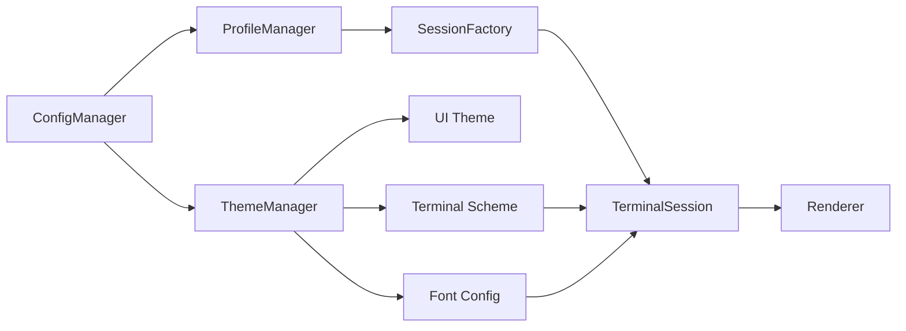
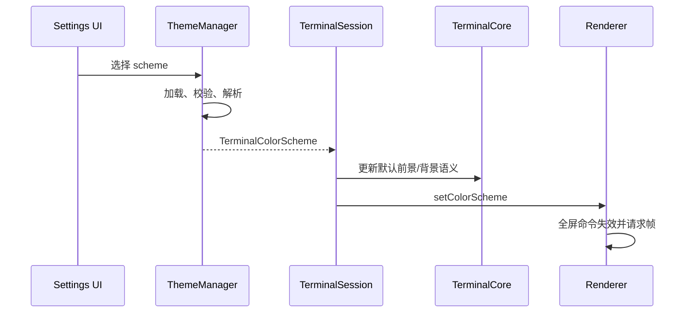

# 配置、Profile、Session 与主题架构

## 1. 职责关系



- Profile：持久化的 Session 创建模板。
- Session：一次运行实例，创建时取得解析后的配置快照。
- UI Theme：应用或窗口级控件外观。
- Terminal Scheme：终端颜色语义，可被 Profile/Session 覆盖。
- Font Config：字体族、字号、字重、fallback 和渲染参数。

修改 Profile 默认不隐式改变已运行 Session。颜色和字体等热更新必须由用户明确应用；字体更新会触发布局、Atlas 和 Buffer 失效，颜色更新通常只触发颜色数据和全屏重绘。

## 2. 配置优先级

```text
内置默认值
  < 全局 settings
  < Profile 配置
  < Session 启动参数
  < Session 临时覆盖
```

所有配置都应先完成 schema 校验、默认值填充和引用解析，再交给 Session 或 Renderer。

## 3. 建议 Profile Schema

```json
{
  "schemaVersion": 1,
  "id": "stable-uuid",
  "name": "Ubuntu SSH",
  "type": "ssh",
  "connection": {
    "host": "192.168.1.100",
    "port": 22,
    "username": "root",
    "credentialRef": "system-keychain-id"
  },
  "terminal": {
    "termType": "xterm-256color",
    "scrollbackLines": 100000
  },
  "appearance": {
    "scheme": "dracula",
    "font": "coding"
  }
}
```

密码、私钥口令和 token 不写入普通 JSON，Profile 只保存系统凭据库引用。Schema 需要版本迁移、未知字段保留策略、唯一 ID 和结构化错误。

## 4. 类型扩展

连接类型使用判别字段和独立 payload：local、ssh、serial、wsl、docker、telnet、custom。共同字段放在 Profile 根或 terminal/appearance；连接专属字段仅由相应 factory/transport 解析。

## 5. 主题数据流



Renderer 禁止读取 JSON，禁止散落硬编码终端颜色。TrueColor Cell 直接携带 RGB；索引色和默认色经 Scheme 解析。

## 6. 验收重点

- Profile 与 Session 生命周期分离；
- 所有引用缺失均产生可定位错误；
- 凭据不明文落盘；
- UI Theme 不改变 ANSI 颜色语义；
- Scheme 切换不重建 Session；
- Font 切换正确触发 resize、Glyph 缓存和 GPU 容量更新；
- 旧 schema 可迁移并有测试。

