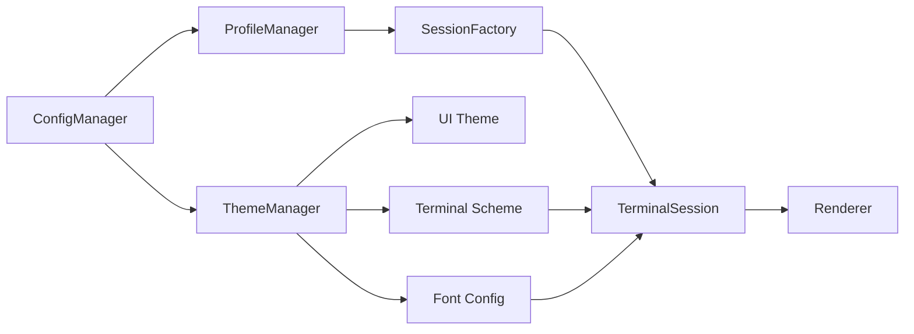
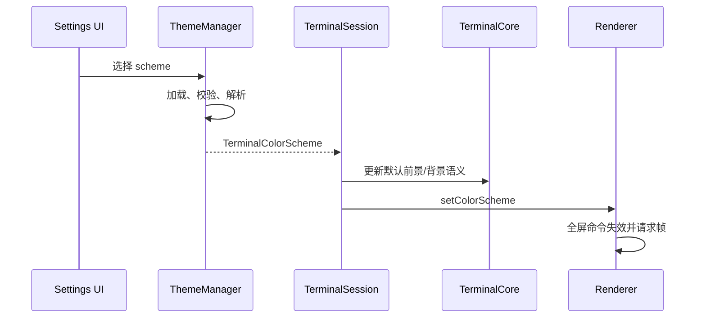

# 配置、Profile、Session 与主题架构

> **本文描述目标设计，图中部分组件名与当前源码不一致。** 名称对照与落地情况：
>
> | 本文中的名称 | 当前实现 |
> | --- | --- |
> | `ConfigManager` | `src/service/ConfigManager.*` —— 已落地 |
> | `ProfileManager` | 无此类；对应 `src/profile/ProfileStore.*`，且目前只有 `MemoryProfileStore`，无持久化实现 |
> | `ThemeManager` | 无此类；UI 主题由 ElaWidgetTools 与 `ConfigManager` 承担；`TerminalSchemeStore` 解析终端配色，Renderer 消费 `TerminalColorScheme` |
> | `SessionFactory` | `src/session/SessionFactory.*` 已实现，但**生产代码尚未使用**（详见 P6 阶段文档"实现进度"表第 10 行） |
>
> 第 3 节的 Profile Schema 同为建议格式；当前实际持久化的是
> `SessionStore` 写入的 `session-history.json`，其 transport 子图为扁平键值
> （`host`/`port`/`terminalType` 等），与本文的嵌套 `connection{}` 结构不同。
> 修改本文的设计前请先对照源码现状。

## 当前实现：终端配色（2026-09-15）

设置页的「终端配色」按 **深色 / 浅色 → 命名方案** 组织，默认深色。
这里的深浅只描述终端渲染区域，与 NovaTerm 的程序主题独立：程序浅色时仍可
使用深色终端，改变 `ui.theme` 不会改变终端配色。

内置 12 套方案，深色 9 套（Campbell、Campbell Powershell、Vintage、
One Half Dark、Tango Dark、Dracula、Tokyo Night、Solarized Dark、Dark Pastels），
浅色 3 套（One Half Light、Tango Light、Black on White）。分类由背景的感知亮度
确定；将自定义背景改为浅色时，编辑器会把方案移到浅色分类。

- `TerminalSchemeStore`（`src/service/`）加载内置方案并按名称合并用户方案，
  负责校验、引用解析、重命名、删除和旧格式迁移；不创建 Session/Renderer。
  预置值来自 `resources/terminal-color-schemes.json`，通过 Qt 资源随程序分发。
  启动和保存时补齐完整方案库；已持久化的有效颜色及未知扩展字段优先保留，
  升级不会用模板覆盖用户修改。模板同时作为「恢复内置配色」的依据。
- `TerminalSchemeSettings` 在本地草稿里预览、修改 16 个 ANSI 色以及前景、背景、
  光标、选区颜色；可以复制、重命名、删除自定义方案，内置方案可以修改并恢复。
- 「保存并应用」通过 `ConfigManager::setValues()` 一次持久化，已打开的
  `TerminalView` 合并变更通知后更新 Renderer。不会重连、清屏、改写历史文本。
  「放弃修改」恢复最后保存的数据。普通浏览与编辑预览不影响运行中的终端。
  如果配置文件保存失败，保留编辑草稿、回滚本批配置且不向终端发布变更。

完整方案库与选择共同持久化在可执行文件旁的 `novaterm.json`，由同一次
`QSaveFile` 原子提交，避免重命名后引用与方案内容分属两次写入。
文件中的终端选择部分示例（完整文件还包含 `schemes` 数组）：

```json
{
  "terminal": {
    "appearance": "dark",
    "colorScheme": {
      "dark": "Dracula",
      "light": "One Half Light"
    }
  }
}
```

`appearance` 是终端自己的分类选择，不是跟随程序/系统主题。`colorScheme` 也兼容
单个方案名字符串；设置页保存时会记录两个分类各自的方案名，方便来回切换。
`schemes` 保存全部预置方案与自定义方案的完整颜色值，首次启动会写入 12 套。
旧版本只保存覆盖项的数组会自动补齐，已有自定义颜色不变。
方案格式采用 Windows Terminal 的字段名：
`name`、`foreground`、`background`、`cursorColor`、`selectionBackground`，
以及 `black/red/green/yellow/blue/purple/cyan/white` 和对应的八个 `bright*` 字段。
`magenta`/`brightMagenta` 可作为紫色字段的别名。每个方案必须有完整 16 色，
无效方案不会遮蔽同名内置方案，缺失引用回退到该分类的默认方案。

颜色使用 `#RGB` 或 `#RRGGBB`。NovaTerm 用覆盖层绘制选区，因此普通 RGB
`selectionBackground` 按 25% 不透明度叠加；为兼容旧配置，它另接受明确的
`#AARRGGBB`。其余颜色不接受 alpha。ANSI 索引 0–15 从方案查色；其他索引色与
程序显式指定的 TrueColor 不随方案改变。

旧 `terminal.colors` 会迁移成命名方案，未修改的 Campbell 配置只保留内置名称。
迁移保留旧选区透明度和有效颜色、避免覆盖已有同名方案，且可重复运行。
旧 `system` 迁移为深浅两个默认引用，终端分类默认固定为深色，之后不再跟随程序主题。
自定义方案重命名会更新深浅引用；删除后对应引用回退，删除内置覆盖则恢复内置值。

验证在现有 `novaterm_renderer_tests`（方案格式/迁移/引用/渲染内容保持）、
`novaterm_ui_dialog_layout_tests`（分类、草稿、复制、保存、放弃）和
`novaterm_terminal_session_tests`（多 View 更新、程序主题独立）中进行。
持久化回归使用临时配置文件和多个全新子进程，验证初始化、修改、重命名、
删除和恢复内置后的再次加载，并验证保存失败不发布变更；不写真实用户配置。
`savedSchemeRepaintsExistingTerminalPixels` 读取实际 GPU 画面，验证修改并保存同名
方案后无需新输入即可改变已有 ANSI 背景和终端底色，TrueColor 保持不变，
已隐藏的另一个终端也获得新方案，Session 和光标位置不变。
Profile 专属覆盖仍是下文的目标设计，本次接入的是全局终端配置。

参考：[Windows Terminal 配色格式](https://learn.microsoft.com/windows/terminal/customize-settings/color-schemes)。

## 1. 职责关系


```mermaid
flowchart LR
    CFG[ConfigManager] --> PM[ProfileManager]
    CFG --> TM[ThemeManager]
    PM --> SF[SessionFactory]
    SF --> S[TerminalSession]
    TM --> UI[UI Theme]
    TM --> TS[Terminal Scheme]
    TM --> FC[Font Config]
    TS --> S
    FC --> S
    S --> R[Renderer]
```

- Profile：持久化的 Session 创建模板。
- Session：一次运行实例，创建时取得解析后的配置快照。
- UI Theme：应用或窗口级控件外观。
- Terminal Scheme：终端颜色语义，可被 Profile/Session 覆盖。
- Font Config：字体族、字号、字重、fallback 和渲染参数。

修改 Profile 默认不隐式改变已运行 Session。颜色和字体等热更新必须由用户明确应用；字体更新会触发布局、Atlas 和 Buffer 失效，颜色更新通常只触发颜色数据和全屏重绘。

## 2. 配置优先级

```text
内置默认值
  < 全局 settings
  < Profile 配置
  < Session 启动参数
  < Session 临时覆盖
```

所有配置都应先完成 schema 校验、默认值填充和引用解析，再交给 Session 或 Renderer。

## 3. 建议 Profile Schema

```json
{
  "schemaVersion": 1,
  "id": "stable-uuid",
  "name": "Ubuntu SSH",
  "type": "ssh",
  "connection": {
    "host": "192.168.1.100",
    "port": 22,
    "username": "root",
    "credentialRef": "system-keychain-id"
  },
  "terminal": {
    "termType": "xterm-256color"
  },
  "appearance": {
    "scheme": "dracula",
    "font": "coding"
  }
}
```

密码、私钥口令和 token 不写入普通 JSON，Profile 只保存系统凭据库引用。**当前实现**
（`src/credential/CredentialStore.cpp`）：Windows 存 Credential Manager，Linux/BSD 存
freedesktop Secret Service（`org.freedesktop.secrets`，gnome-keyring 与 KWallet 均实现），
加密由密钥环负责，NovaTerm 自己不落明文文件；macOS 与没有会话总线/密钥环的环境回退进程内
内存实现（`MemoryCredentialStore`），此时历史会话的 `credentialRef` 在下次启动取不到密码，
界面提示重新输入 —— 重启后仍要免输入密码，必须接入 macOS Keychain（未做）。Schema 需要版本
迁移、未知字段保留策略、唯一 ID 和结构化错误。

## 4. 类型扩展

连接类型使用判别字段和独立 payload：local、ssh、serial、wsl、docker、telnet、custom。共同字段放在 Profile 根或 terminal/appearance；连接专属字段仅由相应 factory/transport 解析。

## 5. 主题数据流


```mermaid
sequenceDiagram
    participant U as Settings UI
    participant T as ThemeManager
    participant S as TerminalSession
    participant C as TerminalCore
    participant R as Renderer
    U->>T: 选择 scheme
    T->>T: 加载、校验、解析
    T-->>S: TerminalColorScheme
    S->>C: 更新默认前景/背景语义
    S->>R: setColorScheme
    R->>R: 全屏命令失效并请求帧
```

Renderer 禁止读取 JSON，禁止散落硬编码终端颜色。TrueColor Cell 直接携带 RGB；索引色和默认色经 Scheme 解析。

## 6. 验收重点

- Profile 与 Session 生命周期分离；
- 所有引用缺失均产生可定位错误；
- 凭据不明文落盘（落平台密钥链：Windows Credential Manager / freedesktop Secret
  Service；无密钥环时的内存回退允许"重启后需重新输入"，不允许落明文文件）；
- UI Theme 不改变 ANSI 颜色语义；
- Scheme 切换不重建 Session；
- Font 切换正确触发 resize、Glyph 缓存和 GPU 容量更新；
- 旧 schema 可迁移并有测试。

