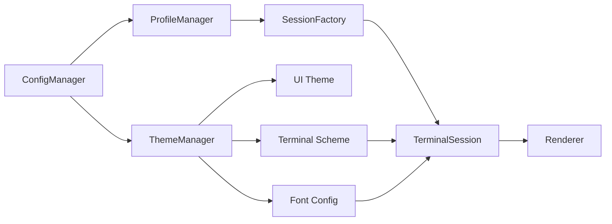
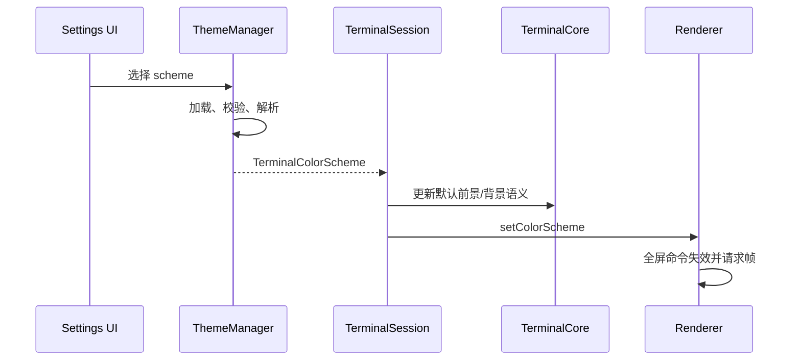

# 配置、Profile、Session 与主题架构

> **本文描述目标设计，图中部分组件名与当前源码不一致。** 名称对照与落地情况：
>
> | 本文中的名称 | 当前实现 |
> | --- | --- |
> | `ConfigManager` | `src/service/ConfigManager.*` —— 已落地 |
> | `ProfileManager` | 无此类；对应 `src/profile/ProfileStore.*`，且目前只有 `MemoryProfileStore`，无持久化实现 |
> | `ThemeManager` | 无此类；UI 主题由 ElaWidgetTools 与 `ConfigManager` 承担，终端配色在 `src/renderer/TerminalColorScheme.*` |
> | `SessionFactory` | `src/session/SessionFactory.*` 已实现，但**生产代码尚未使用**（详见 P6 阶段文档"实现进度"表第 10 行） |
>
> 第 3 节的 Profile Schema 同为建议格式；当前实际持久化的是
> `SessionStore` 写入的 `session-history.json`，其 transport 子图为扁平键值
> （`host`/`port`/`terminalType` 等），与本文的嵌套 `connection{}` 结构不同。
> 修改本文的设计前请先对照源码现状。

## 1. 职责关系


```mermaid
flowchart LR
    CFG[ConfigManager] --> PM[ProfileManager]
    CFG --> TM[ThemeManager]
    PM --> SF[SessionFactory]
    SF --> S[TerminalSession]
    TM --> UI[UI Theme]
    TM --> TS[Terminal Scheme]
    TM --> FC[Font Config]
    TS --> S
    FC --> S
    S --> R[Renderer]
```

- Profile：持久化的 Session 创建模板。
- Session：一次运行实例，创建时取得解析后的配置快照。
- UI Theme：应用或窗口级控件外观。
- Terminal Scheme：终端颜色语义，可被 Profile/Session 覆盖。
- Font Config：字体族、字号、字重、fallback 和渲染参数。

修改 Profile 默认不隐式改变已运行 Session。颜色和字体等热更新必须由用户明确应用；字体更新会触发布局、Atlas 和 Buffer 失效，颜色更新通常只触发颜色数据和全屏重绘。

## 2. 配置优先级

```text
内置默认值
  < 全局 settings
  < Profile 配置
  < Session 启动参数
  < Session 临时覆盖
```

所有配置都应先完成 schema 校验、默认值填充和引用解析，再交给 Session 或 Renderer。

## 3. 建议 Profile Schema

```json
{
  "schemaVersion": 1,
  "id": "stable-uuid",
  "name": "Ubuntu SSH",
  "type": "ssh",
  "connection": {
    "host": "192.168.1.100",
    "port": 22,
    "username": "root",
    "credentialRef": "system-keychain-id"
  },
  "terminal": {
    "termType": "xterm-256color",
    "scrollbackLines": 100000
  },
  "appearance": {
    "scheme": "dracula",
    "font": "coding"
  }
}
```

密码、私钥口令和 token 不写入普通 JSON，Profile 只保存系统凭据库引用。**当前实现**
（`src/credential/CredentialStore.cpp`）：Windows 存 Credential Manager，Linux/BSD 存
freedesktop Secret Service（`org.freedesktop.secrets`，gnome-keyring 与 KWallet 均实现），
加密由密钥环负责，NovaTerm 自己不落明文文件；macOS 与没有会话总线/密钥环的环境回退进程内
内存实现（`MemoryCredentialStore`），此时历史会话的 `credentialRef` 在下次启动取不到密码，
界面提示重新输入 —— 重启后仍要免输入密码，必须接入 macOS Keychain（未做）。Schema 需要版本
迁移、未知字段保留策略、唯一 ID 和结构化错误。

## 4. 类型扩展

连接类型使用判别字段和独立 payload：local、ssh、serial、wsl、docker、telnet、custom。共同字段放在 Profile 根或 terminal/appearance；连接专属字段仅由相应 factory/transport 解析。

## 5. 主题数据流


```mermaid
sequenceDiagram
    participant U as Settings UI
    participant T as ThemeManager
    participant S as TerminalSession
    participant C as TerminalCore
    participant R as Renderer
    U->>T: 选择 scheme
    T->>T: 加载、校验、解析
    T-->>S: TerminalColorScheme
    S->>C: 更新默认前景/背景语义
    S->>R: setColorScheme
    R->>R: 全屏命令失效并请求帧
```

Renderer 禁止读取 JSON，禁止散落硬编码终端颜色。TrueColor Cell 直接携带 RGB；索引色和默认色经 Scheme 解析。

## 6. 验收重点

- Profile 与 Session 生命周期分离；
- 所有引用缺失均产生可定位错误；
- 凭据不明文落盘（落平台密钥链：Windows Credential Manager / freedesktop Secret
  Service；无密钥环时的内存回退允许"重启后需重新输入"，不允许落明文文件）；
- UI Theme 不改变 ANSI 颜色语义；
- Scheme 切换不重建 Session；
- Font 切换正确触发 resize、Glyph 缓存和 GPU 容量更新；
- 旧 schema 可迁移并有测试。

