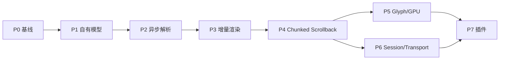

# NovaTerm 分阶段开发路线图

## 1. 依赖关系

阶段编号表示默认落地顺序，不禁止无侵入的前期调研。任何阶段不得绕过前一阶段确立的数据所有权。

## 2. 状态与重点

| 阶段 | 状态 | 开发重点 | 关键退出条件 |
| --- | --- | --- | --- |
| P0 | 已完成 | 测试、独立 Core、性能基线 | 基准可重复、Core 独立构建 |
| P1 | 已完成 | Cell/ScreenBuffer/VTAdapter | Renderer 无 `VTerm*` |
| P2 | 已完成 | Worker、队列、背压、生命周期 | UI 不解析、无死锁/丢数据 |
| P3 | 实现完成；待实机验收 | 调度、脏行、局部上传 | 单 Cell 不全屏扫描，60 FPS 实测 |
| P4 | 计划中 | Chunk、快照、reflow、搜索 | 百万行内存受控，搜索不阻塞 |
| P5 | 计划中 | 多页 Atlas、fallback、instancing | CJK/Emoji/DPI 正确且上传增量化 |
| P6 | 计划中 | Session、Manager、SSH/Serial/Telnet | 多会话隔离、完整生命周期 |
| P7 | 计划中 | 权限化插件 API | 插件失败不影响主通路 |

## 3. 跨阶段质量门

每阶段必须运行 Parser、Unicode、resize/alternate screen、输入、Scrollback、生命周期、Renderer 和压力测试。影响性能路径时必须给出 Release 前后对比；影响线程或生命周期时必须覆盖高负载关闭和重复创建销毁。

## 4. 统一完成定义

“完成”同时要求：设计边界落地、代码构建、自动化测试通过、文档更新、无未解释数据损失。性能目标未达成时可标记“功能完成”，但必须保留公开指标和后续优化项，不得写成全面验收完成。

