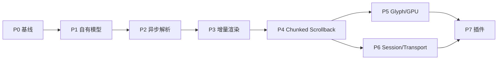

# NovaTerm 分阶段开发路线图

## 1. 依赖关系

```mermaid
flowchart LR
    P0[P0 基线] --> P1[P1 自有模型]
    P1 --> P2[P2 异步解析]
    P2 --> P3[P3 增量渲染]
    P3 --> P4[P4 Chunked Scrollback]
    P4 --> P5[P5 Glyph/GPU]
    P4 --> P6[P6 Session/Transport]
    P5 --> P7[P7 插件]
    P6 --> P7
```

阶段编号表示默认落地顺序，不禁止无侵入的前期调研。任何阶段不得绕过前一阶段确立的数据所有权。

## 2. 状态与重点

| 阶段 | 状态 | 开发重点 | 关键退出条件 |
| --- | --- | --- | --- |
| P0 | 已完成（2026-07-29） | 测试、独立 Core、性能基线 | 基准可重复、Core 独立构建 |
| P1 | 退出标准已达成（2026-07-29 架构边界落地）；已完成增量：宽字符 continuation 回归（2026-09-03）、chunk 快照碎片化成本优化（尾部增量窄接口，2026-09-08）；剩余两个不阻塞边角项——活动屏幕不参与搜索、`dim`/`protectedCell` 因 vendored libvterm screen 层无来源 | Cell/ScreenBuffer/VTAdapter | Renderer 无 `VTerm*` |
| P2 | 功能与 20 MiB/s 性能目标完成（2026-08-01） | Worker、队列、背压、生命周期 | UI 不解析、无死锁/丢数据 |
| P3 | 实现与 Vulkan/OpenGL 实机 60 FPS 跑分完成（2026-08-01）；待高刷新率、资源恢复与人工视觉验收 | 调度、脏行、局部上传 | 单 Cell 不全屏扫描，60 FPS 实测 |
| P4 | 已完成（2026-08-01） | Chunk、快照、reflow、搜索 | 百万行内存受控，搜索不阻塞 |
| P5 | 实施完成；Linux Vulkan/OpenGL、Windows D3D11/D3D12 与 30 分钟长稳验收完成（2026-08-02）；macOS Metal、多屏 DPR 与 120/144 Hz 验收待完成 | 多页 Atlas、fallback、instancing | CJK/Emoji/DPI 正确且上传增量化 |
| P6 | 进行中：Transport 四种完成，会话编排采用「1 View 拥有 1 Session」已在生产；剩少量自包含项 | Session（View-owned）、SSH/Serial/Telnet | 每 View 一会话、完整生命周期 |
| P7 | 计划中（依赖核心数据通路与 Session API 稳定） | 权限化插件 API | 插件失败不影响主通路 |

## 3. 跨阶段质量门

每阶段必须运行 Parser、Unicode、resize/alternate screen、输入、Scrollback、生命周期、Renderer 和压力测试。影响性能路径时必须给出 Release 前后对比；影响线程或生命周期时必须覆盖高负载关闭和重复创建销毁。

## 4. 统一完成定义

“完成”同时要求：设计边界落地、代码构建、自动化测试通过、文档更新、无未解释数据损失。性能目标未达成时可标记“功能完成”，但必须保留公开指标和后续优化项，不得写成全面验收完成。

