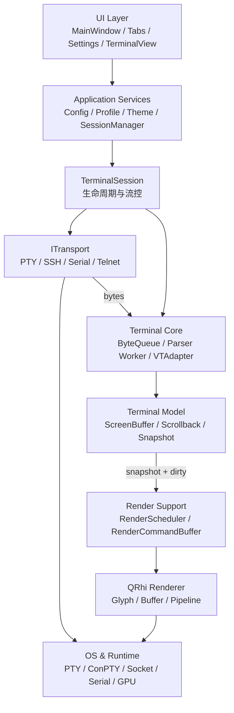
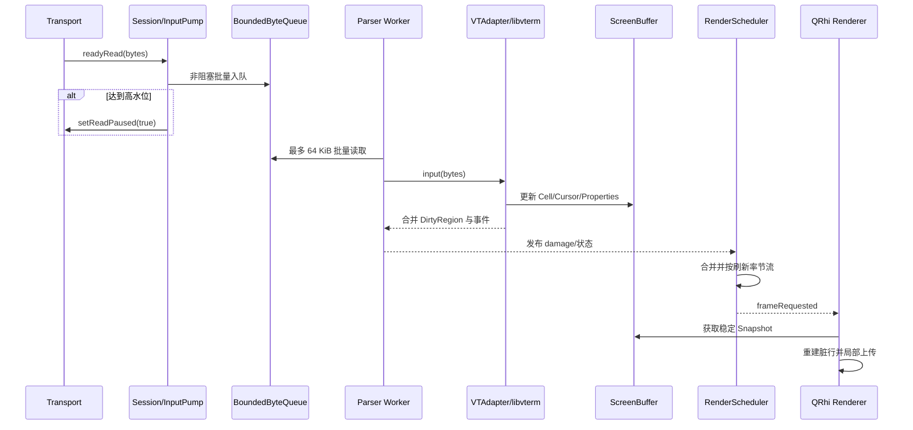
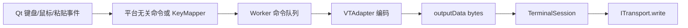
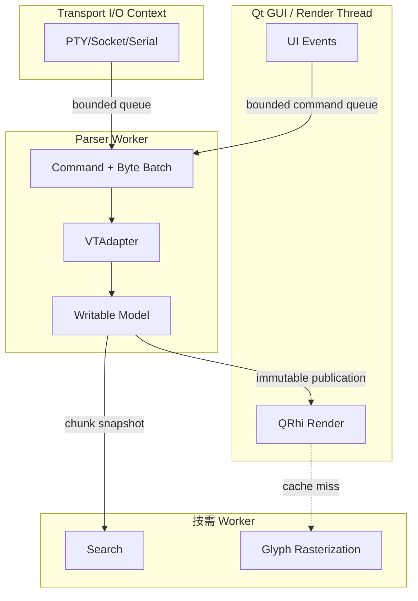
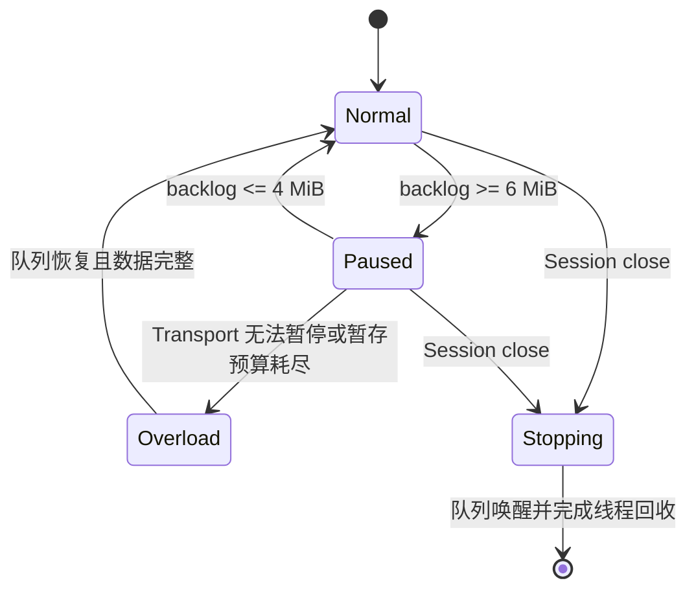

# NovaTerm 统一架构设计

## 1. 愿景与范围

NovaTerm 是基于 Qt 6、libvterm 和 QRhi 的跨平台 GPU 终端。核心目标是：协议解析与 UI 解耦、不同 Transport 共享同一数据通路、持续高输出下 UI 可响应、增量 GPU 渲染、百万行可控 Scrollback，以及可扩展但不破坏核心所有权的插件体系。

本文同时描述三类内容：

- **当前实现**：P0～P5 已完成；P5 已完成 Linux Vulkan/OpenGL、Windows D3D11/D3D12 与 Windows 30 分钟长稳验收，macOS Metal 和真实高刷硬件仍待补充；
- **近期目标**：P6；
- **远期扩展**：P7。

## 2. 架构原则

1. Parser 单写，Renderer、Search 和插件只读。
2. libvterm 类型只能存在于 VTAdapter 实现边界。
3. Transport 只处理字节和连接状态，不理解终端 Cell。
4. Renderer 不理解 ANSI、SSH 或配置文件格式。
5. 所有跨线程队列必须有上限、统计和停止语义。
6. 通过不可变快照或版本化共享数据跨线程，不共享无保护可变对象。
7. 先建立正确性测试和基线，再优化。
8. UI Theme、Terminal Scheme 和 Font Config 分离。
9. Session 是运行期资源和生命周期边界，Profile 是创建模板。
10. 每个阶段保持可构建、可测试、可回退定位。

## 3. 系统分层



### 3.1 UI Layer

负责窗口、标签、设置、输入事件、选择和用户反馈。UI 不解析 ANSI，不持有 libvterm，不实现 Transport 缓冲策略。当前 `TerminalView` 仍组合 Core、Renderer 和 Transport，并暂存竞争窗口中的输入；P6 应将这些运行期职责下沉到 `TerminalSession`。

### 3.2 Application Services

负责配置加载、Profile 解析、主题解析、Session 创建与列表管理。服务层输出结构化对象，不要求 Renderer 自行读取 JSON。

### 3.3 TerminalSession

目标 Session 聚合：Transport、输入泵、ByteQueue、TerminalCore、Scrollback、状态和渲染调度关联。它负责 start、close、resize、reconnect、后台策略和错误传播，但不负责绘制细节。

### 3.4 Terminal Core

`TerminalCore` 是线程安全 Qt 门面；Worker 独占 `VTAdapter` 和 libvterm 可变状态。`VTAdapter` 把 libvterm callback 转换成 NovaTerm 的 Cell、DirtyRegion、Cursor 和属性变化。

### 3.5 Renderer

Renderer 读取稳定 Snapshot，把 DirtyRegion 转为 row-local、按 8-cell block 缓存的 Render Command，仅上传变化的 GPU Buffer 区间。P5 Renderer 使用完整 cluster GlyphKey、字体 fallback、灰度/彩色多页 Atlas、局部纹理上传、实例化 Quad、material batch 和 GPU 行槽位环；Glyph Atlas 和 GPU 资源只属于 Renderer。live-bottom 不构建全历史 reflow，用户进入回看时才惰性生成历史布局。

### 3.6 Transport

所有连接实现 `ITransport`：连接、断开、写入、resize、暂停读取、错误和字节到达。SSH、Serial、Telnet 必须使用与 Local PTY 相同的数据入口。

## 4. 端到端数据流

### 4.1 远端输出到屏幕



### 4.2 用户输入到远端



命令必须按“此前已接收字节完成屏障”排序，避免 resize、输入和输出状态越序。

## 5. 线程模型

NovaTerm 不采用固定“七线程”设计。队列和 ScreenBuffer 是数据结构，不是线程。推荐的最小运行模型如下：



Transport 可以使用 Qt 事件循环、专用读线程或 OS 异步 I/O；这属于实现策略。关键约束是不能因 Parser 积压阻塞 GUI，也不能静默丢失普通终端输出。

## 6. 数据模型与所有权

| 数据 | 唯一写入者 | 读取者 | 发布方式 |
| --- | --- | --- | --- |
| libvterm state | Parser Worker / VTAdapter | VTAdapter | 不跨边界 |
| ScreenBuffer | Parser Worker | Renderer、测试 | Snapshot |
| Scrollback active chunk | Parser Worker | 无直接共享 | seal 后发布 |
| Scrollback sealed chunks | 无写入者 | Renderer、Search | 引用计数只读快照 |
| Cursor/Properties | Parser Worker | UI、Renderer | 批次事件/Snapshot |
| RenderCommandBuffer | GUI/Render 侧 | QRhi 提交 | Renderer 内部 |
| Selection | View/Renderer | Renderer | Overlay |
| Profile | ProfileManager | Session factory、UI | 不可变解析结果 |

当前值语义 Snapshot 保证安全，但后续应使用共享不可变存储、分行版本或 COW 降低每帧复制成本。优化不得破坏稳定读取语义。

## 7. 背压和过载



当前 ByteQueue 容量为 8 MiB，高低水位为 6/4 MiB。目标架构中，未入队片段由 Session/InputPump 管理，不由 TerminalView 管理。任何丢弃策略必须显式、可统计，并区分普通输出、遥测或可重试数据。

## 8. 生命周期

Session 状态建议统一为 `Created → Connecting → Running → Paused/Reconnecting → Closing → Closed/Failed`。关闭顺序为：停止接收新任务、暂停 Transport、按策略排空已提交任务、停止并唤醒队列、等待 Worker、销毁 VTAdapter、关闭 Transport、释放视图和 GPU 资源。

禁止 QObject 跨线程无所有权迁移、Worker 持有已销毁 UI 指针，以及 Session 销毁后仍投递回调。

## 9. 当前目录映射

```text
src/
├── core/terminal/       # Queue、Core、VTAdapter、Screen/Scrollback、类型
├── renderer/            # Scheduler、CommandBuffer、QRhi Renderer、Scheme
├── transport/           # ITransport、LocalShellTransport
├── service/             # Config、Language；后续 Profile/Theme/Session 服务
└── ui/                  # Application、页面、TerminalView、Widgets
tests/
├── core/
└── renderer/
benchmarks/
```

目标演进时可新增 `src/session/`、`src/profile/`、`src/theme/` 和 `src/search/`；不为追求目录形式而提前搬迁代码。

## 10. 非功能目标

| 指标 | 目标 | 说明 |
| --- | ---: | --- |
| 持续 Parser 吞吐 | > 20 MiB/s | 分纯解析与完整发布链路 |
| 突发输入 | > 100 MiB/s | 必须注明持续时间与队列变化 |
| UI 线程 Parser 时间 | 0 ms | 入队操作本身另测 P95/P99 |
| 输入端到端延迟 | < 10 ms | 报告 P50/P95/P99 |
| 普通输出帧率 | 60 FPS | 支持 120/144 Hz 配置 |
| 默认 Scrollback | 100,000 行 | 可配置至 1,000,000 行 |
| 内存 | 有明确预算 | 同时按行数和 bytes 淘汰 |

所有性能结果必须注明 OS、CPU、GPU、Qt、编译器、Release 配置、数据集、时长和统计口径。

## 11. 架构决策检查表

- 新类型是否泄漏 libvterm、QRhi 或具体 Transport？
- 跨线程数据是否不可变或受明确同步保护？
- 队列是否有容量、背压、统计、停止和取消？
- Session 关闭、resize、重连时事件顺序是否确定？
- 单字符变化是否避免全屏扫描和全量上传？
- 配置热更新是否明确影响应用、Profile 或当前 Session？
- 新功能是否有正确性测试、压力测试和 Release 指标？

