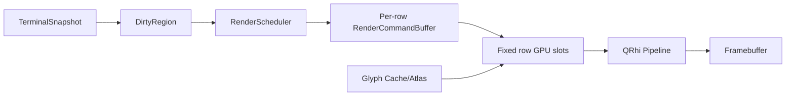
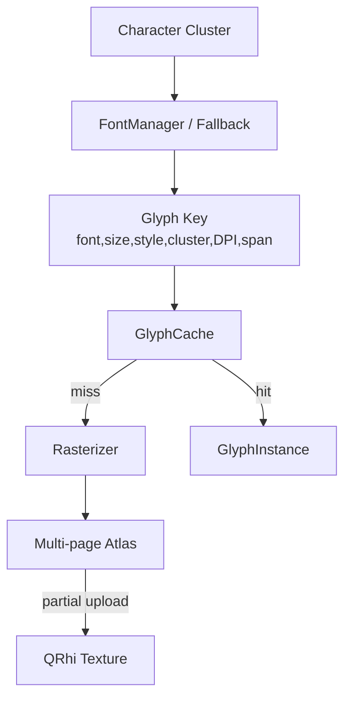

# NovaTerm 渲染架构

## 1. 管线

P3 当前采用固定行槽位实现局部上传：每行独立背景区和内容区，Overlay 独立。提交顺序为“全部背景 → 全部内容 → Overlay”，避免相邻背景覆盖字形抗锯齿边缘。

## 2. RenderScheduler

Scheduler 裁剪并合并相邻/重叠 DirtyRegion；区域超过 32 个或覆盖率达到 60% 时升级全屏；按 60/120/144 Hz 每帧间隔最多提交一次。Cursor 和 Selection 只使 Overlay 失效。

## 3. Command 模型

后端无关命令包括 BackgroundRect、GlyphInstance、Underline、Strike、Cursor、Selection，以及预留 Hyperlink/Search Overlay。命令只保存逻辑矩形、UV 和颜色，不持有 QRhi 资源。

## 4. Snapshot 与增量更新

每帧只获取一次稳定 Snapshot。普通 damage 只重建相交行；未变化行保留 CPU 命令和 GPU 数据。当前值语义 Snapshot 后续可替换为共享不可变行/Chunk，但 Renderer API 应继续只读。

## 5. Glyph 目标架构

P5 的多页 Atlas、LRU、局部上传、CJK fallback、组合字符、Emoji、DPI/generation 失效与资源恢复已完成 Linux Vulkan/OpenGL 本机验收；跨平台、多档真实 DPR 与长稳验收状态以 P5 阶段文档为准。

## 6. 退化与恢复

- resize、字体、主题、滚动映射和 GPU 资源恢复触发全屏失效；
- 固定槽位不足时扩容，禁止截断命令；
- Atlas miss 不得显示错误旧字形；
- GPU 资源丢失后所有有效 CPU 命令重新上传；
- 高频输出允许跳过中间画面，但最终帧必须来自最新一致 Snapshot。

## 7. 指标

记录原始/合并 Dirty 数、调度/合并/全屏帧、重建行、命令数、命令生成时间、CPU 帧时间、上传字节、Draw Call 和 Buffer 重分配。GPU 时间应使用后端时间戳或外部工具测量，禁止为统计引入同步等待。
