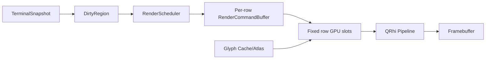
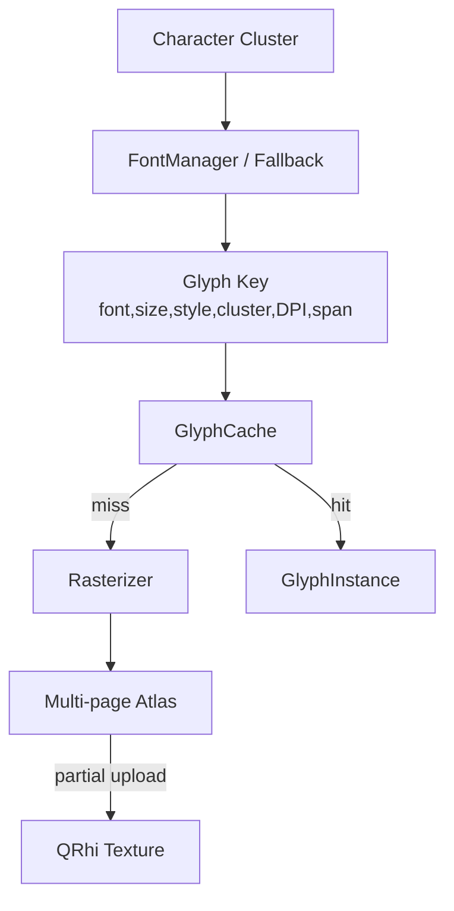

# NovaTerm 渲染架构

## 1. 管线

```mermaid
flowchart LR
    S[TerminalSnapshot] --> D[DirtyRegion]
    D --> RS[RenderScheduler]
    RS --> CB[Per-row RenderCommandBuffer]
    CB --> GB[Fixed row GPU slots]
    GC[Glyph Cache/Atlas] --> GB
    GB --> P[QRhi Pipeline]
    P --> F[Framebuffer]
```

P3 当前采用固定行槽位实现局部上传：每行独立背景区和内容区，Overlay 独立。提交顺序为“全部背景 → 全部内容 → Overlay”，避免相邻背景覆盖字形抗锯齿边缘。

## 2. RenderScheduler

Scheduler 裁剪并合并相邻/重叠 DirtyRegion；区域超过 32 个或覆盖率达到 60% 时升级全屏；按 60/120/144 Hz 每帧间隔最多提交一次。Cursor 和 Selection 只使 Overlay 失效。

### 2.1 隐藏恢复与设置更新（2026-10-07）

借鉴 Windows Terminal 的停绘恢复与请求合并原则，Renderer 隐藏或最小化时
暂停 Scheduler 和光标计时器。停绘期间只保留全屏恢复标记、overlay 标记与
最新内容版本，不持续唤醒绘制，也不积累离散 damage 列表。恢复显示后同步
视口，基于最新不可变快照全量重建。终端解析与历史维护仍继续进行。

光标恢复原来的 530 ms 周期闪烁：可见时启动计时器，隐藏/最小化时停止。
只有低频 timeout 回调查询光标可见性与闪烁模式；浏览历史时不查询也不请求
光标帧。damage、cursorMoved 和历史维护不额外同步读取光标模式，不重置
闪烁周期。此前增加的连续输出常亮逻辑及其高频查询已撤回。
渲染快照与 overlay 帧本来就需要的核心读取保持不变。

字体先归一化字号再比较，相同有效字体不清空 atlas 或触发重排。配色首次应用
仍同步核心默认色；随后默认前景/背景或 ANSI 调色板变化重建内容，仅光标色或
选区色变化更新 overlay，相同绘制颜色不请求新帧。方案名称变化只更新元数据。

上述调整保留不可变行快照、局部 GPU 上传与多页 LRU，未引入 Windows Terminal
的整屏实例生成或平台专属交换链等待机制。

最终同机 D3D11 大文本三轮结果见
[撤回后验收](Performance_Render_Rollback_2026-10-07.md)：吞吐与帧率中位数恢复至
基线范围，隐藏调度为 0。按用户要求，仅保留最后一次统一计时的验收结果，
其他批次报告与结果已清理。

## 3. Command 模型

后端无关命令包括 BackgroundRect、GlyphInstance、Underline、Strike、Cursor、Selection，以及预留 Hyperlink/Search Overlay。命令只保存逻辑矩形、UV 和颜色，不持有 QRhi 资源。

## 4. Snapshot 与增量更新

每帧只获取一次稳定 Snapshot。普通 damage 只重建相交行；未变化行保留 CPU 命令和 GPU 数据。当前值语义 Snapshot 后续可替换为共享不可变行/Chunk，但 Renderer API 应继续只读。

## 5. Glyph 目标架构

```mermaid
flowchart TB
    CL[Character Cluster] --> FM[FontManager / Fallback]
    FM --> K[Glyph Key<br/>font,size,style,cluster,DPI,span]
    K --> C[GlyphCache]
    C -->|miss| RA[Rasterizer]
    RA --> A[Multi-page Atlas]
    A -->|partial upload| Q[QRhi Texture]
    C -->|hit| CMD[GlyphInstance]
```

P5 的多页 Atlas、LRU、局部上传、CJK fallback、组合字符、Emoji、DPI/generation 失效与资源恢复已完成 Linux Vulkan/OpenGL 与 Windows D3D11/D3D12 本机验收，以及 Windows 30 分钟长稳验收（2026-08-02）；macOS Metal、真实多屏 DPR 与真实 120/144 Hz 验收待完成。最新状态以 P5 阶段文档为准。

## 6. 退化与恢复

- resize、字体、主题、滚动映射和 GPU 资源恢复触发全屏失效；
- 固定槽位不足时扩容，禁止截断命令；
- Atlas miss 不得显示错误旧字形；
- GPU 资源丢失后所有有效 CPU 命令重新上传；
- 高频输出允许跳过中间画面，但最终帧必须来自最新一致 Snapshot。

## 7. 指标

记录原始/合并 Dirty 数、调度/合并/全屏帧、重建行、命令数、命令生成时间、CPU 帧时间、上传字节、Draw Call 和 Buffer 重分配。GPU 时间应使用后端时间戳或外部工具测量，禁止为统计引入同步等待。

## P0/P1 性能优化实施记录（2026-09-13）

针对 `perf.data`（本地 PTY 持续输出，build-id `2c289bb5…`）暴露的热点，
渲染侧完成了四项收窄，逐项证据见 `AGENTS.md` 的「P0/P1 性能优化实施记录」：

| 项 | 变化 | 基线热点 | 回归用例 |
| --- | --- | --- | --- |
| 行/块指纹合并 | `RendererSnapshot` 一次遍历产出 8 列块指纹与整行 identity；`RowBlockDamageTracker` 只消费快照块指纹 | `rowContentIdentity` 2.86% + `blockIdentity` 3.03% | `rendererSnapshotPublishesBlockIdentities`、`rowBlockDamageFindsOmittedStaleTail` |
| instance 暂存收窄 | `assembleSpanInstances()`：背景逐列直接覆盖、内容只清本次 span、scratch 复用 | `__memmove` 6.18%（81% 来自 uploadCommands）+ `QList<GpuInstance>::fill` 1.84% | 三个 `spanAssembly*` |
| RenderCommand 容量与 merge | `mutableRow()/finishRow()` 就地重建并复用容量；一次按列线性 merge 取代每行两次 `stable_sort` | 排序/扩容合计 4.25% | `incrementalRowMergeKeepsOrderAndColumns` |
| Glyph 稳态收窄 | `makeKeyAndSelection()` 一次选择产出 key+selection；ASCII 直连缓存；emoji 判定去掉 `toUcs4()` 分配 | `ensureGlyph` 子树 5.25% | `asciiSelectionUsesDirectCacheAndSingleQuery` |

约定：`RenderCommandRow` 的 `backgrounds`/`contents` 必须按 `cellColumn` 升序
（`mergeRowCommandsIncremental()` 与 `assembleSpanInstances()` 都依赖这一点）；
`contentUploadBytes` 统计的是基础内容区域（背景 + 内容两层）。
