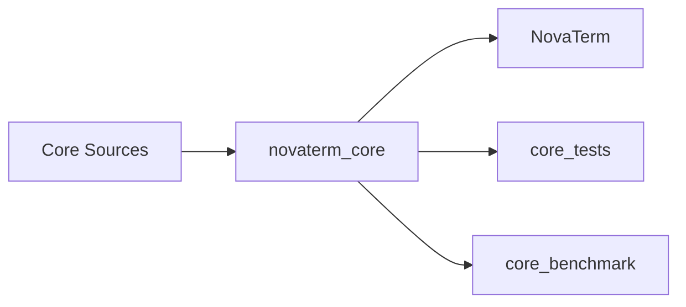

# P0：测试、性能基线与最小构建拆分

**状态：已完成（2026-07-29）**

## 目标

在改变数据和线程模型前建立可重复基线，使 Core 脱离完整 GUI 独立构建、测试和测量。

## 实现重点

- 建立 `novaterm_core` 静态库；
- 应用链接 Core，libvterm 作为私有实现依赖；
- 建立 Core tests 和 benchmark；
- 覆盖 ANSI/UTF-8、Damage、resize、Scrollback；
- 固定构建类型、输入大小、数据集和环境记录。

## 基线结果

Windows x64、MSVC 19.44、Qt 6.8.3、Release：10 MiB 解析为 868.07 ms / 11.52 MiB/s；10 万行 Scrollback 为 337.53 ms；4 项测试通过。

## 验收与遗留

已满足独立构建和可重复测量。基线不包括 Transport、UI 延迟、内存、GPU 时间和 FPS；后续阶段分别补齐。原始口径见 `docs/P0_Performance_Baseline.md`。

