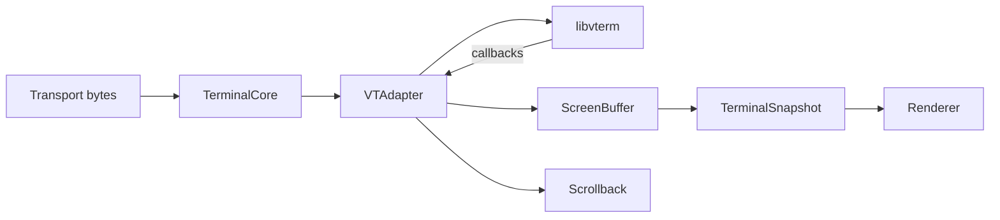
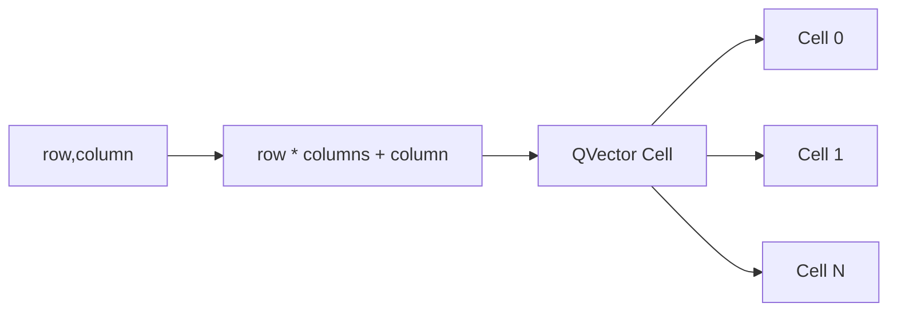
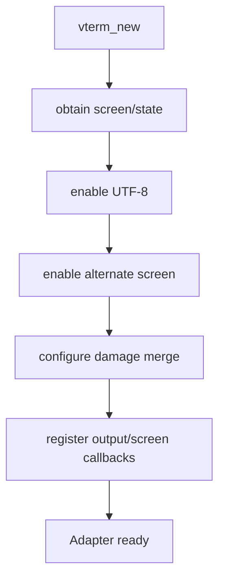
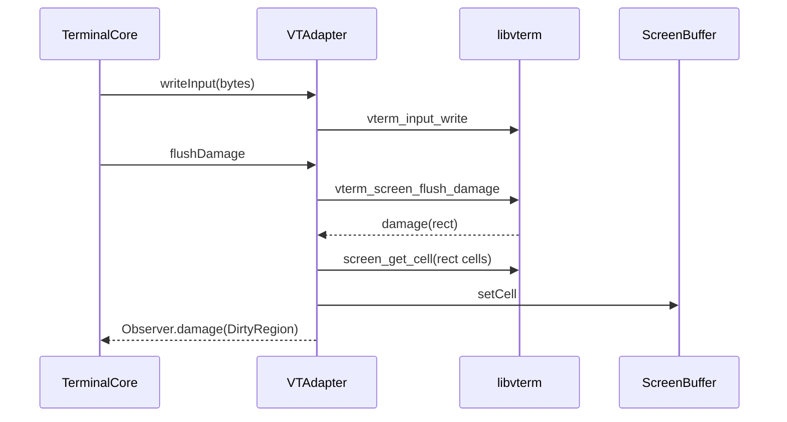

# P1：ScreenBuffer 与 VTAdapter

**状态：架构边界已完成（2026-07-29）；宽字符 continuation 与部分属性映射待补完**

## 目标

建立 NovaTerm 自有终端模型，让 libvterm 成为可替换的协议实现，Renderer 不再依赖其数据类型。

## 架构



## 实现重点

- 定义 Cell、颜色、属性、宽度、continuation、Position、DirtyRegion、Cursor；
- ScreenBuffer 使用连续可见区存储；
- Snapshot 创建后保持值稳定；
- VTAdapter 独占 libvterm 生命周期、callback、类型转换与输入编码；
- Renderer、Scrollback 和公开头文件删除 `VTerm*`；
- 测试 SGR、TrueColor、CJK、UTF-8 分包、title、bell、damage、resize、alternate screen 和 scrollback。

## 落地实现步骤

下面按可独立编译和验证的顺序描述 P1。实施时应避免同时改变数据模型、线程模型和 GPU 策略；P1 只建立 Parser 与消费者之间的稳定契约，异步 Worker 属于 P2。

### 步骤 0：盘点并冻结 libvterm 泄漏点

首先搜索 `src/core`、`src/renderer`、`src/ui` 和测试中的以下符号：

```text
vterm.h
VTerm / VTermScreen / VTermState
VTermScreenCell / VTermColor
VTermRect / VTermPos / VTermScreenCellAttrs
```

把使用位置分成三类：

1. libvterm 生命周期、callback 和输入编码：迁入 `VTAdapter.cpp`；
2. Renderer/Scrollback 需要的显示数据：转换为 NovaTerm 类型；
3. Qt 输入事件：暂时由 `TerminalCore`/`KeyMapper` 转换，但公共渲染接口不得继续携带 `VTerm*`。

记录 P0 测试和 benchmark 结果。迁移期间每一步都运行 P0 测试，防止类型替换掩盖终端行为回归。

### 步骤 1：定义 NovaTerm 稳定数据契约

涉及文件：`src/core/terminal/TerminalTypes.h`。

核心类型及语义如下：

| 类型 | 关键字段 | 语义 |
| --- | --- | --- |
| `Position` | row、col | Cell 坐标，不是像素坐标 |
| `DirtyRegion` | start/end row/column | 半开区间 `[start, end)` |
| `TerminalColor` | Default/Indexed/Rgb | 保留颜色语义，Renderer 最终解析 |
| `CellAttributes` | bold、italic、underline 等 | 与特定 Parser 类型无关 |
| `Cell` | chars、width、attributes、fg/bg | 一个终端网格单元 |
| `CursorState` | position、shape、visible、blink | 可被 Snapshot 和 Renderer 使用 |

当前 `Cell::chars` 最多保存 6 个 Unicode codepoint，足以保留基础字符和有限组合序列；`width` 表示显示宽度。数据契约为宽字符后续网格位置预留了 `WideCharContinuation` 哨兵，Renderer 应避免为 continuation 重复生成 Glyph。当前 `fromVTermCell()` 尚未显式写入该哨兵，见后文“当前实现差距”。

颜色不能在适配层提前全部转换成 QColor：

- Default 保留“使用当前默认色”的语义；
- Indexed 保留 ANSI/256 色索引；
- Rgb 保存 TrueColor 分量；
- reverse、dim、conceal 等属性在渲染阶段统一解释。

`DirtyRegion` 需要通过 `Q_DECLARE_METATYPE` 注册，以便后续跨 Qt queued connection 传递。Core 数据类型可以依赖 Qt Core 容器，但不能依赖 Qt Widgets、QRhi 或 libvterm。

### 步骤 2：实现连续可见区 `ScreenBuffer`

涉及文件：

- `src/core/terminal/ScreenBuffer.h`
- `src/core/terminal/ScreenBuffer.cpp`

使用一维 `QVector<Cell>`，索引规则固定为：

```text
index = row * columns + column
```

公开操作包括 const/可写 `cellAt()`、`setCell()`、`resize()` 和 `clear()`。实现要求：

1. columns/rows 非法值被归一化到安全范围；
2. 越界读取返回 `nullptr`，越界写入不破坏内存；
3. resize 分配新连续区并复制新旧尺寸的重叠矩形；
4. 新增区域使用默认 Cell 初始化；
5. clear 恢复全部默认 Cell；
6. 不在 Cell 中保存 Parser 指针或 Renderer/GPU 资源。



连续存储便于全屏复制和按行扫描。P1 不提前实现 Chunk/COW；Scrollback 的 Chunk 化属于 P4。

### 步骤 3：实现值语义 `TerminalSnapshot`

`TerminalSnapshot` 保存 columns、rows、visibleCells 和 cursor。`makeSnapshot()` 在创建时复制可见 Cell，因此后续 ScreenBuffer 修改不会改变已有 Snapshot。

必须测试以下场景：

1. 创建 Snapshot；
2. 修改原 ScreenBuffer Cell 和 Cursor；
3. 旧 Snapshot 仍返回创建时的内容；
4. Snapshot 越界访问安全返回空指针；
5. resize 前后的 Snapshot 尺寸和索引独立。

值语义优先解决正确性和所有权。它可能产生复制成本，但 P1 不通过返回活动 Buffer 裸引用来“优化”；P2/P4 可在保持不可变读取语义的条件下替换为双缓冲、共享不可变存储或 COW。

### 步骤 4：建立 `VTAdapter` 与 Pimpl 边界

涉及文件：

- `src/core/terminal/VTAdapter.h`
- `src/core/terminal/VTAdapter.cpp`

公开头文件只包含 NovaTerm 类型、Qt Core 值类型和标准库，不包含 `vterm.h`。具体 `VTerm`、`VTermScreen`、`VTermState`、callback 表和转换函数全部放入 `VTAdapter::Impl`。

构造流程：



析构时由 Impl 释放 libvterm。删除 VTAdapter 拷贝构造和赋值，确保一组 libvterm 指针只有一个所有者。构造失败时 `isValid()` 返回 false，其他入口必须安全处理空状态。

### 步骤 5：实现 Cell 与颜色双向转换

在 `VTAdapter.cpp` 内实现私有转换函数，不把它们暴露给 Renderer：

```text
VTermScreenCell -> NovaTerm::Cell
NovaTerm::Cell  -> VTermScreenCell（仅 scrollback pop）
VTermColor      <-> TerminalColor
VTermPos/Rect   -> Position/DirtyRegion
```

转换要求：

- 按容量复制 `chars` 并保证剩余位置清零；
- 保留 Default、Indexed 和 RGB 颜色类别；
- 映射 libvterm 实际提供的 bold、italic、underline、blink、reverse、strike、conceal 等属性；NovaTerm 额外属性需要定义可靠来源后再映射；
- 映射 underline style，未知样式安全回退；
- 根据 libvterm cell width 设置 Cell width；
- 宽字符占用的后续列应写入 continuation；
- Scrollback pop 的反向转换不能引用临时 Cell 内存。

组合字符超过 `MaxCharsPerCell` 时当前模型只能截断，必须在测试或日志中保持可观察；未来若扩展 cluster 存储，需要维持 `Cell` 契约版本兼容。

### 步骤 6：接管 libvterm callbacks

`VTAdapter::Observer` 是 Adapter 向 TerminalCore 发布事件的唯一接口：

```cpp
struct Observer {
    std::function<void(const QByteArray&)> output;
    std::function<void(const DirtyRegion&)> damage;
    std::function<void(const CursorState&)> cursorChanged;
    std::function<void(const QString&)> titleChanged;
    std::function<void()> bell;
    std::function<void()> scrollbackChanged;
};
```

callback 落地映射：

| libvterm callback | Adapter 行为 |
| --- | --- |
| output | 发布编码后的终端输入字节 |
| damage | 从 libvterm 拉取受影响 Cell，更新 ScreenBuffer，发布 DirtyRegion |
| movecursor | 更新 CursorState 并通知观察者 |
| settermprop | 解析 title 等终端属性 |
| bell | 发布 bell 事件 |
| resize | 调整 ScreenBuffer 并同步尺寸 |
| sb_pushline | 转换 Cell 后追加 Scrollback |
| sb_popline | 从 Scrollback 取 NovaTerm Cell 并反向转换 |
| sb_clear | 清空 Scrollback 并通知消费者 |



Damage 使用半开坐标，转换时不得混淆 rows/columns。`flushDamage()` 的调用频率会直接影响同步成本；P1 先保证每次写入后视图及时可见，P2 再改为批次 flush。

### 步骤 7：迁移输入编码和控制入口

VTAdapter 统一包装以下 libvterm 输入 API：

- `writeInput()` 和 `flushDamage()`；
- `keyboardUnichar()`、`keyboardKey()`；
- `startPaste()`、`endPaste()`；
- `mouseButton()`；
- `focusIn()`、`focusOut()`；
- `resize()`；
- `setDefaultColors()`。

Qt `QKeyEvent/QMouseEvent/QWheelEvent` 不应传入 Renderer 之外的长期数据模型。当前 P1 允许 `TerminalCore` 使用 KeyMapper 做桥接，但编码后的动作必须进入 VTAdapter；后续如需彻底去 Qt GUI 化，应引入平台无关 InputCommand，而不是让 VTAdapter 引用 Qt Widgets event。

### 步骤 8：把 `TerminalCore` 改为稳定门面

`TerminalCore` 负责创建 ScreenBuffer、Scrollback 和 VTAdapter，连接 Observer，并对外提供：

- 写入和输入控制；
- columns/rows、Cell、Cursor、title 查询；
- `snapshot()`；
- Scrollback 查询和配置；
- damage、cursorMoved、titleChanged、bell、outputData 等 Qt 信号。

公共 `TerminalCore.h` 不得出现任何 `VTerm*`。P1 此时仍运行在调用线程，不能声称已经线程安全；它的职责是先使数据所有权清晰，为 P2 的 Runtime/Worker 迁移创造条件。

### 步骤 9：迁移 Scrollback 到 NovaTerm Cell

涉及文件：

- `src/core/terminal/ScrollbackBuffer.h`
- `src/core/terminal/ScrollbackBuffer.cpp`

将行元素从 `VTermScreenCell` 改为 `NovaTerm::Cell`。push 保存 Adapter 转换后的 Cell，pop 再由 Adapter 转回 libvterm 类型。Renderer 查询历史行时只看到 NovaTerm Cell。

P1 保持现有行级环形结构和容量行为，避免同时实施 P4。需要测试：未满、写满、覆盖最旧行、改变上限、clear、列数变化和 pop 恢复顺序。

### 步骤 10：迁移 Renderer

Renderer 的公开和私有接口改为只消费：

- `TerminalSnapshot` / `Cell`；
- `TerminalColor` / `CellAttributes`；
- `Position` / `DirtyRegion` / `CursorState`。

具体改造包括：

1. 删除 Renderer 中所有 libvterm include 和 API 调用；
2. 颜色转换改为解释 `TerminalColor`；
3. Glyph 文本从 `Cell::chars` 构造；
4. continuation Cell 不生成重复字形；
5. Cursor、Selection 和文本提取改用 NovaTerm 坐标；
6. Scrollback 和活动屏幕使用相同 Cell 渲染路径。

P1 仍允许 Renderer 全屏扫描和重建 GPU 顶点；真正的 Dirty 行命令缓存属于 P3。此处只验证 Parser 可在不修改 Renderer 的情况下被替换。

### 步骤 11：收紧构建边界

在 CMake 中：

- `novaterm_core` 的公开 include 只暴露 `src`；
- libvterm include 目录设为 `PRIVATE`；
- libvterm 链接依赖设为 `PRIVATE`；
- Renderer/UI 不通过 Core 的传递依赖获得 `vterm.h`；
- 对活动源再次执行 `rg 'VTerm|vterm.h' src/renderer src/ui`。

如果 KeyMapper 暂时需要 libvterm key enum，应将依赖记录为待隔离项，不能因此重新把 libvterm 暴露给 Renderer。

### 步骤 12：补齐正确性与性能验证

目标自动化测试矩阵至少包含：

1. ANSI SGR、Indexed/TrueColor 和属性转换；
2. ASCII、CJK、宽字符 continuation 和组合字符；
3. UTF-8 在任意字节边界分包；
4. Damage 半开区间和屏幕 Cell 同步；
5. resize 保留重叠区域并初始化新增区；
6. Snapshot 创建后不随活动模型改变；
7. OSC title、bell、Cursor shape/visible；
8. alternate screen 进入和退出；
9. Scrollback 环形覆盖、push/pop 和 clear；
10. 默认颜色更新与 reverse/conceal 等渲染语义。

Release benchmark 同时记录 Parser/Core 吞吐和 10 万行 Scrollback。P1 结果下降时应分析 flush、Cell 转换和 Snapshot/同步成本，禁止为了恢复数字绕过 ScreenBuffer 或让 Renderer 重新读取 libvterm。

## 文件级变更清单

| 文件 | P1 职责 |
| --- | --- |
| `src/core/terminal/TerminalTypes.h` | NovaTerm 稳定数据契约 |
| `src/core/terminal/ScreenBuffer.*` | 连续活动屏幕与 Snapshot |
| `src/core/terminal/VTAdapter.*` | libvterm 生命周期、callback 和转换边界 |
| `src/core/terminal/TerminalCore.*` | Core 门面、查询和信号 |
| `src/core/terminal/ScrollbackBuffer.*` | 保存 NovaTerm Cell 的历史行 |
| `src/core/terminal/KeyMapper.*` | Qt 输入到终端键语义的过渡桥接 |
| `src/renderer/TerminalRenderer.*` | 仅消费 NovaTerm 类型 |
| `tests/core/TerminalCoreTests.cpp` | 转换、快照和终端行为测试 |
| `benchmarks/CoreBenchmark.cpp` | P0/P1 性能对比 |
| `CMakeLists.txt` | Core 静态库与 libvterm 私有依赖 |

## 实施过程中的禁止项

- 禁止在 `TerminalTypes.h`、`ScreenBuffer.h`、Renderer 头文件中包含 `vterm.h`；
- 禁止在 Cell 中保存 `VTermScreenCell`、QColor、QRhi 资源或 Transport 状态；
- 禁止 Renderer 通过 VTAdapter 查询活动 libvterm screen；
- 禁止返回可长期持有的活动 ScreenBuffer 可写指针；
- 禁止用全局单例共享 Parser 状态，多 Session 必须拥有独立 Adapter；
- 禁止在 P1 同时引入 Parser Worker、Chunked Scrollback 或新的 GPU 管线；
- 禁止丢失 Default/Indexed/Rgb 区分或提前固化主题颜色；
- 禁止忽略宽字符 continuation、UTF-8 分包和 resize/alternate screen 回归。

## 所有权

本阶段 Parser/Adapter 是 ScreenBuffer 唯一写入来源。P1 当时仍单线程；P2 后禁止 Renderer 直接跨线程读取活动模型。

## 结果与遗留

7 项 Core 测试通过。完整发布吞吐为 4.22 MiB/s，暴露小批次 flush 和模型同步成本；该下降不通过破坏边界规避，而由 P2 批处理解决。

## 当前实现差距

文档复核发现，当前 `TerminalTypes.h` 虽定义了 `WideCharContinuation`，但 `VTAdapter.cpp::fromVTermCell()` 仅复制 chars、把 width 归一为至少 1，并未显式为宽字符后续 Cell 写入 continuation。因此“宽字符 continuation 完整落地”不应仅凭类型存在判定完成。后续应增加双宽字符网格测试，根据 libvterm 对后续 Cell 的实际返回值补齐同步逻辑，再确认 Renderer 不重复生成字形。

此外，`CellAttributes` 中 `dim`、`protectedCell` 等字段当前没有全部从 libvterm attrs 映射；这些字段在被 Renderer 或选择/擦除语义使用前，应补充来源、双向转换和测试。上述差距不改变 Renderer 已脱离 libvterm 的边界成果，但属于 P1 正确性补完项。

## 退出标准

- Renderer 和公开 Core API 不含 libvterm 类型；
- 更换 Parser 不要求修改 Renderer；
- Snapshot 稳定；
- P0 正确性测试继续通过。
