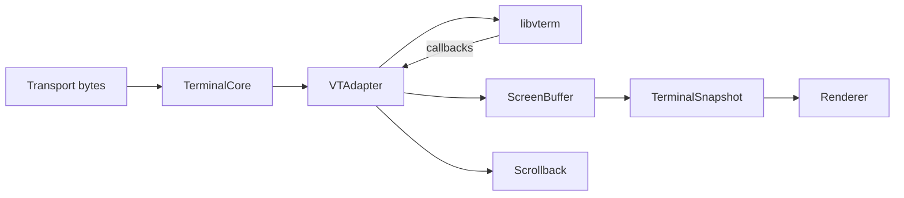
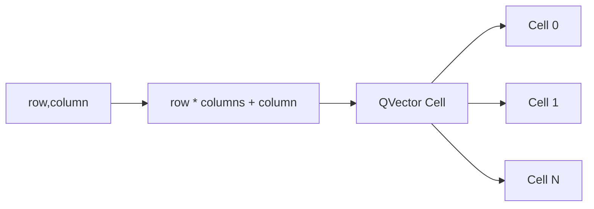
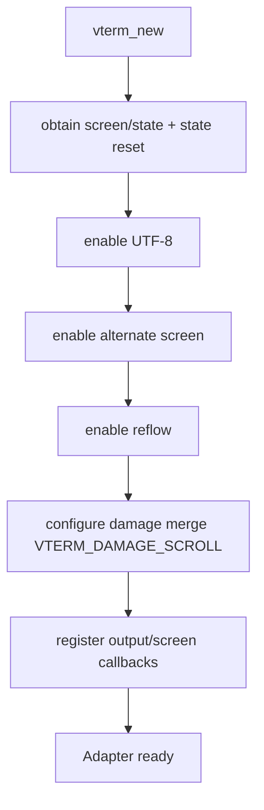
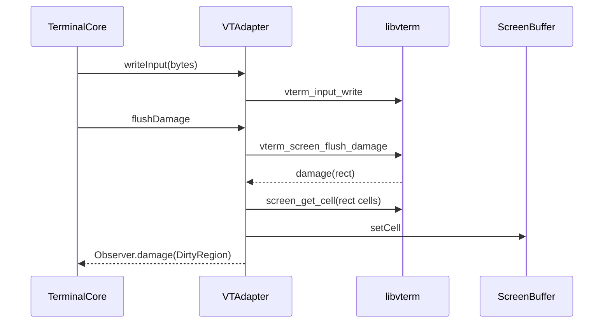

# P1：ScreenBuffer 与 VTAdapter

**状态：架构边界已完成（2026-07-29）；宽字符 continuation 经实测确认已生效并加回归（2026-09-03）；`dim`/`protectedCell` 受 vendored libvterm screen 层限制，在适配层无来源**

## 目标

建立 NovaTerm 自有终端模型，让 libvterm 成为可替换的协议实现，Renderer 不再依赖其数据类型。

## 架构


```mermaid
flowchart LR
    B[Transport bytes] --> C[TerminalCore]
    C --> V[VTAdapter]
    V --> L[libvterm]
    L -->|callbacks| V
    V --> S[ScreenBuffer]
    V --> SB[Scrollback]
    S --> SS[TerminalSnapshot]
    SS --> R[Renderer]
```

## 实现重点

- 定义 Cell、颜色、属性、宽度、continuation、Position、DirtyRegion、Cursor；
- ScreenBuffer 使用连续可见区存储；
- Snapshot 创建后保持值稳定；
- VTAdapter 独占 libvterm 生命周期、callback、类型转换与输入编码；
- Renderer、Scrollback 和公开头文件删除 `VTerm*`；
- 测试 SGR、TrueColor、CJK、UTF-8 分包、title、bell、damage、resize、alternate screen 和 scrollback。

## 落地实现步骤

下面按可独立编译和验证的顺序描述 P1。实施时应避免同时改变数据模型、线程模型和 GPU 策略；P1 只建立 Parser 与消费者之间的稳定契约，异步 Worker 属于 P2。

### 步骤 0：盘点并冻结 libvterm 泄漏点

首先搜索 `src/core`、`src/renderer`、`src/ui` 和测试中的以下符号：

```text
vterm.h
VTerm / VTermScreen / VTermState
VTermScreenCell / VTermColor
VTermRect / VTermPos / VTermScreenCellAttrs
```

把使用位置分成三类：

1. libvterm 生命周期、callback 和输入编码：迁入 `VTAdapter.cpp`；
2. Renderer/Scrollback 需要的显示数据：转换为 NovaTerm 类型；
3. Qt 输入事件：暂时由 `TerminalCore`/`KeyMapper` 转换，但公共渲染接口不得继续携带 `VTerm*`。

记录 P0 测试和 benchmark 结果。迁移期间每一步都运行 P0 测试，防止类型替换掩盖终端行为回归。

### 步骤 1：定义 NovaTerm 稳定数据契约

涉及文件：`src/core/terminal/TerminalTypes.h`。

核心类型及语义如下：

| 类型 | 关键字段 | 语义 |
| --- | --- | --- |
| `Position` | row、col | Cell 坐标，不是像素坐标 |
| `DirtyRegion` | start/end row/column | 半开区间 `[start, end)` |
| `TerminalColor` | Default/Indexed/Rgb | 保留颜色语义，Renderer 最终解析 |
| `CellAttributes` | bold、italic、underline 等 | 与特定 Parser 类型无关 |
| `Cell` | chars、width、attributes、fg/bg | 一个终端网格单元 |
| `CursorState` | position、shape、visible、blink | 可被 Snapshot 和 Renderer 使用 |

当前 `Cell::chars` 最多保存 6 个 Unicode codepoint，足以保留基础字符和有限组合序列；`width` 表示显示宽度。数据契约为宽字符后续网格位置预留了 `WideCharContinuation` 哨兵，Renderer 避免为 continuation 重复生成 Glyph。`fromVTermCell()` 不显式写入该哨兵，但它会被**自然带入**：libvterm 内部用 `chars[0] = (uint32_t)-1` 标记宽字符后续格（`screen.c:198`），`vterm_screen_get_cell()` 逐字复制 `chars`（`screen.c:1040-1044`），该数值恰好等于 `WideCharContinuation = 0xFFFFFFFFu`，于是 `populateCell()` 的按零终止符复制把它一并带过来。见后文“当前实现差距”。

颜色不能在适配层提前全部转换成 QColor：

- Default 保留“使用当前默认色”的语义；
- Indexed 保留 ANSI/256 色索引；
- Rgb 保存 TrueColor 分量；
- reverse、dim、conceal 等属性在渲染阶段统一解释。

`DirtyRegion` 需要通过 `Q_DECLARE_METATYPE` 注册，以便后续跨 Qt queued connection 传递。Core 数据类型可以依赖 Qt Core 容器，但不能依赖 Qt Widgets、QRhi 或 libvterm。

### 步骤 2：实现连续可见区 `ScreenBuffer`

涉及文件：

- `src/core/terminal/ScreenBuffer.h`
- `src/core/terminal/ScreenBuffer.cpp`

使用一维 `QVector<Cell>`，索引规则固定为：

```text
index = row * columns + column
```

公开操作包括 const/可写 `cellAt()`、`setCell()`、`resize()` 和 `clear()`。实现要求：

1. columns/rows 非法值被归一化到安全范围；
2. 越界读取返回 `nullptr`，越界写入不破坏内存；
3. resize 分配新连续区并复制新旧尺寸的重叠矩形；
4. 新增区域使用默认 Cell 初始化；
5. clear 恢复全部默认 Cell；
6. 不在 Cell 中保存 Parser 指针或 Renderer/GPU 资源。


```mermaid
flowchart LR
    RC[row,column] --> I[row * columns + column]
    I --> V[QVector Cell]
    V --> C0[Cell 0]
    V --> C1[Cell 1]
    V --> CN[Cell N]
```

连续存储便于全屏复制和按行扫描。P1 不提前实现 Chunk/COW；Scrollback 的 Chunk 化属于 P4。

### 步骤 3：实现值语义 `TerminalSnapshot`

`TerminalSnapshot` 保存 columns、rows、visibleCells 和 cursor。`makeSnapshot()` 在创建时复制可见 Cell，因此后续 ScreenBuffer 修改不会改变已有 Snapshot。

必须测试以下场景：

1. 创建 Snapshot；
2. 修改原 ScreenBuffer Cell 和 Cursor；
3. 旧 Snapshot 仍返回创建时的内容；
4. Snapshot 越界访问安全返回空指针；
5. resize 前后的 Snapshot 尺寸和索引独立。

值语义优先解决正确性和所有权。它可能产生复制成本，但 P1 不通过返回活动 Buffer 裸引用来“优化”；P2/P4 可在保持不可变读取语义的条件下替换为双缓冲、共享不可变存储或 COW。

### 步骤 4：建立 `VTAdapter` 与 Pimpl 边界

涉及文件：

- `src/core/terminal/VTAdapter.h`
- `src/core/terminal/VTAdapter.cpp`

公开头文件只包含 NovaTerm 类型、Qt Core 值类型和标准库，不包含 `vterm.h`。具体 `VTerm`、`VTermScreen`、`VTermState`、callback 表和转换函数全部放入 `VTAdapter::Impl`。

构造流程：


```mermaid
flowchart TD
    A[vterm_new] --> B[obtain screen/state + state reset]
    B --> C[enable UTF-8]
    C --> D[enable alternate screen]
    D --> RF[enable reflow]
    RF --> E[configure damage merge VTERM_DAMAGE_SCROLL]
    E --> F[register output/screen callbacks]
    F --> G[Adapter ready]
```

析构时由 Impl 释放 libvterm。删除 VTAdapter 拷贝构造和赋值，确保一组 libvterm 指针只有一个所有者。构造失败时 `isValid()` 返回 false，其他入口必须安全处理空状态。

### 步骤 5：实现 Cell 与颜色双向转换

在 `VTAdapter.cpp` 内实现私有转换函数，不把它们暴露给 Renderer：

```text
VTermScreenCell -> NovaTerm::Cell
NovaTerm::Cell  -> VTermScreenCell（仅 scrollback pop）
VTermColor      <-> TerminalColor
VTermPos/Rect   -> Position/DirtyRegion
```

转换要求：

- 按容量复制 `chars` 并保证剩余位置清零；
- 保留 Default、Indexed 和 RGB 颜色类别；
- 映射 libvterm 实际提供的 bold、italic、underline、blink、reverse、strike、conceal 等属性；NovaTerm 额外属性需要定义可靠来源后再映射；
- 映射 underline style，未知样式安全回退；
- 根据 libvterm cell width 设置 Cell width；
- 宽字符占用的后续列应写入 continuation；
- Scrollback pop 的反向转换不能引用临时 Cell 内存。

组合字符超过 `MaxCharsPerCell` 时当前模型只能截断，必须在测试或日志中保持可观察；未来若扩展 cluster 存储，需要维持 `Cell` 契约版本兼容。

### 步骤 6：接管 libvterm callbacks

`VTAdapter::Observer` 是 Adapter 向 TerminalCore 发布事件的唯一接口：

```cpp
struct Observer {
    std::function<void(QByteArrayView)> output;           // 终端响应字节
    std::function<void(const DirtyRegion&)> damage;
    std::function<void(const CursorState&)> cursorChanged;
    std::function<void(const QString&)> titleChanged;
    std::function<void()> bell;
    std::function<void()> scrollbackChanged;
    std::function<void(int)> screenScrolled;              // 活动屏幕上滚行数
};
```

以上为当前 `VTAdapter.h:29-38` 的实际形态，与 P1 初版有两处差异：`output`
改用 `QByteArrayView`（P2 精确部分接收改造时统一为视图传递，避免为定位后缀
反复复制）；`screenScrolled` 由后续阶段新增，供 Renderer 的 GPU 行槽位环判断
可复用行（见 P3 §Viewport 与 Scrollback 映射、P5 §8）。

callback 落地映射：

| libvterm callback | Adapter 行为 |
| --- | --- |
| output | 发布编码后的终端输入字节 |
| damage | 从 libvterm 拉取受影响 Cell，更新 ScreenBuffer，发布 DirtyRegion |
| moverect | 按 libvterm 语义搬移 `ScreenBuffer` 区域，并发布目标区 DirtyRegion |
| movecursor | 更新 CursorState 并通知观察者 |
| settermprop | 解析 title 等终端属性 |
| bell | 发布 bell 事件 |
| resize | 调整 ScreenBuffer 并同步尺寸 |
| sb_pushline_ex | 转换 Cell 后追加 Scrollback，并携带 soft-wrap 标志 |
| sb_popline | 从 Scrollback 取 NovaTerm Cell 并反向转换 |
| sb_clear | 清空 Scrollback 并通知消费者 |

`moverect` 与 `sb_pushline_ex` 不属于 P1 初版：前者由 P2 的 O(1) 全屏行环优化
引入（见 P2 §优化 1），后者是 vendored libvterm 的 NovaTerm 向后兼容扩展，
由 P4 用于把 continuation 物理行合并进同一 `LogicalLine`（见 P4 §实际落地摘要）。
注册点见 `VTAdapter.cpp:204-214`。


```mermaid
sequenceDiagram
    participant T as TerminalCore
    participant A as VTAdapter
    participant V as libvterm
    participant S as ScreenBuffer
    T->>A: writeInput(bytes)
    A->>V: vterm_input_write
    T->>A: flushDamage
    A->>V: vterm_screen_flush_damage
    V-->>A: damage(rect)
    A->>V: screen_get_cell(rect cells)
    A->>S: setCell
    A-->>T: Observer.damage(DirtyRegion)
```

Damage 使用半开坐标，转换时不得混淆 rows/columns。`flushDamage()` 的调用频率会直接影响同步成本；P1 先保证每次写入后视图及时可见，P2 再改为批次 flush。

### 步骤 7：迁移输入编码和控制入口

VTAdapter 统一包装以下 libvterm 输入 API：

- `writeInput()` 和 `flushDamage()`；
- `keyboardUnichar()`、`keyboardKey()`；
- `startPaste()`、`endPaste()`；
- `mouseButton()`；
- `focusIn()`、`focusOut()`；
- `resize()`；
- `setDefaultColors()`。

Qt `QKeyEvent/QMouseEvent/QWheelEvent` 不应传入 Renderer 之外的长期数据模型。当前 P1 允许 `TerminalCore` 使用 KeyMapper 做桥接，但编码后的动作必须进入 VTAdapter；后续如需彻底去 Qt GUI 化，应引入平台无关 InputCommand，而不是让 VTAdapter 引用 Qt Widgets event。

### 步骤 8：把 `TerminalCore` 改为稳定门面

`TerminalCore` 负责创建 ScreenBuffer、Scrollback 和 VTAdapter，连接 Observer，并对外提供：

- 写入和输入控制；
- columns/rows、Cell、Cursor、title 查询；
- `snapshot()`；
- Scrollback 查询和配置；
- damage、cursorMoved、titleChanged、bell、outputData 等 Qt 信号。

公共 `TerminalCore.h` 不得出现任何 `VTerm*`。P1 此时仍运行在调用线程，不能声称已经线程安全；它的职责是先使数据所有权清晰，为 P2 的 Runtime/Worker 迁移创造条件。

### 步骤 9：迁移 Scrollback 到 NovaTerm Cell

涉及文件：

- `src/core/terminal/ScrollbackBuffer.h`
- `src/core/terminal/ScrollbackBuffer.cpp`

将行元素从 `VTermScreenCell` 改为 `NovaTerm::Cell`。push 保存 Adapter 转换后的 Cell，pop 再由 Adapter 转回 libvterm 类型。Renderer 查询历史行时只看到 NovaTerm Cell。

P1 保持现有行级环形结构和容量行为，避免同时实施 P4。需要测试：未满、写满、覆盖最旧行、改变上限、clear、列数变化和 pop 恢复顺序。

**后续变更**：该行级环形结构已由 P4 移除。`ScrollbackBuffer` 现在只是外观层，
唯一后端为 `ChunkedScrollback`，不再双写逐行环形缓冲（`ScrollbackBuffer.h:1-16`）。
本步骤描述的 push/pop 外部语义保持不变，内部存储以 P4 文档为准。

### 步骤 10：迁移 Renderer

Renderer 的公开和私有接口改为只消费：

- `TerminalSnapshot` / `Cell`；
- `TerminalColor` / `CellAttributes`；
- `Position` / `DirtyRegion` / `CursorState`。

具体改造包括：

1. 删除 Renderer 中所有 libvterm include 和 API 调用；
2. 颜色转换改为解释 `TerminalColor`；
3. Glyph 文本从 `Cell::chars` 构造；
4. continuation Cell 不生成重复字形；
5. Cursor、Selection 和文本提取改用 NovaTerm 坐标；
6. Scrollback 和活动屏幕使用相同 Cell 渲染路径。

P1 仍允许 Renderer 全屏扫描和重建 GPU 顶点；真正的 Dirty 行命令缓存属于 P3。此处只验证 Parser 可在不修改 Renderer 的情况下被替换。

### 步骤 11：收紧构建边界

在 CMake 中：

- `novaterm_core` 的公开 include 只暴露 `src`；
- libvterm include 目录设为 `PRIVATE`；
- libvterm 链接依赖设为 `PRIVATE`；
- Renderer/UI 不通过 Core 的传递依赖获得 `vterm.h`；
- 对活动源再次执行 `rg 'VTerm|vterm.h' src/renderer src/ui`。

KeyMapper 确实仍需要 libvterm key enum：`KeyMapper.h:10` 包含
`<vterm_keycodes.h>`，`KeyMapper.cpp` 直接产出 `VTERM_KEY_*` / `VTERM_MOD_*`。
这是一个**已记录的待隔离项**，不是边界被破坏 —— `novaterm_core` 对 libvterm
的 include 与链接均为 PRIVATE（`CMakeLists.txt:192`、`CMakeLists.txt:200`），
`src/renderer`、`src/ui` 中没有任何 `VTerm` 符号引用。彻底去除需要引入
平台无关 InputCommand（步骤 7 已提出），不能因此重新把 libvterm 暴露给 Renderer。

### 步骤 12：补齐正确性与性能验证

目标自动化测试矩阵至少包含：

1. ANSI SGR、Indexed/TrueColor 和属性转换；
2. ASCII、CJK、宽字符 continuation 和组合字符；
3. UTF-8 在任意字节边界分包；
4. Damage 半开区间和屏幕 Cell 同步；
5. resize 保留重叠区域并初始化新增区；
6. Snapshot 创建后不随活动模型改变；
7. OSC title、bell、Cursor shape/visible；
8. alternate screen 进入和退出；
9. Scrollback 环形覆盖、push/pop 和 clear；
10. 默认颜色更新与 reverse/conceal 等渲染语义。

Release benchmark 同时记录 Parser/Core 吞吐和 10 万行 Scrollback。P1 结果下降时应分析 flush、Cell 转换和 Snapshot/同步成本，禁止为了恢复数字绕过 ScreenBuffer 或让 Renderer 重新读取 libvterm。

## 文件级变更清单

| 文件 | P1 职责 |
| --- | --- |
| `src/core/terminal/TerminalTypes.h` | NovaTerm 稳定数据契约 |
| `src/core/terminal/ScreenBuffer.*` | 连续活动屏幕与 Snapshot |
| `src/core/terminal/VTAdapter.*` | libvterm 生命周期、callback 和转换边界 |
| `src/core/terminal/TerminalCore.*` | Core 门面、查询和信号 |
| `src/core/terminal/ScrollbackBuffer.*` | 保存 NovaTerm Cell 的历史行 |
| `src/core/terminal/KeyMapper.*` | Qt 输入到终端键语义的过渡桥接 |
| `src/renderer/TerminalRenderer.*` | 仅消费 NovaTerm 类型 |
| `tests/core/TerminalCoreTests.cpp` | 转换、快照和终端行为测试 |
| `tests/benchmarks/CoreBenchmark.cpp` | P0/P1 性能对比 |
| `CMakeLists.txt` | Core 静态库与 libvterm 私有依赖 |

## 实施过程中的禁止项

- 禁止在 `TerminalTypes.h`、`ScreenBuffer.h`、Renderer 头文件中包含 `vterm.h`；
- 禁止在 Cell 中保存 `VTermScreenCell`、QColor、QRhi 资源或 Transport 状态；
- 禁止 Renderer 通过 VTAdapter 查询活动 libvterm screen；
- 禁止返回可长期持有的活动 ScreenBuffer 可写指针；
- 禁止用全局单例共享 Parser 状态，多 Session 必须拥有独立 Adapter；
- 禁止在 P1 同时引入 Parser Worker、Chunked Scrollback 或新的 GPU 管线；
- 禁止丢失 Default/Indexed/Rgb 区分或提前固化主题颜色；
- 禁止忽略宽字符 continuation、UTF-8 分包和 resize/alternate screen 回归。

## 所有权

本阶段 Parser/Adapter 是 ScreenBuffer 唯一写入来源。P1 当时仍单线程；P2 后禁止 Renderer 直接跨线程读取活动模型。

## 结果与遗留

7 项 Core 测试通过。完整发布吞吐为 4.22 MiB/s，暴露小批次 flush 和模型同步成本；该下降不通过破坏边界规避，而由 P2 批处理解决。

## 当前实现差距

### 已澄清：宽字符 continuation 本来就是通的（2026-09-03 更正）

2026-09-02 的复核曾记录「`WideCharContinuation` 全仓库没有任何写入点」，判定
`populateCell()` 从不写入该哨兵。**该结论是误判**，成因是只读了 `populateCell()`
而没有核对 libvterm 的返回值。实测与源码双向确认：

- libvterm 内部以 `chars[0] = (uint32_t)-1` 标记宽字符后续格
  （`third_party/libvterm-0.3.3/src/screen.c:198`）；
- `vterm_screen_get_cell()` **逐字复制** `chars[]` 而不做翻译
  （`screen.c:1040-1044`），因此适配层收到的 `chars[0]` 就是 `0xFFFFFFFF`；
- 该数值与 `TerminalTypes.h:22` 的 `WideCharContinuation` 相同，`populateCell()`
  的「复制到零终止符」循环（`VTAdapter.cpp:114-119`）因 `!= 0` 而把它带入 Cell；
- Renderer 侧也已正确跳过：`rebuildCommandRow()` 仅对
  `!cell->isWideContinuation()` 调用 `appendCellCommands()`
  （`TerminalRenderer.cpp:1838`），`rowHighlightColor()` 同样跳过
  （`TerminalRenderer.cpp:2116`）。

缺的只是**测试**。已补 `TerminalCoreTests::wideCharMarksContinuationCell`：输出
`中A` 后断言第 0 列 `width==2` 且非延续、第 1 列 `isWideContinuation()`、第 2 列
是 `A` 且 `width==1`。该链路自此有回归保护。

### `dim` / `protectedCell` 无来源，且在当前分层下无法补

`CellAttributes`（`TerminalTypes.h:90-107`）中的 `dim` 与 `protectedCell` 在
`fromVTermAttributes()`（`VTAdapter.cpp:65-86`）和 `toVTermAttributes()`
（`VTAdapter.cpp:88-108`）中都没有映射，两者**恒为 false**。2026-09-03 复核后
把根因收紧到具体位置：

- `VTermScreenCellAttrs`（`third_party/libvterm-0.3.3/include/vterm.h:499-510`）
  只有 bold / underline / italic / blink / reverse / conceal / strike / font /
  dwl / dhl（外加 `get_cell` 另填的 small_font、baseline），**没有 dim，也没有
  protected**；
- libvterm 的 SGR 分派（`src/pen.c:291-460`）**没有 `case 2:` 分支**，即 SGR 2
  （faint）被静默忽略，pen 里根本不存在该状态；
- DECSCA 只体现为 `erase` 回调的 `selective` 参数，不落到 per-cell 状态。

因此这不是「NovaTerm 忘了映射」，而是**screen 层不提供该信息**。要按 Cell 填上
它们，必须自己跟踪 pen 并知道每个 Cell 由哪次 SGR 写入 —— 那要求改用
`VTermStateCallbacks` 的 `putglyph` 接管 screen 层，属于独立的架构决策
（与「剩余工作」第 2 项同源），不是适配层能完成的。

全仓库唯一读取点是两处行内容哈希（`TerminalCore.cpp:119-120`、
`RowBlockDamageTracker.h:119-120`），只把属性位打进哈希，不产生视觉或语义效果 ——
即 `dim` 不会让 Renderer 降低亮度，`protectedCell` 也不会让 DECSCA 保护区在清屏时
保留。字段已在 `TerminalTypes.h` 就地标注「暂无来源、恒为 false」，在有来源之前
不得让渲染或擦除语义依赖它们。

上述差距不改变 Renderer 已脱离 libvterm 的边界成果。

### 2026-09-03 已补齐

`ScreenBuffer` 增加**每行软换行标志**（`rowContinuation()`/`setRowContinuation()`），由
`VTAdapter::Impl::syncLineInfo()` 从 `vterm_state_get_lineinfo(state, row)->continuation`
在 `writeInput` / `flushDamage` / `onResize` 三个全量同步边界重读整屏。经
`TerminalCore::rowContinuation()` 暴露给 GUI 线程。在此之前活动屏幕上被自动换行的
超宽行没有任何逻辑行身份，复制选区会在软换行处插入不存在的换行
（`TerminalRenderer::selectedText()` 曾无条件在行间插 `\n`）。

同批修正两处 libvterm 边界的阻抗失配：

- `onScrollbackPush()` 曾无条件裁剪行尾空 Cell。软换行行的行尾空格是**有效内容**
  （下一行文本紧接其后），裁掉会让按新列宽重排后的内容整体左移。现仅对硬换行行裁剪。
  回归：`TerminalCoreTests::softWrapKeepsTrailingSpaces`。
- `ScrollbackBuffer::popLine()` 曾取**最旧**一行（`ChunkedScrollback::popOldest`）并只回填
  前 `cols` 格，其余 Cell 永久丢弃。libvterm 在屏幕**变高**时用 `sb_popline` 反向取回紧邻
  屏幕顶部的那一行，即**最新**的历史行（`libvterm/src/screen.c:737-740`）。现改为
  `ChunkedScrollback::takeNewestTail()`：按 `total % cols` 还原末行长度取走，剩余部分写回
  历史。回归：`TerminalCoreTests::popLineReturnsNewestRowWithoutLoss`。

### 已决定不做（2026-09-03）

以下两项互相耦合，经评估后决定长期搁置。**记录结论与依据，避免被重新论证。**

**A. 跨接缝的逻辑行不拼接。**

一条超宽行的前几段已滚入 scrollback（合成 `hardBreak=false` 的逻辑行），末段还在活动
屏幕。列宽变化后 libvterm 明确把两侧的拼接甩给应用层
（`libvterm/src/screen.c:588-595` 原文："Reflow the visible fragment as its own prefix;
the preceding fragment remains in the scrollback callback owned by the application"），
于是接缝处出现一个短行 —— 段落中间凭空多一次断行。

**决定不做的理由**：影响仅限排版观感。内容正确性不受影响 —— 复制走的是
`isRowContinuation()` 判据（历史侧看 `DisplayLine::wrapIndex`，活动屏幕侧看
`TerminalCore::rowContinuation()`），跨接缝复制得到的仍是正确的单行文本。而拼接必然改变
内容占用的 widget 行数，`screenRow = widgetRow - scrollLine`（`TerminalCore.cpp:777`）、
渲染器行身份/damage 机制、`selectedText` 坐标反解都建立在该算术映射上，无法局部修补。

若将来重新考虑，**B 是它的前置** —— 不要在当前存储模型下为它写临时机制，那部分必然被丢弃。

**B. scrollback 存储模型不改为「物理行 + 每行 wrap 位」。**

主流终端（VTE ring / alacritty `Grid` / Windows Terminal `TextBuffer`）把历史与屏幕放在
同一结构，"屏幕"只是其中一段索引，因此 reflow 时边界本身可移动。NovaTerm 的边界不能
移动：libvterm 拥有活动屏幕并自行 reflow，NovaTerm 用合并逻辑行表示历史。

改为行式存储**确实能买到**：删掉整个 `DisplayLine` / `_historyLayout` 层（行即显示行，
滚动条量程直接是 `scrollbackLineCount()`，`LineLayout::viewport`、`ReflowEngine`、
`updateHistoryLayout` 全部不需要存在）；尾部空格裁剪与 `sb_popline` 语义两处阻抗失配从
「已修的 bug」变成「不可能出现」；`appendContinuation` 的整块 COW
（`ChunkedScrollback.cpp:91-107`）与逻辑行内存无上界一并消失；接缝从架构性阻塞降级为
有界工作量。

**决定不做的理由**（评估结论，按权重）：

1. **瞬态一致性问题只是搬家，不是消失。** 今天 reflow 把结果建在独立缓冲
   （`_pendingHistoryLayout`）里算完再原子换上，索引成本约 40 字节/行，中途出错丢掉即可，
   存储层毫发无损。行式存储下 reflow 必须**重写真源**：整体 swap 要瞬态 2× 内存（按 256 MB
   默认预算即 512 MB 峰值，不可接受），逐 chunk 重写则要给每 chunk 带宽度标记、面对不同
   宽度 chunk 混排、行数在过程中变化 —— 又需要一套代际机制。「简化」的幅度低于第一印象。
2. **搜索结果的 reflow 稳定性会退化。** 今天匹配锚在 `LineId`，reflow 不动存储所以天然
   稳定。行式存储下若只有行下标则 reflow 后全部失效，必须给每行额外带一个稳定的 run id；
   且跨软换行的字符串需要先拼接 run 才能匹配（今天是免费的）。
3. **它能预防的用户可见缺陷已经全部修好**（尾部空格裁剪、`sb_popline`、复制假换行），
   重做一遍不会让用户感知到改善。收益是未来可维护性，不是当下功能。
4. 内存大致中性：实测每逻辑行约 2155 字节（24 个 cell，含容量与分配开销）。行式存储若
   保留尾部裁剪则总量相当，但容器数从「逻辑行数」变成「行数」，重度折行内容的
   per-container 开销更多。不构成决策依据。

**边界澄清**：该改动**不违反** `docs/ARCHITECTURE.md` §2 的任何一条原则（Parser 单写、
libvterm 只在 VTAdapter 内、跨线程传不可变快照均不受影响），只需改 §5/§9 对数据模型的
描述。评估过程中曾误判为「需修订 §2 原则」，据此更正 —— 门槛比先前记录的低。

改动范围也是收敛的：`src/core/scrollback/*`、`ScrollbackBuffer`、`SearchEngine`、渲染器的
历史映射；不触及 VTAdapter 的 libvterm 边界语义。

**重新启动本项的条件**：决定要修 A（接缝短行），或因其他原因本来就要重写存储层。

### 剩余工作

1. **活动屏幕不参与搜索**。`TerminalCore::searchScrollback()` 只搜 scrollback 快照
   （`TerminalCore.cpp:898-901`），同一字符串滚进历史后能搜到、还在屏幕上时搜不到。
2. **布局常驻带来的 chunk 碎片化：字节预算风险已实测排除，但快照成本随 chunk 数增长**。
   `TerminalRenderer::updateHistoryLayout()` 在每次 `scrollbackChanged` 取一次快照，而
   `ChunkedScrollback::snapshot()` 会 `publish()` → `sealActive()`，于是每批输出封存一个
   小 chunk，不再填满 `DefaultChunkLines = 1024`。

   2026-09-03 实测（80×24、10000 行、`scrollbackLimit=100000`）：

   | 写法 | logicalLines | sealedChunks | effectiveBytes |
   | --- | --- | --- | --- |
   | 一次 `writeInput` | 9977 | 10 | 21,459,448 |
   | 拆成 500 批 | 9977 | 499 | 21,514,216 |

   chunk 数从 10 涨到 499（即「行数/1024」变成「发布批次数」），但字节记账只多
   54,768 字节 —— 每 chunk 约 112 字节，相对膨胀 **0.26%**。对 256 MB 默认字节预算
   不构成提前淘汰风险，**原先记录的担忧不成立**。已由
   `RendererP3Tests::fragmentedOutputDoesNotInflateScrollbackBytes` 锁定（允许碎片化
   发生，但要求字节膨胀留在 5% 以内）。

   实测同时暴露一项当时未预见的成本：`ScrollbackSnapshot` 的构造为**每个 chunk** 复制
   一个 `ChunkView`（`shared_ptr` + 3 个 `qsizetype`，约 40 字节，
   `ChunkedScrollback.cpp:238-255`），而快照现在**每次发布都取一份**。该成本随 chunk 数
   线性增长，碎片化把它放大约 50 倍：100,000 行历史若由约 5000 批产生，则每次快照要复制
   约 5000 个 `ChunkView`（约 200 KB 分配与原子引用计数），按 60 次发布/秒计约 12 MB/s
   的churn。这不影响正确性，但在大历史 + 高频输出下值得优化 —— 可行方向是给
   `TerminalCore` 增加「只取尾部若干逻辑行」的窄接口，让增量维护不必构造全量快照。
   尚未实施，也尚未在 GPU 长稳基准下复测。
3. **`dim` / `protectedCell` 需要接管 screen 层才有来源**（见上文「当前实现差距」）。
   注意它与上文 B 项**不同源**：B 是换 scrollback 存储，本项要的是改用
   `VTermStateCallbacks` 的 `putglyph` 接管**活动屏幕**模型。B 被搁置不影响本项，但本项
   工作量更大且目前无人需要。在有来源之前字段保持恒 false 并已就地标注。原先并列在此的
   「宽字符 continuation 写入点」已确认是误判，见上文更正。

## 退出标准

- Renderer 和公开 Core API 不含 libvterm 类型；
- 更换 Parser 不要求修改 Renderer；
- Snapshot 稳定；
- P0 正确性测试继续通过。
