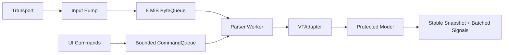
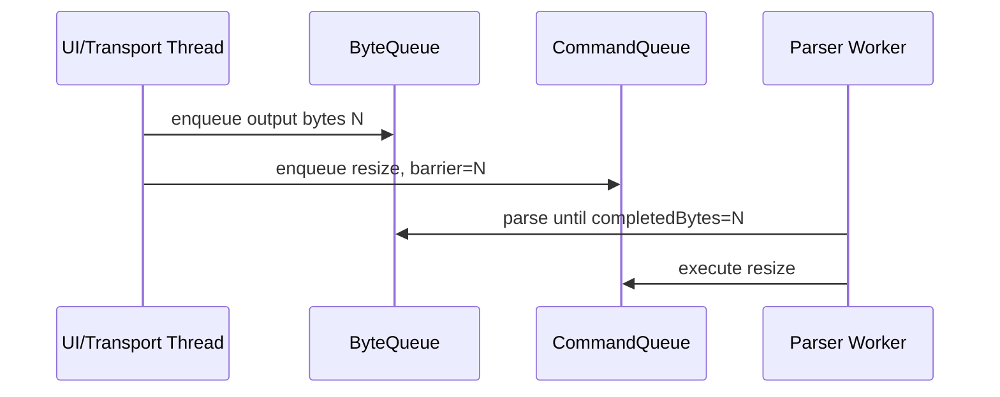

# P2：异步 Parser、有界队列与背压

**状态：功能及 20 MiB/s 性能目标完成（2026-08-01）**

## 目标

把 `vterm_input_write()` 移出 UI 线程，在持续输出时保证 UI 响应、内存有界、普通输出不静默丢失，并建立可靠关闭顺序。

## 架构



## 实现重点

- 固定容量环形 ByteQueue，批量读写、停止唤醒和统计；
- Worker 每次最多读取 64 KiB，独占 VTAdapter；
- libvterm 全屏滚动采用逻辑行环形偏移，避免逐行搬移整块 ScreenCell；
- Scrollback 复用环形槽位并省略行尾默认空白 Cell；
- resize、键鼠、焦点、粘贴、颜色和限制进入有界命令队列；
- 批次末合并 damage、title、bell、scrollback 和 output；
- `waitForIdle()` 提供测试/benchmark 完成屏障；
- 8 MiB 容量、6/4 MiB 高低水位，Transport 主动暂停/恢复；
- 无法暂停时显式报告 overload；
- 销毁时停止接收、尝试排空、唤醒队列、等待 Worker、在线程内销毁 Adapter。

## 落地实现步骤

下面的步骤按依赖顺序排列。每一步都应保持工程可构建，并在进入下一步前完成对应的局部测试。当前源码已经完成这些步骤；该清单同时用于后续重构、代码审查和其他 Transport 接入。

### 步骤 0：冻结 P1 边界并补齐并发测试骨架

在引入线程前先确认以下约束仍成立：

- `VTAdapter` 是 libvterm 的唯一所有者；
- Renderer 不包含 `vterm.h`，只消费 NovaTerm 类型和稳定 Snapshot；
- `ScreenBuffer`、Scrollback、Cursor 和终端属性只有 Parser 路径能够修改；
- P1 的 ANSI、UTF-8 分包、宽字符、Damage、resize 和 Scrollback 测试全部通过。

新增测试辅助设施：可等待完成的超时机制、大数据生成器、重复创建/销毁循环，以及能够在失败时输出队列统计的断言。此时不要先移动 Parser 线程，否则数据竞争难以与原有正确性问题区分。

### 步骤 1：实现固定容量 `BoundedByteQueue`

涉及文件：

- `src/core/terminal/BoundedByteQueue.h`
- `src/core/terminal/BoundedByteQueue.cpp`
- `tests/core/TerminalCoreTests.cpp`

实现一个以固定 `QByteArray` 为后备存储的环形队列，维护 head、tail 和当前 size。公开操作为：

```cpp
bool enqueue(QByteArrayView data, int timeoutMs,
             qsizetype* queuedBytesAfter = nullptr);
QByteArray take(qsizetype maxBytes, int timeoutMs);
void stop();
Statistics statistics() const;
```

必须保证：

1. 入队和出队跨数组尾部时仍保持字节顺序；
2. 单次写入超过总容量时立即失败；
3. `timeoutMs == 0` 时入队不等待，供 UI/Transport 入口使用；
4. 阻塞生产者在消费者释放空间后被唤醒；
5. `stop()` 同时唤醒生产者和消费者，之后不再接收数据；
6. 统计至少包含容量、当前积压、历史高水位、累计入队/出队和生产者等待次数。

本阶段采用互斥锁和条件变量实现有界 RingBuffer。SPSC 无锁队列不是硬性要求；只有 profiler 证明锁是主要瓶颈且生命周期语义可保持时才替换。

### 步骤 2：在 `TerminalCore` 中建立 Runtime

涉及文件：

- `src/core/terminal/TerminalCore.h`
- `src/core/terminal/TerminalCore.cpp`

将线程相关状态集中到 `TerminalCore::Runtime`，避免在公开头文件泄漏 Worker、libvterm 或同步实现。Runtime 初始化顺序：

1. 创建 ScreenBuffer、Scrollback 和 8 MiB ByteQueue；
2. 创建 Parser Worker 线程；
3. 在 Worker 入口创建 `VTAdapter`；
4. 进入字节/命令消费循环；
5. Worker 退出前在同一线程销毁 `VTAdapter`。

`TerminalCore` 继续作为位于 Qt 对象线程的门面。对外信号只能通过 queued invocation 回到对象线程，禁止 Worker 直接调用 UI 或 Renderer。

### 步骤 3：把 Transport 字节入口改成非阻塞批量入队

`TerminalCore::writeInput()` 不再调用 `VTAdapter::writeInput()`，而是通过
`QByteArrayView` 把数据按最多 64 KiB 分片并使用零等待入队：

```cpp
struct InputWriteResult {
    qsizetype requestedBytes;
    qsizetype acceptedBytes;
    bool backpressured;
};
```

```text
writeInput(data)
  ├─ 按 64 KiB 分片
  ├─ enqueue(chunk, 0)
  ├─ 成功：累计 submittedBytes
  └─ 失败：设置 backpressure 并返回精确 acceptedBytes
```

`acceptedBytes == requestedBytes` 表示全部接收；否则调用方从
`acceptedBytes` 处保留未接收后缀并暂停读取。接口不得只返回一个无法表达
部分接收位置的布尔值，也不得在背压后重试整个输入造成重复解析。

迁移期间需要检查所有 `writeInput()` 调用者：测试和 benchmark 可以重试或等待；生产 Transport 路径必须实现暂停与暂存闭环。

### 步骤 4：实现 Parser Worker 消费循环

Worker 每次最多从 ByteQueue 取 64 KiB，并执行：


重点规则：

- 一个批次只 flush 一次，避免 P1 小包路径的重复同步成本；
- `VTAdapter` 的所有方法都只能在 Worker 调用；
- model mutex 只覆盖模型读写，不覆盖 Qt 信号投递或 Transport 操作；
- 队列暂时为空时使用有超时的等待，使 Worker 能检查命令和停止状态；
- 完成计数在模型更新和事件发布之后推进。

### 步骤 5：把所有终端控制操作串行化为命令

定义 `ParserCommand` 和 `CommandType`，覆盖：

- KeyboardCharacter、KeyboardKey；
- MouseButton、Paste；
- Resize、DefaultColors；
- FocusIn、FocusOut；
- SetScrollbackLimit、ClearScrollback、Flush。

命令队列同时限制最多 4096 项和估算 8 MiB payload。相邻的 Resize、DefaultColors、SetScrollbackLimit 和 Flush 可以合并为最新值；按键、鼠标和粘贴等有序输入不得随意合并。

每个命令入队时记录 `byteBarrier = submittedBytes`。Worker 只有在 `completedBytes >= byteBarrier` 时才能执行该命令：



该屏障防止 resize、颜色更新或用户输入越过此前已经接收的远端输出。命令队列超过数量或字节预算时，通过 `inputOverload(reason)` 明确报告。

### 步骤 6：合并 callback 并在 Qt 对象线程发布

VTAdapter observer 不立即逐个发 Qt 信号，而是先写入 Worker 私有的 pending 状态：

- 多个 Damage 合并为覆盖区域；
- output 暂存为有序字节数组；
- Cursor、title、bell、scrollback 使用批次标志和最新状态；
- 每批解析或一组命令完成后调用一次 `publishPendingSignals()`。

发布时复制必要的值，随后通过 `QMetaObject::invokeMethod(..., Qt::QueuedConnection)` 回到 `TerminalCore` 所在线程。Lambda 不得捕获 Worker 中即将失效的引用。

### 步骤 7：提供稳定读取和完成屏障

活动 ScreenBuffer、Scrollback、Cursor 和 title 由 model mutex 保护。Renderer 构建一帧时调用一次 `snapshot()`，得到值语义稳定数据，之后不再逐 Cell 跨线程访问活动模型。

为测试和 benchmark 维护四个单调计数：

```text
submittedBytes   / completedBytes
submittedCommands / completedCommands
```

`waitForIdle(timeout)` 在调用时截取目标计数，并等待两类 completed 达到目标。它只用于一致性屏障和测试，不应成为正常渲染路径中的同步点。

### 步骤 8：打通 Transport 高低水位背压

队列容量和水位为：

| 参数 | 当前值 | 作用 |
| --- | ---: | --- |
| ByteQueue capacity | 8 MiB | 限制 Parser 输入内存 |
| High watermark | 6 MiB | 触发暂停 Transport 读取 |
| Low watermark | 4 MiB | 恢复读取，避免频繁抖动 |
| Parser batch | 64 KiB | 平衡吞吐、延迟和 callback 数 |

`TerminalCore` 在达到高水位或非阻塞入队失败时发出 `inputBackpressureChanged(true)`；Worker 消费至低水位后发出 `false`。状态变化使用原子 exchange 去重，避免重复暂停/恢复信号。

`ITransport::setReadPaused(bool)` 的落地要求：

- Unix PTY：禁用/启用对应 `QSocketNotifier`；
- Windows ConPTY：读线程在条件变量等待，恢复后继续 `ReadFile`；
- SSH/Serial/Telnet：优先暂停上游读取；底层不能暂停时使用独立接收线程和有界暂存；
- 返回 `false` 表示实现不支持暂停，调用方必须报告 overload，不能忽略。

### 步骤 9：处理 readyRead 与暂停之间的竞争窗口

高水位信号送达前，Transport 可能已经发出额外 `readyRead`。当前实现由 `TerminalView::_pendingTransportInput` 保存未入队后缀，并按 64 KiB 在低水位后重试：

```text
readyRead(data)
  ├─ pending 非空：追加并维持暂停
  └─ pending 为空：writeInput(data view)
       └─ 部分接收：仅保存 data[acceptedBytes..end]

backpressure(false)
  ├─ writeInput(pending view)
  ├─ 移除精确 acceptedBytes
  ├─ 仍有后缀：保持暂停
  └─ 全部接收：恢复 Transport
```

这是当前已经落地的过渡实现。P6 必须把这一逻辑原样迁移到 `TerminalSession/InputPump`，并为 pending 数据增加明确容量和统计，使后台 Session、无 View Session 也能正确背压。

### 步骤 10：实现确定的停止和销毁顺序

Runtime 销毁顺序：

1. `accepting = false`，拒绝新字节和命令；
2. 使用有限超时尝试等待已提交任务完成；
3. `stopping = true`；
4. 调用 `bytes.stop()` 唤醒队列两端；
5. 等待 Worker 退出；
6. Worker 在自己的线程中销毁 VTAdapter；
7. 清除 backpressure，并释放 QThread。

Transport/Session 层应先断开 `readyRead` 或暂停读取，再开始 Core 销毁。任何超时都应可记录；不得无限等待，也不得在 Worker 尚访问模型时先销毁 ScreenBuffer。

### 步骤 11：分层验证并切换默认路径

建议按以下顺序验证：

1. ByteQueue 单测：空队列、满队列、回绕、超时、停止和生产者唤醒；
2. Core 正确性回归：ANSI、UTF-8、Damage、resize、Scrollback；
3. 并发测试：解析期间 resize、64 MiB 突发、反复创建/销毁；
4. 背压集成：高水位暂停、低水位恢复、pending 完整重试；
5. 完整应用构建和本地 PTY/ConPTY 手工验证；
6. Release benchmark：分别报告纯队列、完整 Parser 发布路径和 Scrollback；
7. 确认默认入口不再存在同步 `vterm_input_write()` 后，删除旧同步数据通路。

## 性能优化记录（2026-08-01）

### 基线与定位方法

最初的 Release 基准以约几十字节的小包反复调用 `writeInput()`，20 MiB
完整 Parser 路径为 10.22 MiB/s。这个输入方式会放大生产端锁竞争，也与
Transport/InputPump 的 64 KiB 批次设计不一致，因此先把 benchmark 改为：

- 按 64 KiB 构造包含 ANSI、UTF-8 和换行的有效输入批次；
- 队列满时短暂退避，模拟 Transport 暂停读取，不在主线程忙等争抢队列锁；
- 从提交首批数据开始计时，到 `waitForIdle()` 确认全部字节解析和发布完成；
- 同时输出队列峰值、重试次数、累计入队/出队和最终积压，防止以丢数据换吞吐。

随后使用带函数级 profiling 的临时 Release 构建分析相同负载。结果显示，
`libvterm` 的 `moverect_internal()` 占约 37.5% 的采样：20 MiB 测试产生约
37.5 万次全屏滚动，每次都把 39 行 `ScreenCell` 逐行 `memmove()`。
`damagerect()`、Scrollback 行转换和回调是后续热点；ByteQueue 并不是主要
瓶颈，因此没有引入复杂的无锁队列。

### 优化 1：全屏滚动改为 O(1) 行环

在项目捆绑的 `libvterm` ScreenBuffer 中为 primary/alternate buffer 分别维护
逻辑首行的物理偏移。全宽且覆盖整个屏幕的垂直滚动只更新偏移，不再移动
整屏 Cell：

```text
scroll up one row
  before: logical row 0 -> physical row 0
  after : logical row 0 -> physical row 1
  reuse : old physical row 0 becomes the new bottom row
```

局部滚动区域仍使用原有、支持重叠的矩形复制路径。Resize/reflow 需要连续
内存时，先按逻辑行顺序把行环规范化，再执行 libvterm 原有 resize 逻辑。
primary 和 alternate screen 各自保存偏移，切换屏幕不会混用行序。

`VTAdapter::onMoveRect()` 同时按 libvterm 回调语义移动 NovaTerm
`ScreenBuffer`，并发布目标区域 Damage；不能只返回“已处理”而不更新模型。

### 优化 2：降低 Scrollback 行转换和分配成本

旧 `ScrollbackBuffer` 仍是 P2 当前完整 Parser 路径的一部分，因此做了以下
兼容性优化：

- Parser 直接写入下一个可复用的环形槽位，避免每行创建临时 QVector、
  再复制/移动到历史缓冲；
- `VTermScreenCell::chars` 遇到零终止符立即停止转换，不再固定复制全部六个
  codepoint 槽；
- 只省略字符、属性、前景色和背景色都为默认值的行尾空白 Cell；带背景色、
  样式或显式空格的尾部不会被裁剪；
- Renderer/旧查询 API 读取被省略的列时合成默认 Cell，保持固定终端列宽
  的外部语义。

这部分是 P2 旧接口的过渡优化，不代表 P4 的 Chunked Scrollback 已因此
完成。P4 仍负责逻辑行、不可变 Chunk、bytes 预算、Snapshot 滞留内存、
reflow 和异步搜索；后续迁移时应保留“尾部默认 Cell 可稀疏表示”和“写入槽
复用”的经验，而不是长期双写两套 Scrollback。

### 优化 3：移除高频路径上的重复同步

`BoundedByteQueue::enqueue()` 在持有互斥锁时返回成功入队后的队列深度，
`TerminalCore` 用该值判断高水位，不再每次成功入队后立即调用
`statistics()` 再锁一次。队列容量、累计计数和高低水位语义保持不变。

### 正确性保护

性能改动必须同时满足：

1. `totalEnqueued == totalDequeued`，`waitForIdle()` 后队列深度为零；
2. 连续全屏滚动后活动屏幕和 Scrollback 行顺序正确；
3. 行环存在偏移时 resize 能先规范化并保持尺寸/内容有效；
4. alternate screen、局部滚动和带样式尾部仍走保守路径；
5. Core、Renderer 测试全部通过，不降低背压、超时和关闭覆盖。

新增 `fullScreenScrollPreservesContent()` 回归测试检查活动屏幕、历史首行和
带行环 resize。benchmark 仍把数据完整性作为独立 PASS/FAIL 条件，吞吐
达标不能覆盖正确性失败。

### 优化结果

| 阶段 | Parser 吞吐 | 10 万行耗时 | 说明 |
| --- | ---: | ---: | --- |
| 原始 Release 基线 | 10.22 MiB/s | 441.55 ms | 小包输入、整屏逐行搬移 |
| 队列/批次/行转换优化后 | 15.08 MiB/s | 298.32 ms | 64 KiB 输入、槽位复用、尾部稀疏 |
| libvterm 全屏行环后 | 26.41--27.70 MiB/s | 148--159 ms | O(1) 全屏滚动 |

最终完整路径相对原始基线提升约 158%--171%，并稳定超过 20 MiB/s 目标。

## 接口健壮性与可观测性优化（2026-08-01）

### 修复部分接收歧义

第一轮性能优化后继续审查背压路径，发现旧 `bool writeInput()` 存在语义
缺陷：大输入可能已经把若干 64 KiB 前缀写入队列，随后因队列满返回
`false`。调用者不知道具体接收位置，只能丢弃剩余数据或重试整个分片，
分别导致静默丢失或重复解析。

现在 `TerminalCore::InputWriteResult` 同时返回请求字节数、实际接收字节数和
背压状态。`TerminalView` 只把 `data[acceptedBytes..end]` 加入 pending；
低水位恢复时也只移除本轮实际接收的前缀。Core、ByteQueue 和调用者之间
使用 `QByteArrayView` 传递视图，避免为了定位后缀反复创建 `mid()` 副本。

这次修改仍保留“单个最多 64 KiB 入队”和零等待语义，因此不会扩大锁持有
时间，也不会把 UI/Transport 调用变成阻塞操作。

### 扩展行环正确性测试

在已有全屏向上滚动和 resize 规范化测试之外，新增以下边界覆盖：

- Reverse Index 触发的全屏向下滚动；
- 已存在非零行偏移时的局部滚动区域，区域外行必须保持不变；
- primary 和 alternate screen 分别滚动后切换，两个行环偏移不得串用；
- 64 MiB 输入在多次部分接收后必须完整排空，且
  `totalEnqueued == totalDequeued == input.size()`。

这些测试保护了 O(1) 行环的快速路径、局部矩形保守路径和精确后缀重试
语义。吞吐结果只有在字节完整性屏障同时 PASS 时才有效。

### 增加延迟和背压指标

Core benchmark 除平均吞吐外，现在还报告：

- Transport 提交批次数和提交总耗时；
- 最后一次提交到 `waitForIdle()` 的排空延迟；
- 64 KiB 批次端到端提交延迟 P50/P95/P99；
- 背压退避累计时间及其占 Parser 总耗时比例；
- 队列峰值、失败/重试次数、累计入队/出队和最终深度。

三次 Release 结果如下：

| 指标 | 结果范围 |
| --- | ---: |
| 完整 Parser 吞吐 | 26.51--27.18 MiB/s |
| Parser 总耗时 | 738.07--756.59 ms |
| Transport 提交耗时 | 477.66--494.58 ms |
| 最终排空延迟 | 260.41--262.01 ms |
| 批次延迟 P50 | 1.999--2.000 ms |
| 批次延迟 P95 | 2.991--3.437 ms |
| 批次延迟 P99 | 3.363--4.666 ms |
| 背压等待占比 | 62.0%--62.5% |
| 10 万行 Scrollback | 147.61--147.84 ms |

队列在压力测试中达到 8 MiB 上限属于预期背压行为；最终深度均为零，累计
入队/出队均为 21,031,920 bytes。较高的背压等待占比说明生产者确实快于
Parser，但 Parser 吞吐和尾部排空延迟保持稳定，没有通过无界缓存掩盖瓶颈。

Release Core/Renderer 全量测试通过；P4 Chunked Scrollback 基准同时保持
1,117,561 lines/s、Snapshot 创建 3.02 us 和内存预算 PASS，未观察到回归。

## 文件级变更清单

| 文件 | P2 职责 |
| --- | --- |
| `src/core/terminal/BoundedByteQueue.*` | 固定容量字节环和统计 |
| `src/core/terminal/TerminalCore.*` | Runtime、Worker、精确部分接收、命令、屏障、信号发布 |
| `src/core/terminal/VTAdapter.*` | 保持 Worker 独占，不自行创建线程 |
| `src/core/terminal/ScreenBuffer.*` | 在 model mutex/稳定 Snapshot 边界下使用 |
| `src/core/terminal/ScrollbackBuffer.*` | P2 兼容历史缓冲、槽位复用和尾部默认 Cell 稀疏化 |
| `third_party/libvterm-0.3.3/src/screen.c` | 全屏滚动行环和 resize 前规范化 |
| `src/transport/ITransport.h` | 定义暂停读取能力 |
| `src/transport/LocalShellTransport.*` | PTY/ConPTY 暂停和恢复 |
| `src/ui/terminal/TerminalView.*` | 当前精确后缀 pending 重试桥接；P6 将下沉 |
| `tests/core/TerminalCoreTests.cpp` | 队列、并发、精确部分接收、行环边界、背压和销毁测试 |
| `tests/benchmarks/CoreBenchmark.cpp` | Release 吞吐与 Scrollback 测量 |

## 实施过程中的禁止项

- 禁止把整个 `TerminalCore` QObject 粗暴移动到线程后让 UI 继续直接调用；
- 禁止 Renderer 跨线程持有活动 ScreenBuffer 的裸引用；
- 禁止在 UI 线程使用无限等待的 ByteQueue 入队；
- 禁止用无界 `QByteArray` 或 queued signal 代替有界背压；
- 禁止为了吞吐在队列满时静默丢弃普通终端字节；
- 禁止在持有 model mutex 时发 UI 信号、等待线程或调用 Transport；
- 禁止让 resize 等控制命令越过已经接收但尚未解析的字节。

## 当前技术债务

竞争窗口的未入队 Transport 数据目前由 `TerminalView` 暂存。P6 应迁移到 Session/InputPump，使后台 Session 不依赖 View。值语义 Snapshot 也需要在不改变语义的前提下降低复制成本。

## 验证和指标

Release Core/Renderer 测试及完整应用构建通过。使用 64 KiB Transport
批次连续运行三次 20 MiB 完整 Parser 基准，吞吐为 26.97、26.51、
27.18 MiB/s，均超过 20 MiB/s 目标；10 万行 Scrollback 为
147.61--147.84 ms。测试覆盖回绕、唤醒、64 MiB 精确部分接收、高低水位、
全屏双向滚动、局部滚动区域、alternate screen、resize 和高负载销毁。

## 退出标准

UI 不执行 libvterm 解析；队列有界；普通输出不静默丢失；关闭无死锁/UAF/线程泄漏；Release 完整 Parser 路径稳定超过 20 MiB/s。
