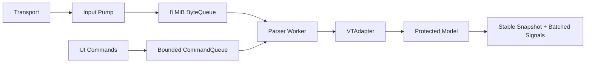
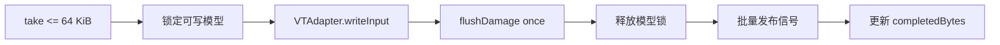
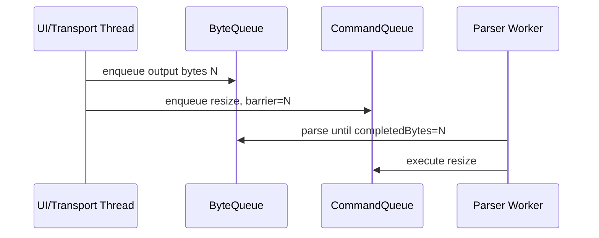

# P2：异步 Parser、有界队列与背压

**状态：功能完成（2026-07-30）；20 MiB/s 性能目标未达成**

## 目标

把 `vterm_input_write()` 移出 UI 线程，在持续输出时保证 UI 响应、内存有界、普通输出不静默丢失，并建立可靠关闭顺序。

## 架构



## 实现重点

- 固定容量环形 ByteQueue，批量读写、停止唤醒和统计；
- Worker 每次最多读取 64 KiB，独占 VTAdapter；
- resize、键鼠、焦点、粘贴、颜色和限制进入有界命令队列；
- 批次末合并 damage、title、bell、scrollback 和 output；
- `waitForIdle()` 提供测试/benchmark 完成屏障；
- 8 MiB 容量、6/4 MiB 高低水位，Transport 主动暂停/恢复；
- 无法暂停时显式报告 overload；
- 销毁时停止接收、尝试排空、唤醒队列、等待 Worker、在线程内销毁 Adapter。

## 落地实现步骤

下面的步骤按依赖顺序排列。每一步都应保持工程可构建，并在进入下一步前完成对应的局部测试。当前源码已经完成这些步骤；该清单同时用于后续重构、代码审查和其他 Transport 接入。

### 步骤 0：冻结 P1 边界并补齐并发测试骨架

在引入线程前先确认以下约束仍成立：

- `VTAdapter` 是 libvterm 的唯一所有者；
- Renderer 不包含 `vterm.h`，只消费 NovaTerm 类型和稳定 Snapshot；
- `ScreenBuffer`、Scrollback、Cursor 和终端属性只有 Parser 路径能够修改；
- P1 的 ANSI、UTF-8 分包、宽字符、Damage、resize 和 Scrollback 测试全部通过。

新增测试辅助设施：可等待完成的超时机制、大数据生成器、重复创建/销毁循环，以及能够在失败时输出队列统计的断言。此时不要先移动 Parser 线程，否则数据竞争难以与原有正确性问题区分。

### 步骤 1：实现固定容量 `BoundedByteQueue`

涉及文件：

- `src/core/terminal/BoundedByteQueue.h`
- `src/core/terminal/BoundedByteQueue.cpp`
- `tests/core/TerminalCoreTests.cpp`

实现一个以固定 `QByteArray` 为后备存储的环形队列，维护 head、tail 和当前 size。公开操作为：

```cpp
bool enqueue(const QByteArray& data, int timeoutMs);
QByteArray take(qsizetype maxBytes, int timeoutMs);
void stop();
Statistics statistics() const;
```

必须保证：

1. 入队和出队跨数组尾部时仍保持字节顺序；
2. 单次写入超过总容量时立即失败；
3. `timeoutMs == 0` 时入队不等待，供 UI/Transport 入口使用；
4. 阻塞生产者在消费者释放空间后被唤醒；
5. `stop()` 同时唤醒生产者和消费者，之后不再接收数据；
6. 统计至少包含容量、当前积压、历史高水位、累计入队/出队和生产者等待次数。

本阶段采用互斥锁和条件变量实现有界 RingBuffer。SPSC 无锁队列不是硬性要求；只有 profiler 证明锁是主要瓶颈且生命周期语义可保持时才替换。

### 步骤 2：在 `TerminalCore` 中建立 Runtime

涉及文件：

- `src/core/terminal/TerminalCore.h`
- `src/core/terminal/TerminalCore.cpp`

将线程相关状态集中到 `TerminalCore::Runtime`，避免在公开头文件泄漏 Worker、libvterm 或同步实现。Runtime 初始化顺序：

1. 创建 ScreenBuffer、Scrollback 和 8 MiB ByteQueue；
2. 创建 Parser Worker 线程；
3. 在 Worker 入口创建 `VTAdapter`；
4. 进入字节/命令消费循环；
5. Worker 退出前在同一线程销毁 `VTAdapter`。

`TerminalCore` 继续作为位于 Qt 对象线程的门面。对外信号只能通过 queued invocation 回到对象线程，禁止 Worker 直接调用 UI 或 Renderer。

### 步骤 3：把 Transport 字节入口改成非阻塞批量入队

`TerminalCore::writeInput()` 不再调用 `VTAdapter::writeInput()`，而是把数据按最多 64 KiB 分片并使用零等待入队：

```text
writeInput(data)
  ├─ 按 64 KiB 分片
  ├─ enqueue(chunk, 0)
  ├─ 成功：累计 submittedBytes
  └─ 失败：设置 backpressure 并返回 false
```

返回 `true` 表示本次传入数据全部被接收；返回 `false` 表示调用方必须保留尚未接收的片段并暂停读取。接口不得在返回 `false` 后假装数据已处理，也不得静默截断。

迁移期间需要检查所有 `writeInput()` 调用者：测试和 benchmark 可以重试或等待；生产 Transport 路径必须实现暂停与暂存闭环。

### 步骤 4：实现 Parser Worker 消费循环

Worker 每次最多从 ByteQueue 取 64 KiB，并执行：



重点规则：

- 一个批次只 flush 一次，避免 P1 小包路径的重复同步成本；
- `VTAdapter` 的所有方法都只能在 Worker 调用；
- model mutex 只覆盖模型读写，不覆盖 Qt 信号投递或 Transport 操作；
- 队列暂时为空时使用有超时的等待，使 Worker 能检查命令和停止状态；
- 完成计数在模型更新和事件发布之后推进。

### 步骤 5：把所有终端控制操作串行化为命令

定义 `ParserCommand` 和 `CommandType`，覆盖：

- KeyboardCharacter、KeyboardKey；
- MouseButton、Paste；
- Resize、DefaultColors；
- FocusIn、FocusOut；
- SetScrollbackLimit、ClearScrollback、Flush。

命令队列同时限制最多 4096 项和估算 8 MiB payload。相邻的 Resize、DefaultColors、SetScrollbackLimit 和 Flush 可以合并为最新值；按键、鼠标和粘贴等有序输入不得随意合并。

每个命令入队时记录 `byteBarrier = submittedBytes`。Worker 只有在 `completedBytes >= byteBarrier` 时才能执行该命令：



该屏障防止 resize、颜色更新或用户输入越过此前已经接收的远端输出。命令队列超过数量或字节预算时，通过 `inputOverload(reason)` 明确报告。

### 步骤 6：合并 callback 并在 Qt 对象线程发布

VTAdapter observer 不立即逐个发 Qt 信号，而是先写入 Worker 私有的 pending 状态：

- 多个 Damage 合并为覆盖区域；
- output 暂存为有序字节数组；
- Cursor、title、bell、scrollback 使用批次标志和最新状态；
- 每批解析或一组命令完成后调用一次 `publishPendingSignals()`。

发布时复制必要的值，随后通过 `QMetaObject::invokeMethod(..., Qt::QueuedConnection)` 回到 `TerminalCore` 所在线程。Lambda 不得捕获 Worker 中即将失效的引用。

### 步骤 7：提供稳定读取和完成屏障

活动 ScreenBuffer、Scrollback、Cursor 和 title 由 model mutex 保护。Renderer 构建一帧时调用一次 `snapshot()`，得到值语义稳定数据，之后不再逐 Cell 跨线程访问活动模型。

为测试和 benchmark 维护四个单调计数：

```text
submittedBytes   / completedBytes
submittedCommands / completedCommands
```

`waitForIdle(timeout)` 在调用时截取目标计数，并等待两类 completed 达到目标。它只用于一致性屏障和测试，不应成为正常渲染路径中的同步点。

### 步骤 8：打通 Transport 高低水位背压

队列容量和水位为：

| 参数 | 当前值 | 作用 |
| --- | ---: | --- |
| ByteQueue capacity | 8 MiB | 限制 Parser 输入内存 |
| High watermark | 6 MiB | 触发暂停 Transport 读取 |
| Low watermark | 4 MiB | 恢复读取，避免频繁抖动 |
| Parser batch | 64 KiB | 平衡吞吐、延迟和 callback 数 |

`TerminalCore` 在达到高水位或非阻塞入队失败时发出 `inputBackpressureChanged(true)`；Worker 消费至低水位后发出 `false`。状态变化使用原子 exchange 去重，避免重复暂停/恢复信号。

`ITransport::setReadPaused(bool)` 的落地要求：

- Unix PTY：禁用/启用对应 `QSocketNotifier`；
- Windows ConPTY：读线程在条件变量等待，恢复后继续 `ReadFile`；
- SSH/Serial/Telnet：优先暂停上游读取；底层不能暂停时使用独立接收线程和有界暂存；
- 返回 `false` 表示实现不支持暂停，调用方必须报告 overload，不能忽略。

### 步骤 9：处理 readyRead 与暂停之间的竞争窗口

高水位信号送达前，Transport 可能已经发出额外 `readyRead`。当前实现由 `TerminalView::_pendingTransportInput` 保存未入队后缀，并按 64 KiB 在低水位后重试：

```text
readyRead
  ├─ pending 非空：追加并维持暂停
  └─ pending 为空：逐块 writeInput
       └─ 首次失败：保存当前块剩余数据和后续数据

backpressure(false)
  ├─ 重试 pending
  ├─ 再次失败：保持暂停
  └─ 全部接收：恢复 Transport
```

这是当前已经落地的过渡实现。P6 必须把这一逻辑原样迁移到 `TerminalSession/InputPump`，并为 pending 数据增加明确容量和统计，使后台 Session、无 View Session 也能正确背压。

### 步骤 10：实现确定的停止和销毁顺序

Runtime 销毁顺序：

1. `accepting = false`，拒绝新字节和命令；
2. 使用有限超时尝试等待已提交任务完成；
3. `stopping = true`；
4. 调用 `bytes.stop()` 唤醒队列两端；
5. 等待 Worker 退出；
6. Worker 在自己的线程中销毁 VTAdapter；
7. 清除 backpressure，并释放 QThread。

Transport/Session 层应先断开 `readyRead` 或暂停读取，再开始 Core 销毁。任何超时都应可记录；不得无限等待，也不得在 Worker 尚访问模型时先销毁 ScreenBuffer。

### 步骤 11：分层验证并切换默认路径

建议按以下顺序验证：

1. ByteQueue 单测：空队列、满队列、回绕、超时、停止和生产者唤醒；
2. Core 正确性回归：ANSI、UTF-8、Damage、resize、Scrollback；
3. 并发测试：解析期间 resize、64 MiB 突发、反复创建/销毁；
4. 背压集成：高水位暂停、低水位恢复、pending 完整重试；
5. 完整应用构建和本地 PTY/ConPTY 手工验证；
6. Release benchmark：分别报告纯队列、完整 Parser 发布路径和 Scrollback；
7. 确认默认入口不再存在同步 `vterm_input_write()` 后，删除旧同步数据通路。

## 文件级变更清单

| 文件 | P2 职责 |
| --- | --- |
| `src/core/terminal/BoundedByteQueue.*` | 固定容量字节环和统计 |
| `src/core/terminal/TerminalCore.*` | Runtime、Worker、命令、屏障、信号发布 |
| `src/core/terminal/VTAdapter.*` | 保持 Worker 独占，不自行创建线程 |
| `src/core/terminal/ScreenBuffer.*` | 在 model mutex/稳定 Snapshot 边界下使用 |
| `src/transport/ITransport.h` | 定义暂停读取能力 |
| `src/transport/LocalShellTransport.*` | PTY/ConPTY 暂停和恢复 |
| `src/ui/terminal/TerminalView.*` | 当前 pending 重试桥接；P6 将下沉 |
| `tests/core/TerminalCoreTests.cpp` | 队列、并发、背压和销毁测试 |
| `benchmarks/CoreBenchmark.cpp` | Release 吞吐与 Scrollback 测量 |

## 实施过程中的禁止项

- 禁止把整个 `TerminalCore` QObject 粗暴移动到线程后让 UI 继续直接调用；
- 禁止 Renderer 跨线程持有活动 ScreenBuffer 的裸引用；
- 禁止在 UI 线程使用无限等待的 ByteQueue 入队；
- 禁止用无界 `QByteArray` 或 queued signal 代替有界背压；
- 禁止为了吞吐在队列满时静默丢弃普通终端字节；
- 禁止在持有 model mutex 时发 UI 信号、等待线程或调用 Transport；
- 禁止让 resize 等控制命令越过已经接收但尚未解析的字节。

## 当前技术债务

竞争窗口的未入队 Transport 数据目前由 `TerminalView` 暂存。P6 应迁移到 Session/InputPump，使后台 Session 不依赖 View。值语义 Snapshot 也需要在不改变语义的前提下降低复制成本。

## 验证和指标

12 项 Release Core 测试及完整应用构建通过；20 MiB 数据为 9.35 MiB/s，10 万行 Scrollback 为 490.63 ms。测试覆盖回绕、唤醒、64 MiB 突发、高低水位、resize 和高负载销毁。

## 退出标准

UI 不执行 libvterm 解析；队列有界；普通输出不静默丢失；关闭无死锁/UAF/线程泄漏。吞吐目标作为显式未完成性能项继续跟踪。
