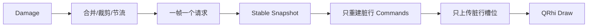
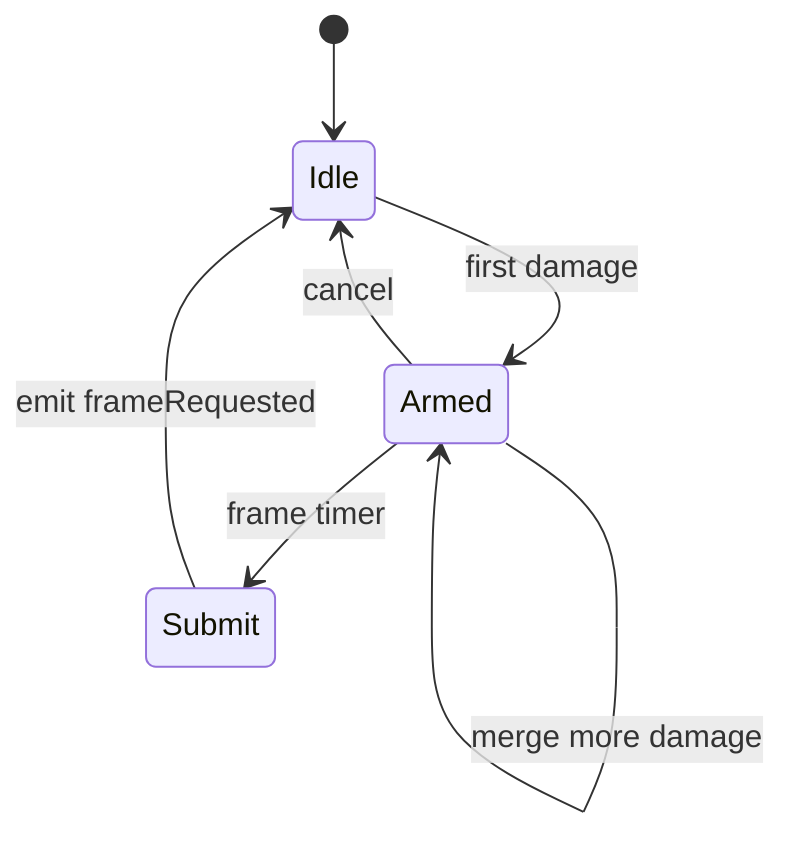

# P3：RenderScheduler 与增量渲染

**状态：代码实现完成（2026-07-30），待实机 GPU、FPS 和视觉正确性验收**

## 目标

让 Damage Rect 真正减少 CPU 命令构建和 GPU 上传，并把 Parser 更新与 GPU 帧率解耦。

## 管线



## 实现重点

- RenderScheduler 支持相邻/重叠合并、32 区域和 60% 覆盖阈值；
- 支持 60/120/144 Hz 精确定时；
- RenderCommandBuffer 按行缓存背景、Glyph、Underline、Strike；
- Cursor、Selection 作为独立 Overlay；
- GPU 动态 Buffer 使用固定行槽位，未变行不上传；
- 保持全背景、全内容、Overlay 的绘制顺序；
- resize、主题、字体、滚动映射和资源恢复执行全屏失效；
- 统计脏区、帧、重建行、命令时间、CPU 时间、上传字节和 Draw Call。

## 落地实现步骤

### 步骤 0：建立 P2 渲染基线

先记录全屏扫描实现的 CPU 帧时间、每帧生成顶点数、上传 bytes、Draw Call 和持续输出 FPS。准备三类负载：单 Cell 更新、连续逐行输出、全屏刷新/滚动。确认 Renderer 每帧只读取一次稳定 `TerminalSnapshot`，不跨线程读取活动 ScreenBuffer。

### 步骤 1：实现后端无关 `RenderScheduler`

新增 `src/renderer/RenderScheduler.{h,cpp}`。Scheduler 只处理 Cell 坐标 DirtyRegion，不持有 QRhi 资源：

- `setViewport(columns, rows)` 设置裁剪边界；
- `schedule(region)` 接收普通 damage；
- `scheduleFullFrame()` 处理 resize、主题、字体和资源恢复；
- `scheduleOverlay()` 处理 Cursor/Selection；
- `setTargetRefreshRate()` 接受 60/120/144 Hz，非法值回退；
- `cancel()` 在销毁或资源释放时停止未提交帧。

区域先裁剪，再反复合并相交或边缘相邻矩形。区域数超过 32 或估算覆盖面积达到屏幕 60% 时升级为全屏。使用 `Qt::PreciseTimer`，一个帧间隔只发一次 `frameRequested(regions, fullFrame, overlayDirty)`。



### 步骤 2：建立 Scheduler 单元测试

测试空/越界裁剪、重叠、包含、边缘相邻、区域阈值、覆盖率阈值、Overlay-only、全屏优先级和高频合帧。时间测试允许合理容差，避免依赖精确毫秒造成 CI 抖动。

### 步骤 3：实现 `RenderCommandBuffer`

新增 `src/renderer/RenderCommandBuffer.{h,cpp}`。定义后端无关命令类型：BackgroundRect、GlyphInstance、Underline、Strike、Cursor、SelectionOverlay，并预留 Hyperlink/Search Overlay。

每个可见行保存 `RenderCommandRow { backgrounds, contents, revision }`，Overlay 单独保存。`replaceRow()` 只增加目标行和全局 revision，resize 清除无效行。命令只保存逻辑矩形、Atlas UV 和颜色，不能保存 `QRhiBuffer*`、纹理或 Parser 指针。

### 步骤 4：把 Renderer 更新入口接入 Scheduler

修改 `TerminalRenderer`：

1. `TerminalCore::damage` 不再直接导致一帧完整 rebuild，而是调用 `schedule()`；
2. Cursor/Selection 变化调用 `scheduleOverlay()`；
3. resize、字体、scheme、scrollback 映射改变调用 `scheduleFullFrame()`；
4. `frameRequested` 到达时，在互斥保护下保存 regions/full/overlay 状态，并只调用一次 `update()`；
5. render 开始时交换 pending 状态，禁止遍历仍被信号追加的容器。

### 步骤 5：按脏区计算脏行

每帧获取一次 Snapshot，将 Scheduler 的半开 DirtyRegion 映射为 `QVector<bool> dirtyRows`。普通 damage 只标记相交可见行；全屏帧标记全部行；Overlay-only 不标记内容行。

Scrollback 需要区分两种情况：位于实时底部时，追加历史行通常复用同批 active-screen damage；回看历史或 document-row 到 widget-row 映射改变时必须全屏失效，避免显示错行。

### 步骤 6：只重建脏行命令

`rebuildCommandRows(snapshot, dirtyRows)` 仅遍历脏行 Cell，并通过 `replaceRow()` 更新缓存。每个 Cell 按需生成背景、Glyph、下划线和删除线；宽字符 continuation 不重复生成；Cursor/Selection 在独立函数中重建。

记录本帧重建行数、命令数和 command generation nanoseconds。不得为了统计对未变行重新扫描。

### 步骤 7：规划固定 GPU 行槽位

当前 P3 为每个可见行预留固定容量：背景最多每 Cell 一个 Quad，内容为 Glyph/装饰预留上限，Overlay 位于独立尾区。Buffer 仅在 rows、columns、DPR、容量上限或资源生命周期变化时重新分配。

```text
[background row 0 ... row N]
[content    row 0 ... row N]
[overlay region]
```

固定槽位的优点是脏行可直接计算 byte offset；缺点是容量浪费和复杂 Glyph 上限，P5 可在指标支持下改为实例/分块缓冲，但不得破坏增量更新语义。

### 步骤 8：局部生成顶点并上传

只将脏行命令转换成 `GpuVertex`，并对对应背景区、内容区调用 `updateDynamicBuffer()`；Overlay 变化时只上传 Overlay 区。若命令超过槽位容量，本帧扩容并全量重传，禁止截断。

Draw 顺序固定为：所有背景、所有内容、Overlay。即使使用多次 draw，也不能按 Cell 交错绘制背景和字形，否则后一 Cell 背景可能覆盖前一字形的抗锯齿边缘。

### 步骤 9：处理 Atlas 和资源生命周期

P3 保留现有 Glyph Atlas 行为；新 Glyph 导致整图上传属于 P5 优化项。`initialize()`、`releaseResources()`、DPR/字体变化和 QRhi 资源丢失必须：

- 保留或重建 CPU 命令语义；
- 重建 Pipeline、Texture、Sampler、SRB 和 Buffer；
- 强制全部有效行重新上传；
- 清除悬空 QRhi 指针和旧 Atlas key。

### 步骤 10：增加可观测指标

`RenderStatistics` 至少累计：原始/合并 Dirty、调度/合并/全屏帧、重建行、命令数、命令生成时间、CPU frame time、GPU upload bytes、Draw Call、Buffer reallocations。提供读取接口用于 benchmark/调试页，但不要在热路径频繁格式化字符串。

### 步骤 11：分层验证和实机验收

先运行 Renderer support 单测，再构建完整应用，最后在 Release 实机验证 60/120/144 Hz、持续输出、回看 Scrollback、resize、主题/字体切换和 GPU 资源恢复。对比 P2 基线，证明单 Cell 更新不再扫描全部可见 Cell、上传量随脏行数变化。

## 文件级变更清单

| 文件 | P3 职责 |
| --- | --- |
| `src/renderer/RenderScheduler.*` | Dirty 合并、阈值和帧节流 |
| `src/renderer/RenderCommandBuffer.*` | 按行 CPU 命令缓存与 Overlay |
| `src/renderer/TerminalRenderer.*` | 脏行重建、固定槽位和局部上传 |
| `tests/renderer/RendererP3Tests.cpp` | Scheduler/CommandBuffer 单测 |
| `tests/renderer/TerminalSessionSmokeTests.cpp` | Core 到 Renderer 冒烟验证 |
| `CMakeLists.txt` | Renderer 测试目标和 Shader 资源 |

## 实施禁止项

- 禁止 Parser callback 直接强制立即渲染；
- 禁止每个 damage 创建一帧或每帧重新扫描全屏；
- 禁止 RenderCommand 持有 QRhi/libvterm 类型；
- 禁止把 Cursor/Selection 变化升级为内容全屏重建；
- 禁止在渲染热路径等待 Parser 或 GPU 完成；
- 禁止为获取 GPU 时间插入同步 readback；
- 禁止槽位溢出时截断字符或装饰。

## 测试

支持层测试覆盖区域合并、全屏升级、高频合帧、按行替换和 resize 清理；Core 测试和 Debug 应用构建通过。

## 实机验收矩阵

- ASCII、CJK、宽字符、组合字符、下划线和选择无视觉回归；
- 单字符 damage 只重建一行；
- 持续输出稳定 60 FPS，高刷新率节流正确；
- 记录 CPU 帧 P50/P95/P99、上传字节、Draw Call 和帧丢失；
- D3D11/D3D12、Vulkan、OpenGL 中至少覆盖项目支持的平台后端；
- GPU 资源重建后画面完整。

## 退出标准

实机确认普通输出 60 FPS、无明显同步停顿、最终画面正确。真实 GPU 时间未有统一无阻塞 QRhi API 时，使用平台 profiler，不在渲染路径强制同步。
