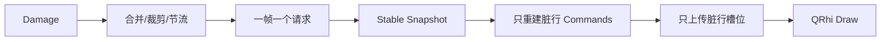
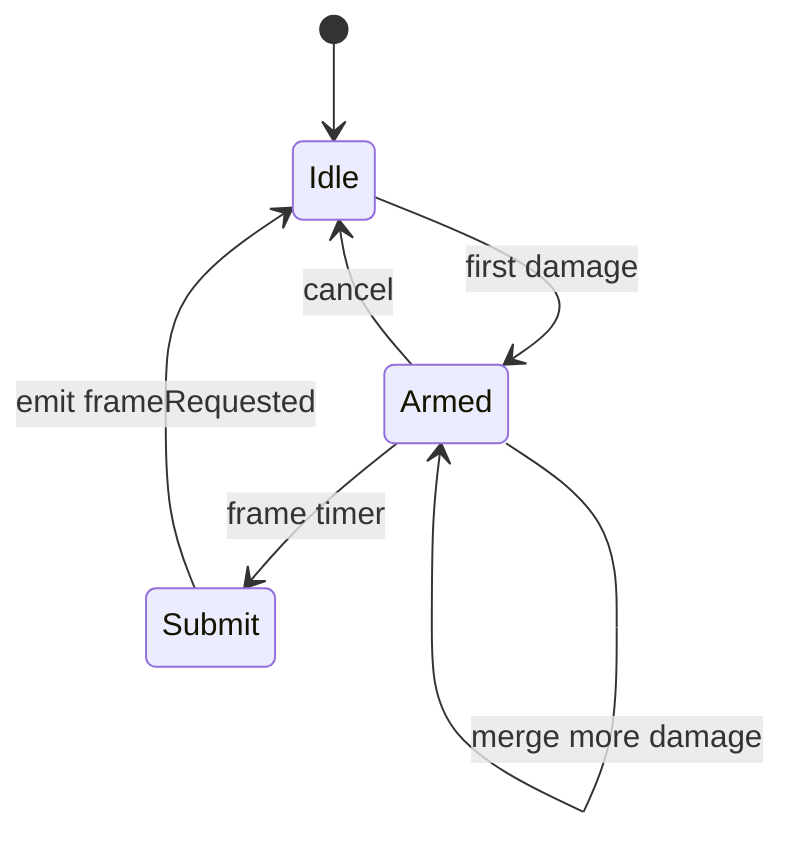

# P3：RenderScheduler 与增量渲染

**状态：代码、自动化验证、Vulkan/OpenGL 实机 60 FPS 跑分完成（2026-08-01），待高刷新率、资源恢复和人工视觉验收**

> **2026-09-10 复核**：P5 与去 Qt 化大重构后重新核对 P3。**增量渲染语义与自动化
> 验证均未回归**：`novaterm_renderer_tests` 通过（Debug 2.1s），P3 support 基准
> 结构不变量与 2026-08-01 一致（单行=1 脏行/239 命令/45,888 modeled bytes，
> 全屏=40 行/9,560 命令，**上传缩减 97.5%**）。CPU 绝对 ns 为机器相关（本
> i7-13700H 笔记本比原验收机 i7-14700K 慢且持续负载下热降频，不可直接对比）。
> 修正了「固定槽位容量」小节因 P5 实例化改造而漂移的行号引用。GPU 实机
> 60 FPS 数据与「尚未完成的验收」四项维持原状——本机无对应显示/后端环境，
> 未重测也未改判。详见文末「2026-09-10 复核记录」。

## 目标

让 Damage Rect 真正减少 CPU 命令构建和 GPU 上传，并把 Parser 更新与 GPU 帧率解耦。

## 管线


```mermaid
flowchart LR
    D[Damage] --> S[合并/裁剪/节流]
    S --> F[一帧一个请求]
    F --> SS[Stable Snapshot]
    SS --> RC[只重建脏行 Commands]
    RC --> U[只上传脏行槽位]
    U --> Q[QRhi Draw]
```

## 实现重点

- RenderScheduler 支持相邻/重叠合并、32 区域和 60% 覆盖阈值；
- 使用精确定时器实现 60/120/144 Hz 目标提交频率上限；
- RenderCommandBuffer 按行缓存背景、Glyph、Underline、Strike；
- Cursor、Selection 作为独立 Overlay；
- GPU 动态 Buffer 使用固定行槽位，未变行不上传；
- 保持全背景、全内容、Overlay 的绘制顺序；
- resize、主题、字体、滚动映射和资源恢复执行全屏失效；
- 统计脏区、帧、重建行、命令时间、CPU 时间、上传字节和 Draw Call。

## 正确性契约与不变量

本节是 P3 实现、评审和回归测试必须共同遵守的契约；当无法证明增量状态完整时，必须保守升级为全屏帧，不能以可能漏绘为代价维持局部更新。

### Snapshot、Damage 与 revision

- Parser Worker 每完成一个可见模型发布批次，递增单调 `modelRevision`；同一批次产生的所有 Damage 携带相同 revision。
- `TerminalSnapshot` 和 `RendererSnapshot` 必须记录它们在模型锁内读取到的 revision。
- Scheduler 合并多个 Damage 时保留最高 content revision，并随 `frameRequested` 一并提交。
- Renderer 每帧开始时原子交换 pending regions、full/overlay 标志和 revision；render 期间到达的新请求留给下一帧，不能被本帧清除。
- 每个可见模型行同时记录最近一次内容变更的 row revision；`RendererSnapshot` 即使只复制脏行 Cell，也必须发布所有可见行的 revision 元数据。
- 如果 Renderer 取得的 Snapshot revision 高于当前已投递 Damage 的最高 revision，说明 Snapshot 包含尚未送达 GUI 的更新。Renderer 使用 row revision 补标所有超前行并重新获取这些行；只有缺少完整行级证据、viewport 尺寸改变或全部行均失效时才升级全屏。
- 高频输出允许合并或跳过中间 revision，但停止更新后最终画面必须收敛到最高已发布 revision。

发布关系如下：

```text
Parser batch N
  -> mutate model under lock
  -> revision = N
  -> mark changed row revisions = N
  -> publish Damage(region, N)
  -> Scheduler keeps max revision
  -> Renderer reads Snapshot(revision >= N, row revisions)
  -> recover rows newer than delivered Damage revision
```

### DirtyRegion 坐标与合并

- DirtyRegion 严格使用 Cell 坐标半开区间：`[startRow,endRow) × [startColumn,endColumn)`。
- 区域必须先裁剪到 `[0,rows) × [0,columns)`；裁剪后的零面积区域被忽略且不进入统计。
- 相交区域合并；共享一段水平边或垂直边的区域视为相邻并合并；仅角点接触不合并。
- 合并结果使用最小包围矩形，并反复检查直至不存在可继续合并的区域。
- 合并后区域数达到第 33 个（`> 32`），或合并区域面积和达到 viewport 面积的 60%（`>= 0.60`）时升级全屏。
- 当前区域在合并后互不重叠，因此覆盖率可使用面积和；若后续改变合并算法导致区域可能重叠，必须改用精确并集或去重后面积。

### 调度语义

- 60/120/144 Hz 是目标提交频率上限，不承诺与显示器 VSync 精确对齐，也不补交定时器延迟期间错过的中间帧。
- 首个请求启动单次 `Qt::PreciseTimer`；timer 已 armed 时只合并状态，不再创建第二个 timer。连续帧使用单调时钟上的绝对 deadline 保留亚毫秒相位，避免每次 Damage 到达后重新等待完整间隔造成帧率漂移；若错过完整间隔则跳过旧 deadline，不补交中间帧。
- Full Frame 优先于普通 Damage；升级全屏后清除普通区域，但保留最高 content revision；Full Frame 同时使 Overlay 失效。
- Overlay-only 帧不得产生内容脏行或改变 content revision。
- `cancel()` 必须停止 timer 并清空区域、Full/Overlay 标志和 pending revision；随后新的 schedule 从干净状态重新开始。
- `setViewport()` 改变裁剪边界时触发 Full Frame；旧 viewport 的局部 Damage 不得直接用于新映射。

### Viewport 与 Scrollback 映射

- `scrollLine == 0` 且映射未改变时，scrollback 追加可复用同一 Parser 发布批次的 active-screen Damage，不能把每次输出升级为全屏。
- 用户回看历史、滚动偏移被淘汰范围夹紧、reflow 完成、列数变化、回到底部或 document-row 到 widget-row 映射发生变化时，必须 Full Frame。
- 历史行和 active screen 的组合必须在同一次 `rendererSnapshot()` 模型锁内完成，禁止一帧混用不同 Scrollback generation。
- 单调 `ViewportMappingRevision` 已由 P5 引入并落地为 `TerminalRenderer::_viewportMappingRevision`（映射变化、滚动交接、clamp 变化等处递增，并经 `RenderStatistics::viewportMappingRevision` 暴露）；映射 revision 改变即全屏失效。映射计算目前仍在 `rendererSnapshot()` 的模型锁内完成，若将来移出，该 revision 是必须维持的正确性前提。设计说明见 P5 文档 §8.2。

### Atlas generation

- `RenderCommandRow` 记录生成 Glyph UV 时的 `atlasGeneration`。
- 一个 generation 生命周期内，已分配 Glyph 的 UV 必须稳定，禁止静默重排或复用为其他字形。
- Atlas reset、DPR/字体变化或任何可能改变 UV 的操作必须递增 generation，并重建所有引用旧 generation 的有效行。
- Atlas 在构建可见行途中溢出时，Renderer 必须检测 generation 变化并重新生成全部可见行；Atlas miss 禁止显示旧 key 对应的错误字形。
- P5 引入多页和 LRU 后仍须保持上述 generation/失效语义。

### 固定槽位容量

> **P5 已替换顶点格式。** P3 落地时每个 Quad 展开为 6 个 `GpuVertex`（每个
> 8 个 `float`，32 bytes/顶点，192 bytes/Quad）。P5 阶段 C 改为**实例化**：
> 一个 Quad 等于一条 `GpuInstance`（16 个 `float`，64 bytes，
> `TerminalRenderer.h:175-193`），单位 Quad 由 shader 生成，背景/内容/overlay
> 各一次 `cb->draw(4, instanceCount)`（`TerminalRenderer.cpp:932`/`941`/`949`），
> pipeline 拓扑为 TriangleStrip（`TerminalRenderer.cpp:1564`）。下面按当前实例
> 格式给出，槽位划分与增量语义未变，只是每 Quad 的 bytes 从 192 降到 64。

```text
backgroundInstancesPerRow = max(columns, 该行实际 background 命令数)
contentInstancesPerRow    = max(columns × 4, 该行实际 content 命令数)
overlayInstances          = max(rows + 2, overlayCommandCount)
requiredBytes             = (rows × (bgStride + contentStride)
                             + overlayInstances) × sizeof(GpuInstance)
```

内容区每 Cell 的 4-command 上限覆盖 Glyph、双下划线两个 Quad 和 Strike。实际命令超过当前槽位时，容量只增不减并重新计算所有行 offset（`ensureVertexBuffer()` 用 `_backgroundRowStrideVertices` / `_contentRowStrideVertices` 做单调上取整）；布局改变或 Buffer 重分配后必须全量重传。行由有内容变为空时以命令数量归零控制 Draw，不能继续绘制旧槽位数据。

## 落地实现步骤

### 步骤 0：建立 P2 渲染基线

先记录全屏扫描实现的 CPU 帧时间、每帧生成顶点数、上传 bytes、Draw Call 和持续输出 FPS。准备三类负载：单 Cell 更新、连续逐行输出、全屏刷新/滚动。确认 Renderer 每帧只读取一次稳定 `RendererSnapshot`，不跨线程读取活动 ScreenBuffer。

### 步骤 1：实现后端无关 `RenderScheduler`

新增 `src/renderer/RenderScheduler.{h,cpp}`。Scheduler 只处理 Cell 坐标 DirtyRegion，不持有 QRhi 资源：

- `setViewport(columns, rows)` 设置裁剪边界；
- `schedule(region, revision)` 接收普通 damage 及其模型 revision；
- `scheduleFullFrame(revision)` 处理 resize、主题、字体和资源恢复；
- `scheduleOverlay()` 处理 Cursor/Selection；
- `setTargetRefreshRate()` 接受 60/120/144 Hz，非法值回退；
- `cancel()` 在销毁或资源释放时停止未提交帧。

区域先裁剪，再反复合并相交或边缘相邻矩形。区域数超过 32 或估算覆盖面积达到屏幕 60% 时升级为全屏。使用 `Qt::PreciseTimer`，一个帧间隔最多发送一次 `frameRequested(regions, fullFrame, overlayDirty, contentRevision)`。


```mermaid
stateDiagram-v2
    [*] --> Idle
    Idle --> Armed: first damage
    Armed --> Armed: merge more damage
    Armed --> Submit: frame timer
    Submit --> Idle: emit frameRequested
    Armed --> Idle: cancel
```

### 步骤 2：建立 Scheduler 单元测试

测试空/越界裁剪、重叠、包含、边缘相邻、仅角点接触、区域阈值、覆盖率阈值、Overlay-only、全屏优先级、高频合帧、最高 revision 合并和 cancel 后 revision 清理。时间测试允许合理容差，避免依赖精确毫秒造成 CI 抖动。

### 步骤 3：实现 `RenderCommandBuffer`

新增 `src/renderer/RenderCommandBuffer.{h,cpp}`。定义后端无关命令类型：BackgroundRect、GlyphInstance、Underline、Strike、Cursor、SelectionOverlay，并预留 Hyperlink/Search Overlay。P4/P5 之后这两个预留项都已实装，当前 `RenderCommandType` 共 8 项（`RenderCommandBuffer.h:21-31`）。

每个可见行保存 `RenderCommandRow { backgrounds, contents, revision, atlasGeneration }`，Overlay 单独保存。`replaceRow()` 只增加目标行和全局 revision，resize 清除无效行及 Atlas generation。命令只保存逻辑矩形、Atlas UV 和颜色，不能保存 `QRhiBuffer*`、纹理或 Parser 指针。

P5 在此基础上扩展了 `RenderCommandRow`（新增 `contentRevision` 与 8-Cell 脏列 span）、`RenderCommand`（新增 `atlasPage`、`pageGeneration`、`cellColumn`）以及 `rotateRowsUp()` / `rowsUseAtlasGeneration()`（`RenderCommandBuffer.h:34-101`）；这些都是增量，未改变本步骤的行缓存语义。

### 步骤 4：把 Renderer 更新入口接入 Scheduler

修改 `TerminalRenderer`：

1. `TerminalCore::damage` 不再直接导致一帧完整 rebuild，而是调用 `schedule()`；
2. Cursor/Selection 变化调用 `scheduleOverlay()`；
3. resize、字体、scheme、scrollback 映射改变调用 `scheduleFullFrame()`；
4. `frameRequested` 到达时，在互斥保护下保存 regions/full/overlay 状态，并只调用一次 `update()`；
5. render 开始时交换 pending 状态，禁止遍历仍被信号追加的容器。

### 步骤 5：按脏区计算脏行

每帧获取一次 Snapshot，将 Scheduler 的半开 DirtyRegion 映射为 `QVector<bool> dirtyRows`。普通 damage 只标记相交可见行；全屏帧标记全部行；Overlay-only 不标记内容行。

Scrollback 需要区分两种情况：位于实时底部时，追加历史行通常复用同批 active-screen damage；回看历史或 document-row 到 widget-row 映射改变时必须全屏失效，避免显示错行。

### 步骤 6：只重建脏行命令

`rebuildCommandRows(snapshot, dirtyRows)` 仅遍历脏行 Cell，并通过 `replaceRow()` 更新缓存。每个 Cell 按需生成背景、Glyph、下划线和删除线；宽字符 continuation 不重复生成；Cursor/Selection 在独立函数中重建。

记录本帧重建行数、命令数和 command generation nanoseconds。不得为了统计对未变行重新扫描。

### 步骤 7：规划固定 GPU 行槽位

当前 P3 为每个可见行预留固定容量：背景最多每 Cell 一个 Quad，内容为 Glyph/装饰预留上限，Overlay 位于独立尾区。Buffer 仅在 rows、columns、DPR、容量上限或资源生命周期变化时重新分配。

```text
[background row 0 ... row N]
[content    row 0 ... row N]
[overlay region]
```

固定槽位的优点是脏行可直接计算 byte offset；缺点是容量浪费和复杂 Glyph 上限。**P5 已完成这一演进**：改为 64-byte 实例 + 8-Cell 脏块 + GPU 行槽位环，槽位划分保持不变，增量更新语义未破坏（见 P5 §7、§8 与 §21.1 C/D）。

### 步骤 8：局部生成顶点并上传

只将脏行命令转换成 GPU 实例数据（P3 为 `GpuVertex`，P5 起为 `GpuInstance`），并对对应背景区、内容区调用 `updateDynamicBuffer()`；Overlay 变化时只上传 Overlay 区。若命令超过槽位容量，本帧扩容并全量重传，禁止截断。

Draw 顺序固定为：所有背景、所有内容、Overlay。即使使用多次 draw，也不能按 Cell 交错绘制背景和字形，否则后一 Cell 背景可能覆盖前一字形的抗锯齿边缘。

### 步骤 9：处理 Atlas 和资源生命周期

P3 保留现有 Glyph Atlas 行为；新 Glyph 导致整图上传属于 P5 优化项。`initialize()`、`releaseResources()`、DPR/字体变化和 QRhi 资源丢失必须：

- 保留或重建 CPU 命令语义；
- 重建 Pipeline、Texture、Sampler、SRB 和 Buffer；
- 强制全部有效行重新上传；
- 清除悬空 QRhi 指针和旧 Atlas key。

### 步骤 10：增加可观测指标

`RenderStatistics` 至少累计：原始/合并 Dirty、调度/合并/全屏帧、revision 补回行/保守全屏、重建行、命令数、命令生成时间、CPU frame time、GPU upload bytes、Draw Call、Buffer reallocations 和超过 16.67 ms 的 CPU 帧。CPU 帧时间使用预分配的 2048 样本滚动窗口，在读取统计时计算 P50/P95/P99，热路径只执行定长写入，不格式化字符串。

### 步骤 11：分层验证和实机验收

先运行 Renderer support 单测，再构建完整应用，最后在 Release 实机验证 60/120/144 Hz、持续输出、回看 Scrollback、resize、主题/字体切换和 GPU 资源恢复。对比 P2 基线，证明单 Cell 更新不再扫描全部可见 Cell、上传量随脏行数变化。

## 文件级变更清单

| 文件 | P3 职责 |
| --- | --- |
| `src/renderer/RenderScheduler.*` | Dirty 合并、阈值和帧节流 |
| `src/renderer/RenderCommandBuffer.*` | 按行 CPU 命令缓存与 Overlay |
| `src/renderer/TerminalRenderer.*` | 脏行重建、固定槽位和局部上传 |
| `tests/renderer/RendererP3Tests.cpp` | Scheduler/CommandBuffer 单测 |
| `tests/renderer/TerminalSessionSmokeTests.cpp` | Core 到 Renderer 冒烟验证 |
| `tests/benchmarks/RendererP3Benchmark.cpp` | Snapshot、脏行遍历与命令缓存 CPU 基准 |
| `tests/benchmarks/RendererP3GpuBenchmark.cpp` | 真实 QRhi 后端的单 Cell、全屏和持续输出跑分 |
| `CMakeLists.txt` | Renderer 测试目标和 Shader 资源 |

## 实施禁止项

- 禁止 Parser callback 直接强制立即渲染；
- 禁止每个 damage 创建一帧或每帧重新扫描全屏；
- 禁止 RenderCommand 持有 QRhi/libvterm 类型；
- 禁止把 Cursor/Selection 变化升级为内容全屏重建；
- 禁止在渲染热路径等待 Parser 或 GPU 完成；
- 禁止为获取 GPU 时间插入同步 readback；
- 禁止槽位溢出时截断字符或装饰。

## 测试

支持层测试覆盖区域合并、全屏升级、高频合帧、revision 补行、Atlas generation、按行替换和 resize 清理；Core 测试和 Release 应用构建通过。

## 实机验收矩阵

- ASCII、CJK、宽字符、组合字符、下划线和选择无视觉回归；
- 单字符 damage 只重建一行；
- 持续输出稳定 60 FPS，高刷新率节流正确；
- 记录 CPU 帧 P50/P95/P99、上传字节、Draw Call 和帧丢失；
- D3D11/D3D12、Vulkan、OpenGL 中至少覆盖项目支持的平台后端；
- GPU 资源重建后画面完整。

### 可量化验收口径

统一使用 Release 构建，记录 OS、CPU、GPU、Qt、编译器、QRhi 后端、DPR、字体、viewport、VSync 设置、负载、持续时间和样本数。默认性能场景采用 `120 × 40`：

- 单 Cell Damage：只重建 1 行，不访问其他行 Cell；稳定资源生命周期内 Buffer 重分配为 0；上传不得涉及其他行槽位。
- 单行连续输出：停止输出后两个目标帧间隔内，`lastRenderedRevision` 等于最高已发布 model revision。
- 全屏刷新/滚动：允许全屏重建，但不得出现槽位截断、旧 UV、错误行映射或最终帧缺失。
- 连续输出 60 秒：记录 CPU frame P50/P95/P99、调度帧、Full Frame、revision 保守升级、上传 bytes、Draw Call、Buffer 重分配和超过 16.67 ms 的 CPU 帧数。
- 120/144 Hz 只验证提交频率上限与最终 revision 收敛，不把通用 Qt timer 当作 VSync 证明。
- “帧丢失”拆分为 Scheduler 主动合并帧、QRhi 未呈现帧和 CPU 超预算帧，禁止混用一个计数。
- CJK、宽字符、组合字符和 Emoji 在 P3 的标准是“不低于 P2 的视觉行为”；完整 fallback、shaping 和 Atlas 局部上传属于 P5。

## 2026-08-01 自动化验证与跑分记录

### 环境与命令

```text
OS: Ubuntu 24.04.4 LTS x86_64
CPU: Intel Core i7-14700K (20 cores / 28 threads)
GPU: NVIDIA GeForce RTX 4070 Ti
Qt: 6.8.3
Compiler: GCC 13.3.0
Build: Release
Viewport model: 120 × 40
QPA for renderer unit tests: offscreen
Display for GPU benchmark: X11，Vulkan / OpenGL
```

```bash
cmake -S . -B build -DCMAKE_BUILD_TYPE=Release \
  -DBUILD_TESTING=ON -DNOVATERM_BUILD_BENCHMARKS=ON
cmake --build build --target NovaTerm novaterm_core_tests \
  novaterm_scrollback_tests novaterm_renderer_tests \
  novaterm_renderer_p3_benchmark \
  novaterm_renderer_p3_gpu_benchmark -j2
ctest --test-dir build --output-on-failure
build/bin/novaterm_renderer_p3_benchmark --iterations 50000
NOVATERM_RHI_API=vulkan \
  build/bin/novaterm_renderer_p3_gpu_benchmark --duration-ms 60000
NOVATERM_RHI_API=opengl \
  build/bin/novaterm_renderer_p3_gpu_benchmark --duration-ms 10000
build/bin/novaterm_core_benchmark --bytes 20971520 --lines 100000
```

### 自动化测试结果

| 测试目标 | 结果 | 耗时 |
| --- | ---: | ---: |
| `novaterm_core_tests` | PASS，25/25 | 3.12 s |
| `novaterm_scrollback_tests` | PASS，17/17 | 0.46 s |
| `novaterm_renderer_tests` | PASS，21/21 | 0.52 s |
| CTest 合计 | PASS，3/3 targets | 4.11 s |
| `NovaTerm` Release 完整构建 | PASS | — |

Renderer/Core 新增回归覆盖：最高 content revision 合并、cancel 清理 revision、Snapshot 与 per-row revision 单调发布、Full Frame 对后续 Damage 的支配、精确 60% 阈值、刷新率回退、行级 Atlas generation 一致性，以及原有区域合并、Overlay-only、行替换和 Scrollback 映射行为。

### P3 support 基准结果

该基准测量 `rendererSnapshot()`、脏行 Cell 遍历和 `RenderCommandBuffer` 替换组成的 CPU support 管线；它不创建 QRhi 设备，不代表真实 GPU、Driver、VSync 或呈现时间。

**“模型上传量”一列的口径注意**：该列由 benchmark 自行按 P3 的六顶点模型
（`VerticesPerQuad = 6`、`GpuVertexBytes = 8 × sizeof(float)`，见
`tests/benchmarks/RendererP3Benchmark.cpp:15-16`）估算，**不是**当前 Renderer
的真实上传量。P5 起真实格式为 64 bytes/实例，同样命令数的实际上传约为该列的
1/3。要看真实上传 bytes 请用 `novaterm_renderer_p5_gpu_benchmark`
或 `RenderStatistics::gpuUploadBytes`。下表数字保留为 P3 当时的对比基线。

| 场景 | 脏行 | 命令数 | CPU P50 | CPU P95 | CPU P99 | 模型上传量 |
| --- | ---: | ---: | ---: | ---: | ---: | ---: |
| 单行增量 | 1 | 239 | 1,179 ns | 1,465 ns | 2,337 ns | 45,888 bytes |
| 全屏 | 40 | 9,560 | 46,078 ns | 48,041 ns | 50,812 ns | 1,835,520 bytes |

在 `120 × 40` 密集行模型下，单行局部上传相对全屏模型减少 97.5% bytes。此基准已包含 Snapshot 和 Cell 遍历，但仍不包含字体查询、Glyph rasterization、顶点生成和 QRhi update 开销。

### QRhi 实机 GPU 跑分

GPU 基准创建真实 `QRhiWidget`，窗口对应终端几何为 `119 × 40`，目标刷新率为 60 Hz。持续输出每 1 ms 投递一条换行文本，因此滚至底部后大多数帧属于全屏滚动 Damage；这是比单 Cell 更新更重的场景。

| 后端 | 持续时间 | FPS | CPU P50/P95/P99 | CPU >16.67 ms | 最终 revision |
| --- | ---: | ---: | ---: | ---: | ---: |
| Vulkan | 60.466 s | 60.017 | 2.932/4.412/4.564 ms | 0 | 25884 = 25884，收敛 |
| OpenGL | 10.183 s | 60.100 | 0.528/0.729/0.779 ms | 0 | 9259 = 9259，收敛 |

| 场景 | 后端 | 帧 | 重建行 | 上传 bytes | Draw Call | Buffer 重分配 |
| --- | --- | ---: | ---: | ---: | ---: | ---: |
| 单 Cell | Vulkan | 1 | 1 | 23,232 | 42 | 0 |
| 强制全屏 | Vulkan | 2 | 40 | 914,304 | 84 | 0 |
| 持续滚屏 | Vulkan | 3,629 | 144,840 | 3,635,277,696 | 292,046 | 0 |
| 单 Cell | OpenGL | 1 | 1 | 23,040 | 41 | 0 |
| 强制全屏 | OpenGL | 2 | 40 | 914,112 | 82 | 0 |
| 持续滚屏 | OpenGL | 612 | 24,354 | 607,412,160 | 49,201 | 0 |

Vulkan 持续输出期间通过 per-row revision 补回 4 行，OpenGL 补回 1 行，均未触发 revision 保守全屏。两种后端均无 render failure、无 Buffer 重分配、无 CPU 超预算帧。单 Cell 场景满足“只重建一行且只上传该行槽位”；停止输出并排空 Parser 后，`lastRenderedRevision` 与 `modelRevision` 相等。

### 同机 Parser 基线

20.06 MiB 输入耗时 765.50 ms，吞吐 26.20 MiB/s，达到 `>= 20 MiB/s` 目标；批次延迟 P50/P95/P99 为 2.109/2.996/3.105 ms，最终队列归零。该结果用于确认 P3 修改没有破坏既有异步 Parser 基线，不等价于渲染 FPS。

### 尚未完成的验收

自动化和 Vulkan/OpenGL 60 Hz 性能验收已经完成；以下项目仍为待办，不能标记
P3 完全退出。**这四项均为硬件/环境门槛项，不是代码缺陷**——当前会话所在机器
（i7-13700H 笔记本，无高刷新率显示器、无 GPU profiler 环境）不具备验收条件，
故未跑、未改判。下面给出每项的阻塞原因与可直接照做的验收步骤，便于有环境的
人接手。

**共通前置：** Release 构建；用 `NOVATERM_RHI_API` 选后端（`d3d11`/`d3d12`/
`vulkan`/`opengl`，见 `main.cpp:241-242`、`TerminalRenderer.cpp:60-106`）；指标
从 `RenderStatistics` 读（`cpuFrameP50/P95/P99`、`gpuUploadBytes`、`drawCalls`、
`bufferReallocations`、`framesOverBudget`、`lastRenderedRevision`、
`viewportMappingRevision`、`revisionRecoveredRows`、`revisionPromotedFullFrames`）。

1. **真实 120/144 Hz 显示器上的节流与最终 revision 收敛**
   - 阻塞原因：需要物理高刷新率显示器；本机为 60 Hz 面板，`Qt::PreciseTimer`
     的 120/144 Hz 目标间隔无法在真实呈现上区分。
   - 步骤：接 120 Hz（及 144 Hz）显示器；`setTargetRefreshRate(120)`；跑持续
     单行输出 60 s；确认提交帧率上限贴近目标而非超过，停止输出两个目标帧间隔
     内 `lastRenderedRevision == modelRevision`。注意验收口径只认「提交频率上限
     + 最终 revision 收敛」，不得把通用 Qt timer 当 VSync 证明（见本文
     「可量化验收口径」）。

2. **GPU 资源丢失/重建后的完整画面**
   - 阻塞原因：需要真实设备丢失场景（TDR/驱动重置/独显热插拔），本机无法稳定
     触发。软件侧可先做替代验证。
   - 步骤（择一）：① 真实丢设备——D3D 下触发 TDR 或切换 GPU，观察
     `QRhiWidget` 重建；② 替代自动化——在集成测试里调用
     `releaseResources()`（`TerminalRenderer.h:160`）后强制下一帧，验证
     Pipeline/Texture/Sampler/SRB/Buffer 全部重建、所有有效行重新上传、无悬空
     QRhi 指针、无旧 Atlas key、画面与丢失前逐像素一致。判据见「步骤 9」。

3. **实机字形无回归（ASCII/CJK/宽字符/组合字符/下划线/Strike/Cursor/Selection）**
   - 阻塞原因：需要人工目视比对，无法自动化断言「看起来对」。
   - 步骤：Release 实跑，逐类输入样张（ASCII 段落、CJK 段落、Emoji/宽字符、
     组合字符如带变音符、单/双/波浪下划线、删除线、各光标形状、鼠标选区），
     与 P5 实机截图对照，确认无错位、无错行映射、无残留旧 UV。CJK/宽字符/
     组合/Emoji 在 P3 的标准是「不低于 P2 的视觉行为」。

4. **平台 profiler 的 GPU 时间（且不得在渲染热路径插入同步 readback）**
   - 阻塞原因：需要 RenderDoc / Nsight / PIX 等外部 profiler，本机未安装且
     Qt 无统一无阻塞 QRhi GPU 计时 API。
   - 步骤：用平台 profiler 抓取一帧 GPU 时间（单 Cell、强制全屏、持续滚屏三
     场景各一）；严禁为取 GPU 时间在 `render()` 里插同步 readback（「实施禁止
     项」明列）。记录随「可量化验收口径」的环境清单一并归档。

## 2026-09-10 复核记录

P5 全量落地（`c527390`/`cdaae2b`）与去 Qt 化大重构（`e356e51`/`1ba7c94`/
`3e321ab` 等触及 renderer）之后，按处理 P2 文档的同一流程复核 P3。

**代码引用核对：** 逐条核对本文的 `file:line` 引用，多数仍准确
（`RenderCommandType` 8 项在 `RenderCommandBuffer.h:21-31`；`RenderCommandRow`
的 `contentRevision`/`rotateRowsUp`/`rowsUseAtlasGeneration` 在
`RenderCommandBuffer.h:34-101`；`_viewportMappingRevision` 及
`RenderStatistics::viewportMappingRevision` 均在位）。仅「固定槽位容量」小节
的两处引用因 P5 实例化改造漂移，已修正：`GpuInstance` 结构在
`TerminalRenderer.h:175-193`（16 float / 64 bytes）；绘制为背景/内容/overlay
各一次 `cb->draw(4, instanceCount)`（`TerminalRenderer.cpp:932`/`941`/`949`），
TriangleStrip 拓扑在 `TerminalRenderer.cpp:1564`（旧引用的 `923-945`/`1437-1449`
已不指向对应代码）。

**可复现部分（本机重测，未回归）：**

| 项 | 2026-08-01（i7-14700K/RTX4070Ti/Ubuntu） | 2026-09-10（i7-13700H/Windows） |
| --- | --- | --- |
| `novaterm_renderer_tests` | PASS 21/21 | PASS（Debug 2.1s） |
| support 单行增量 | 1 脏行 / 239 命令 / 45,888 modeled bytes | 同上（结构不变量一致） |
| support 全屏 | 40 脏行 / 9,560 命令 | 同上 |
| support 上传缩减 | 97.5% | 97.5% |
| support CPU p50（单行/全屏） | 1,179 ns / 46,078 ns | 55,100 ns / 106,100 ns（机器相关，见下） |

support 基准的 CPU 绝对 ns 是机器相关量：本 i7-13700H 笔记本单线程比原验收机
i7-14700K 慢，且持续构建+跑分下热降频明显（见 [[p2-benchmark-machine-dependent]]）。
基准存在的意义是证明「单 Cell 更新只重建一行、上传随脏行数变化」这一增量性质，
该性质（脏行数、命令数、97.5% 缩减）逐项保持，故无回归。

**未复现部分（维持原判，未改状态）：** Vulkan/OpenGL 实机 60 FPS 跑分及
「尚未完成的验收」四项（真实 120/144 Hz、GPU 资源丢失/重建、实机字形无回归、
平台 profiler GPU 时间）需对应显示/后端/profiler 环境，本机不具备，未重测，
按原样保留，不乐观改判。已为这四项补齐「阻塞原因 + 可照做的验收步骤」，见上文
「尚未完成的验收」。

### 2026-09-10 性能优化：跳过非脏行冗余内容指纹（`33a1f00`）

对 support 基准做相位拆分（临时插桩，已还原）后定位到一个真实低效点并修复：

- **现象**：单行更新场景 98% 的 CPU 成本在 `rendererSnapshot()`，而非命令重建
  （相位实测 snapshot ≈ 54 µs、rebuild ≈ 1 µs）。
- **根因**：`rendererSnapshot()` 对每个**非脏**活动行都调用 `rowContentIdentity()`
  哈希整行所有列，120×40 下改 1 行也要哈希其余 39 行 × 120 格 ≈ 4,600 次/帧。
- **安全性**：该指纹是载重的正确性机制（revision 补回，见本文
  §Snapshot、Damage 与 revision），不能删；但渲染器的补回检查只在某行 row
  revision **严格大于**本帧已投递的 `requestedContentRevision` 时才读该行指纹，
  否则走 revision 分支直接跳过。故 `rendererSnapshot` 新增 `rendererContentRevision`
  入参：非脏活动行仅当 row revision 超过该门槛时才算指纹，否则填 0（无人读）。
  渲染器非 live-scroll 帧传 `requestedContentRevision` 作门槛，使「算指纹的行」
  恰等于「会被读的行」；live-scroll 旋转帧要按指纹比对全部行
  （`rowsNeedingRebuildAfterMapping`），传 0 计算全部。默认参数 0 = 计算全部，
  与旧行为逐字节一致。这是 O(rows×cols) → O(dirtyRows×cols) 的算法级削减。
- **实测**（同机背靠背，Release）：单行 snapshot+rebuild p50 约 82 µs → 4.5 µs
  （~18×，94%）；比值不受本机热降频影响。全屏场景不变（本就全部脏行）。
- **回归**：`novaterm_core_tests`、`novaterm_renderer_tests`、
  `novaterm_terminal_session_tests` 三项通过。

## 退出标准

自动化测试和 support 基准必须通过；实机确认普通输出 60 FPS、CPU 帧分位数与上传量已记录、停止输出后最终 revision 收敛、无明显同步停顿且最终画面正确，才能将 P3 标记为完成。真实 GPU 时间未有统一无阻塞 QRhi API 时，使用平台 profiler，不在渲染路径强制同步。
