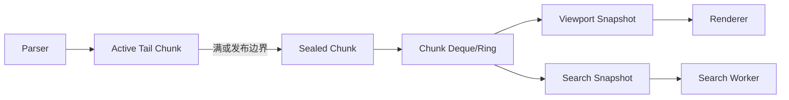
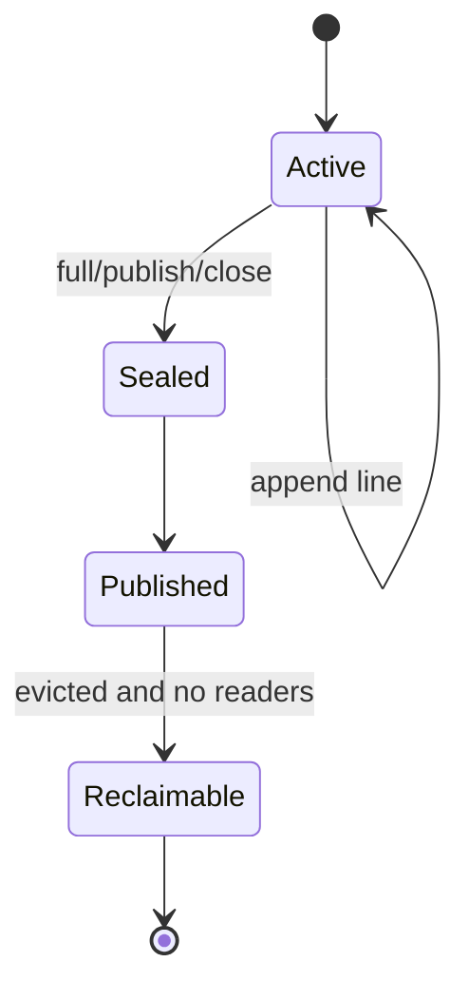
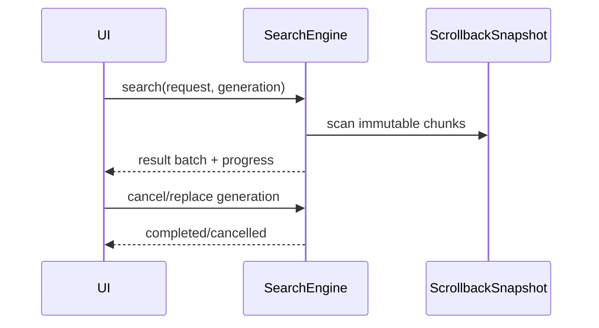

# P4：Chunked Scrollback、快照与异步搜索

**状态：已完成（2026-08-01）**

## 实际落地摘要

P4 已接入生产路径，而不是保留为孤立原型：

- `ScrollbackBuffer` 仅作为 libvterm/旧调用点的兼容门面，唯一后端为
  `ChunkedScrollback`，不存在旧、新容器双写。
- VTAdapter 使用 NovaTerm 的向后兼容 `sb_pushline_ex` 扩展取得 soft-wrap
  信息；continuation 物理行合并到同一稳定 `LogicalLine/LineId`。alternate
  screen 仍由 libvterm 保持独立，且不进入 primary history。
- Snapshot 是发布边界：active tail 被 seal 后共享，不复制历史或 tail Cell。
  后续 continuation 若命中已发布尾块，执行单 chunk COW，旧 Snapshot 继续
  读取旧版本；淘汰/COW 后仍被引用的 bytes 计入 `retainedBySnapshots`。
- Renderer 通过 `ViewportSnapshot` 获取可见历史，并缓存异步 reflow 产生的
  `(LineId, cell range, wrap index)` 映射；滚动锚点为 `LineId + wrapOffset`，
  淘汰后夹到有效范围。resize/历史变化只提交新 generation，不在 UI 线程
  全量 reflow。
- TerminalCore 会话拥有 SearchEngine/ReflowEngine，析构时先取消并 join。
  TerminalView 提供 Ctrl+F/右键 Find 搜索栏；SearchMatch 以稳定 LineId 和
  Cell 范围进入独立 SearchOverlay，不修改 Cell。

### 内存预算定义

`maxBytes` 控制 live scrollback 的“保守记账 bytes”：包括对象、Cell
capacity、16-byte 对齐以及每次分配/共享控制块的 64-byte charge。它不是
跨平台 allocator 的逐字节 RSS 值，但给出了与行数无关、可执行淘汰的上界；
benchmark 另外报告 OS peak RSS。Snapshot 已淘汰/COW 的额外存活内存不计入
live hard budget，而独立计入 `retainedBySnapshots`，释放 Snapshot 后会回落。
因此诊断时必须同时观察 live、retained 和 RSS，不能把 `effectiveBytes` 当作
进程总内存。

默认值为 100,000 行、256 MiB、1024 logical lines/chunk；最大可配置行数为
1,000,000。单行超过 byte budget、0 行或 0 byte budget 都会立即淘汰。

## 目标

实现追加均摊 O(1)、百万行容量、内存预算可控、Renderer/Search 可安全并发读取的 Scrollback，并把搜索移出 UI/Parser 路径。

## 建议模型



## 开发重点

1. 先定义逻辑行、物理显示行、软换行、硬换行、宽字符 continuation 和组合字符语义。
2. 采用固定容量 Chunk（候选 1024/4096 行），活动尾块单写，sealed chunk 不可变。
3. 同时按最大行数和内存 bytes 预算淘汰，默认 100,000 行，允许 1,000,000 行。
4. Snapshot 持有 Chunk 引用和版本，不阻塞 Parser 修改活动尾块。
5. reflow 在 resize 时保持逻辑行语义，可取消，避免长期阻塞 UI/Parser。
6. Search Worker 支持取消、代次 ID、增量结果和 Search Overlay，不修改 Cell。
7. 淘汰时处理仍被 Snapshot 引用的旧 Chunk，并统计滞留内存。

## 落地实现步骤

### 步骤 0：冻结语义并建立旧实现基线

在选择容器前定义：逻辑行、硬换行、软换行、物理显示行、双宽 Cell、continuation、组合序列和 alternate screen 是否进入历史。记录当前 10 万行追加、随机读取、滚动和 resize 的时间与内存，并保留旧 `ScrollbackBuffer` 正确性测试。

### 步骤 1：定义行与 Chunk 数据结构

建议新增 `src/core/scrollback/`：

```cpp
struct LogicalLine {
    CellStorage cells;
    bool hardBreak;
    LineId id;
};

struct ScrollbackChunk {
    ChunkId id;
    QVector<LogicalLine> lines;
    qsizetype byteSize;
    bool sealed;
};
```

Chunk 大小先以 1024 行作为可测默认值，同时 benchmark 4096 行。不要假设所有行列数相同；逻辑行需要保留 reflow 信息。LineId/ChunkId 单调递增，用于稳定定位、搜索结果和淘汰检测。

### 步骤 2：实现单写活动尾块

Parser 只写 active tail chunk。追加时填充尾块；满、需要发布或 Session 关闭时 seal。Sealed chunk 之后不可修改，只能由引用计数只读共享。追加不得逐行移动已有容器，也不得因未满环形区执行 O(n) 搬移。



### 步骤 3：建立 Chunk 索引和容量策略

容器使用 deque/ring 保存 Chunk handle，并维护累计行数、逻辑 Cell 数和估算 bytes。容量同时受 `maxLines` 与 `maxBytes` 限制；任一超限即从最旧 sealed chunk 开始淘汰。默认 100,000 行，最大配置 1,000,000 行，byte 预算由设置明确给出。

淘汰从索引移除不等于立即释放：被 Snapshot/Search 引用的 Chunk 延迟释放，其 bytes 计入 `retainedBySnapshots`。当保留内存超过软上限时应告警或取消陈旧搜索，不能悄悄突破硬预算无限增长。

### 步骤 4：实现只读 `ScrollbackSnapshot`

Snapshot 保存版本、Chunk handles、总行范围和 active tail 的不可变副本/发布视图。创建 Snapshot 时只复制索引和必要尾部，不复制全部 Cell。Renderer 和 Search 只能通过 Snapshot 查询。

接口应支持：按 LineId 查找逻辑行、把 document row 映射到逻辑行片段、检测目标已被淘汰、获取版本。禁止返回可写 Chunk 或长期裸指针。

### 步骤 5：提供旧 API 兼容适配层

先用 Adapter 实现现有 `lineCount()/lineAt()/pushLine()/popLine()` 行为，使 VTAdapter 和 Renderer 在第一轮迁移中无需同时重写。兼容层通过 Chunk 索引定位，避免物化完整旧 `QVector<QVector<Cell>>`。完成调用方迁移后删除长期双数据通路。

### 步骤 6：实现 Viewport 行映射

新增独立的行布局/映射组件，把逻辑行按当前 columns 生成物理显示片段：

```text
(LineId, logical cell range, wrap index) <-> document row
```

映射必须避免把宽字符拆在行末，组合字符跟随基础字符，硬换行结束逻辑行。Viewport 只计算可见区及适量前后缓存；不能为百万行每帧完整 reflow。

### 步骤 7：实现可取消增量 reflow

resize 产生新的 layout generation。Reflow 任务读取不可变 Chunk Snapshot，按 Chunk/批次生成新索引；每批检查取消标志。如果再次 resize，旧 generation 结果不得覆盖新 generation。

活动尾部和当前 viewport 优先计算，以便快速出首帧；历史区域可以渐进完成。Parser 继续追加新 Chunk，不等待历史 reflow。发布结果时校验 source version 和 generation。

### 步骤 8：迁移 Renderer

Renderer 获取 `ViewportSnapshot`，不再逐 Cell 调用带锁的 Scrollback 查询。滚动位置使用稳定 LineId + wrap offset，而不是只保存易受淘汰影响的整数数组下标。历史被淘汰时将锚点夹到最旧有效位置，并触发全屏映射失效。

P3 的 RenderCommand 行缓存继续使用 widget row；当 document-row 映射变化时全屏失效，单纯活动屏幕 damage 仍走增量路径。

### 步骤 9：实现异步 `SearchEngine`

SearchEngine 使用专用 Worker 或线程池读取 `ScrollbackSnapshot`。请求至少包含 query、大小写/正则/全词选项、范围和 generation；结果使用 `(LineId, startCell, endCell)`，不能使用易失数组索引。



按 Chunk 增量发布结果和进度，限制每批结果数量；正则表达式需设置取消检查和资源限制。搜索结果通过 P3 预留的 SearchOverlay 显示，不修改 Cell。

### 步骤 10：增加统计与诊断

记录 active/sealed Chunk 数、逻辑/物理行数、有效 bytes、Snapshot 保留 bytes、淘汰数、追加 P50/P99、Snapshot 创建时间、reflow generation/耗时、搜索首结果/总耗时和取消次数。

### 步骤 11：迁移、对比和删除旧实现

用相同输入同时喂给旧/新实现，仅在测试中对比行内容、push/pop、resize 和淘汰结果。新路径通过正确性、内存和性能门后切换默认实现；随后删除旧行级容器，避免两个 Scrollback 长期双写。

## 建议文件结构

| 文件 | 职责 |
| --- | --- |
| `src/core/scrollback/ScrollbackTypes.h` | LineId、ChunkId、逻辑行类型 |
| `src/core/scrollback/ScrollbackChunk.*` | Chunk 存储与 seal |
| `src/core/scrollback/ChunkedScrollback.*` | 追加、索引、预算和淘汰 |
| `src/core/scrollback/ScrollbackSnapshot.*` | 只读发布视图 |
| `src/core/scrollback/LineLayout.*` | wrap、viewport 和 reflow |
| `src/core/search/SearchEngine.*` | 可取消异步搜索 |
| `tests/core/ScrollbackTests.cpp` | Chunk/淘汰/reflow 正确性 |
| `benchmarks/ScrollbackBenchmark.cpp` | 百万行内存和性能 |

## 实施禁止项

- 禁止以逐行 `removeFirst()` 或整体移动实现淘汰；
- 禁止 Search/Renderer 读取 Parser 正在修改的 active chunk；
- 禁止 resize 在 UI 线程同步 reflow 百万行；
- 禁止 Search Match 写入 Cell 或 ScreenBuffer；
- 禁止只限制行数而不限制实际 bytes；
- 禁止长期 Snapshot 的保留内存不可观测；
- 禁止用数组下标作为跨淘汰、跨 reflow 的永久标识；
- 禁止在迁移完成后继续双写新旧 Scrollback。

## 测试与指标

- 10 万、100 万行追加吞吐和峰值内存；
- Chunk 边界的 CJK、组合字符和换行；
- 快速 resize/reflow、搜索取消、搜索期间淘汰；
- Parser、Renderer、Search 并发压力；
- 追加 P50/P99、reflow 时间、搜索首结果时间、Snapshot 保留 bytes。

## 2026-08-01 验收结果

Release CTest：3/3 targets 通过（core、scrollback、renderer）。P4 专项目前
包含 17 个 test cases，覆盖 chunk/byte/line 淘汰、活动尾发布、Snapshot 在
clear/setLimits/持续淘汰下稳定、retention 释放回落、CJK/双宽 continuation、
emoji surrogate 到 Cell 映射、hard/soft wrap、生产 VT soft-wrap 合并、
viewport wrap anchor、快速/乱序 generation、取消、worker 忙时析构、无效/
危险正则、结果上限和批次。

ASan + UBSan（Debug）3/3 targets 通过。LeakSanitizer 在当前受 ptrace 管理的
容器内无法启动；TSan 在运行前因 `unexpected memory mapping` 退出，未产生
代码 race 报告。另用不含 `.git`/既有 build 的 `/tmp` 清洁源码副本完成独立
configure/build，`ctest -N` 正确列出 3 个测试且全部通过。

以下为同一台 Linux/Qt 6.8.3 Release 构建、80 columns、256 MiB budget 的
结构化 benchmark 结果（数值会随硬件变化）：

| workload | chunk | append | P50/P99 | snapshot | live/retained/peak RSS | viewport first | reflow | search first/total | cancel |
| --- | ---: | ---: | ---: | ---: | ---: | ---: | ---: | ---: | ---: |
| 100k | 1024 | 1.10M lines/s | 0.02/0.04 us | 4.66 us | 255.97/8.09/277.38 MiB | 34.03 us | 11.56 ms | 0.55/93.53 ms | 0.16 ms |
| 1M | 1024 | 2.02M lines/s | 0.02/0.06 us | 2.92 us | 255.22/8.09/276.50 MiB | 41.72 us | 10.82 ms | 0.49/82.85 ms | 0.07 ms |
| 1M | 4096 | 1.61M lines/s | 0.02/0.04 us | 4.10 us | 230.96/32.34/276.84 MiB | 38.93 us | 11.32 ms | 0.53/79.66 ms | 0.06 ms |

百万行 workload 实际生成并追加 80,000,000 Cells；256 MiB hard live budget
会持续淘汰，因此最终保留约 29k–32k 行，而不是假装在 256 MiB 内保存完整
百万条 80-Cell 行。1024 chunk 的 Snapshot retention 明显低于 4096，故继续
作为默认值。benchmark 对 memory budget、viewport、reflow、search、cancel
设置失败退出码，不只打印 PASS。

## 风险

不要同时叠加链表、Ring、稀疏存储和复杂 COW 而没有明确职责。先用不可变 Chunk + deque/ring 建立正确语义，再依据 profiler 优化。Snapshot 长期持有可能使内存超过预算，必须有可观测策略。

当前剩余的运维风险不是 P4 功能缺口：第三方长期持有大量 Snapshot 会让
进程总 RSS 高于 live budget（但 retained bytes 可观测）；正则在进入 PCRE2
前限制 pattern/line/result 并拒绝嵌套量词，仍应避免把搜索接口暴露为无配额
的远程正则服务。vendored libvterm 扩展保留旧 callback，升级 libvterm 时需
移植 `sb_pushline_ex`。

## 退出标准

百万普通文本行内存有上限；追加均摊 O(1)；搜索和快速滚动不阻塞 Parser/UI；reflow 和淘汰测试通过；最终视图行映射正确。

逐项核对：

- [x] 百万行输入受行数与保守 bytes 双预算约束，OS peak RSS 由 benchmark 报告；
- [x] append 均摊 O(1)，deque 按 chunk 淘汰，无 `removeFirst()`/整体搬移；
- [x] Snapshot 不复制历史或 active tail，retention 可观测并在释放后回落；
- [x] Renderer/Search 只读 immutable Snapshot，不读 Parser active tail；
- [x] viewport 只同步布局可见行，全历史 reflow/search 在 worker；
- [x] generation 单调，旧请求不可覆盖新结果，单行每 256 Cells 检查取消；
- [x] CJK、组合序列、emoji、宽字符 continuation、hard/soft wrap 映射有测试；
- [x] SearchMatch 使用稳定 LineId + Cell range，并通过 SearchOverlay 显示；
- [x] VTAdapter、TerminalCore、Renderer、TerminalView 已迁移，旧 ring 不再存储；
- [x] Release 全测、ASan/UBSan、清洁源码构建和 100k/1M benchmark 通过。

结论：满足 P4 退出标准。

## 后续热路径优化（2026-08-01）

完成退出验收后又对持续输出和大结果集做了一轮优化：

- Search UI 不再在每个 128-result batch 复制“截至当前的全部结果”。Renderer
  以 generation 为边界增量接收，并按 `LineId -> matches` 建索引。可见 Overlay
  从 `O(visible rows × all matches)` 降为 `O(visible rows + visible matches)`；
  live bottom 直接跳过历史 Overlay 扫描。
- Search worker 发布完整 batch 时 move 出 matches，避免 worker 边界的批次数组
  深拷贝；Reflow 同样 move 合并临时 wrapped rows。
- history change/resize 使用 24 ms trailing debounce。测试中同步触发 100 次
  history change 只提交 1 个 reflow generation，避免持续输出期间反复取消、
  重启全历史任务。
- live-bottom `rendererSnapshot()` 不再取得 scrollback Snapshot，因而不会仅为
  活跃屏幕绘制 seal tail 或制造小 chunk。新增测试验证 active tail/sealed chunk
  统计在 live render 前后不变。
- Snapshot 的 LineId 定位由线性 chunk 扫描改为 chunk + line 两级二分。
  1,000,000 条单 Cell 行、977 chunks、100,000 次命中查询实测为
  **69.17 ns/op**；常规 80-column/32-chunk workload 为 **25.35 ns/op**。

优化后 Release CTest 仍为 3/3 通过，ASan/UBSan 3/3 通过。常规百万行、
80-column、1024 chunk 实测 append 2.12M lines/s、Snapshot 2.59 us、全量
retained reflow 10.12 ms、搜索 79.74 ms，256 MiB live budget 继续通过。

## 典型 Scrollback 行数矩阵（2026-08-01）

新增 `scrollback_benchmark_matrix` 构建目标。1k、10k、100k、1M 四个场景
分别在全新子进程运行，避免前一场景的 allocator high-water mark 污染 RSS。
Linux 同时读取 `/proc/self/statm` 当前 RSS 与 `getrusage` peak RSS；报告进程
基线、append、Snapshot、Snapshot retention probe 和异步任务完成后的阶段值。

运行命令：

```bash
cmake --build build/Release --target scrollback_benchmark_matrix --parallel
# 自定义矩阵也可直接运行：
./build/Release/bin/novaterm_scrollback_benchmark \
  --matrix --matrix-lines 1000,10000,100000,1000000 \
  --columns 80 --chunk-lines 1024 --max-bytes 268435456
```

配置均为 Release、80 Cells/line、1024 lines/chunk、256 MiB live budget。

| 请求行数 | 最终保留 | append 后 RSS | 相对基线 | retention 后 RSS | peak RSS | effective / snapshot-retained |
| ---: | ---: | ---: | ---: | ---: | ---: | ---: |
| 1k | 1,000 | 22.57 MiB | +8.04 MiB | 30.61 MiB | 31.68 MiB | 8.09 / 7.90 MiB |
| 10k | 10,000 | 93.25 MiB | +78.76 MiB | 101.29 MiB | 102.30 MiB | 78.97 / 8.09 MiB |
| 100k | 32,416 | 269.30 MiB | +254.81 MiB | 277.31 MiB | 278.36 MiB | 255.97 / 8.09 MiB |
| 1M | 32,320 | 269.43 MiB | +254.89 MiB | 276.71 MiB | 277.75 MiB | 255.22 / 8.09 MiB |

| 请求行数 | throughput | append P50/P99 | Snapshot | LineId | viewport | reflow first/full | search first/full | cancel |
| ---: | ---: | ---: | ---: | ---: | ---: | ---: | ---: | ---: |
| 1k | 0.34M lines/s | 0.04/1.65 us | 5.77 us | 8.06 ns | 35.06 us | 0.30/0.56 ms | 0.47/7.66 ms | 0.14 ms |
| 10k | 0.43M lines/s | 0.03/0.71 us | 4.12 us | 14.30 ns | 38.29 us | 0.37/3.82 ms | 0.46/25.68 ms | 0.05 ms |
| 100k | 1.09M lines/s | 0.02/0.04 us | 4.66 us | 26.93 ns | 39.13 us | 0.37/11.26 ms | 0.59/84.94 ms | 0.06 ms |
| 1M | 2.14M lines/s | 0.02/0.05 us | 3.17 us | 27.66 ns | 44.34 us | 0.47/15.20 ms | 0.54/85.70 ms | 0.06 ms |

结果表明实际 RSS 在 100k workload 前达到 256 MiB live budget 平台，1M 输入
不会继续线性增长；它通过淘汰将 live 历史稳定在约 32k 条 80-Cell 行。
Snapshot 创建在本矩阵中没有可测 RSS 增量。retention probe 故意保持旧
Snapshot 并再追加 1024 行，因此总 RSS 增加约一个 8 MiB chunk，释放后由
既有 retention 回落测试验证可回收。小 workload 的 throughput 包含抽样
计时开销，更适合观察延迟；大 workload 才代表稳定吞吐。
