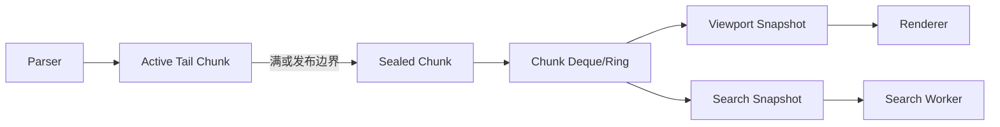
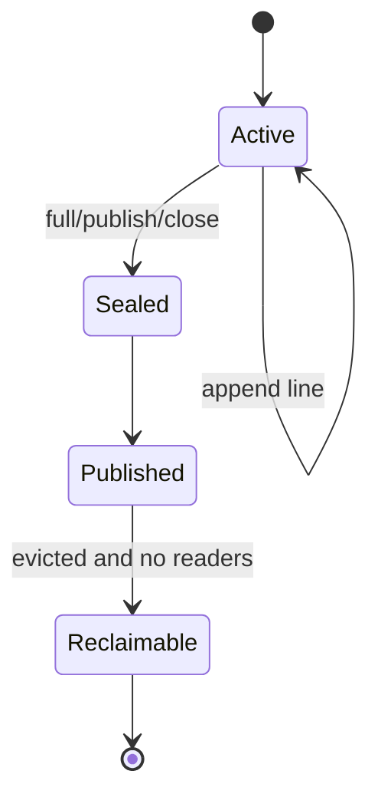
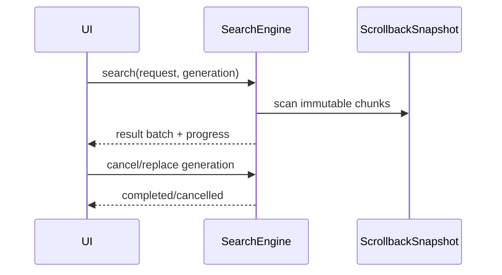

# P4：Chunked Scrollback、快照与异步搜索

**状态：计划中**

## 目标

实现追加均摊 O(1)、百万行容量、内存预算可控、Renderer/Search 可安全并发读取的 Scrollback，并把搜索移出 UI/Parser 路径。

## 建议模型



## 开发重点

1. 先定义逻辑行、物理显示行、软换行、硬换行、宽字符 continuation 和组合字符语义。
2. 采用固定容量 Chunk（候选 1024/4096 行），活动尾块单写，sealed chunk 不可变。
3. 同时按最大行数和内存 bytes 预算淘汰，默认 100,000 行，允许 1,000,000 行。
4. Snapshot 持有 Chunk 引用和版本，不阻塞 Parser 修改活动尾块。
5. reflow 在 resize 时保持逻辑行语义，可取消，避免长期阻塞 UI/Parser。
6. Search Worker 支持取消、代次 ID、增量结果和 Search Overlay，不修改 Cell。
7. 淘汰时处理仍被 Snapshot 引用的旧 Chunk，并统计滞留内存。

## 落地实现步骤

### 步骤 0：冻结语义并建立旧实现基线

在选择容器前定义：逻辑行、硬换行、软换行、物理显示行、双宽 Cell、continuation、组合序列和 alternate screen 是否进入历史。记录当前 10 万行追加、随机读取、滚动和 resize 的时间与内存，并保留旧 `ScrollbackBuffer` 正确性测试。

### 步骤 1：定义行与 Chunk 数据结构

建议新增 `src/core/scrollback/`：

```cpp
struct LogicalLine {
    CellStorage cells;
    bool hardBreak;
    LineId id;
};

struct ScrollbackChunk {
    ChunkId id;
    QVector<LogicalLine> lines;
    qsizetype byteSize;
    bool sealed;
};
```

Chunk 大小先以 1024 行作为可测默认值，同时 benchmark 4096 行。不要假设所有行列数相同；逻辑行需要保留 reflow 信息。LineId/ChunkId 单调递增，用于稳定定位、搜索结果和淘汰检测。

### 步骤 2：实现单写活动尾块

Parser 只写 active tail chunk。追加时填充尾块；满、需要发布或 Session 关闭时 seal。Sealed chunk 之后不可修改，只能由引用计数只读共享。追加不得逐行移动已有容器，也不得因未满环形区执行 O(n) 搬移。



### 步骤 3：建立 Chunk 索引和容量策略

容器使用 deque/ring 保存 Chunk handle，并维护累计行数、逻辑 Cell 数和估算 bytes。容量同时受 `maxLines` 与 `maxBytes` 限制；任一超限即从最旧 sealed chunk 开始淘汰。默认 100,000 行，最大配置 1,000,000 行，byte 预算由设置明确给出。

淘汰从索引移除不等于立即释放：被 Snapshot/Search 引用的 Chunk 延迟释放，其 bytes 计入 `retainedBySnapshots`。当保留内存超过软上限时应告警或取消陈旧搜索，不能悄悄突破硬预算无限增长。

### 步骤 4：实现只读 `ScrollbackSnapshot`

Snapshot 保存版本、Chunk handles、总行范围和 active tail 的不可变副本/发布视图。创建 Snapshot 时只复制索引和必要尾部，不复制全部 Cell。Renderer 和 Search 只能通过 Snapshot 查询。

接口应支持：按 LineId 查找逻辑行、把 document row 映射到逻辑行片段、检测目标已被淘汰、获取版本。禁止返回可写 Chunk 或长期裸指针。

### 步骤 5：提供旧 API 兼容适配层

先用 Adapter 实现现有 `lineCount()/lineAt()/pushLine()/popLine()` 行为，使 VTAdapter 和 Renderer 在第一轮迁移中无需同时重写。兼容层通过 Chunk 索引定位，避免物化完整旧 `QVector<QVector<Cell>>`。完成调用方迁移后删除长期双数据通路。

### 步骤 6：实现 Viewport 行映射

新增独立的行布局/映射组件，把逻辑行按当前 columns 生成物理显示片段：

```text
(LineId, logical cell range, wrap index) <-> document row
```

映射必须避免把宽字符拆在行末，组合字符跟随基础字符，硬换行结束逻辑行。Viewport 只计算可见区及适量前后缓存；不能为百万行每帧完整 reflow。

### 步骤 7：实现可取消增量 reflow

resize 产生新的 layout generation。Reflow 任务读取不可变 Chunk Snapshot，按 Chunk/批次生成新索引；每批检查取消标志。如果再次 resize，旧 generation 结果不得覆盖新 generation。

活动尾部和当前 viewport 优先计算，以便快速出首帧；历史区域可以渐进完成。Parser 继续追加新 Chunk，不等待历史 reflow。发布结果时校验 source version 和 generation。

### 步骤 8：迁移 Renderer

Renderer 获取 `ViewportSnapshot`，不再逐 Cell 调用带锁的 Scrollback 查询。滚动位置使用稳定 LineId + wrap offset，而不是只保存易受淘汰影响的整数数组下标。历史被淘汰时将锚点夹到最旧有效位置，并触发全屏映射失效。

P3 的 RenderCommand 行缓存继续使用 widget row；当 document-row 映射变化时全屏失效，单纯活动屏幕 damage 仍走增量路径。

### 步骤 9：实现异步 `SearchEngine`

SearchEngine 使用专用 Worker 或线程池读取 `ScrollbackSnapshot`。请求至少包含 query、大小写/正则/全词选项、范围和 generation；结果使用 `(LineId, startCell, endCell)`，不能使用易失数组索引。



按 Chunk 增量发布结果和进度，限制每批结果数量；正则表达式需设置取消检查和资源限制。搜索结果通过 P3 预留的 SearchOverlay 显示，不修改 Cell。

### 步骤 10：增加统计与诊断

记录 active/sealed Chunk 数、逻辑/物理行数、有效 bytes、Snapshot 保留 bytes、淘汰数、追加 P50/P99、Snapshot 创建时间、reflow generation/耗时、搜索首结果/总耗时和取消次数。

### 步骤 11：迁移、对比和删除旧实现

用相同输入同时喂给旧/新实现，仅在测试中对比行内容、push/pop、resize 和淘汰结果。新路径通过正确性、内存和性能门后切换默认实现；随后删除旧行级容器，避免两个 Scrollback 长期双写。

## 建议文件结构

| 文件 | 职责 |
| --- | --- |
| `src/core/scrollback/ScrollbackTypes.h` | LineId、ChunkId、逻辑行类型 |
| `src/core/scrollback/ScrollbackChunk.*` | Chunk 存储与 seal |
| `src/core/scrollback/ChunkedScrollback.*` | 追加、索引、预算和淘汰 |
| `src/core/scrollback/ScrollbackSnapshot.*` | 只读发布视图 |
| `src/core/scrollback/LineLayout.*` | wrap、viewport 和 reflow |
| `src/core/search/SearchEngine.*` | 可取消异步搜索 |
| `tests/core/ScrollbackTests.cpp` | Chunk/淘汰/reflow 正确性 |
| `benchmarks/ScrollbackBenchmark.cpp` | 百万行内存和性能 |

## 实施禁止项

- 禁止以逐行 `removeFirst()` 或整体移动实现淘汰；
- 禁止 Search/Renderer 读取 Parser 正在修改的 active chunk；
- 禁止 resize 在 UI 线程同步 reflow 百万行；
- 禁止 Search Match 写入 Cell 或 ScreenBuffer；
- 禁止只限制行数而不限制实际 bytes；
- 禁止长期 Snapshot 的保留内存不可观测；
- 禁止用数组下标作为跨淘汰、跨 reflow 的永久标识；
- 禁止在迁移完成后继续双写新旧 Scrollback。

## 测试与指标

- 10 万、100 万行追加吞吐和峰值内存；
- Chunk 边界的 CJK、组合字符和换行；
- 快速 resize/reflow、搜索取消、搜索期间淘汰；
- Parser、Renderer、Search 并发压力；
- 追加 P50/P99、reflow 时间、搜索首结果时间、Snapshot 保留 bytes。

## 风险

不要同时叠加链表、Ring、稀疏存储和复杂 COW 而没有明确职责。先用不可变 Chunk + deque/ring 建立正确语义，再依据 profiler 优化。Snapshot 长期持有可能使内存超过预算，必须有可观测策略。

## 退出标准

百万普通文本行内存有上限；追加均摊 O(1)；搜索和快速滚动不阻塞 Parser/UI；reflow 和淘汰测试通过；最终视图行映射正确。
