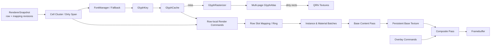
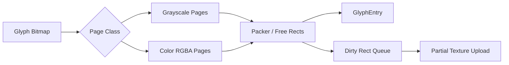
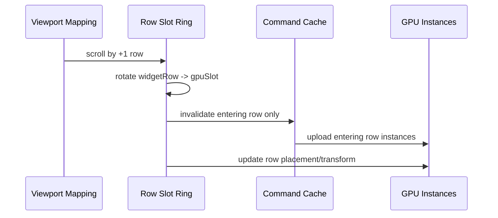
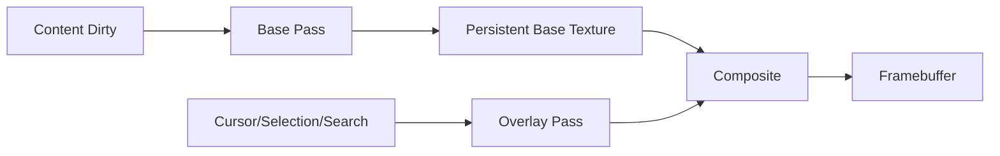
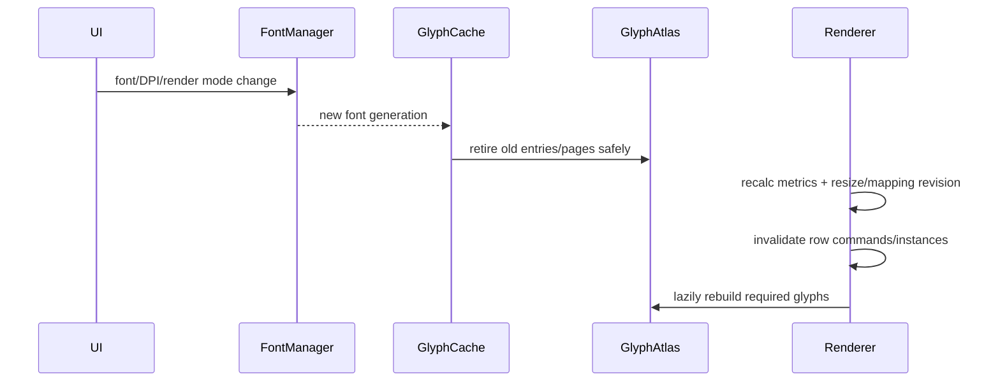

# P5：Glyph 系统与 GPU 提交管线

**状态：P5 实施完成，本机验收完成（Linux Vulkan/OpenGL，2026-08-01）；跨平台与长稳验收待完成**

## 1. 目标与范围

P5 在不破坏 P3 增量渲染、Snapshot 一致性和最终 revision 收敛语义的前提下，完成两类工作：

1. 建立可扩展的字体、fallback、cluster、Glyph Cache 和多页 Atlas；
2. 将 P3 的固定行六顶点管线演进为可批处理、可复用滚屏行、显存有预算且可观测的 GPU 提交架构。

目标能力包括：

- 稳定支持 ASCII、CJK、字体 fallback、组合字符、Emoji、Powerline/Nerd Font 和高 DPI；
- 新 Glyph 只上传 Atlas 变化子区域，不再默认上传整张 2048 × 2048 纹理；
- Atlas 支持多页、显存预算、LRU、安全淘汰和 generation 失效；
- Glyph 使用实例数据或等价紧凑表示，避免每 Quad 重复上传六个完整顶点；
- 背景、内容和 Overlay 保持正确层级，同时显著降低 Draw Call；
- 连续滚屏使用行局部坐标、GPU 行槽位环和映射表复用未变化行；
- Overlay-only 帧不重建、不上传基础内容，尽量避免重新提交全部行 Draw；
- Snapshot、Scrollback 和 viewport 映射具备足够精细的 revision，避免保守全屏；
- Buffer、Atlas 和持久 Render Target 都有容量上限、统计、恢复和停止语义。

P5 不负责改变 ANSI/VT 解析、Transport、Session 生命周期或终端 Cell 网格语义；不得为 GPU 优化反向污染 Parser/Core 所有权。

## 2. P3 基线与P5量化目标

P5 必须以相同机器、Release配置和数据集对比P3，不允许只给优化后的孤立数字。当前P3参考基线：

| 场景 | P3基线 |
| --- | ---: |
| Vulkan持续滚屏 | 60.017 FPS，60.466 s |
| Vulkan CPU P50/P95/P99 | 2.932/4.412/4.564 ms |
| Vulkan持续滚屏重建行 | 144,840行/3,629帧，约39.91行/帧 |
| Vulkan持续滚屏上传 | 3,635,277,696 bytes |
| Vulkan持续滚屏Draw Call | 292,046次，约80.47次/帧 |
| Vulkan单Cell | 重建1行，上传23,232 bytes |
| OpenGL持续滚屏 | 60.100 FPS，10.183 s |

P5在`119 × 40`或等价可见网格上的默认目标：

| 指标 | 目标 |
| --- | ---: |
| 单Cell内容更新 | 不超过1行；支持脏列/分块后应少于整行命令重建 |
| 稳态逐行滚屏重建 | P95不超过2个新行槽位/帧 |
| 稳态逐行滚屏上传bytes | 相对P3同负载降低至少90% |
| ASCII稳态Draw Call | 每帧不超过6次 |
| 混合文本Draw Call | 不超过`4 + 活跃Atlas page/material batch数` |
| Overlay-only内容重建/上传 | 0行、0内容bytes |
| 重复语料预热后Glyph raster/upload | 0次新增，除非发生显式淘汰 |
| CPU帧P99 | 不高于同机P3基线10%以上，且无>16.67 ms稳态帧 |
| 最终一致性 | 停止输出后两个目标帧间隔内revision收敛 |
| Atlas/Buffer内存 | 不超过配置预算；无无界增长 |

首次冷启动、字体/DPI切换和资源恢复必须单独统计，不得混入稳态命中率和帧时间。

## 3. 总体架构



核心分层：

- Font/Glyph层不持有QRhi对象；
- Atlas逻辑层负责page、slot、generation、dirty rect和预算；
- QRhi资源层负责Texture、Buffer、Pipeline、SRB和frames-in-flight；
- 行映射层负责document/widget row到GPU slot的稳定映射；
- Material Batch层按pipeline、page、format和blend state合批；
- Overlay与基础内容拥有独立失效和上传路径。

### 3.1 数据所有权与线程

| 数据/资源 | 写入者 | 读取者 | 发布/同步方式 |
| --- | --- | --- | --- |
| Screen/Scrollback内容 | Parser Worker | Renderer | 不可变Snapshot/revision |
| Font配置与fallback链 | Application Service | FontManager | 不可变配置/generation |
| Font face运行对象 | FontManager或Raster Worker | Rasterizer | 每线程face或明确锁保护 |
| Raster任务队列 | Renderer请求侧 | Raster Worker | 有界队列、优先级、取消和停止 |
| GlyphCache逻辑Entry | Renderer/Glyph服务单写侧 | Command Builder | generation化只读查询 |
| Atlas page/slot元数据 | Renderer/Glyph服务单写侧 | GPU提交 | 帧内稳定快照 |
| QRhi Texture/Buffer/Pipeline | Render线程 | Render线程 | 不跨线程 |
| RowCommand/RowSlotMap | Renderer侧 | GPU提交 | revision化缓存 |
| Overlay状态 | View/Renderer | Overlay提交 | 独立revision |

Raster队列必须有容量、visible-row优先级、重复key去重、过期generation取消和关闭唤醒。队列满时允许同步处理少量可见ASCII或延后非可见任务，但不得阻塞Parser、无限增长或丢失最终可见Glyph请求。

## 4. 必须继承的P3契约

- Renderer每帧只读取一次稳定Snapshot；需要补行时可在同一帧重新请求明确的dirty rows，但不得跨锁读取活动ScreenBuffer。
- Damage与Snapshot revision必须单调；无法证明增量集合完整时保守全屏。
- P5引入per-row、per-chunk或mapping revision后只能减少误失效，不能允许漏绘。
- 绘制层级保持“背景 → Glyph/装饰 → Overlay”；合批不得改变视觉顺序。
- Cursor/Selection/Search/Hyperlink等Overlay不得升级为基础内容命令重建。
- Atlas/page/slot miss不得复用旧key或显示错误字形。
- 高频输出允许跳过中间画面，但最终帧必须来自最新一致Snapshot。
- GPU资源重建后，所有仍有效的CPU命令、Glyph entry和行映射必须重新绑定或重新上传。

## 5. 文本、字体与Glyph契约

### 5.1 Cluster与GlyphKey

缓存键不能只使用Unicode codepoint。`GlyphKey`至少包含：

```text
FontFaceId
font generation
pixel size / effective scale
weight / italic / synthetic style
cluster scalar sequence
cell span
fallback index
render mode
grayscale/color format
variation/features identity（若启用）
```

Key必须提供稳定hash/equality，不保存`QFont*`、临时字符串指针、QRhi句柄或可变外部缓冲区。

当前Cell最多保存有限chars；P5 API必须接受cluster span/string view，避免把未来扩展锁死为单codepoint。若Emoji ZWJ序列或复杂cluster超过当前Cell容量，应明确采用扩展cluster存储、外部cluster table或可诊断降级，禁止静默截断后错误复用Glyph。

### 5.2 FontManager

从`TerminalRenderer`拆出`FontManager`：

- 管理主等宽字体、用户fallback链和平台fallback；
- 按完整cluster选择能够覆盖它的FontFace；
- 生成稳定`FontFaceId`和单调font generation；
- 提供cell width、baseline、ascent/descent、underline/strike metrics；
- 区分真实bold/italic和synthetic style；
- 缓存coverage查询，避免每Cell重复探测字体。

终端布局仍以Cell网格为准。fallback不得改变列数或推进后续Cell；bearing/overhang必须采用一致的裁剪或邻格绘制策略。宽字符continuation不得重复生成Glyph实例。

### 5.3 GlyphRasterizer

Rasterizer输入`GlyphKey + face + cluster`，输出与QRhi无关的：

- bitmap及像素格式；
- bearing、advance、baseline和logical rect；
- cell span与裁剪范围；
- grayscale alpha或color RGBA标志；
- source generation和诊断信息。

后台光栅化必须采用每线程face、受控锁或不可变字体数据。任务携带font/cache generation；过期结果不得进入新Atlas。相同key的并发miss只允许一个实际raster任务，其余请求合并为等待者。常用ASCII可同步预热，其他miss可异步完成并使引用行重新失效。

## 6. Glyph Cache与多页Atlas

### 6.1 GlyphCache

Cache管理`GlyphKey → GlyphEntry`，Entry至少记录：

```text
cache generation
atlas page id / page generation
slot rect / UV
logical metrics
last used frame
pin / in-flight retire frame
resident / pending / failed state
```

未命中时不能返回另一个Glyph的旧UV。允许返回明确的missing-glyph占位，同时安排raster；结果完成后只使实际引用该key的行/分块失效。

淘汰必须与GPU frames-in-flight安全期绑定：被当前帧实例引用的slot在提交完成前不能复用。若QRhi不能提供精确fence，使用保守的frame generation延迟回收，并按最大frames-in-flight配置。

### 6.2 多页GlyphAtlas



每页维护：尺寸、格式、packer/free-list、generation、使用面积、碎片率、dirty rect、last-used frame和in-flight引用。

策略要求：

- grayscale与color Emoji使用独立page class；
- 页面满时先在预算内新增页；
- 达到预算后按entry/page LRU和安全回收规则淘汰；
- 高碎片时允许后台repack到新generation，但旧页必须存活到所有引用退休；
- Atlas满不能永久停止缓存，也不能每次miss都reset全部页；
- page generation改变后，引用旧page/slot的行必须精确失效。

显存预算必须可配置并公开统计。预算至少区分Atlas、动态实例Buffer和持久Render Target；不得只按页数限制而忽略不同像素格式的bytes差异。

### 6.3 局部纹理上传

新Glyph只标记对应Atlas子矩形。每帧执行：

1. 对dirty rect裁剪并去空；
2. 合并相交或近邻矩形，但避免包围盒膨胀导致接近整页；
3. 按page和上传预算构造QRhi texture upload description；
4. 超预算任务延迟到后续帧；
5. 字体/DPI全失效或资源恢复时允许整页上传，并单独计数。

必须记录requested bytes、实际上传bytes、dirty area/page area、rect合并前后数量、预算延期和整页退化原因。不得为了统计同步等待GPU。

## 7. Row-local命令与脏列/分块

P3命令保存widget绝对坐标，滚屏后即使行内容未变也需要重建。P5将每行命令改为行局部坐标：

```text
RenderCommandRow {
    contentRevision
    atlasGenerations/material refs
    local backgrounds
    local glyph/decorations
    dirty spans or blocks
}

RowPlacement {
    document/display identity
    widgetRow
    gpuSlot
    yTransform
    mappingRevision
}
```

命令中的x坐标可以保持Cell局部位置，y坐标相对行原点；最终widget y由实例或行transform提供。这样滚屏时可以只更新`RowPlacement`，不重新生成所有行Glyph命令。

P5应在指标支持下把一行进一步拆成固定Cell block或dirty column span。单Cell Damage只更新相交block，未变化block保留CPU命令和GPU实例。分块大小必须通过ASCII、CJK、装饰和选择负载实测，不能以复杂索引成本抵消收益。

## 8. 滚屏GPU槽位复用

### 8.1 行槽位环



滚动映射改变时：

- 计算旧、新可见行identity的最长复用集合；
- 保持复用行对应的command block和GPU slot；
- 只回收离开viewport的slot；
- 只为新进入viewport的行生成命令和实例；
- 更新小型row placement/transform Buffer；
- resize、reflow、alternate screen或无法匹配identity时才全屏重建。

行identity不能只使用可变数组下标。Scrollback使用稳定`LineId + wrapIndex + sourceVersion`；active screen使用screen generation、logical row identity或可证明安全的ring identity。

### 8.2 ViewportMappingRevision

显式维护单调`ViewportMappingRevision`，至少在以下情况递增：

- 用户滚动或回到底部；
- Scrollback淘汰导致anchor/clamp变化；
- reflow完成或columns改变；
- alternate screen切换；
- active screen row ring旋转；
- resize改变可见行数。

Snapshot发布mapping revision、可见行identity和内容revision。内容未变但位置改变时只更新placement；identity或内容revision改变时才重建目标行/块。

## 9. 实例化、Material Batch与Draw Call

### 9.1 实例数据

优先评估单位Quad + Index Buffer + 实例Buffer：

```text
position / size 或 local rect
UV rect
color
row transform/slot
atlas page/material id
flags
```

背景、Glyph、Underline、Strike可使用相同基础Quad和不同material/flags，也可以保留少量独立pipeline。必须比较AoS/SoA、16字节对齐、half/normalized格式和跨后端兼容性，不能假定所有后端支持相同压缩格式。

### 9.2 Material Batch

按以下稳定key合批：

```text
layer
pipeline id
atlas page / texture class
blend mode
scissor/clip state
render target
```

背景先批量提交，内容按Atlas page/material提交，Overlay最后提交。若后端支持Texture Array且实测收益明确，可以跨page合批；否则按page分batch。后端差异必须封装在Renderer capability/strategy内，不能进入Core或RenderCommand公共模型。

Draw Call优化不得通过错误排序实现。透明Glyph和背景相邻时仍需保证后续背景不会覆盖前面Glyph的抗锯齿边缘。

## 10. Overlay独立渲染

P3的Overlay-only帧虽然不上传内容，但仍重新提交所有基础行Draw。P5优先采用持久基础层：



- 基础内容变化时更新Base Texture的全部或脏区域；
- Overlay-only时复用Base Texture，只提交Composite和Overlay；
- resize、DPR、format或QRhi资源恢复时重建Base Texture并全屏失效；
- Base Texture显存计入预算；
- 若某QRhi后端的额外Render Target成本高于收益，允许采用后端策略回退，但必须保留0内容重建、0内容上传语义并记录回退原因。

脏区域更新只有在Render Target能够可靠保留未触及像素时才允许；必须使用可证明的load/store语义、持久纹理或分块Base Texture。不能假设交换链Framebuffer跨帧保留内容。无法保证时重绘Base Texture，但仍复用CPU命令和GPU实例。

Cursor、Selection、Search和Hyperlink应按独立revision或子层缓存，避免Cursor闪烁重新生成大Selection/Search列表。

## 11. 动态Buffer、frames-in-flight与内存预算

实例数据、row placement、Overlay和间接参数使用双/三缓冲或环形分配，避免CPU覆盖GPU仍在读取的区间。

要求：

- 依据后端frames-in-flight选择slot数；
- Buffer按增长因子扩容，不按每帧精确resize；
- 扩容前检查bytes溢出和总预算；
- 临时峰值下降后允许延迟收缩，不在活跃输出中频繁抖动；
- 记录当前/峰值bytes、扩容/收缩、预算拒绝和退化路径；
- 预算不足时优先淘汰安全Atlas entry或降低缓存，不得截断可见字符；
- 资源释放时清除全部frame slot、pending upload和悬空page引用。

## 12. Snapshot与共享不可变行

P5可将当前值语义脏行复制替换为共享不可变行、COW或Chunk引用，以降低Snapshot复制成本。约束如下：

- Parser仍是唯一写入者；
- Renderer只读已发布版本；
- row/chunk对象携带内容revision；
- publication不能让Renderer看到半更新行；
- 引用生命周期必须覆盖命令生成；
- 优化前后`RendererSnapshot`只读API和最终一致性不变。

该项与P4 Chunked Scrollback协同，但P5不得重新引入共享无保护可变ScreenBuffer。

## 13. 字体、DPI、主题和资源失效



- Scheme颜色变化通常不丢弃灰度Glyph；若颜色烘焙进彩色资源则按material规则失效；
- font、DPI、render mode、variation变化生成新key/generation；
- 旧异步任务完成后只能丢弃，不能写入新generation；
- QRhi资源丢失时逻辑Glyph Cache可以保留bitmap或重新raster，但所有Texture/Buffer/SRB/Pipeline/Base Texture必须重建；
- 恢复后第一帧必须来自最新Snapshot，且不得显示旧page slot。

## 14. 能力探测与退化路径

Renderer初始化时形成后端能力表：

- texture format与最大尺寸；
- partial texture upload支持和对齐限制；
- texture array/dynamic indexing；
- instance step rate与最大binding；
- frames-in-flight策略；
- 时间戳或外部GPU profiler可用性；
- 持久Render Target格式与采样支持。

统一优先路径与退化路径都必须保持正确性。例如：

- 无Texture Array：按page分batch；
- 局部上传限制严格：对齐/合并dirty rect，必要时单页整图退化并统计；
- Instancing收益不稳定：保留紧凑顶点Buffer策略；
- Base Texture不可用：回退完整Draw提交，但不重建/上传未变化内容。

退化不能静默发生，统计和日志必须说明后端、原因和次数。

## 15. 可观测性

### 15.1 Glyph/Atlas

- cache hit/miss、cold/warm hit rate；
- raster任务、耗时P50/P95/P99、过期/失败；
- page数、格式、占用率、碎片率、current/peak bytes；
- eviction、repack、generation变化和安全回收等待；
- dirty rect合并前后数量、局部/整页上传bytes和退化原因。

### 15.2 命令/GPU提交

- 原始/合并Damage、dirty rows、dirty blocks/spans；
- revision补回行、mapping-only更新、滚屏复用/新建/淘汰行；
- command/instance数量和生成时间；
- 各Buffer current/peak bytes、扩容/收缩和预算拒绝；
- Base/Content/Overlay pass次数；
- material batch和Draw Call；
- CPU帧P50/P95/P99和>预算帧；
- Scheduler合并帧、Renderer提交帧、可获得时的平台presented frame；
- GPU时间只通过无阻塞时间戳或外部工具获取。

统计读取不得在热路径排序、格式化或同步等待GPU。分位数采用预分配滚动窗口或无锁/低争用采样器。

## 16. 分阶段实施顺序

### 阶段A：提取Glyph服务，不改变GPU几何

1. 定义GlyphKey、FontFaceId、bitmap和generation；
2. 拆出FontManager、Rasterizer和GlyphCache；
3. 保持P3单页Atlas和六顶点格式；
4. 对比视觉基线和P3性能，确认无回归。

### 阶段B：多页Atlas和局部上传

1. 实现page class、packer、预算和LRU；
2. 实现dirty rect合并与局部QRhi上传；
3. 增加异步raster安全退休；
4. 验证Atlas填满、淘汰、DPI切换和资源恢复。

### 阶段C：实例化与批处理

1. 先实现单位Quad和实例Buffer；
2. 背景、内容、装饰按layer/material合批；
3. 接入多页纹理策略；
4. 达到Draw Call和上传bytes目标后移除旧六顶点热路径，保留可诊断回退开关至阶段稳定。

### 阶段D：滚屏行环和脏分块

1. 命令改为行局部坐标；
2. 引入稳定行identity、RowPlacement和ViewportMappingRevision；
3. 实现行槽位环与滚屏复用；
4. 在实测支持下增加dirty span/block；
5. 对比P3持续滚屏基线，证明重建行和上传bytes下降。

### 阶段E：Overlay持久基础层与最终整合

1. 引入Base Texture和独立Overlay pass；
2. 分离Cursor、Selection和Search子层revision；
3. 完成跨后端退化和内存预算；
4. 执行完整视觉、性能、资源和长时间压力验收。

每个阶段必须可构建、可测试、可独立回退定位。禁止在同一提交中同时替换字体选择、Atlas、实例格式、滚屏映射和Overlay合成。

## 17. 建议文件结构

| 文件 | 职责 |
| --- | --- |
| `src/renderer/font/FontManager.*` | 字体、fallback、metrics和generation |
| `src/renderer/glyph/GlyphTypes.h` | GlyphKey、bitmap、entry和page id |
| `src/renderer/glyph/GlyphRasterizer.*` | cluster光栅化与异步任务 |
| `src/renderer/glyph/GlyphCache.*` | key缓存、LRU、引用和退休 |
| `src/renderer/glyph/GlyphAtlas.*` | 多页pack、预算、generation和dirty rect |
| `src/renderer/gpu/RendererCapabilities.*` | QRhi能力与后端策略 |
| `src/renderer/gpu/InstanceBuffer.*` | frames-in-flight实例/环形Buffer |
| `src/renderer/gpu/MaterialBatcher.*` | layer、page和pipeline合批 |
| `src/renderer/gpu/RowSlotMap.*` | 行identity、placement和滚屏槽位环 |
| `src/renderer/gpu/OverlayCompositor.*` | Base Texture和Overlay独立合成 |
| `src/renderer/TerminalRenderer.*` | Snapshot协调、失效和QRhi提交 |
| `tests/renderer/GlyphTests.cpp` | key、fallback、raster、cache和Atlas单测 |
| `tests/renderer/GpuPipelineTests.cpp` | batch、slot ring、预算和失效测试 |
| `tests/benchmarks/RendererP5Benchmark.cpp` | cold/warm Glyph、滚屏、Overlay和GPU基准 |

目录是建议边界，不为形式提前搬迁；先提取可测试接口，再移动实现。

## 18. 测试矩阵

### 18.1 单元测试

- GlyphKey对font、style、cluster、DPI、span、fallback和format逐项区分；
- fallback整cluster覆盖、缺字和固定网格宽度；
- packer边界、padding、旋转策略（若允许）、满页和碎片；
- dirty rect裁剪、合并、预算延期和整页退化；
- LRU、pin、in-flight退休、generation和过期异步结果；
- grayscale/color page class隔离；
- RowSlotMap滚动±1、多行跳转、回到底部、淘汰和resize；
- ViewportMappingRevision与内容revision独立变化；
- material稳定排序和背景/内容/Overlay层级；
- Buffer扩容、延迟收缩、bytes溢出和预算拒绝；
- Overlay子层revision和Base Texture失效。

### 18.2 集成与故障测试

- Atlas在可见行构建途中扩页/淘汰，不显示旧UV；
- 字体/DPI/主题连续切换，旧任务不污染新generation；
- QRhi Texture、Buffer、Pipeline和Base Texture重建；
- 单Cell变空、宽字符continuation、双下划线和Strike；
- Scrollback回看期间持续输出、reflow和淘汰；
- 滚屏slot复用后行identity与画面一致；
- Overlay-only期间基础内容命令/上传为0；
- 显存预算耗尽时字符完整且退化可诊断；
- 高频输出停止后最终revision收敛；
- Renderer重复创建/销毁，无后台raster回调访问已销毁对象。

### 18.3 视觉测试

数据集至少包括：

- ASCII、box drawing、Powerline/Nerd Font；
- 简繁中文、日文、韩文和混合fallback；
- combining mark、variation selector、ZWJ Emoji和肤色序列；
- 粗体、斜体、反色、conceal、单/双下划线和Strike；
- 宽字符边界、行末、选择、搜索和光标覆盖；
- 100%、125%、150%、200% DPR；
- grayscale与color Glyph混合。

跨OS字体栅格差异不应使用全局逐像素完全相等；采用同环境golden、结构断言、容差图像比较和人工抽检结合。

### 18.4 性能与长时间测试

- cold cache首屏和warm cache重复语料；
- 单Cell、单行、Overlay-only、全屏刷新；
- 60秒逐行滚屏，与P3同负载对比；
- Atlas超过单页、达到预算、反复淘汰；
- 60/120/144 Hz目标提交率；
- Vulkan、OpenGL及项目实际支持的D3D/Metal后端；
- 至少30分钟混合输出，检查内存、页数、Buffer和pending任务不无界增长。

所有结果记录OS、CPU、GPU、Qt、编译器、Release配置、后端、DPR、字体、viewport、VSync、数据集、持续时间、样本数和P50/P95/P99。

## 19. 实施禁止项

- 禁止仅以Unicode codepoint作为GlyphKey；
- 禁止新增少量Glyph时默认上传整页Atlas；
- 禁止Atlas满后停止缓存、覆盖仍被引用slot或每次全局reset；
- 禁止fallback改变终端网格列宽；
- 禁止后台任务写入已退休generation/page；
- 禁止RenderCommand/Core暴露FreeType、平台字体句柄或QRhi后端对象；
- 禁止每帧创建或精确resize动态Buffer；
- 禁止显存预算不足时截断可见字符；
- 禁止用可变数组下标作为跨滚屏稳定行identity；
- 禁止为减少Draw Call打乱背景、内容和Overlay层级；
- 禁止Overlay-only触发基础内容命令重建；
- 禁止为了GPU时间或present统计插入同步readback/wait；
- 禁止在没有独立基线和回退点时同时替换Raster、Atlas、实例、滚屏和Overlay管线。

## 20. 退出标准

P5只有同时满足以下条件才能标记完成：

- ASCII、CJK、fallback、组合字符、Emoji和目标DPI视觉验收通过；
- Atlas满后能够扩页或安全淘汰，重复语料预热后无新增raster/upload；
- 少量新Glyph只局部上传，整页退化都有明确原因和统计；
- 字体/DPI热切换、异步任务退休和GPU资源恢复正确；
- 单Cell保持增量，Overlay-only为0内容重建/上传；
- 稳态逐行滚屏P95重建不超过2行/帧，上传bytes相对P3降低至少90%；
- ASCII稳态Draw Call不超过6次/帧，混合文本满足material batch公式；
- Atlas、Buffer、Base Texture和异步队列在预算内，无长时间无界增长；
- 60 Hz持续输出无CPU超预算帧，最终revision收敛；项目支持的高刷新率和后端完成记录；
- Renderer继续与Parser、Transport和具体字体/QRhi后端实现解耦；
- 自动化测试、Release构建、P3/P5前后跑分和本文档结果全部更新。

## 21. 2026-08-01 实施记录

### 21.1 A～E 落地结果

- A：新增 `FontManager`、完整 cluster `GlyphKey`、fallback face 选择、QRhi 无关 Rasterizer、generation 化 `GlyphCache`。Key 包含 face、font generation、cluster scalar sequence、pixel size、DPR scale、weight/italic、cell span、fallback index、render mode/format 和 feature identity；不保存字体或 GPU 裸句柄。
- B：新增灰度/彩色分层的多页 Atlas，按实际 RGBA bytes 执行 64 MiB 默认预算，页满后先扩页、再按 page LRU 与三帧安全退休回收。Glyph dirty rect 会裁剪、受膨胀率限制地合并并通过 QRhi subresource upload 上传；冷启动/字体、DPI、GPU 资源恢复才允许整页上传。Raster 请求经过容量 512、visible 优先、key 去重、generation 取消和 stop 清空的有界队列；当前可见 Glyph 使用文档允许的同步完成策略。
- C：六顶点 Quad 热路径替换为 64-byte 实例和 shader 内单位 Quad；背景、正文与 Overlay 维持严格层级，Atlas 使用 texture array 跨 page 合批。固定实例槽位使 ASCII 正文为背景、内容两次 Draw，Overlay 需要时再增加一次。Buffer 使用 1.5 倍增长、64 MiB 预算，只在容量不足时重建；QRhi Dynamic Buffer 负责后端 frames-in-flight staging，Atlas slot 另按三帧退休。
- D：行命令改为 row-local Y，增加 8-cell dirty block、稳定行内容 identity、row placement uniform、GPU row-slot 环和单调 `ViewportMappingRevision`。live-bottom scroll 旋转 CPU command row 与 GPU slot，只重建进入或 identity 校验不一致的行；reflow 在 live bottom 不再错误触发正文全屏失效。Renderer Snapshot 的脏行改为引用计数的 `const QVector<Cell>`，发布后不可变。
- E：Cursor、Selection、Search 继续使用独立 Overlay revision/实例区。当前 Vulkan/OpenGL 能力探测结果未启用 persistent Base Texture，因为 QRhi 公共接口不能证明交换链或 Render Target 未触及像素的跨帧 preserved-load 语义；按第 10、14 节允许的确定性回退重提交已有实例，但 Overlay-only 的正文命令重建和正文 Buffer/Atlas 上传均为 0。字体/DPI 清除逻辑 Cache 并提升 generation；GPU 资源重建保留逻辑 Atlas bitmap、重建 Texture/Buffer/SRB/Pipeline 并整页恢复。

### 21.2 测试环境与命令

| 项目 | 值 |
| --- | --- |
| OS | Ubuntu 24.04，Linux 6.8.0-136-generic，X11 |
| CPU | Intel Core i7-14700K，20 core / 28 thread |
| GPU | NVIDIA GeForce RTX 4070 Ti，12 GiB |
| Vulkan | Instance 1.3.275，NVIDIA 595.84，device API 1.4.329 |
| OpenGL | 4.6 Core，NVIDIA 595.84，direct rendering |
| Qt / 编译器 / CMake | Qt 6.8.3 / GCC 13.3.0 / CMake 3.28.3 |
| 配置 | `Release`，119 × 40 初始 viewport，60 Hz，默认 16 px monospace，DPR 1.0，VSync |

执行命令：

```bash
cmake -S . -B build-p5-release -DCMAKE_BUILD_TYPE=Release -DBUILD_TESTING=ON -DNOVATERM_BUILD_BENCHMARKS=ON
cmake --build build-p5-release -j4
ctest --test-dir build-p5-release --output-on-failure --verbose
NOVATERM_RHI_API=vulkan ./build-p5-release/bin/novaterm_renderer_p5_gpu_benchmark --duration-ms 60000
NOVATERM_RHI_API=opengl ./build-p5-release/bin/novaterm_renderer_p5_gpu_benchmark --duration-ms 10000
git diff --check
```

Release CTest 共 4 个 executable、86 个 QtTest case，全部通过（Core 26、Scrollback 17、P3 Renderer 21、P5 Renderer 22）。P5 case 覆盖 key、fallback、font/glyph generation、完整 cluster 与 color raster、glyph quad cell-local 原点/光标网格对齐、队列容量/去重/取消/stop、Atlas page class/局部上传/预算延期、warm hit 零上传、LRU 与 frames-in-flight、双页资源整页恢复、过期 generation、row-slot 单步/跳转/强制 remap、mapping revision、跨页 material batch、Buffer 溢出/预算/释放统计；Core 另增加 Snapshot 发布后行数据 COW 不可变测试。

### 21.3 Vulkan 60 秒结果

| 场景/指标 | 结果 |
| --- | ---: |
| 单 Cell | 1 行 / 1 block；正文 2,560 B；Atlas 2,448 B；总计 9,120 B；2 Draw |
| Overlay-only | 正文 0 行、0 B；Atlas 0 B；placement/overlay 4,176 B；3 Draw |
| warm cache 重复字符 | 新增 raster 0；Atlas upload 0；16 hit / 0 miss |
| CJK + combining | 1 行 / 1 block；8 raster；45,792 B 局部 Atlas upload；最终画面/revision 收敛 |
| 稳态滚屏 | 59.758 s，3,581 帧，59.925 FPS |
| 滚屏重建 | 3,831 行；采样 P95 = 1 行/帧；3,480 新 slot，135,720 复用 |
| 滚屏上传 | 正文 144,997,440 B；Atlas 41,616 B；总计 159,878,240 B |
| 滚屏提交 | 8,945 Draw，2.498 Draw/帧；510,121 实例 |
| Glyph cache | 52,432 hit / 34 miss；17 raster；0 eviction（预算内） |
| CPU P50/P95/P99 | 0.429 / 0.871 / 0.930 ms；>16.67 ms 为 0 |
| Buffer / 内存峰值 | Buffer 1,990,656 B，测量段 0 重分配；Renderer 统计峰值 18,767,872 B |
| revision | published = rendered = 3,522，收敛 |

字体/DPI 模拟热切换使用 16→17 px 字体：旧 generation 不复用，Atlas 允许一次 16,777,216 B 整页资源上传，之后重新进入 warm 状态。Resize、强制主题全屏和资源恢复路径均完成且画面 revision 收敛。冷启动/失效整页上传未计入稳态命中率。

### 21.4 OpenGL 10 秒结果

OpenGL 同一数据集运行 9.983 s、597 帧、59.802 FPS；滚屏 P95 1 行/帧，正文上传 22,684,480 B、总上传 25,199,968 B、1,492 Draw（2.499/帧），CPU P50/P95/P99 为 0.409/0.855/1.008 ms，0 次稳态 Buffer 重分配，最终 revision 594/594 收敛。单 Cell、warm cache、CJK/combining、Overlay-only、强制全屏、resize 和字体重建均在同一进程覆盖；Overlay-only 正文仍为 0 行/0 B。

### 21.5 相对 P3 Vulkan 基线

按每帧归一化，以第 2 节 P3 Vulkan 60.466 s 基线对比：

| 指标 | P3 | P5 | 变化 |
| --- | ---: | ---: | ---: |
| 滚屏重建行/帧 | 39.91 | 1.070（P95 1） | -97.3% |
| 滚屏总上传/帧 | 1,001,730 B | 44,646 B | -95.5% |
| Draw/帧 | 80.47 | 2.498 | -96.9% |
| CPU P50 | 2.932 ms | 0.429 ms | -85.4% |
| CPU P95 | 4.412 ms | 0.871 ms | -80.3% |
| CPU P99 | 4.564 ms | 0.930 ms | -79.6% |
| FPS | 60.017 | 59.925 | -0.15% |

单 Cell 冷 miss 总上传由 23,232 B 降至 9,120 B（-60.7%）；warm 后 Atlas 新增上传为 0。OpenGL FPS 从 P3 的 60.100 变为 59.802（-0.50%）。所有量化退出目标在本机 60 Hz Vulkan/OpenGL 范围内达到。

### 21.6 未覆盖项与风险

- 本轮没有 Windows D3D、macOS Metal、125%/150%/200% 真实屏幕 DPR、120/144 Hz 或 30 分钟压力环境；这些不能由当前 Linux/X11 机器代替，状态保持为待补跨平台验收。
- Emoji 已走独立 RGBA page class 和 shader color 分支，ZWJ/variation cluster 不按 codepoint 截断；但具体彩色外观依赖系统 fallback 是否提供 color font，本机自动化只验证结构、缓存和提交，仍需人工 golden 抽检。
- persistent Base Texture 在本机使用显式回退；因此 Overlay-only 仍重提交既有基础实例（没有正文重建或上传）。若后续后端能证明 preserved-load/store，再启用独立 Base Texture，不能直接假设 swapchain 内容跨帧保留。
- 当前 raster 队列已具备容量、去重、优先级、generation 取消与停止语义，但可见 miss 仍同步消费；复杂冷启动的后台 worker 化仍可继续降低首屏尖峰，不能改变最终 Glyph/revision 语义。

### 21.7 补充回归与 Unicode 实机跑分

在上述 60 秒主基线之外，增加简繁中文、日文、韩文、box drawing、Powerline、combining mark、ZWJ Emoji 和肤色 ZWJ 序列，并在同一进程紧接一次完全相同的 warm corpus。补充测试还覆盖双 Atlas page 的资源恢复、普通局部上传超预算延期以及 pending upload 自动续帧。

补充跑分发现并修复了一个真实回归：新建/回收 page 曾被错误标记为 `fullDirty`，导致 color page 的首次局部更新可能在下一帧产生 16 MiB 整页上传。修复后，新页和 LRU 回收页只上传实际插入的 dirty rect；仅 GPU Texture 重建的 `markAllDirty()` 允许整页恢复。若存在整页恢复，所有 resident page 在独立冷路径原子上传，避免 frames-in-flight 期间命令采样尚未恢复的页；普通增量 dirty rect 继续受每帧预算约束，延期时由 Scheduler 自动请求后续 Overlay 帧。

启动画面人工反馈还暴露了 glyph 与 cursor 网格错位：Rasterizer 已把文字按 `baseline=ascent` 绘入位图，却将 GPU `logicalRect.top` 再设为 `-ascent`，使正文相对 cell/cursor 整体上移并裁切首行。修复后 quad 恢复为 cell-local `(0,0)` 原点，物理像素尺寸再反算逻辑尺寸以保持 fractional DPR 对齐；新增 `rasterizedQuadStartsAtCellLocalOrigin` 回归测试。修复后 Release 全量 86 case 通过，Vulkan/OpenGL 实机短跑均完成复杂字符、Overlay-only、滚屏、resize、字体切换且最终 revision 收敛。

最终命令：

```bash
cmake --build build-p5-release -j2
ctest --test-dir build-p5-release --output-on-failure
NOVATERM_RHI_API=vulkan ./build-p5-release/bin/novaterm_renderer_p5_gpu_benchmark --duration-ms 10000
NOVATERM_RHI_API=opengl ./build-p5-release/bin/novaterm_renderer_p5_gpu_benchmark --duration-ms 10000
git diff --check
```

| 指标 | Vulkan | OpenGL |
| --- | ---: | ---: |
| 实际滚屏时长 / 帧 / FPS | 10.384 s / 623 / 59.996 | 9.788 s / 587 / 59.971 |
| 滚屏重建行 / block | 611 / 611 | 614 / 614 |
| 滚屏 row-slot P95 | 1 | 1 |
| 滚屏正文 / Atlas / 总上传 | 22,146,240 / 41,616 / 24,769,152 B | 22,260,480 / 41,616 / 24,735,360 B |
| 滚屏 Draw / 实例 | 1,552 / 80,848 | 1,479 / 81,245 |
| CPU P50/P95/P99 | 0.432 / 0.902 / 1.114 ms | 0.412 / 0.831 / 0.995 ms |
| 稳态 >16.67 ms / Buffer 重分配 | 0 / 0 | 0 / 0 |
| Buffer 当前/峰值；Renderer 内存峰值 | 1,990,656 / 1,990,656；35,545,088 B | 1,990,656 / 1,990,656；35,545,088 B |
| 最终 revision | 619 / 619，收敛 | 584 / 584，收敛 |

场景级断言：单 Cell 为 1 行/1 block，Vulkan 总上传 9,120 B、2 Draw，OpenGL 9,184 B、3 Draw；ASCII warm cache 为 16 hit、0 miss、0 raster、0 Atlas upload；复杂 warm corpus 为 17 hit、0 miss、0 raster、0 Atlas upload；Overlay-only 为 0 正文行、0 block、0 正文/Atlas upload；强制全屏、resize 和 16→17 px 字体/DPI模拟切换均完成，字体切换旧 generation 不复用并执行一次 16,777,216 B 冷路径 Atlas 恢复。两后端均 0 eviction、稳态 0 Buffer 重分配，最终 revision 收敛。

按 P3 Vulkan 每帧基线归一化，本次补充 Vulkan 的滚屏重建由 39.912 降至 0.981 行/帧（-97.54%），总上传由 1,001,730 降至 39,758 B/帧（-96.03%），Draw 由 80.476 降至 2.491/帧（-96.90%）。P99 为 P3 的 24.4%，明显低于“不高于 110%”上限；补充数据再次满足 P95 ≤ 2、上传降低 ≥90%、ASCII ≤6 Draw、Overlay-only 正文为 0、warm cache 零新增 raster/upload 和 revision 收敛退出条件。
