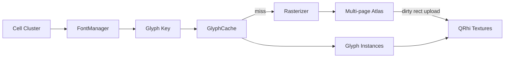
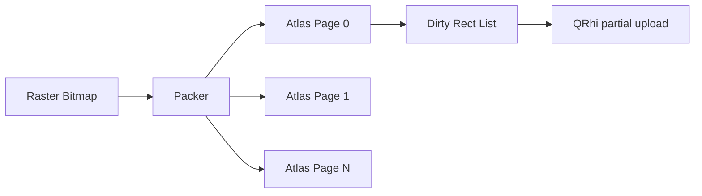
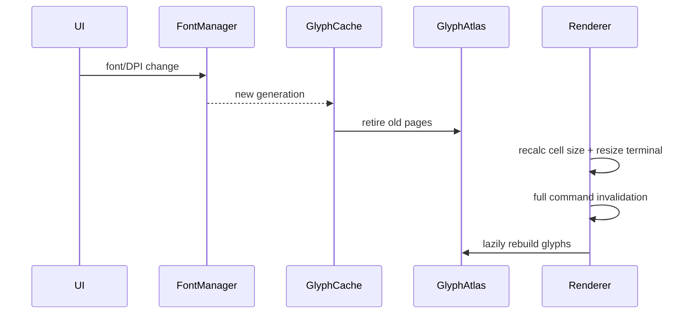

# P5：Glyph 系统与 GPU 管线优化

**状态：计划中**

## 目标

稳定支持 ASCII、CJK、字体 fallback、组合字符、Emoji 和高 DPI，并降低 Atlas 上传、顶点内存和 Draw Call。

## 模块

## 开发重点

- 从 TerminalRenderer 拆分 FontManager、GlyphRasterizer、GlyphCache、GlyphAtlas；
- Key 包含字体、字号、weight/style、cluster、DPI、cell span 和 fallback index；
- 多页 Atlas、局部上传、LRU/代次失效和统计视图；
- 明确灰度、彩色 Emoji、合成 cluster 与双宽布局；
- 评估实例数据替代每 Quad 六顶点，以及环形/双缓冲上传；
- 字体/DPI 改变时安全失效，不引用旧资源；
- QRhi 后端差异限制在 Renderer 内。

## 落地实现步骤

### 步骤 0：建立字形与 GPU 基线

准备 ASCII、CJK、组合字符、Emoji、Powerline/Nerd Font 和多语言混合数据集。记录当前 Atlas 尺寸、整图上传次数/bytes、Glyph miss、CPU raster 时间、顶点 bytes、Draw Call、CPU/GPU 帧时间。先截图或像素基线保存视觉结果。

### 步骤 1：定义文本 cluster 和 `GlyphKey`

不要只以 codepoint 为缓存键。建议键至少包含：FontFaceId、pixel size、weight、italic、cluster 内容、DPR/scale、cell span、fallback index、render mode 和颜色 Glyph 标志。为 key 提供稳定 hash/equality，不保存 `QFont*` 或临时字符串指针。

Cell 的有限 chars 先转换为 cluster；如果 P4/P1 后续扩展 cluster 存储，Glyph API 应能接受 span/string view，而不是固定单 codepoint。

### 步骤 2：拆分 `FontManager`

从 `TerminalRenderer` 移出字体选择和 fallback：

- 加载主等宽字体和配置的 fallback 链；
- 按 cluster 选择支持全部或最佳覆盖的 face；
- 计算 cell width、baseline、ascent/descent 和 underline metrics；
- 生成稳定 FontFaceId 和 font generation；
- 字体或 DPI 改变时发布新 generation。

终端布局仍以 Cell 网格为准。fallback Glyph 不得改变列宽；超出 Cell 的 bearing/overhang 需要裁剪或明确允许的邻格绘制策略。

### 步骤 3：拆分 `GlyphRasterizer`

Rasterizer 输入 GlyphKey/face/cluster，输出与 QRhi 无关的 bitmap、格式、bearing、advance、logical rect 和 cell span。区分灰度 alpha、彩色 RGBA Emoji，必要时为 LCD/subpixel 模式预留但默认保证跨后端一致。

若后台 rasterization，字体引擎对象必须遵守线程安全要求：每线程 face、受控锁或不可变字体数据。任务携带 generation，过期结果不得写入新 Atlas。

### 步骤 4：实现独立 `GlyphCache`

Cache 管理 key 到 GlyphEntry 的映射、hit/miss、last-used frame 和 generation。缓存未命中流程：先返回占位/安排 raster，再在结果就绪时使受影响行失效；常用 ASCII 可同步预热，避免首帧闪烁。

Cache 淘汰与 Atlas slot 生命周期绑定。被当前帧命令引用的 entry 在提交完成前不能复用；可使用 frame generation 或延迟若干帧的安全回收。

### 步骤 5：实现多页 `GlyphAtlas`

每页维护 packer、像素格式、dirty rect、generation 和使用统计。灰度与彩色 Glyph 可分不同 page class。页面满时先新增页，达到显存预算后按 LRU/页代次淘汰；禁止 Atlas 满后永久停止缓存。

### 步骤 6：实现局部纹理上传

新 Glyph 只标记相应 Atlas 子矩形，合并相邻 dirty rect 后通过 QRhi texture upload description 更新子区域。设置每帧上传预算，超额任务延后并保持最终一致性。记录上传区域面积与整页面积比；字体/DPI 全失效时允许整页重建。

### 步骤 7：Renderer 接入新 Glyph 服务

Renderer 的 `appendCellCommands()` 只请求 GlyphEntry，不直接 raster 或操作 Atlas 像素。RenderCommand 需要携带 atlas page/material batch 信息；提交时按 page、纹理格式和 pipeline 状态合批，同时保持背景→内容→Overlay 的正确层级。

替换过程先保持 P3 顶点格式，确认视觉一致后再优化实例化，避免同时调试 Atlas 和 GPU 几何问题。

### 步骤 8：评估并实现 Glyph Instancing

定义每实例数据：目标 rect/position、UV rect、颜色、page index/texture binding 和 flags。静态单位 Quad 放在小 Vertex/Index Buffer，动态 Buffer 只上传实例。背景/装饰可继续使用独立实例或合并矩形路径。

QRhi 后端对纹理数组、动态索引和实例 step rate 的能力需实测。若无法统一使用 texture array，则按 Atlas page 分 batch；不能把后端专属类型泄漏到 RenderCommand/Core。

### 步骤 9：使用环形或多帧动态 Buffer

根据 frames-in-flight 为实例数据使用双/三缓冲或环形分配，避免 CPU 重写 GPU 尚在读取的区域。Buffer 扩容采用增长策略并记录次数；禁止每帧精确 resize。资源释放和 QRhi 重建时清除所有 frame slot。

### 步骤 10：处理字体、DPI 与资源失效

颜色 Scheme 切换通常无需丢弃 Glyph；字体、DPI、render mode 改变必须生成新 key。旧异步任务和旧 QRhi page 不得被新命令引用。

### 步骤 11：诊断、测试和跨后端验证

增加 Atlas 调试视图和统计：hit rate、miss/raster、页数、占用率、eviction、局部上传 bytes、过期任务、batch/Draw Call。自动测试 packer 边界、key 区分、LRU、generation 和 fallback；视觉测试覆盖基线数据集。Release 实机验证项目支持的 D3D/Vulkan/OpenGL 后端和 GPU 资源恢复。

## 建议文件结构

| 文件 | 职责 |
| --- | --- |
| `src/renderer/font/FontManager.*` | 字体、fallback、metrics、generation |
| `src/renderer/glyph/GlyphTypes.h` | GlyphKey、bitmap、entry |
| `src/renderer/glyph/GlyphRasterizer.*` | cluster 光栅化 |
| `src/renderer/glyph/GlyphCache.*` | key 缓存、LRU 和代次 |
| `src/renderer/glyph/GlyphAtlas.*` | 多页 pack、预算和 dirty rect |
| `src/renderer/TerminalRenderer.*` | 批次和 QRhi 提交 |
| `tests/renderer/GlyphTests.cpp` | key/packer/cache/fallback 测试 |
| `benchmarks/RendererBenchmark.cpp` | raster、上传和实例性能 |

## 实施禁止项

- 禁止仅以 Unicode codepoint 作为 GlyphKey；
- 禁止新增少量 Glyph 时默认上传整张 Atlas；
- 禁止 fallback 改变终端网格列宽；
- 禁止后台任务写入已淘汰 generation/page；
- 禁止 Renderer/Core 暴露 FreeType 或 QRhi 后端对象；
- 禁止每帧重新创建动态 Buffer；
- 禁止为优化 Draw Call 打乱背景、内容和 Overlay 层级；
- 禁止在无视觉基线时同时替换 raster、Atlas 和实例管线。

## 测试与指标

覆盖 ASCII/CJK/Emoji/组合字符、fallback 链、粗斜体、不同 DPI、Atlas 填满和资源丢失。记录 cache hit、raster 次数、页数、淘汰、上传区域/bytes、Draw Call 和 CPU/GPU 帧时间。

## 退出标准

Atlas 满不会停止缓存；少量新 Glyph 不上传整张 Atlas；字体与 DPI 热切换正确；复杂文本无截断或错误复用；Renderer 继续与 Parser/Transport 解耦。
