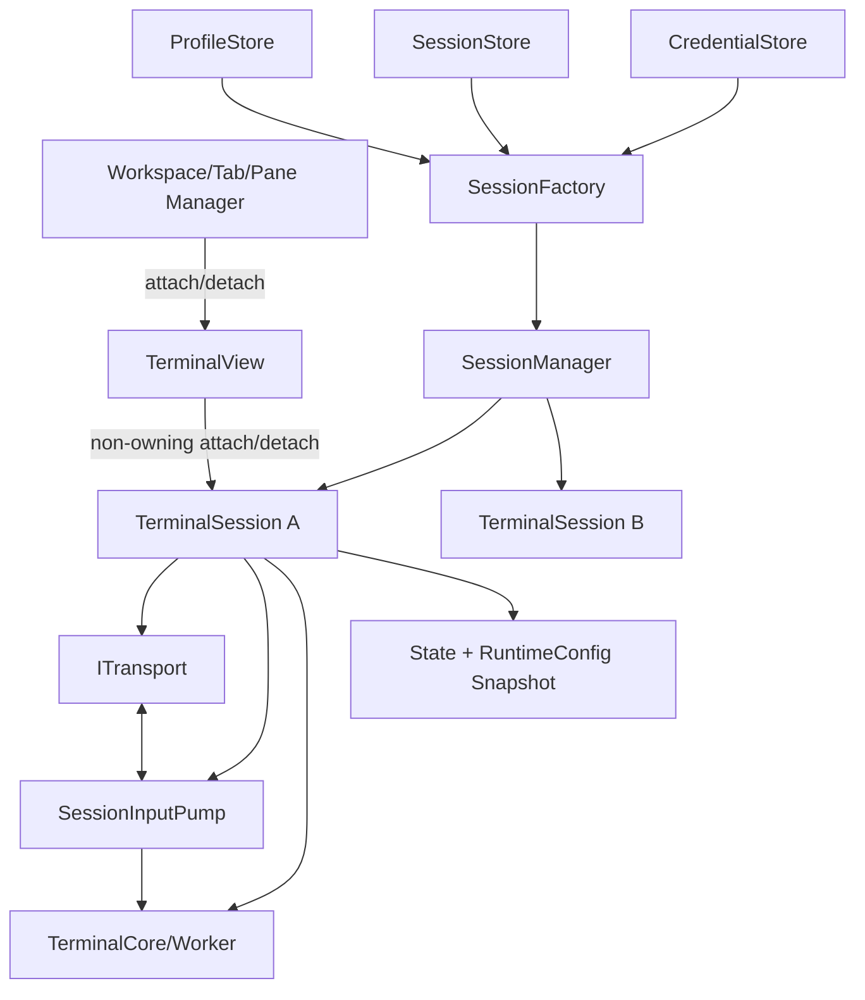
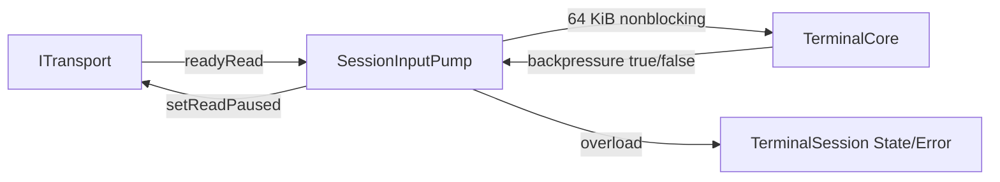
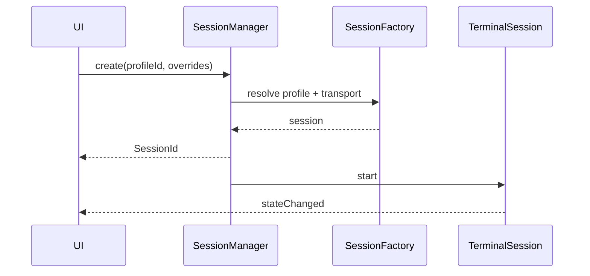
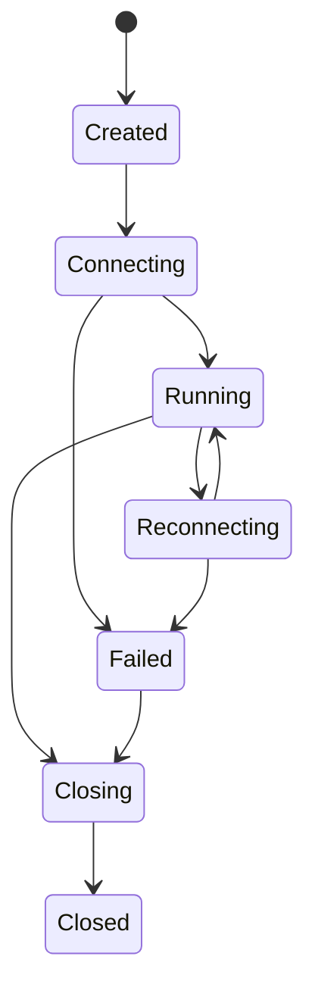

# P6：TerminalSession、SessionManager 与 Transport

**状态：计划中**

## 目标

建立完整多会话生命周期，将当前散落在 TerminalView 的 Transport、输入暂存和 Core 组合职责下沉，并补齐 SSH、Serial、Telnet。

## 目标结构



## 开发重点

1. 先引入轻量 TerminalSession，保持单会话行为不变。
2. 把 `_pendingTransportInput`、暂停/恢复和 overload 从 TerminalView 移至 InputPump。
3. Session 统一 start、close、resize、reconnect、错误、title、activity 和状态机。
4. SessionManager 只管理 Session 注册、创建、查找、关闭、恢复和资源回收；当前激活 Tab/Pane/Window 属于 Workspace/UI 层。
5. 明确 View 与 Session 生命周期独立：Session 可无 View 后台运行，View detach 不关闭 Session，Session 不反向持有 View/Renderer。
6. 扩展 ITransport：异步连接/关闭、部分写、写队列、bytesWritten、错误类别、keepalive 和 reconnect。
7. 接入顺序：Local PTY/ConPTY → SSH → Serial → Telnet → Custom。
8. 后台策略由 View/RenderScheduler 根据可见性决定；无 View 时不请求 GPU 帧，但 Parser、Scrollback 和连接继续保持正确。
9. Profile、RuntimeConfig、Session 恢复元数据和 Credential 分层保存，禁止把敏感凭据直接序列化到 Profile/Session 文件。

## 落地实现步骤

### 步骤 0：盘点当前 View 中的运行期职责

列出 `TerminalView` 当前承担的 Core 创建、LocalShellTransport 创建、attach/detach、`_pendingTransportInput`、背压、output 转发、resize debounce、title/activity 和断开提示。为现有单会话行为增加 smoke test，迁移时逐项下沉，不一次性重写 UI。

### 步骤 1：定义 Session 类型和状态契约

建议新增 `src/session/SessionTypes.h`，包含稳定 `SessionId`、SessionState、错误类别、关闭原因、连接统计和解析后的 RuntimeConfig。状态变更只能经过统一 transition 函数，非法转换记录错误。

Profile 是创建模板；`SessionFactory` 读取 Profile、Session overrides 和 Credential 引用，解析生成不可变或受控可变的 `RuntimeConfig` 快照。TerminalSession 创建时取得该快照，后续 Profile 修改默认不影响已经运行的 Session，除非用户明确应用可热更新字段。

配置分层如下：

- `ProfileStore`：持久化用户定义的连接模板；
- `SessionStore`：持久化应用重启所需的 Session restore metadata、ProfileId 和 overrides；
- `CredentialStore`：持久化密码、token、私钥口令等敏感凭据，Profile/Session 只保存 `credentialRef`；
- `RuntimeConfig`：当前 Session 实际使用的解析后配置快照，只属于运行期，不允许 Transport 直接读取 Profile JSON/UI 控件。

恢复 Session 时默认应保持“原 Session 的连接语义”：使用保存的 ProfileId + overrides + 必要的配置版本/快照信息重新生成 RuntimeConfig。若产品明确选择“恢复时跟随最新 Profile”，必须作为显式策略，不能隐式改变连接目标。

### 步骤 2：引入最小 `TerminalSession`

先让 Session 聚合一个 `ITransport` 和一个 `TerminalCore`，连接现有信号，但仍由单个 TerminalView 使用。建议接口：

```cpp
class TerminalSession : public QObject {
public:
    SessionId id() const;
    SessionState state() const;
    TerminalCore* core() const;
    void start();
    void close(CloseMode mode);
    void writeUserInput(const QByteArray&);
    void resizeTerminal(int columns, int rows);
signals:
    void stateChanged(SessionState);
    void errorOccurred(SessionError);
};
```

Session 不持有 TerminalRenderer；View 可以 attach/detach Session，Renderer 读取 Session 暴露的 Core/Snapshot。这样后台 Session 可以没有 View。

Ownership 必须明确：

- `SessionManager` 拥有/注册 `TerminalSession`；
- `TerminalSession` 拥有或独占其 `ITransport`、`SessionInputPump` 和 Core/Worker；
- `TerminalView` 只保存对 Session 的非 owning 引用（例如 `QPointer`/weak reference），detach 后引用失效但 Session 不关闭；
- `TerminalSession`、`SessionManager`、`TerminalCore` 禁止保存 `TerminalView*`、`QWidget*`、Renderer 或任何 GPU 资源。

Session 对 UI 只暴露状态、事件、Snapshot 和命令接口。Session 负责描述“发生了什么”，UI 决定“如何展示”。例如 Session 只发送 `titleChanged`、`activityChanged`、`errorOccurred`，不得直接修改 Tab 标题、弹 QMessageBox 或操作状态栏。

### 步骤 3：实现 `SessionInputPump`

把 Transport `readyRead` 到 `TerminalCore::writeInput()` 的 64 KiB 分片、pending 后缀、高低水位暂停/恢复和 overload 迁到 InputPump。InputPump 本身也必须有 pending bytes 上限、统计和停止语义。



迁移后删除 `TerminalView::_pendingTransportInput`。用集成测试证明数据顺序和字节总数不变，再删除旧连接代码，禁止长期存在两个 pump。

### 步骤 4：完善 Session 生命周期和关闭协议

`start()` 建立信号连接后启动 Transport；connected 后进入 Running。关闭顺序：停止新用户输入、暂停/断开 readyRead、按 CloseMode 排空或丢弃明确可丢数据、停止 Core、关闭 Transport、等待句柄/线程回收、断开 queued callback、进入 Closed。

CloseMode 至少区分 Graceful 与 Abort。析构可执行有界 Abort，但正常 UI 关闭优先 Graceful。所有异步 callback 携带 SessionId/generation，已关闭 Session 的迟到事件被忽略。

### 步骤 5：扩展 `ITransport` 契约

现有 bool/QString 接口逐步扩展为异步、结构化语义：

- `connectAsync()` / connected；
- `close()` / disconnected；
- 有界写队列、部分写和 `bytesWritten`；
- `TransportError { category, code, message, retryable }`；
- `setReadPaused()`；
- `resizeTerminal()`；
- 可选 keepalive、reconnect policy 和统计。

接口只传字节、尺寸和连接状态，不出现 ScreenBuffer、Profile JSON 或 Renderer 类型。能力差异使用 capability 查询，不能用大量空实现掩盖不支持功能。

### 步骤 6：巩固 Local PTY/ConPTY

把当前 LocalShellTransport 作为参考实现：Unix PTY 用 notifier 暂停读取，Windows ConPTY reader 用条件变量暂停。补齐部分写、子进程退出码、关闭超时、SIGWINCH/ConPTY resize、shell 环境和句柄回收测试。

Local shell 命令解析属于 Profile/SessionFactory，Transport 接收已解析启动参数，不读取 UI 控件。

### 步骤 7：实现 SSH Transport

SSH 使用独立 I/O 上下文，阶段化完成 DNS/TCP、host-key 验证、认证、channel、PTY 请求和 shell 启动。凭据通过 credentialRef 获取，不记录密码/私钥内容。实现窗口调整、keepalive、断线分类、部分读写和背压；暂停应用读取时仍需处理协议必要的控制流，不能造成 SSH 死锁。

主机密钥首次信任和变更必须通过 UI 决策流程，不允许默认静默接受。认证 callback 不得阻塞 GUI。

SSH Transport 不得直接调用 UI。需要用户决策时通过 Session/Application 层发布结构化 Challenge，例如 `HostKeyChallenge`、`PasswordChallenge`、`KeyboardInteractiveChallenge`、`PassphraseChallenge`，UI 返回对应 `ChallengeResponse`。Challenge 必须带 `SessionId`/generation/ChallengeId，Session 关闭或 generation 变化后迟到响应必须被忽略。

### 步骤 8：实现 Serial Transport

Serial 配置包含设备、baud、data bits、parity、stop bits、flow control。连接和错误使用统一 Session 状态；断开设备、权限失败和热插拔可区分。背压优先使用串口/驱动流控，无法停止读取时使用有界接收线程并报告过载策略。

resize 对 Serial 是明确 no-op capability，不应伪装成功的远端 PTY 调整。

### 步骤 9：实现 Telnet Transport

Telnet 层负责 IAC 协商、字节转义、NAWS、终端类型和二进制模式，然后把净终端数据送入 InputPump。协议状态机属于 Transport，不属于 VTAdapter。写端对 `0xFF` 正确转义，resize 通过 NAWS；默认明确提示 Telnet 非加密风险。

### 步骤 10：实现 `SessionManager`

Manager 以 SessionId 保存 Session，提供 create、find、list、close、closeAll、restore 和资源回收。Manager 不成为大锁：每个 Session 独立 Worker/队列/状态，列表锁不覆盖 Transport 或关闭等待。

`SessionManager` 不管理 UI 的 current/active Session。当前 Window/Tab/Pane 的激活关系属于 Workspace/Tab/Pane Manager；多窗口场景下可以同时存在多个“当前 Session”。若需要根据可见性调整展示策略，应由 View/Workspace 计算 presentation state，再通知 RenderScheduler，而不是在 SessionManager 中维护单一 `activeSession`。



### 步骤 11：View attach/detach 与后台策略

TerminalView attach Session 时连接 title、activity、state、Snapshot/update 事件和必要的 Core 只读接口；detach 只释放显示关联，不关闭 Session。架构层面允许 `1 Session -> 0..N Views`，即使 P6 首版只实现单 View，也禁止把一对一 ownership 写死。

前台目标刷新率正常；隐藏 View 降低 RenderScheduler 频率；无 View 时不请求 GPU 帧。Parser、Scrollback、Search 和连接仍按策略运行。Session 本身不维护“渲染频率”或“当前 Tab”状态。

Session 再次 attach 时获取最新 Snapshot 并全屏重建。Snapshot 必须是线程安全的 CPU-side 数据，不包含 QWidget、Renderer、Texture、GlyphAtlas、SwapChain 等 GPU/UI 对象，并携带 revision/generation 以便 View 判断是否需要全量重建或增量刷新。GPU 资源只属于 View/Renderer，不放入 SessionManager。

### 步骤 12：会话参数持久化与恢复存储

新增清晰的持久化边界：

1. `ProfileStore` 保存可复用连接模板，例如 SSH host/port/user、Serial baud/parity、Local shell 启动参数等；
2. `SessionStore` 保存应用重启所需的 restore metadata，例如 SessionId（如需稳定恢复）、ProfileId、Session overrides、reconnectOnRestore、必要的 RuntimeConfig schema/version，以及 Workspace 可引用的恢复键；
3. `CredentialStore` 保存密码、token、私钥口令等敏感信息，Profile/SessionStore 中只允许出现 `credentialRef`；
4. `RuntimeConfig` 是 SessionFactory 解析后的运行期配置快照，不由 Transport 持久化，也不允许 Transport 读取 UI 控件或原始 Profile JSON；
5. Workspace 的 Tab 顺序、Pane 布局、View scroll position/selection 等 UI 状态不写入 SessionStore，应由独立 WorkspaceStore（若实现）持久化。

推荐恢复链路：

```text
SessionStore(ProfileId + overrides + restore metadata)
        +
ProfileStore
        +
CredentialStore(credentialRef)
        ↓
SessionFactory::resolve()
        ↓
RuntimeConfig Snapshot
        ↓
TerminalSession
```

配置文件具体采用 JSON、SQLite 或 QSettings 不在 P6 强制指定，但 Store 接口必须隔离存储格式，避免 SessionManager/Transport 依赖具体序列化实现。

### 步骤 13：重连和恢复

Reconnect 创建新的 Transport connection generation，但保持 SessionId；Core/Scrollback 是否保留由策略决定。旧 generation 的 readyRead/disconnected 不得影响新连接。指数退避设置最大次数、最大间隔和用户取消；认证/host-key 错误默认不自动无限重试。

应用级 restore 与网络 reconnect 分离：restore 是“根据持久化元数据重新创建 Session”，reconnect 是“同一个运行 Session 建立新的 Transport generation”。两者不能共用同一状态语义。

### 步骤 14：压力验证和切换

按 Local→SSH→Serial→Telnet 顺序接入，每种 Transport 通过相同 contract tests。运行多 Session 并发输出、前后台切换、关闭时洪流、resize 风暴、网络断连、应用退出和百次创建销毁。确认 View 不再保存 Transport 字节后切换默认架构。

## Session / UI 状态归属

| 状态/资源 | 所属层 | 说明 |
| --- | --- | --- |
| Transport connection / reconnect policy | Session | 与 View 生命周期无关 |
| RuntimeConfig | Session | 创建时解析后的运行期快照 |
| Terminal screen / scrollback / parser state | Core/Session | 后台也必须保持正确 |
| title / activity / error | Session event | Session 产生事件，UI 决定展示方式 |
| current Tab / active Pane / Window focus | Workspace/UI | 禁止放入 SessionManager |
| View scroll position / selection | View | 属于具体 View，同一 Session 的多个 View 可不同 |
| Font / Scheme | View/Presentation config | 可由 Profile 提供默认值，但实际渲染资源属于 View |
| GPU glyph cache / texture / swapchain | Renderer | 禁止进入 Session/Manager |
| Tab 顺序 / split layout | Workspace | 若需要持久化，应进入 WorkspaceStore |
| password / token / private-key passphrase | CredentialStore | Profile/Session 只保存 credentialRef |

依赖方向必须保持为 `UI -> Session API -> Core/Transport`，Session/Core/Transport 不允许反向依赖具体 UI 类型。

## 建议文件结构

| 文件 | 职责 |
| --- | --- |
| `src/session/SessionTypes.h` | ID、状态、错误和配置 |
| `src/session/TerminalSession.*` | 生命周期和信号编排 |
| `src/session/SessionInputPump.*` | 分片、pending 和背压 |
| `src/session/SessionManager.*` | 多会话注册与管理 |
| `src/session/SessionFactory.*` | Profile/overrides/credentialRef 到 RuntimeConfig、Session/Transport |
| `src/session/SessionStore.*` | Session restore metadata 持久化接口 |
| `src/profile/ProfileStore.*` | Profile 模板持久化接口 |
| `src/credential/CredentialStore.*` | 敏感凭据存取，Profile 仅保存引用 |
| `src/transport/ITransport.h` | 统一异步契约 |
| `src/transport/*Transport.*` | Local/SSH/Serial/Telnet 实现 |
| `tests/session/SessionTests.cpp` | 状态、关闭和多会话测试 |
| `tests/transport/TransportContractTests.cpp` | 所有实现共享契约 |

## 实施禁止项

- 禁止 TerminalView 继续拥有 pending Transport 字节；
- 禁止 TerminalSession、SessionManager、TerminalCore、Transport 保存 `TerminalView*`、`QWidget*`、Renderer 或 GPU 资源；
- 禁止 SessionManager 保存全局唯一 `activeSession` 作为 Tab/Window 激活状态；
- 禁止把 current Tab、Pane 布局、Selection、View scroll position 等 UI 状态塞入 Session；
- 禁止 SessionManager 用单个大锁包围所有 Session I/O；
- 禁止 Transport 理解 ANSI、Cell 或 Renderer；
- 禁止密码、token、私钥口令写入 Profile、SessionStore 或日志，只允许保存 credentialRef；
- 禁止迟到 callback 操作已关闭或新 generation Session；
- 禁止后台 Session 继续无意义地产生高频 GPU 帧；
- 禁止用阻塞 GUI 的连接、认证或关闭流程；
- 禁止不同 Transport 绕过 InputPump/Core 建立第二数据通路。

## 状态机



## 测试

反复创建/关闭、连接失败、断线重连、关闭时大输出、resize 风暴、部分写、后台多会话并发、应用退出。增加 attach/detach 后 Session 继续运行、Session 关闭时 View 引用安全失效、一个 Session 多 View（至少 contract test）、Profile 修改不污染运行 RuntimeConfig、Session restore metadata round-trip、Credential 不落盘到 Profile/SessionStore 等测试。使用 sanitizer/平台诊断验证无 UAF、线程和句柄泄漏。

## 退出标准

Local/SSH/Serial/Telnet 共享同一数据通路；多 Session 互不阻塞；View 不保存 Transport 输入；Session 生命周期不依赖 View；Session/Manager/Core/Transport 不反向依赖 UI 类型；后台无不必要高频 GPU 帧；Profile/Session/Credential 分层持久化；restore 与 reconnect 语义分离；所有状态和错误可观察；压力关闭可靠。
