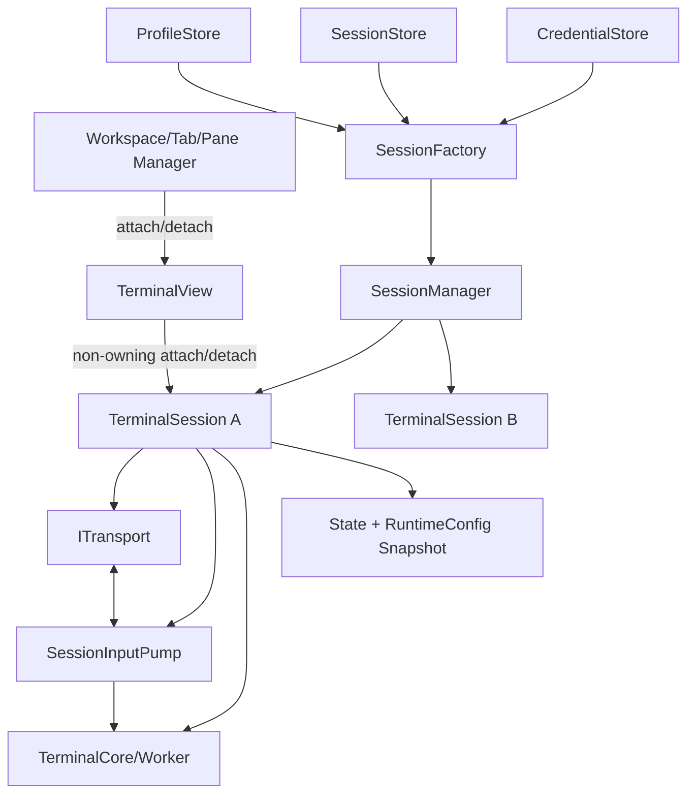
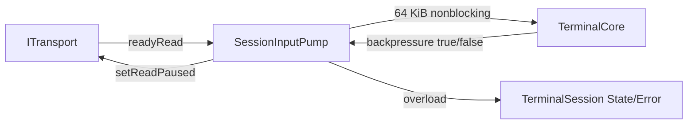
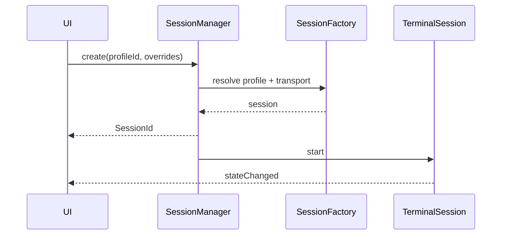
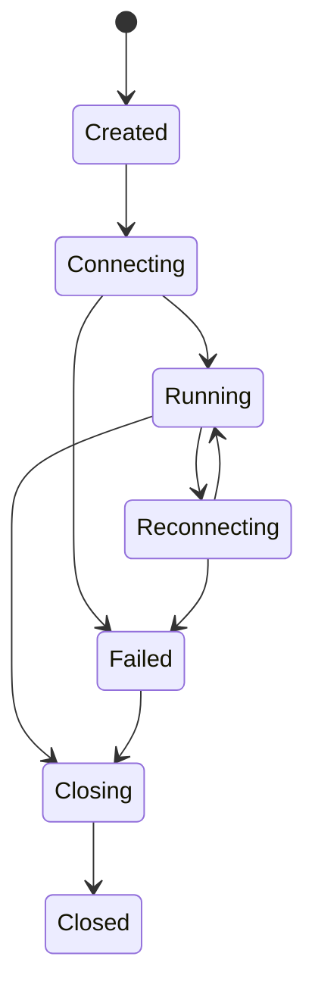

# P6：TerminalSession、SessionManager 与 Transport

**状态：进行中 —— Transport 层已完成，Session 编排层未接入生产路径**

> 进度核对日期：2026-09-02。核对方式为逐条比对下方"落地实现步骤"与当前代码。
> 按 `Development_Roadmap.md` 的统一完成定义（设计边界落地 + 代码构建 + 自动化
> 测试通过 + 文档更新），本阶段两项未满足，因此既不标记"已完成"，也不标记
> "功能完成"：`SessionManager`/`SessionFactory` 尚未接入生产路径，且
> `novaterm_conpty_tests` 存在句柄回收失败。

## 实现进度

| 步骤 | 状态 | 缺口 |
| --- | --- | --- |
| 0 盘点 View 运行期职责 | 已完成 | — |
| 1 Session 类型与状态契约 | 已完成 | — |
| 2 最小 `TerminalSession` | 部分完成 | 所有权与设计相反：`TerminalView` 默认自建 Session 并 parent 自己（`TerminalView.cpp:133` 的 `new TerminalSession(_core, this)`；`_ownsSession` 默认 true 见 `TerminalView.h:105`，赋值见 `TerminalView.cpp:124`），生产路径全部走这条 |
| 3 `SessionInputPump` | 已完成 | 禁止项第一条未被违反：`_pendingTransportInput` 在 `src/ui/` 下已零残留，暂存点为 `SessionInputPump.h:85` 的 `_pending`（上限 `MaxPendingBytes` 8 MiB / 单次 `InputChunkBytes` 64 KiB，`SessionInputPump.h:80-81`）|
| 4 生命周期与关闭协议 | 部分完成 | `TerminalSession::close(CloseMode)` 首行即 `Q_UNUSED(mode)`（`TerminalSession.cpp:317-319`），Graceful 与 Abort 未区分 |
| 5 `ITransport` 契约扩展 | 部分完成 | `transportError` 已接通：四种 Transport 全部 emit（按 ITransport.h 约定先发结构化错误、再发 `errorOccurred`），`TerminalSession` 据此把分类映射为 `SessionErrorCategory`，不再硬编码 `Io`，且仍只上报一条 `sessionError`。剩余缺口：`exited` 仅 Local 发出，转发到 `TerminalSession::exited` 后 UI 无消费者 |
| 6 Local PTY/ConPTY | 已完成（句柄断言受平台缺陷阻塞） | 两处句柄断言失败**不是本项目缺陷**：`CreatePseudoConsole`/`ClosePseudoConsole` 在本机 Windows 版本上不配平，每个伪控制台生命周期泄漏约 1 个句柄（单线程无子进程的最小复现见 `tests/transport/conpty_handle_leak_repro.c`，实测 1.04/循环）。ConPtySession 自建的 8 个句柄全部有对应关闭点，线程数与子进程数断言均通过。另有 `duplexLoadAndBackpressure` 偶发超时待查（与句柄无关）|
| 7 SSH Transport | 部分完成 | 资源监控辅助通道已改为请求驱动常驻 channel，快速 `/proc` 与低频 `df` 分离并在同一工作线程非阻塞推进（见下方 2026-09-06 记录）。其余缺口仍是：结构化 Challenge 完全不存在；`TerminalView.cpp` 仍直接 `qobject_cast<SshTransport*>` 弹框并调 `acceptHostKey()`，绕过 Session 层；`_keyDecision` 无 ChallengeId 防迟到响应；keyboard-interactive 未实现 |
| 8 Serial Transport | 已完成 | 无专门测试文件 |
| 9 Telnet Transport | 已完成 | — |
| 10 `SessionManager` | 部分完成 | 实现完整（注册/查找/关闭/重连/自动回收，无 `activeSession`），但**生产代码零使用**：`SessionManager` 与 `SessionFactory` 在 `src/ui/`、`src/main.cpp` 中均无命中，会话集合实际由 `TerminalPage::_terminalViews` 这个 View 列表隐式代表；`create(profileId, overrides)` 与 `restore` 未实现 |
| 11 attach/detach 与后台策略 | 部分完成 | `TerminalSession::detach()` 实际就是 `close(CloseMode::Graceful)`（`TerminalSession.cpp:290-293`），与"detach 不关闭 Session"直接冲突；可见性→GPU 帧策略缺失（`RenderScheduler`/`TerminalView` 无 `isVisible`/`occluded` 逻辑，`setTargetRefreshRate` 无人按可见性调用）|
| 12 持久化分层 | 部分完成 | `SessionStore`、`CredentialStore` 已接入 `SessionPanel`；`ProfileStore` 只有 `MemoryProfileStore`（`ProfileStore.h:88`，基类接口在 `ProfileStore.h:40`），无持久化实现，生产代码仅用其静态方法 `containsSensitiveValues` |
| 13 重连与恢复 | 部分完成 | `SessionStatistics::generation` 已投入消费：`connectTransportSignals()` 把世代号绑进每个处理器，`start()`/`beginReconnect()` 自增后调用 `rewireTransportSignals()` 重建接线。但**跨线程投递的信号仍无法靠 generation 识别**——SshTransport/LocalShellTransport 用 `invokeMethod(QueuedConnection)` 把 emit 推迟到 GUI 线程，emit 发生在重接线之后，世代号已是新值，故 `isConnected()` 启发式必须保留。彻底解法需把 generation 写进 ITransport 的信号契约（属步骤 5 的接口变更）。另无指数退避、最大重试次数与最大间隔 |
| 14 压力验证与切换 | 部分完成 | `tests/transport/TransportContractTests.cpp` 不存在，四种 Transport 各写一套独立测试（SSH 那份还不是 QTest）；SSH 无压力/泄漏/背压测试；无多 Session 并发输出测试；无 sanitizer 配置 |

### 本地终端启动尺寸（2026-09-06）

`TerminalView` 用 `terminalSizeChanged` 的最新目标行列数初始化 Transport，
不再在 `startLocalShell` 或 `attachTransport` 中用异步 Core 的旧尺寸覆盖它。
否则布局已放大而 Core 尚未处理 resize 时，ConPTY 会按旧高度滚动，
造成 PowerShell `dir` 的提示符和文件列表错行。缓存仅在创建 Renderer 前
从 Core 初始化，后续由 Renderer 的尺寸信号更新。
`terminalViewStartupPreservesPendingSize` 用真实 ConPTY 子进程查询窗口尺寸，
确定性模拟目标已发布、模型尚未更新的窗口；修复前失败，修复后通过。
验证：Windows / Qt 6.8.3 / MSVC Release 构建通过，
`novaterm_terminal_session_tests` 9 项通过，`novaterm_core_tests` 37 项通过。
真实 PowerShell 的 `dir` 诊断运行中，屏幕模型与 D3D11 截图的文件列对齐，
提示符位于列表末尾；原截图的启动时序由上述尺寸竞态测试覆盖。

### 快速连接展示（2026-09-05）

`SessionPanel` 保留原有连接类型分组及存储格式，改为设备图标与名称/连接信息两行的单列树，增加名称和主机搜索、无匹配提示、长文本省略及完整 tooltip。此变更仅涉及 UI 展示，不改变本阶段的 Session 编排状态。

2026-09-06：移除会话面板顶部重复的 `_titleLabel`，将 `_newSessionButton`
移入原标题栏并与折叠按钮同行，减少一行纵向占用；折叠后仍只保留展开按钮。
串口历史条目的详情行由仅显示波特率改为“串口号 @ 波特率”，并同步用于搜索、
tooltip 和无障碍文本。
展开状态的最小宽度统一限制为 190 px，并在配置加载、拖动记录与折叠恢复时共同
执行该下限，避免历史会话名称和连接详情被压缩到无法辨认。

2026-09-08：终端页将标签交互从 `TerminalPage` 抽离到专用
`TerminalTabWidget`。所有标签支持与历史会话条目一致的右键“编辑”入口；右击
标签会先将其设为当前标签，再用该标签保存的运行配置和 SSH 运行期凭据回填同一
个会话对话框。确认后复用原 `TerminalView`，替换 Transport 并立即连接，因此
已断开的标签也能就地修正主机、端口或凭据后重连，不会另开重复标签；远程会话
复用原 Core 和既有屏幕/回滚内容，本地 Shell 继续遵循已有的重启缓冲策略。
专用控件只负责标签命中和菜单，不持有 Session/Transport；配置快照由
`TerminalPage` 随标签生命周期清理，敏感凭据不写入持久化或日志。

同日修复 Ela 标签拖出浮窗在 Windows 上偶发无法最大化、无法关闭的问题。
拖拽期间浮窗会临时启用 `Qt::WindowTransparentForInput`；`QDrag::exec()` 的嵌套
事件循环可能替换浮窗或重建原生句柄，旧实现只清一次 Qt 标志，最终窗口会残留
`WS_EX_TRANSPARENT`，导致整个标题栏收不到输入。现由 `ElaCustomTabWidget`
集中管理拖拽输入穿透：结束时同时清 Qt 标志与 Windows 原生扩展样式，并回到主
事件循环后对最终句柄再次复核。关闭浮窗仍按 Ela 原有语义把标签送回来源页，
不会关闭 Terminal Session。

### SSH 远端资源监控（2026-09-06）

`SystemMonitorPanel` 不再每秒调用一次包含三个 `awk` 和 `df` 的单次命令。
快速指标默认每 2 秒请求一次（`monitor.fastIntervalMs` 可设为 1000），由
`SshTransport` 在既有连接上维护一个无 PTY 的常驻 exec channel；远端 Shell
阻塞等待请求，每次只启动一个合并读取 `/proc/stat`、`/proc/meminfo` 和
`/proc/net/dev` 的 `awk`。文件系统容量由独立单次 channel 每 30 秒查询并缓存
最近有效结果，因此慢 `df` 不会拖住快速指标。

常驻协议包含请求 ID 和明确起止标记，`SshMonitorFrameParser` 覆盖任意分片、
多帧合并、错误标记、单帧/接收缓冲/行长/条目数上限。channel 建立与单次响应
分别有 5 秒超时，stderr 限 16 KiB，失败后按 1–30 秒有界指数退避；快速请求
最多一个在途。隐藏、折叠、最小化和标签切换会停止定时器、发送 EOF 并关闭
channel，恢复后立即采样并重建 CPU/网络差分基线。辅助 channel 和交互 Shell
全部继续由同一 SSH 工作线程访问，认证完成后以非阻塞状态机处理 `SSH_AGAIN`。

本地自动验证在 `novaterm_ssh_transport_check`：覆盖协议分片、合帧、错误帧、
单帧/接收缓冲/条目超限，以及未连接时拒绝启动采样。另用
`novaterm_ssh_monitor_integration_check` 读取已有 Zynq 历史会话与凭据引用实测：
10.221 秒内收到 10 个有效快速样本；人为制造的 7 秒慢命令在 5 秒超时，期间
快速通道仍收到 5 个样本；交互 Shell 标记正常回显；停止后 1 秒通过远端进程表
确认采集脚本为 0；断开重连后的首帧成功；迟到样本为 0。该检查不输出主机凭据，
也不注册到默认 ctest。尚未使用服务端独立观测工具完成原始实现与各中间方案的
整机 CPU/进程树 CPU 时间对比，因此不能据此声明具体性能收益。

2026-09-06 Zynq 实测又发现，libssh 的
`ssh_channel_read_nonblocking()` 在正常通道结束时返回负值 `SSH_EOF`；通用命令
读取路径曾把所有负值误归类为“输出超过 1 MiB”，导致资源面板的文件系统区域
错误告警。现已把 `SSH_EOF` 作为正常流结束处理，并将 `SSH_ERROR` 与实际累计
超限分别报告。同一历史会话执行面板原始 `df` 命令实测 stdout 115 字节、
stderr 0 字节并正常完成。

2026-09-08：修复单次命令在收到 EOF 后立即读取退出状态的竞态。SSH 的 EOF、
`exit-status` 与 close 是独立消息，服务端可先发 EOF、随后才发退出状态；旧实现
此时调用已弃用的 `ssh_channel_get_exit_status()`，会把“状态尚未到达”的 -1
误报为命令失败。现改为注册 libssh 的异步 exit-status 回调，只有输出结束且
退出状态已收到才完成请求；若通道关闭后仍无退出状态，则报告明确的协议错误。
`novaterm_ssh_transport_check` 增加 EOF/exit-status 两种到达顺序及缺失状态的
确定性回归检查。

同日统一资源面板字体层级：与 `SessionPanel` 相同，下拉框和表头采用 13 px，
CPU、内存、交换指标名采用 12 px，数值详情、速率、进度条文字和磁盘列表采用
10 px；文件系统表头加粗，
磁盘单行高度按字体度量且不低于 28 px，避免高 DPI 下文字裁切。此调整只涉及
展示，不改变采样或 Transport 生命周期。CPU、内存、交换三条占用条的垂直间距
同步由 8 px 收紧为 4 px，使指标组更紧凑且保持三列对齐。

## 剩余工作

按依赖排序，第 1 项是其余多数缺口的前置条件：

1. **把 `SessionManager`/`SessionFactory` 接入生产路径。** 当前 `TerminalPage` 每个 Tab 直接 `new TerminalView`、由 View 自建并持有 Session，这是 P6"建立完整多会话生命周期"未落地的根因。detach 语义、结构化错误上抛、Challenge 发布层都需要先有编排层才有落点。
2. **`close(CloseMode)` 区分 Graceful 与 Abort**，并让 `detach()` 只解除显示关联、不关闭 Session。
3. ~~**Session 级 generation 投入消费**~~ —— 已完成（2026-09-02），但只覆盖同线程场景。剩余：把 generation 写进 ITransport 信号契约，才能覆盖跨线程投递（并进而移除 `isConnected()` 启发式）。
4. **SSH Challenge 层**：把 host-key、password、passphrase、keyboard-interactive 统一为带 SessionId/generation/ChallengeId 的结构化请求，移除 `TerminalView` 对 `SshTransport` 的 `qobject_cast`。
5. ~~**`transportError` 接到 Session**~~ —— 已完成（2026-09-02）。剩余：`exited` 到 UI 仍断链。
6. ~~**修复 ConPTY 句柄回收**~~ —— 已查明为平台缺陷，本项目无法修复，见步骤 6 行。
7. **建立 `TransportContractTests`**，四种 Transport 跑同一套契约；补 Serial 测试与 SSH 压力测试。
8. **可见性→GPU 帧策略**（步骤 11）。
9. **`ProfileStore` 持久化实现**（步骤 12）。

## 目标

建立完整多会话生命周期，将当前散落在 TerminalView 的 Transport、输入暂存和 Core 组合职责下沉，并补齐 SSH、Serial、Telnet。

## 目标结构


```mermaid
flowchart TB
    W[Workspace/Tab/Pane Manager] -->|attach/detach| V[TerminalView]
    M[SessionManager] --> S1[TerminalSession A]
    M --> S2[TerminalSession B]
    V -->|non-owning attach/detach| S1
    S1 --> T[ITransport]
    S1 --> IP[SessionInputPump]
    S1 --> C[TerminalCore/Worker]
    S1 --> ST[State + RuntimeConfig Snapshot]
    PS[ProfileStore] --> F[SessionFactory]
    SS[SessionStore] --> F
    CS[CredentialStore] --> F
    F --> M
    IP --> C
    T <--> IP
```

## 开发重点

1. 先引入轻量 TerminalSession，保持单会话行为不变。
2. 把 `_pendingTransportInput`、暂停/恢复和 overload 从 TerminalView 移至 InputPump。
3. Session 统一 start、close、resize、reconnect、错误、title、activity 和状态机。
4. SessionManager 只管理 Session 注册、创建、查找、关闭、恢复和资源回收；当前激活 Tab/Pane/Window 属于 Workspace/UI 层。
5. 明确 View 与 Session 生命周期独立：Session 可无 View 后台运行，View detach 不关闭 Session，Session 不反向持有 View/Renderer。
6. 扩展 ITransport：异步连接/关闭、部分写、写队列、bytesWritten、错误类别、keepalive 和 reconnect。
7. 接入顺序：Local PTY/ConPTY → SSH → Serial → Telnet → Custom。Local/SSH/Serial/Telnet 四种 Transport 均已实现；Custom 仍需外部工厂，`SessionFactory::create()` 目前对其返回错误。
8. 后台策略由 View/RenderScheduler 根据可见性决定；无 View 时不请求 GPU 帧，但 Parser、Scrollback 和连接继续保持正确。
9. Profile、RuntimeConfig、Session 恢复元数据和 Credential 分层保存，禁止把敏感凭据直接序列化到 Profile/Session 文件。

## 落地实现步骤

### 步骤 0：盘点当前 View 中的运行期职责

列出 `TerminalView` 当前承担的 Core 创建、LocalShellTransport 创建、attach/detach、`_pendingTransportInput`、背压、output 转发、resize debounce、title/activity 和断开提示。为现有单会话行为增加 smoke test，迁移时逐项下沉，不一次性重写 UI。

### 步骤 1：定义 Session 类型和状态契约

建议新增 `src/session/SessionTypes.h`，包含稳定 `SessionId`、SessionState、错误类别、关闭原因、连接统计和解析后的 RuntimeConfig。状态变更只能经过统一 transition 函数，非法转换记录错误。

Profile 是创建模板；`SessionFactory` 读取 Profile、Session overrides 和 Credential 引用，解析生成不可变或受控可变的 `RuntimeConfig` 快照。TerminalSession 创建时取得该快照，后续 Profile 修改默认不影响已经运行的 Session，除非用户明确应用可热更新字段。

配置分层如下：

- `ProfileStore`：持久化用户定义的连接模板；
- `SessionStore`：持久化应用重启所需的 Session restore metadata、ProfileId 和 overrides；
- `CredentialStore`：持久化密码、token、私钥口令等敏感凭据，Profile/Session 只保存 `credentialRef`；
- `RuntimeConfig`：当前 Session 实际使用的解析后配置快照，只属于运行期，不允许 Transport 直接读取 Profile JSON/UI 控件。

恢复 Session 时默认应保持“原 Session 的连接语义”：使用保存的 ProfileId + overrides + 必要的配置版本/快照信息重新生成 RuntimeConfig。若产品明确选择“恢复时跟随最新 Profile”，必须作为显式策略，不能隐式改变连接目标。

### 步骤 2：引入最小 `TerminalSession`

先让 Session 聚合一个 `ITransport` 和一个 `TerminalCore`，连接现有信号，但仍由单个 TerminalView 使用。建议接口：

```cpp
class TerminalSession : public QObject {
public:
    SessionId id() const;
    SessionState state() const;
    TerminalCore* core() const;
    void start();
    void close(CloseMode mode);
    void writeUserInput(const QByteArray&);
    void resizeTerminal(int columns, int rows);
signals:
    void stateChanged(SessionState);
    void errorOccurred(SessionError);
};
```

Session 不持有 TerminalRenderer；View 可以 attach/detach Session，Renderer 读取 Session 暴露的 Core/Snapshot。这样后台 Session 可以没有 View。

Ownership 必须明确：

- `SessionManager` 拥有/注册 `TerminalSession`；
- `TerminalSession` 拥有或独占其 `ITransport`、`SessionInputPump` 和 Core/Worker；
- `TerminalView` 只保存对 Session 的非 owning 引用（例如 `QPointer`/weak reference），detach 后引用失效但 Session 不关闭；
- `TerminalSession`、`SessionManager`、`TerminalCore` 禁止保存 `TerminalView*`、`QWidget*`、Renderer 或任何 GPU 资源。

Session 对 UI 只暴露状态、事件、Snapshot 和命令接口。Session 负责描述“发生了什么”，UI 决定“如何展示”。例如 Session 只发送 `titleChanged`、`activityChanged`、`errorOccurred`，不得直接修改 Tab 标题、弹 QMessageBox 或操作状态栏。

### 步骤 3：实现 `SessionInputPump`

把 Transport `readyRead` 到 `TerminalCore::writeInput()` 的 64 KiB 分片、pending 后缀、高低水位暂停/恢复和 overload 迁到 InputPump。InputPump 本身也必须有 pending bytes 上限、统计和停止语义。


```mermaid
flowchart LR
    T[ITransport] -->|readyRead| IP[SessionInputPump]
    IP -->|64 KiB nonblocking| C[TerminalCore]
    C -->|backpressure true/false| IP
    IP -->|setReadPaused| T
    IP -->|overload| S[TerminalSession State/Error]
```

迁移后删除 `TerminalView::_pendingTransportInput`。用集成测试证明数据顺序和字节总数不变，再删除旧连接代码，禁止长期存在两个 pump。

### 步骤 4：完善 Session 生命周期和关闭协议

`start()` 建立信号连接后启动 Transport；connected 后进入 Running。关闭顺序：停止新用户输入、暂停/断开 readyRead、按 CloseMode 排空或丢弃明确可丢数据、停止 Core、关闭 Transport、等待句柄/线程回收、断开 queued callback、进入 Closed。

CloseMode 至少区分 Graceful 与 Abort。析构可执行有界 Abort，但正常 UI 关闭优先 Graceful。所有异步 callback 携带 SessionId/generation，已关闭 Session 的迟到事件被忽略。

### 步骤 5：扩展 `ITransport` 契约

现有 bool/QString 接口逐步扩展为异步、结构化语义：

- `connectAsync()` / connected；
- `close()` / disconnected；
- 有界写队列、部分写和 `bytesWritten`；
- `TransportError { category, code, message, retryable }`；
- `setReadPaused()`；
- `resizeTerminal()`；
- 可选 keepalive、reconnect policy 和统计。

接口只传字节、尺寸和连接状态，不出现 ScreenBuffer、Profile JSON 或 Renderer 类型。能力差异使用 capability 查询，不能用大量空实现掩盖不支持功能。

### 步骤 6：巩固 Local PTY/ConPTY

把当前 LocalShellTransport 作为参考实现：Unix PTY 用 notifier 暂停读取，Windows ConPTY reader 用条件变量暂停。补齐部分写、子进程退出码、关闭超时、SIGWINCH/ConPTY resize、shell 环境和句柄回收测试。

Local shell 命令解析属于 Profile/SessionFactory，Transport 接收已解析启动参数，不读取 UI 控件。

### 步骤 7：实现 SSH Transport

SSH 使用独立 I/O 上下文，阶段化完成 DNS/TCP、host-key 验证、认证、channel、PTY 请求和 shell 启动。凭据通过 credentialRef 获取，不记录密码/私钥内容。实现窗口调整、keepalive、断线分类、部分读写和背压；暂停应用读取时仍需处理协议必要的控制流，不能造成 SSH 死锁。

主机密钥首次信任和变更必须通过 UI 决策流程，不允许默认静默接受。认证 callback 不得阻塞 GUI。

SSH Transport 不得直接调用 UI。需要用户决策时通过 Session/Application 层发布结构化 Challenge，例如 `HostKeyChallenge`、`PasswordChallenge`、`KeyboardInteractiveChallenge`、`PassphraseChallenge`，UI 返回对应 `ChallengeResponse`。Challenge 必须带 `SessionId`/generation/ChallengeId，Session 关闭或 generation 变化后迟到响应必须被忽略。

### 步骤 8：实现 Serial Transport

Serial 配置包含设备、baud、data bits、parity、stop bits、flow control。连接和错误使用统一 Session 状态；断开设备、权限失败和热插拔可区分。背压优先使用串口/驱动流控，无法停止读取时使用有界接收线程并报告过载策略。

resize 对 Serial 是明确 no-op capability，不应伪装成功的远端 PTY 调整。

### 步骤 9：实现 Telnet Transport

Telnet 层负责 IAC 协商、字节转义、NAWS、终端类型和二进制模式，然后把净终端数据送入 InputPump。协议状态机属于 Transport，不属于 VTAdapter。写端对 `0xFF` 正确转义，resize 通过 NAWS；默认明确提示 Telnet 非加密风险。

**已实现**：`src/transport/TelnetTransport.*`。`QTcpSocket` 负责链路，协议状态机由 vendored 的 libtelnet 承担（`third_party/libtelnet`，纯 C 单文件，public domain，覆盖 RFC 854/855/1091/1143/1572）。`libtelnet.h` 经 PImpl 隔离在 `.cpp` 内，与 `VTAdapter` 对 libvterm 的边界约束一致。capabilities 为 `PauseReads | ResizeTerminal | KeepAlive | Reconnect`。未申报 NEW-ENVIRON：UI 未提供环境变量输入，申报后无值可送。

选用 libtelnet 而非自写状态机的关键理由是 RFC 1143 Q-method 协商由库承担——这是 Telnet 唯一容易写错到产生协商死循环的部分。使用该库有三处语义必须留意（均已在代码注释中标注）：

- **telopt 表不会发起协商。** 该表只被 libtelnet 的 `_check_telopt` 用于决定是否*接受*对端发起的协商。客户端意向必须在连接建立后显式调用 `telnet_negotiate()` 申报（`DO/WILL SGA`、`DO ECHO`、`WILL TTYPE`，以及按配置的 `WILL NAWS` 和双向 `BINARY`）。只填表不申报会得到一个"能连上但窗口尺寸与终端类型永不上报"的静默故障。
- **telopt 表必须与 `telnet_t` 同寿命。** `telnet_init()` 只保存该表指针，此后每次协商都会回读，因此它是状态机对象的成员而非局部变量。
- **出站统一走 `telnet_send_text()`。** `TELNET_FLAG_TRANSMIT_BINARY` 由协商结果自动置位，该函数据此选择行为：未协商 BINARY 时按 RFC 854 把裸 CR 转为 CR NUL、LF 转为 CR LF，协商成功后原样透传；两种模式都会把 `0xFF` 加倍。Transport 内无需自行分支。

与 SSH 不同，Telnet 不需要独立工作线程：`QTcpSocket` 本身异步，全部逻辑在 GUI 线程信号槽内完成。背压也不需要步骤 7 中"暂停时仍须处理协议控制流"的特殊处理——Telnet 没有应用层流控窗口，停止 drain socket 即让 TCP 接收窗口收缩、由对端自然减速；socket 读缓冲设有上界以保证该反压真实生效。

净数据在 `telnet_recv()` 返回之后统一投递，而不是在解析回调内直接 emit：同一 chunk 可能既含数据又含协商，若在 libtelnet 栈内回调上层，调用方的 `write()`/`disconnect()` 会重入解析器。

NAWS 在对端回 `DO NAWS` 之前只缓存尺寸、不发报文，协商成功时立即补报；对端回 `DONT NAWS` 后不再发送，不伪装成功（与步骤 8 中 Serial 的 no-op resize 同一原则）。子协商载荷内的 `0xFF` 由 `telnet_subnegotiation()` 加倍，终端恰好 255 列时报文不会被截断。

### 步骤 10：实现 `SessionManager`

Manager 以 SessionId 保存 Session，提供 create、find、list、close、closeAll、restore 和资源回收。Manager 不成为大锁：每个 Session 独立 Worker/队列/状态，列表锁不覆盖 Transport 或关闭等待。

`SessionManager` 不管理 UI 的 current/active Session。当前 Window/Tab/Pane 的激活关系属于 Workspace/Tab/Pane Manager；多窗口场景下可以同时存在多个“当前 Session”。若需要根据可见性调整展示策略，应由 View/Workspace 计算 presentation state，再通知 RenderScheduler，而不是在 SessionManager 中维护单一 `activeSession`。


```mermaid
sequenceDiagram
    participant UI
    participant M as SessionManager
    participant F as SessionFactory
    participant S as TerminalSession
    UI->>M: create(profileId, overrides)
    M->>F: resolve profile + transport
    F-->>M: session
    M-->>UI: SessionId
    M->>S: start
    S-->>UI: stateChanged
```

### 步骤 11：View attach/detach 与后台策略

TerminalView attach Session 时连接 title、activity、state、Snapshot/update 事件和必要的 Core 只读接口；detach 只释放显示关联，不关闭 Session。架构层面允许 `1 Session -> 0..N Views`，即使 P6 首版只实现单 View，也禁止把一对一 ownership 写死。

前台目标刷新率正常；隐藏 View 降低 RenderScheduler 频率；无 View 时不请求 GPU 帧。Parser、Scrollback、Search 和连接仍按策略运行。Session 本身不维护“渲染频率”或“当前 Tab”状态。

Session 再次 attach 时获取最新 Snapshot 并全屏重建。Snapshot 必须是线程安全的 CPU-side 数据，不包含 QWidget、Renderer、Texture、GlyphAtlas、SwapChain 等 GPU/UI 对象，并携带 revision/generation 以便 View 判断是否需要全量重建或增量刷新。GPU 资源只属于 View/Renderer，不放入 SessionManager。

### 步骤 12：会话参数持久化与恢复存储

新增清晰的持久化边界：

1. `ProfileStore` 保存可复用连接模板，例如 SSH host/port/user、Serial baud/parity、Local shell 启动参数等；
2. `SessionStore` 保存应用重启所需的 restore metadata，例如 SessionId（如需稳定恢复）、ProfileId、Session overrides、reconnectOnRestore、必要的 RuntimeConfig schema/version，以及 Workspace 可引用的恢复键；
3. `CredentialStore` 保存密码、token、私钥口令等敏感信息，Profile/SessionStore 中只允许出现 `credentialRef`；
4. `RuntimeConfig` 是 SessionFactory 解析后的运行期配置快照，不由 Transport 持久化，也不允许 Transport 读取 UI 控件或原始 Profile JSON；
5. Workspace 的 Tab 顺序、Pane 布局、View scroll position/selection 等 UI 状态不写入 SessionStore，应由独立 WorkspaceStore（若实现）持久化。

推荐恢复链路：

```text
SessionStore(ProfileId + overrides + restore metadata)
        +
ProfileStore
        +
CredentialStore(credentialRef)
        ↓
SessionFactory::resolve()
        ↓
RuntimeConfig Snapshot
        ↓
TerminalSession
```

配置文件具体采用 JSON、SQLite 或 QSettings 不在 P6 强制指定，但 Store 接口必须隔离存储格式，避免 SessionManager/Transport 依赖具体序列化实现。

### 步骤 13：重连和恢复

Reconnect 创建新的 Transport connection generation，但保持 SessionId；Core/Scrollback 是否保留由策略决定。旧 generation 的 readyRead/disconnected 不得影响新连接。指数退避设置最大次数、最大间隔和用户取消；认证/host-key 错误默认不自动无限重试。

应用级 restore 与网络 reconnect 分离：restore 是“根据持久化元数据重新创建 Session”，reconnect 是“同一个运行 Session 建立新的 Transport generation”。两者不能共用同一状态语义。

### 步骤 14：压力验证和切换

按 Local→SSH→Serial→Telnet 顺序接入，每种 Transport 通过相同 contract tests。运行多 Session 并发输出、前后台切换、关闭时洪流、resize 风暴、网络断连、应用退出和百次创建销毁。确认 View 不再保存 Transport 字节后切换默认架构。

## Session / UI 状态归属

| 状态/资源 | 所属层 | 说明 |
| --- | --- | --- |
| Transport connection / reconnect policy | Session | 与 View 生命周期无关 |
| RuntimeConfig | Session | 创建时解析后的运行期快照 |
| Terminal screen / scrollback / parser state | Core/Session | 后台也必须保持正确 |
| title / activity / error | Session event | Session 产生事件，UI 决定展示方式 |
| current Tab / active Pane / Window focus | Workspace/UI | 禁止放入 SessionManager |
| View scroll position / selection | View | 属于具体 View，同一 Session 的多个 View 可不同 |
| Font / Scheme | View/Presentation config | 可由 Profile 提供默认值，但实际渲染资源属于 View |
| GPU glyph cache / texture / swapchain | Renderer | 禁止进入 Session/Manager |
| Tab 顺序 / split layout | Workspace | 若需要持久化，应进入 WorkspaceStore |
| password / token / private-key passphrase | CredentialStore | Profile/Session 只保存 credentialRef |

依赖方向必须保持为 `UI -> Session API -> Core/Transport`，Session/Core/Transport 不允许反向依赖具体 UI 类型。

## 建议文件结构

| 文件 | 职责 |
| --- | --- |
| `src/session/SessionTypes.h` | ID、状态、错误和配置 |
| `src/session/TerminalSession.*` | 生命周期和信号编排 |
| `src/session/SessionInputPump.*` | 分片、pending 和背压 |
| `src/session/SessionManager.*` | 多会话注册与管理 |
| `src/session/SessionFactory.*` | Profile/overrides/credentialRef 到 RuntimeConfig、Session/Transport |
| `src/session/SessionStore.*` | Session restore metadata 持久化接口 |
| `src/profile/ProfileStore.*` | Profile 模板持久化接口 |
| `src/credential/CredentialStore.*` | 敏感凭据存取，Profile 仅保存引用 |
| `src/transport/ITransport.h` | 统一异步契约 |
| `src/transport/*Transport.*` | Local/SSH/Serial/Telnet 实现 |
| `tests/session/SessionTests.cpp` | 状态、关闭和多会话测试（目标 `novaterm_session_tests`）|
| `tests/transport/TransportContractTests.cpp` | 所有实现共享契约 —— **尚未建立**（见"剩余工作"第 7 项）|
| `tests/transport/TelnetTransportTests.cpp` | Telnet 协商、转义、背压和失败路径（loopback QTcpServer，无需 telnetd） |
| `tests/transport/PtyTransportTests.cpp` / `ConPtyTransportTests.cpp` | Local PTY / ConPTY，各自独立而非共享契约；ConPTY 另有 `conpty_handle_leak_repro.c` 平台缺陷复现 |
| `tests/transport/SshTransportFailureCheck.cpp` | SSH 失败路径与资源监控帧协议（分片、合帧、错误、上限）—— 非 QTest，仅返回退出码；无真实服务端压力/泄漏/背压覆盖 |

Serial Transport 目前**没有对应测试文件**（见"实现进度"步骤 8 行）。

## 实施禁止项

- 禁止 TerminalView 继续拥有 pending Transport 字节；
- 禁止 TerminalSession、SessionManager、TerminalCore、Transport 保存 `TerminalView*`、`QWidget*`、Renderer 或 GPU 资源；
- 禁止 SessionManager 保存全局唯一 `activeSession` 作为 Tab/Window 激活状态；
- 禁止把 current Tab、Pane 布局、Selection、View scroll position 等 UI 状态塞入 Session；
- 禁止 SessionManager 用单个大锁包围所有 Session I/O；
- 禁止 Transport 理解 ANSI、Cell 或 Renderer；
- 禁止密码、token、私钥口令写入 Profile、SessionStore 或日志，只允许保存 credentialRef；
- 禁止迟到 callback 操作已关闭或新 generation Session；
- 禁止后台 Session 继续无意义地产生高频 GPU 帧；
- 禁止用阻塞 GUI 的连接、认证或关闭流程；
- 禁止不同 Transport 绕过 InputPump/Core 建立第二数据通路。

## 状态机


```mermaid
stateDiagram-v2
    [*] --> Created
    Created --> Connecting
    Connecting --> Running
    Connecting --> Failed
    Running --> Reconnecting
    Reconnecting --> Running
    Reconnecting --> Failed
    Running --> Closing
    Failed --> Closing
    Closing --> Closed
```

## 测试

反复创建/关闭、连接失败、断线重连、关闭时大输出、resize 风暴、部分写、后台多会话并发、应用退出。增加 attach/detach 后 Session 继续运行、Session 关闭时 View 引用安全失效、一个 Session 多 View（至少 contract test）、Profile 修改不污染运行 RuntimeConfig、Session restore metadata round-trip、Credential 不落盘到 Profile/SessionStore 等测试。使用 sanitizer/平台诊断验证无 UAF、线程和句柄泄漏。

## 退出标准

Local/SSH/Serial/Telnet 共享同一数据通路；多 Session 互不阻塞；View 不保存 Transport 输入；Session 生命周期不依赖 View；Session/Manager/Core/Transport 不反向依赖 UI 类型；后台无不必要高频 GPU 帧；Profile/Session/Credential 分层持久化；restore 与 reconnect 语义分离；所有状态和错误可观察；压力关闭可靠。
