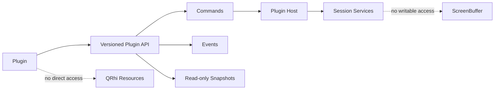
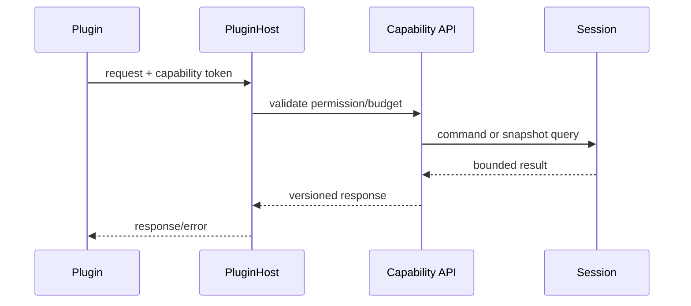

# P7：插件与扩展系统

**状态：计划中；必须等待核心数据通路和 Session API 稳定**

## 目标

为主题、脚本、协议工具、SFTP、状态监控和 AI 辅助提供受控扩展点，同时保护 ScreenBuffer、Session 和 GPU 所有权。

## 安全边界



## 开发重点

- 版本化 manifest、能力声明、依赖和兼容范围；
- 权限模型：文件、网络、凭据、Session 内容、剪贴板和进程；
- 命令、事件和只读 Snapshot API；
- 超时、取消、速率限制、队列上限和故障隔离；
- 加载、启用、禁用、卸载、升级和崩溃恢复；
- 脚本运行时与原生插件分级，优先选择可隔离方案；
- 敏感终端内容默认不向插件开放。

## 落地实现步骤

### 步骤 0：冻结可扩展边界和威胁模型

只有 P4/P6 的只读 Snapshot、Session 命令和生命周期稳定后才开始实现。列出可信主体、敏感资产和攻击面：终端内容、输入、凭据、文件、网络、剪贴板、进程启动、UI 注入和资源耗尽。默认拒绝所有能力，再按 manifest 授权。

首版明确不支持的能力也要写入设计，例如插件直接获得 QRhi 对象、可写 ScreenBuffer、任意进程内 C++ ABI 或无提示读取所有 Session 内容。

### 步骤 1：选择隔离等级

将扩展分级：

| 类型 | 示例 | 建议隔离 |
| --- | --- | --- |
| 声明式资源 | Theme、Scheme、命令描述 | 纯数据校验，无代码执行 |
| 脚本插件 | 自动化、文本处理 | 受限 runtime/WASM，能力 API |
| 服务插件 | SFTP、协议工具、AI | 独立 Plugin Host 进程 |
| 原生进程内插件 | 极少数性能扩展 | 首版不开放或仅官方签名 |

优先使用进程外或可沙箱化模型。C++ ABI 跨编译器/Qt 版本不稳定，不能作为公共插件协议的唯一基础。

### 步骤 2：定义版本化 Manifest

建议字段：schemaVersion、id、name、version、publisher、entrypoint、hostApiRange、capabilities、contributions、dependencies、platforms 和 integrity/signature。

```json
{
  "schemaVersion": 1,
  "id": "example.search-tools",
  "version": "1.0.0",
  "hostApi": ">=1.0 <2.0",
  "entrypoint": "plugin.wasm",
  "capabilities": ["session.snapshot.read"],
  "contributions": { "commands": ["search.selection"] }
}
```

加载前完成 schema、ID、版本范围、路径穿越、重复 contribution 和完整性校验。插件数据目录按稳定 ID 隔离。

### 步骤 3：定义能力和授权模型

能力至少细分为：读取指定 Session Snapshot、发送终端输入、订阅事件、文件读写范围、外部网络域、凭据代理、剪贴板、通知和进程启动。高风险能力安装/首次使用时明确提示，并允许随时撤销。

插件只能获得 capability-scoped handle，不获得内部 QObject 指针。凭据能力返回受限操作或短期 token，不向插件暴露主密码。

### 步骤 4：设计稳定 Host API

API 分为 Commands、Events、Queries 和 Contributions：

- Commands：用户或插件请求执行受控动作；
- Events：Session 状态、配置、选择等通知；
- Queries：带权限和预算的只读 Snapshot/元数据；
- Contributions：命令面板、菜单、主题、设置 schema 等声明。

所有请求带 requestId、pluginId、API version、deadline/cancellation 和大小限制。跨进程协议使用版本化消息，不直接序列化内部 C++ 对象。



### 步骤 5：实现 Plugin Registry 与发现

Registry 扫描受控安装目录，解析 manifest，建立 enabled/disabled/quarantined 状态和依赖图。发现阶段不执行插件代码。循环依赖、版本不兼容、重复 ID 和签名失败产生结构化诊断。

加载顺序由依赖拓扑和 contribution 类型确定，不依赖文件系统枚举顺序。禁用全部插件时不启动 Plugin Host。

### 步骤 6：实现 Plugin Host 生命周期

PluginManager 负责 start、activate、deactivate、stop、update 和 crash recovery。按插件或信任域选择独立进程；设置 CPU 时间、内存、消息大小、并发请求和事件速率预算。

插件只有在 activation event 命中时启动，避免开机全部激活。停用时取消请求、停止事件投递、等待有限时间、强制终止 Host，并释放 capability handle。

### 步骤 7：实现事件总线和背压

事件按插件使用有界队列。高频事件定义合并策略：resize/title 可保留最新值，日志/telemetry 可采样，终端原始输出默认不广播。不可合并的重要事件在队列满时断开或暂停插件，并记录 dropped/coalesced，而不是反向阻塞 Parser。

Session Snapshot 采用显式请求和分页/范围限制，禁止每次 damage 把完整屏幕复制给所有插件。

### 步骤 8：实现命令与只读 Snapshot API

Session API 使用稳定 SessionId 和 generation。插件可读取授权范围内的不可变 Snapshot，结果有最大 Cell/bytes、超时和脱敏策略。发送输入必须单独权限并经过 Session 命令路径，不能直接写 Transport 或 VTAdapter。

插件对 Snapshot 的长期引用设置租约；到期、Session 关闭或内存压力时失效。插件不能阻止 P4 Chunk 淘汰无限延迟。

### 步骤 9：实现 UI Contributions

首版只允许声明式 Command、Menu、Settings schema、Theme/Scheme。Host 将 contribution 转换为 NovaTerm 自有模型，再由 UI 渲染；插件不直接持有 QWidget/QML/QRhi 对象。

如未来开放 WebView/独立面板，应使用消息边界和内容安全策略，并与主 UI 线程故障隔离。

### 步骤 10：日志、审计和隐私

记录安装/启停、授权变更、能力调用类别、超时、资源超限和崩溃；日志默认不包含终端内容、命令文本、凭据和文件内容。用户可查看每个插件权限与近期访问，并一键撤销/禁用。

### 步骤 11：更新和兼容策略

安装包先写临时目录、校验完整性，再原子切换版本；保留可回滚上一版本。更新不得在 Plugin 运行中覆盖二进制。Host API 使用 major/minor 兼容规则，废弃接口至少跨一个明确周期，并提供 capability negotiation。

### 步骤 12：故障注入和安全验收

构造无限循环、内存增长、事件不消费、畸形消息、超大响应、崩溃、权限绕过、路径穿越、网络越权和 Session 关闭竞态。验证 Host 能隔离并回收，Parser/Renderer FPS 和输入延迟不受不可接受影响。

## 建议文件结构

| 文件 | 职责 |
| --- | --- |
| `src/plugin/PluginManifest.*` | Schema 和兼容校验 |
| `src/plugin/PluginRegistry.*` | 发现、状态和依赖 |
| `src/plugin/PluginManager.*` | 生命周期和 Host 编排 |
| `src/plugin/CapabilityManager.*` | 授权、token 和审计 |
| `src/plugin/PluginProtocol.*` | 版本化 IPC 消息 |
| `src/plugin/EventBroker.*` | 有界事件和合并 |
| `src/plugin/contributions/*` | Command/Menu/Theme/Settings |
| `plugin-host/` | 隔离运行时进程 |
| `tests/plugin/` | 协议、权限、故障和兼容测试 |

## 实施禁止项

- 禁止插件获得可写 ScreenBuffer、活动 Chunk 或 QRhi 资源；
- 禁止无权限读取终端内容、凭据、文件或网络；
- 禁止插件事件队列无界增长或反向阻塞 Parser；
- 禁止把内部 QObject/C++ ABI 当作跨进程公共协议；
- 禁止在发现 manifest 时执行插件代码；
- 禁止日志记录敏感终端数据和密钥；
- 禁止更新时原地覆盖正在运行的插件；
- 禁止插件崩溃导致 NovaTerm 主进程退出。

## 测试

恶意/卡死插件、事件洪泛、异常退出、权限拒绝、API 版本不兼容、Session 关闭期间回调、禁用全部插件的性能对比。

## 退出标准

禁用插件时主路径无额外行为；插件不能写 ScreenBuffer 或持有 GPU 资源；插件失败不阻塞 Parser/Renderer；权限和生命周期可审计；API 有明确版本与兼容策略。
