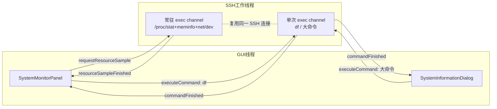

# P7：系统资源查询

**状态：已实现为内置功能（2026-09-06 常驻采集、2026-09-09 系统信息窗口）；
性能收益未用服务端独立工具横向对比，属功能完成、量化验收待补**

> **范围说明**：本阶段是 SSH 远端资源监控面板与系统信息查询窗口两项内置能力
> 的设计与实现记录，直接编进主程序、直接持有 `QWidget` 与 `SshTransport`。
> 远端 AI 上下文与工具调用能力不在本阶段范围内，规划在下一个大版通过 AI MCP
> （Model Context Protocol）接口引入，届时另立文档。

## 目标

在**不新建第二条 SSH 连接、不阻塞交互 Shell、不反压 Parser** 的前提下，为当前
SSH 会话提供两类远端资源视图：

- **常驻低开销监控**（`SystemMonitorPanel`）：可停靠面板，周期性展示 CPU、
  内存、交换分区占用率，单网卡收发速率历史，以及文件系统容量。
- **一次性详细快照**（`SystemInformationDialog`）：面板信息按钮打开的独立
  窗口，一次抓取操作系统、内核、CPU/GPU 硬件、CPU 使用分解、内存/交换、
  网络接口与文件系统的完整明细。

两者都是**内置实现**，直接持有 `QWidget` 与 `SshTransport`，编进主程序。

## 与当前代码的关系（2026-09-11 核对）

| 能力 | 源文件 |
| --- | --- |
| 常驻监控面板 | `src/ui/widgets/SystemMonitorPanel.{h,cpp}` |
| 系统信息窗口 | `src/ui/widgets/SystemInformationDialog.{h,cpp}` |
| 双通道 SSH 采集 API | `src/transport/SshTransport.h`（`executeCommand` / `startResourceMonitoring` / `requestResourceSample`） |
| 常驻帧协议解析 | `SshMonitorFrameParser`（见 P6「SSH 远端资源监控」小节） |
| 面板装载与会话接线 | `src/ui/app/MainWindow.cpp:1164`（装载）、`:1250`（会话切换）、`:912`（最小化门控） |

面板由 `MainWindow` 通过 dock 持有；会话切换经
`TerminalPage::currentSftpContextChanged → SystemMonitorPanel::setSessionContext`
传入具体 `SshTransport`，主窗口最小化状态经 `setPresentationActive` 传入。

## 数据流



关键点：**快速 `/proc` 指标与慢 `df` 走完全隔离的两条 channel**。慢挂载点或
繁忙服务端拖住 `df` 时，CPU/内存/网络刷新不受影响。系统信息窗口与后台 `df`
共用同一条有界单次命令通道，因此用户打开详情时面板会先取消在途 `df`
（`SystemMonitorPanel.cpp:588`）。

## 命令与稳定协议

所有远端脚本都用「类型标记 + 制表符字段」的稳定协议，绝不依赖本地化输出
文本，脚本开头统一 `LC_ALL=C`。

### 常驻快速采集（每 2 秒，可配 1 秒）

常驻脚本由 `SshTransport` 在无 PTY 的常驻 channel 内维护，每次请求只启动一个
合并读取 `/proc/stat`、`/proc/meminfo`、`/proc/net/dev` 的 `awk`。面板侧解析器
`parseMetrics()`（`SystemMonitorPanel.cpp:178`）约定：

| 类型 | 字段 | 含义 |
| --- | --- | --- |
| `CPU` | 3 | `CPU\t<total tick>\t<idle tick>` |
| `MEM` | 5 | `MEM\t<memTotalKiB>\t<memAvailKiB>\t<swapTotalKiB>\t<swapFreeKiB>` |
| `NET` | 4 | `NET\t<iface>\t<recvBytes>\t<sentBytes>` |

`CPU` 与 `MEM` 缺任一即视为本次采集无效；`NET` 上限 128 个接口。

### 低频文件系统（每 30 秒）

`fileSystemQueryCommand()`（`SystemMonitorPanel.cpp:163`）：
`(df -Pk || df -k)` 输出经 `awk` 转为 `FS\t<mount>\t<availKiB>\t<sizeKiB>`
（4 字段），由 `parseFileSystems()` 解析，上限 128 个文件系统。

### 系统信息一次性大命令

`systemInformationCommand()`（`SystemInformationDialog.cpp:45`）在一条命令内
串联 `/etc/os-release`、`uname`、`/proc/cpuinfo`、`/proc/stat`、`/proc/meminfo`、
`/proc/net/dev`、可选 `lspci`、`df`，输出多类型 TSV 行：

| 类型 | 卡片 | 关键字段 |
| --- | --- | --- |
| `OV` | Overview | os / kernel / host / ip / load / arch / uptime / SSH_CONNECTION |
| `CPU` | CPU | name / cores / MHz / cache / vendor / BogoMIPS |
| `GPU` | GPU | `lspci` 匹配 VGA/3D/Display 控制器 |
| `CPUUSE` | CPU usage | user / system / nice / idle / iowait / irq+softirq+steal 百分比 |
| `MEM` `SWAP` | Memory / Swap | total / used / avail(free) / usage% / cache |
| `NET` | Network interfaces | iface / sent / received |
| `FS` | Filesystems | device / size / used% / avail / mount |

`parseInformation()`（`SystemInformationDialog.cpp:132`）按首字段分派，容量统一
以 1024 进位换算为可读单位（`formatKiB`/`formatBytes`），uptime 秒数格式化为
`d/h/min`。

## 采样生命周期与门控

`updateSamplingState()`（`SystemMonitorPanel.cpp:694`）是采样开关的唯一判据：

```
shouldSample = _presentationActive && isVisible()
             && _sshTransport && _sshTransport->isConnected()
```

- **隐藏、折叠、最小化、切换标签** → 停止两个定时器、`stopResourceMonitoring()`
  发 EOF 关闭常驻 channel、取消在途 `df`，并**清空 CPU/网络差分基线**
  （`_previousCpuTotal`、`_previousNetworkBytes` 等）。
- **恢复** → 重启定时器、`startResourceMonitoring()`、立即各触发一次采样，
  重新建立基线。

暂停期间远端累计计数（`/proc/stat` tick、`/proc/net/dev` 字节）持续变化，
恢复时**必须丢弃旧基线**，否则首个样本会算出跨越整个暂停期的虚高速率/占用。

## 差分与数值安全

- **CPU 占用**：`/proc/stat` 是开机以来累计 tick，首样本仅建基线，之后用相邻
  样本的 `(total-idle)/total` 差分（`handleFastMetrics` 内）。
- **网络速率**：用相邻样本字节差 ÷ **真实采样间隔**（`QElapsedTimer` 实测，
  非固定 1 秒），兼容定时器抖动与命令执行耗时；计数器回绕或网卡重置时差值
  钳为 0，避免尖峰。历史保留最近 `NetworkHistoryCapacity = 64` 个点。
- **占用率百分比**：`used * 100` 先提升到 `long double` 再除，避免大容量主机
  整数溢出；结果 `clamp(0,100)`。
- **交换分区总量为 0**：合法（未配置 swap），显示真实 `0%` 而非「未知」。

## 会话切换与迟到结果屏蔽

`setSessionContext()`（`SystemMonitorPanel.cpp:525`）切换 transport 时：捕获
当前 `SshTransport*`，所有异步回调（`commandFinished` / `resourceSampleFinished`
/ `disconnected` / `destroyed`）在 lambda 内复核 `_sshTransport == current`，
屏蔽切换会话后迟到的旧结果；`resetMetrics()` 同步清空全部累计基线与 pending
请求 ID（`pending == 0` 表示无在途请求）。系统信息窗口另以请求 ID +
`QPointer<SshTransport>` + `WA_DeleteOnClose` 三重屏蔽迟到结果。

面板与窗口都监听 `LanguageManager::languageChanged` 与 `ElaTheme::themeModeChanged`
做运行时语言/主题切换；`SystemMonitorPanel::paintEvent` 内比对
`_themeMode` 做主题自愈（与 `ElaText.cpp:158` 同理，不把配色只押在信号按期
到达上）。

## 无自动化 UI 测试的说明

`src/ui/` 无覆盖测试（见 AGENTS.md「改哪测哪」表）。本阶段的可验证部分落在
Transport 层：

- `novaterm_ssh_transport_check`：常驻帧协议分片/合帧/错误帧、单帧与接收
  缓冲与条目上限、未连接拒绝采样、`SSH_EOF`/`SSH_ERROR` 区分、EOF 与
  exit-status 到达顺序。
- `novaterm_ssh_monitor_integration_check`（不注册 ctest，需真实服务端）：
  慢命令并发、交互 I/O、暂停回收、断开重连、迟到样本为 0。

面板与窗口本身的布局、门控、差分逻辑靠编译通过 + 实跑验证。

## 实施边界（硬约束）

- **不新建第二条 SSH 连接**：所有采集复用当前会话的 `SshTransport`，通过其
  辅助 exec channel。
- **快慢通道隔离**：`/proc` 快采与 `df` 分属两条 channel，慢 `df` 不得拖住
  快指标。
- **最多一个在途请求**：`requestFastMetrics` / `requestFileSystems` 非重入，
  慢服务端不积压定时任务。
- **不可见即停采**：任何不可见状态都必须停止远端脚本并释放 channel，恢复时
  重建基线。
- **不反压 Parser / 交互 Shell**：辅助 channel 与交互 Shell 共享同一 SSH 工作
  线程，全程非阻塞状态机处理 `SSH_AGAIN`，资源采集不得阻塞交互回显。

## 剩余工作

- 尚未用服务端独立观测工具（整机 CPU / 进程树 CPU 时间）对原始每秒单命令
  实现与当前常驻方案做量化对比，因此不能声明具体性能收益数字（见 P6
  「SSH 远端资源监控」小节同一保留）。
- 仅覆盖 Linux `/proc` 与 `df`；非 Linux 远端返回空指标并显示明确空状态，
  未提供其它平台的采集脚本。
- 面板与窗口本身无自动化回归；布局/门控回归依赖人工实跑。

## 相关文档

- P6「SSH 远端资源监控（2026-09-06 起）」：常驻通道、帧协议、超时退避、
  `SSH_EOF` 与 exit-status 竞态的实现明细与实测记录。
- `docs/ARCHITECTURE.md`：资源面板的标题发布与最小宽度策略、信息窗口定位。
- `docs/architecture/Performance_Optimization_2026-09-10.md`：SSH worker 唤醒
  与有界交付的同批优化。
