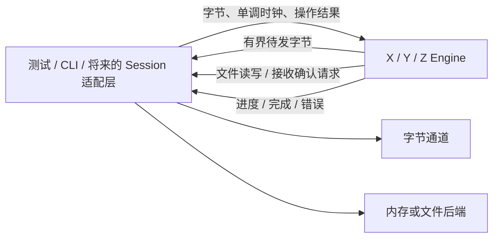

# P9：XMODEM / YMODEM / ZMODEM 文件传输协议

**状态：协议库已实现；Linux 六项专项测试、ASan/UBSan 与独立对端 124 项互通通过；两个 lrzsz 上游缺陷用例跳过，Windows/macOS 与串口接线待完成（2026-10-04）**

> **范围说明**：本阶段先独立实现 XMODEM、YMODEM、ZMODEM 的双向文件传输。
> 三个协议完成测试与独立对端互通后，再设计串口终端接线；Session、Transport
> 与 UI 接入不在当前实施范围内。
> 初稿：2026-10-03；文档格式与阶段索引同步：2026-10-04。

## 目标

建立独立于终端和串口的文件传输协议库，支持 XMODEM、YMODEM、ZMODEM
双向传输。**先实现三个协议，再考虑串口终端接线。**

因此第一阶段交付的是可独立构建、测试和复用的文件传输协议库，而不是
串口功能。先按 XMODEM → YMODEM → ZMODEM 顺序实现，共享必要的基础设施，
三个协议均完成双向测试与独立对端互通后，才单独设计 Session/串口/UI 接入。

当前阶段不修改 SerialTransport、SessionInputPump、SessionInputArbiter、
TerminalSession、TerminalView、会话配置和历史记录；不增加菜单、自动探测、
文件选择框或串口 worker。协议库不依赖 Qt、libvterm、串口设备或 UI。

以下协议变体、默认值和接口是建议设计。协议“支持”必须说明具体变体，
不能用一个协议名称掩盖缺失的收发能力。

## 架构与文件级变更清单

本阶段遵守 C++17、CMake ≥ 3.20、中文 Doxygen/注释、RAII、有界缓存和取消语义。

建议新增 `src/filetransfer/`，独立于终端核心和 Session 层：

| 文件 | 职责 |
| --- | --- |
| `TransferTypes.h` | 协议、方向、配置、错误、文件元信息、进度、操作标识 |
| `ITransferEngine.h` | 三个协议共用的非阻塞事件接口 |
| `Checksum.h/.cpp` | 8 位 checksum、CRC16/XMODEM、ZMODEM CRC16/CRC32 |
| `XyPacketCodec.h/.cpp` | SOH/STX 数据包、包号反码、校验及跨分片解析 |
| `XmodemEngine.h/.cpp` | XMODEM 单文件收发、握手、重传、结束、取消 |
| `YmodemEngine.h/.cpp` | YMODEM block 0、文件批次、精确长度和收尾 |
| `ZmodemCodec.h/.cpp` | hex/binary16/binary32 头、ZDLE 和数据子包 |
| `ZmodemEngine.h/.cpp` | ZMODEM 协商、文件交换、偏移纠错和结束 |
| `CMakeLists.txt` | 独立 STATIC 库 `novaterm_filetransfer`，仅依赖标准库 |

X/Y 共用包编解码，不强行共用完整状态机；ZMODEM 自成引擎。
CRC16 的基础更新可复用，但协议的覆盖范围、最终处理和线上的字节顺序
由各自 Codec 明确决定，不能凭“都是 CRC16”直接共用帧尾编码。

根 CMake 仅添加子目录；库禁止 AUTOMOC/AUTOUIC/AUTORCC，
本阶段 NovaTerm 主程序不链接该库。独立构建命令为
`cmake -S src/filetransfer -B /tmp/novaterm-filetransfer-build`，
子目录只有被独立配置时才声明 project()/启用测试；作为根工程子目录时
不重复设置根工程策略。纯标准库测试可独立运行，不需要 Qt 安装。

新增目录后同步 ARCHITECTURE.md 目录映射，新增测试后同步 README/AGENTS；
不把尚未接线的串口传输写成已完成。提交仍遵守项目 PATCH 每提交加一规则。

## 实现重点

| 协议 | 首期必须支持 | 单独延期 |
| --- | --- | --- |
| XMODEM | 128 字节 checksum、128 字节 CRC、XMODEM-1K CRC；双向单文件 | 非标准扩展、协议自动识别 |
| YMODEM | 标准 batch，block 0 元信息，128/1024 字节数据包，CRC16；双向单/多文件 | YMODEM-G、非标准 bootloader 收尾 |
| ZMODEM | hex/binary16/binary32，CRC16/32，ZDLE，单/多文件，ZRPOS 纠错重传 | ZMODEM8K 完整扩展、跨连接续传、ZCOMMAND 执行 |

共同约束：二进制保真，计数使用 64 位，单文件小于 4 GiB，单批最多 256 文件，
累计元信息不超过 256 KiB。文件名按 UTF-8/ASCII 解析，单文件名最多 255 字节。
路径是否合法、如何命名/覆盖、是否写临时文件，由宿主文件适配层负责。
协议库不打开路径、不创建目录、不执行命令。

### XMODEM

- 接收端根据显式配置发送 NAK（checksum）或 `C`（CRC）。发送端根据
  对端初始 NAK/`C` 选择校验；1K 模式收到 NAK 时退回 128 字节 checksum，
  不发送 1K checksum 包。接收模式不暗中从 CRC 降级；调用方可配置降级策略。
- SOH 表示 128 字节，STX 表示 1024 字节；数据块从序号 1 开始，
  按模 256 回绕。序号反码和校验都必须正确。
- 收到当前预期包才提交文件数据；上一包的有效重复包重新 ACK，
  不重复写入、不重复增加进度；其余包号按错误处理。
- 接收 1K 模式允许 SOH/STX 混合，末包填充默认 0x1A。
  控制字节出现在 payload 内是数据，不能当 ACK/EOT/CAN 处理。
- 支持有效 EOT 后 ACK 的结束流程；ACK 丢失时在有限收尾窗口内响应重复 EOT。
  本机取消发送至少两个 CAN，接收取消要求连续两个 CAN，单 CAN 不立即取消。
- **XMODEM 不携带文件名和真实长度。** 接收方必须由调用方提供目标标识；
  未提供 expectedSize 时保留全部包内容，不能删除末尾 0x1A/0x00 来猜长度。
  提供 expectedSize 时只提交声明长度，检查数据不足/多余完整包，最终包内
  合法填充不计入文件。发送空文件可直接结束；未知大小接收无法区分真实尾部
  与填充，结果明确标记 lengthKnown=false。

### YMODEM

- 基于 X/Y 包 Codec，实现完整 batch，不能把 XMODEM-1K 称为 YMODEM。
- block 0 含 NUL 终止文件名和可选 ASCII 元信息；已知大小的发送任务必须
  发送十进制真实长度。接收检查长度溢出、缺少 NUL、非法元信息和预算超限。
- 接收元信息后 ACK，再发 `C` 请求数据；每文件数据序号重新从 1 开始，
  包号回绕为 0 时仍是数据，只有处于等待元信息态才把 block 0 当文件头。
- 已声明长度时精确裁剪最后一包填充，不按内容剥离；长度缺失则保留完整
  包数据并报告未知长度，不能将“未提供长度”解释为空文件。
- 标准结束为 EOT → NAK → EOT → ACK，再发 `C` 等待下一文件头；
  发送端兼容对端第一次 EOT 就 ACK 的响应。接收端默认使用标准双 EOT。
- 空文件名的 block 0 表示批次结束，不是一个空文件；有文件名且大小 0
  表示空文件，仍执行文件结束流程。重复文件头/重复 EOT 不创建重复文件。
- 无 YMODEM-G 流式模式；收到 `G` 返回 UnsupportedVariant，不冒充已支持。
  不自动退回 ZMODEM，不无提示切换协议。

### ZMODEM

- 支持初始化、ZSINIT、ZFILE/ZDATA/ZEOF/ZFIN，以及 ZRPOS/ZACK/ZNAK/ZSKIP
  等本范围必需协商与错误反馈。不声明尚未实现的能力。
- ZDLE 转义、CRC 和解析状态跨输入分片保持；数据子包末标记参与 CRC。
  发送从 1 KiB 子包起步，接收子包最多 8 KiB，元信息最多 4 KiB。
- 接收位置以宿主确认成功提交的连续偏移为准；CRC 错误不得提交文件数据。
  ZRPOS 触发对应偏移的重新读取，计数不把重传算作新增有效数据。
- 发送有限窗口，不超过 16 KiB，使用确认点；接收宣告有限容量并为在途
  数据预留空间。协议不能靠扩大无限缓存吸收慢文件后端。
- 按状态处理 ZFIN 交换及 `OO` 收尾；返回实际消费字节数，
  末帧后同一输入块的尾随字节留给调用方，payload 内的 `OO` 不触发结束。
- ZCOMMAND 明确拒绝；不执行远端命令。不从上次任务或连接的文件续传。

协议依据：
[Chuck Forsberg 的 XMODEM/YMODEM 协议参考](https://bitspassats.com/helwie/pdf/XMODEM_YMODEM%20Protocol%20Reference.pdf)、
[ZMODEM 原始说明](https://www.tuhs.org/Usenet/comp.sources.unix/1986-May/004372.html)、
[Tera Term ZMODEM 说明](https://github.com/TeraTermProject/teraterm/wiki/ZMODEM-Protocol)。
对端命令与变体依据：[lrzsz 发送手册](https://raw.githubusercontent.com/UweOhse/lrzsz/master/man/lsz.1)、
[接收手册](https://raw.githubusercontent.com/UweOhse/lrzsz/master/man/lrz.1)。

## 数据流与接口契约



引擎单线程驱动，不自建线程、不阻塞等待、不使用 wall clock、不调用
QSerialPort/QObject/QFile。宿主控制 transport、文件、线程和任务生命周期。
建议统一接口如下，最终实施计划需锁定各值对象字段：

- `start(const TransferRequest&, TimePoint now)`：显式选择协议、方向和配置。
- `consume(ByteView input, TimePoint now) -> ConsumeResult`：报告消费字节数、
  是否等待宿主/输出空间；不能把未消费数据悄悄丢弃。
- `advance(TimePoint now)` 与 `nextDeadline()`：确定性虚拟时钟测试，
  宿主用单次定时器驱动，不固定轮询。
- `pendingOutput() -> ByteView` 与 `acknowledgeOutput(size_t accepted, now)`：
  非 owning 视图在下一次变更前有效；只删除通道已接受的前缀，保留部分写后缀。
- `takeAction() -> optional<TransferAction>`：取得一个有界文件/状态动作；
  `completeOperation(OperationId, OperationResult, now)`：反馈宿主操作结果。
- `cancel(now)`：停止生成新文件数据，产生取消控制字节并进行有界收尾。

文件动作为 OfferFile、ReadAt、WriteAt、FinishFile；宿主明确接受/拒绝 OfferFile。
XMODEM 的接收目标由请求提供；Y/Z 从文件头提供元信息。OperationId 携带
任务标识和单调序号；过期结果不能改变新任务。每实例同一时间只运行一个任务。

WriteAt 成功后才 ACK 或推进已提交偏移。FinishFile 成功后才宣告该文件成功；
宿主可将其映射为临时文件的提交操作。引擎分别统计 submitted/confirmed
字节和重传次数，不把通道接收字节等同于对端已接收的文件字节。
XMODEM 无 ACK 偏移，只能按已 ACK 数据块和已知真实长度计算发送进度。

不追求协议终止后立即销毁引擎：有限 Closing 状态吸收重复结束帧并重发
必要 ACK，完成后返回尾随未消费字节。后续 Session 接线需考虑此收尾窗口。

## 背压、预算与超时

| 对象 | 建议上限 / 默认值 |
| --- | --- |
| X/Y 单包 | payload 最多 1024 字节，加协议头尾 |
| Z 数据子包 / 元信息 | 8 KiB / 4 KiB |
| 输入暂存 | 每引擎最多 64 KiB，超出时返回未消费后缀 |
| 编码待发缓存 | 每引擎最多 64 KiB，包括转义后字节 |
| 待处理动作 | 最多 16 项；累计拥有的 payload 最多 256 KiB |
| 未完成文件 I/O | 每引擎最多 1 个，避免有序写入变成乱序完成 |
| 握手总期限 | 30 秒 |
| 握手重试间隔 | 3 秒，总期限不被重复无进展字节延长 |
| 分片包等待 / ACK 等待 | 10 秒，宿主可按实际链路速率调大 |
| 连续无进展重试 | 最多 10 次，真实提交/确认推进才重置 |
| 宿主文件操作等待 | 30 秒后任务失败；过期结果忽略 |
| 结束重复响应窗口 | 3 秒，有限重发，不延长为无限等待 |

接收包号回绕不重置总字节计数；超时计数不以任意噪声作为进展。
发送 ACK deadline 在该包全部交给通道后启用，不能在尚未接受输出时就重发。
通道暂存/物理排空延迟由宿主计入配置；库没有波特率或 UART 停发假设。
输出暂时无法接受、动作队列满时停止推进，保留状态，不无限生成动作。
宿主保证整个通道链路的积压也有界，库内部上限不能证明宿主队列有界。

## 测试

协议库使用内存后端作为默认测试宿主；独立 CLI 使用临时目录文件后端，
只作为互通工具，不作为 NovaTerm 产品终端入口。

二进制语料包括 0x00–0xFF 全字节、末尾真实 0x1A/0x00、空文件、
127/128/129/1023/1024/1025 字节、超过包号回绕的文件和多文件批次。

Y/Z 和提供 expectedSize 的 XMODEM 按原始 SHA-256 比较。
未知长度 XMODEM 按“原始内容 + 协议约定填充”比较，单独断言保留真实尾部；
不能要求它从线上恢复不存在的长度信息。未知大小 YMODEM 同样报告完整包长度。

错误测试包括任意分片、合并包、延迟、checksum/CRC 错误、反码错误、
重复包、ACK 丢失、非法序号、EOT/CAN 出现在 payload、重复结束、
畸形元信息、长度溢出、宿主短读/失败、取消和迟到操作结果。
故障注入按协议状态进行，随机种子固定，等待使用虚拟时钟。

## 落地实现步骤

下面的步骤按依赖顺序排列。每一步保持协议库可独立构建、可测试；
进入下一协议实现前完成当前协议的局部测试与双向互通。

### 步骤 0：冻结协议边界并建立共享基础

涉及文件：`TransferTypes.h`、`ITransferEngine.h`、`Checksum.h/.cpp`、
`XyPacketCodec.h/.cpp`、`src/filetransfer/CMakeLists.txt`、根 CMake 和测试声明。

建立 `novaterm_filetransfer`，冻结事件、文件动作、时钟和部分写契约，
实现共享校验及 X/Y PacketCodec。补齐固定校验向量、包号反码、任意分片、
非法包长与输入/输出容量测试；确认纯标准库独立构建不需要 Qt。
该步骤不创建 Session/串口/UI 接口。

### 步骤 1：实现 XMODEM 收发

涉及文件：`XmodemEngine.h/.cpp`、`tests/filetransfer/XmodemTests.cpp`。
实现 XMODEM 三种模式的发送与接收；完成填充、包号回绕、重传与结束用例。
新增 `tests/filetransfer/XmodemTests.cpp`，注册 `novaterm_xmodem_tests`。
退出条件：无 Qt 独立构建，所有确定性测试通过，checksum/CRC/1K
各自与独立对端完成双向互通；不能只完成发送就进入下一阶段。

### 步骤 2：实现 YMODEM 批次传输

复用已验证 X/Y Codec，实现 block 0、精确长度、空文件、批次结束和双 EOT。
新增 `tests/filetransfer/YmodemTests.cpp`，注册 `novaterm_ymodem_tests`。
退出条件：双向单/多文件互通通过，重复头与序号回绕不重复写入，
文件尾部精确、批次结束可靠，缺失长度正确报告未知长度。

### 步骤 3：实现 ZMODEM 收发与纠错

新增独立 Codec/Engine，实现协商、转义、CRC16/32、ZRPOS、有限窗口与结束。
新增 `tests/filetransfer/ZmodemTests.cpp`，注册 `novaterm_zmodem_tests`。
退出条件：双向单/多文件互通通过，CRC16/32 都覆盖，
损坏包可恢复，重复反馈不会重复计数，结束尾随字节可交还宿主。

### 步骤 4：补齐三个协议的互通与跨平台验收

- 新增 `tests/filetransfer/InteropDriver.cpp` 和 `interop_check.py`，
  raw PTY/双向字节桥接，stderr 与协议通道分离，无串口依赖。
- 固定 lrzsz 0.12.20 来源和校验和；使用 sx/rx、sb/rb、sz/rz 或对应
  `--xmodem`/`--ymodem` 参数；按实际发布包帮助确认命令名和参数。
  XMODEM 接收需提供文件名，checksum 模式由接收端选择。
- 每种模式分别与 lrzsz 双向验收，不允许其自动回退其他协议造成假通过。
  夹具记录选中模式和握手，故障恢复另用可控对端验证。
- 测试工具缺失标记未运行；确定性单测默认注册，外部对端互通显式运行，
  不把工具缺失或跳过写成“互通通过”。
- Windows/Linux 分别独立构建库和单测；Linux 先完成 lrzsz 互通。
  Windows 独立对端互通若无可运行工具则保留为缺口，不以 Linux 代替。
- 新增 `novaterm_filetransfer_no_qt_link_check`，只链接此库，构造三种引擎，
  执行启动/字节输入/取消，证明无 Qt 和终端依赖。
- 用 ASan/UBSan 验证解析与生命周期；至少 100 次开始/取消/重建循环，
  检查所有内部队列和 payload 不超预算。

## 退出标准

本阶段完成必须同时满足步骤 0～4 的验收条目。三种协议单测均通过，
Linux 独立互通模式全覆盖，Windows 构建/单测通过；Windows 对端互通缺口
必须单列，不能写成全面跨平台验收完成。

测试只跑新协议目标及其共享基础测试。若根 CMake 改动仅添加独立库/目标，
不改变已有编译策略/Qt/第三方依赖，不因此运行无关测试；真正改变公共构建
选项或跨模块接口时再按 AGENTS 规则扩大回归。

## 实施禁止项

- 禁止在协议库中引入 Qt、libvterm、QSerialPort 或 UI 依赖。
- 禁止协议引擎直接打开文件路径、创建线程、阻塞等待或执行远端命令。
- 禁止本阶段修改生产 Session/Transport/TerminalView 或增加串口功能入口。
- 禁止无界缓存、无限重试，或丢弃未消费输入和部分写后缀。
- 禁止按内容剥离 XMODEM 尾部填充、重复包重复落盘或提前报告文件成功。
- 禁止用两个自研引擎互测替代独立对端互通，或把未运行验收写成通过。

## 实现进度

| 步骤 | 状态 | 剩余工作 |
| --- | --- | --- |
| 0 共享基础与构建边界 | 已实现并通过 Linux 测试 | Windows/macOS 构建待验证 |
| 1 XMODEM | 已实现；checksum/CRC/1K Linux 双向互通通过 | Windows/macOS 对端验收 |
| 2 YMODEM | 已实现；Linux 单文件/批次双向互通通过 | Windows/macOS 对端验收 |
| 3 ZMODEM | 已实现；Linux CRC16/32 双向互通通过 | 原始 lrzsz 0.12.20 的两个 CRC16 空文件发送缺陷用例未通过独立对端验收 |
| 4 协议验收 | Linux 六项专项、无 Qt 链接、ASan/UBSan 与 124 项独立互通通过 | LeakSanitizer 受环境限制；Windows/macOS 与真实 UART 未验收 |

## 后续串口接线边界

本节只保留已发现的约束，**不属于当前实现任务**，接口和 UI 待协议完成后设计。

- 仍只在 SessionInputPump 的唯一入站通路分流，协议数据先于 VT/交互标记解析。
- X/Y 需用户明确选择协议和方向；不能根据普通文本中的 `C`/NAK 自动启动。
  ZMODEM 可另设计完整合法头/CRC 探测与误匹配回放。
- 出站需 SessionInputArbiter 独占、Core 输入输出屏障、部分写反馈和取消收尾；
  不能另开串口，不能让键盘字节混入协议。
- X/Y 要求 8 位透明通道，不使用会吞掉有效 payload 的软件流控；
  ZMODEM 的转义与软件流控兼容另验收。
  依据：[Tera Term XMODEM 串口要求](https://teratermproject.github.io/manual/4/en/usage/tips/xmodem.html)。
- Session 拥有控制器，UI 单向调用 Session；断连使旧协议任务失效，
  自动重连不恢复旧文件传输。
- 真实 UART 吞吐、拔线恢复、终端文本恢复和 Ela 界面均属后续验收，
  独立字节桥接测试不能替代。

## 剩余工作

协议实现与 Linux 验证记录见下节。剩余工作为 Windows/macOS 构建与对端验收、
受上游缺陷阻塞的 CRC16 空文件独立互通、可用环境的 LeakSanitizer 验证。
串口接线另行设计；当前没有终端菜单或串口文件传输入口。


## 2026-10-04 实现与验证记录

### 当前代码事实

- `src/filetransfer/` 已建立纯 C++17 STATIC 库，不链接 Qt、Core 或 Transport。
  公共头仅复用标准库 `CoreTypes.h` 的 ByteView；引擎不创建线程或访问文件系统。
- `EngineSupport` 提供有界输出、部分写前缀确认、唯一在途文件动作、
  单调操作标识、超时及取消。比设计允许的最多 16 个动作更严格，实际只允许
  一个未完成文件动作，保持文件提交顺序。UTF-8 文件标识在边界验证。
- X/Y PacketCodec 与各自收发状态机、Z Codec/状态机均落地。Y 发送常规使用
  1024 字节数据包，末包有效数据不超过 128 字节时使用 SOH；接收支持两种。
  不支持 STX+checksum、YMODEM-G 或 ZCOMMAND 执行。
- X/Y 未知长度保留末包；已知长度按声明裁剪。Z 按已提交偏移纠错，
  有效数据和重传分别记账，不提供跨任务续传。
- 根工程排除 filetransfer 的源码 GLOB，主程序未接入协议库；
  `tests/filetransfer/CMakeLists.txt` 与独立构建共用六个测试声明。

### 已运行验证

环境：Linux x86_64，GCC 13.3.0，CMake 3.28.3，Debug，C++17；
本节是字节桥接与内存/临时文件宿主验证，不是串口性能验收。

| 验证 | 结果 | 入口/证据 |
| --- | --- | --- |
| 独立 CMake 构建及严格警告 | 通过 | `cmake -S src/filetransfer -B <build>`；`-Wall -Wextra -Wpedantic -Werror` |
| 六个协议专项 CTest | 6/6 通过 | checksum、support、X、Y、Z、no-Qt link check |
| 根工程配置与新增目标构建 | 通过 | `ctest --test-dir <root-build> -L filetransfer`，6/6 |
| GCC 13 `-fanalyzer` | 未作为通过项 | std::vector 标准库赋值的最小例也复现 null/uninitialized 诊断，分析结果无法作为项目结论 |
| ASan + UBSan | 6/6 通过，无报告 | `-fsanitize=address,undefined -fno-sanitize-recover=all`；`ASAN_OPTIONS=detect_leaks=0` |
| 无 Qt 链接 | 通过 | `novaterm_filetransfer_no_qt_link_check` 只链接协议库，ldd 无 Qt；三引擎 100 次生命周期 |
| 原始 lrzsz 0.12.20 大文件互通 | 124 PASS，2 SKIP | 三种 X 模式、Y、Z CRC16/32 双向；0～10 MiB、全字节、真实尾部、中文名、多文件 |
| 独立代码审查 | 发现项已修复并复验 | 延迟 ACK、文件完成期限、ZCHALLENGE 重传包保护均有回归测试 |

GCC 13 的额外 `-fanalyzer` 检查未得到可判定结果：仅包含 string、optional、
vector 的标准值类型赋值也复现同类诊断。常规严格编译警告仍全部通过，
未降低工程警告策略；该静态分析不计入通过项。
LeakSanitizer 在本环境报 ptrace 限制，未将泄漏检测记为通过。
Windows/macOS 未运行，真实 UART、吞吐水位及终端 UI 也未验收。

### 独立对端与夹具

lrzsz 发布包来源：`https://ohse.de/uwe/releases/lrzsz-0.12.20.tar.gz`。
SHA-256：`c28b36b14bddb014d9e9c97c52459852f97bd405f89113f30bee45ed92728ff1`。
源码和编译产物仅在 `/tmp` 中，未新增产品依赖、未安装到系统、未修改上游源码。

互通驱动仅在 Linux 构建：

```bash
python3 tests/filetransfer/interop_check.py \
  --driver <build>/tests/novaterm_filetransfer_interop_driver \
  --lrzsz-dir <lrzsz-build>/src \
  --large --skip-known-lrzsz-bugs
```

根工程构建时 driver 在 `<build>/bin/`，独立构建时在 `<build>/tests/`。
输出分别报告 PASS/SKIP，工具缺失返回错误，不假装已经运行。
所有接收/发送文件位于临时目录，不连接用户串口或服务器。

driver 一端经 raw PTY，对端用 socketpair 做透明字节桥接。原因是原始 lrzsz
`rbsb.c` 恢复终端时调用 `tcflush(TCIOFLUSH)`，会删除 PTY master 尚未消费的
最后 ACK。夹具绕开该清理副作用，不补造 ACK，也不改协议实现。

两个显式 SKIP 是 Z CRC16 的空文件接收与含空文件批次接收：原始发布包
`zm.c::zsdata()` 在 length=0 时仍执行 do/while，并对 size_t 做减一，
下溢后越界读取。库的空文件收发由确定性测试覆盖，但上述两个原始对端用例
不能算作通过。跳过只在显式选项且对端版本确认为 0.12.20 时启用。

### 回归边界

已用 RED→GREEN 验证：未排空输出的旧 ACK 不得确认新数据/头/EOT；
匹配的文件结果在期限后到达也必须失败；ZCHALLENGE 的旁路 ZACK 不得替换
在途文件/数据的重传包；Closing 期限不得被重复帧无限续延。
X/Y 的 ACK 不携带包号，未宣称能识别所有已排空后的任意迟到 ACK；
宿主必须按事件顺序交付字节，不在新数据发送后回放旧反馈。

本轮只构建并运行新增协议目标，没有运行无关终端/渲染/密钥环测试，
提交版本为 NovaTerm 0.2.55。后续接线仍需按 P6 的单通路与生命周期约束单独验收。
