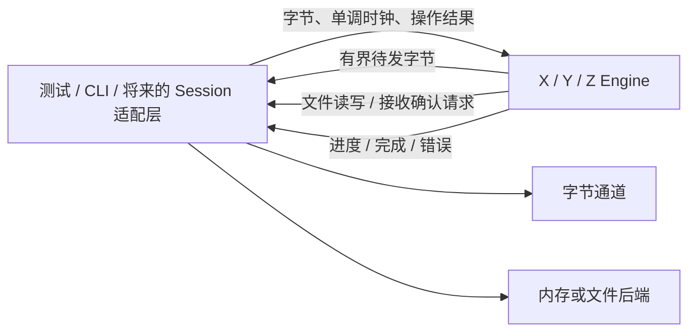
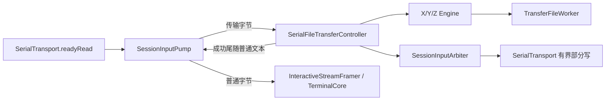

# P9：XMODEM / YMODEM / ZMODEM 文件传输协议

**状态：协议库及串口 Session/手动传输窗口已接入；Linux 纯协议、门面、UI 与真实 QSerialPort/raw PTY 通路测试通过；Windows 取消发布竞争用例有已知失败，macOS 与真实 UART 文件传输验收待补（2026-10-07 收尾复核）**

> **范围说明**：本阶段先独立实现 XMODEM、YMODEM、ZMODEM 的双向文件传输。
> 2026-10-04 的首期独立协议实现记录保留在下文；随后已接入 Session、
> 串口通道与 Ela 手动传输窗口。当前接线事实以文末“串口终端接线”一节
> 和源码为准，自动探测握手与自动注入设备命令不在当前范围内。
> 初稿：2026-10-03；文档格式与阶段索引同步：2026-10-04。

## 目标

建立独立于终端和串口的文件传输协议库，支持 XMODEM、YMODEM、ZMODEM
双向传输。**先实现三个协议，再考虑串口终端接线。**

因此第一阶段交付的是可独立构建、测试和复用的文件传输协议库，而不是
串口功能。先按 XMODEM → YMODEM → ZMODEM 顺序实现，共享必要的基础设施，
三个协议均完成双向测试与独立对端互通后，才单独设计 Session/串口/UI 接入。

首期独立协议阶段没有修改 Session、Transport 或 UI；随后通过 Qt 门面完成
串口接线。纯协议库继续不依赖 Qt、libvterm、串口设备或 UI；菜单、
文件选择与异步文件 worker 都属于门面及以上，不移入协议库。

以下协议变体、默认值和接口是建议设计。协议“支持”必须说明具体变体，
不能用一个协议名称掩盖缺失的收发能力。

## 架构与文件级变更清单

本阶段遵守 C++17、CMake ≥ 3.20、中文 Doxygen/注释、RAII、有界缓存和取消语义。

建议新增 `src/filetransfer/`，独立于终端核心和 Session 层：

| 文件 | 职责 |
| --- | --- |
| `TransferTypes.h` | 协议、方向、配置、错误、文件元信息、进度、操作标识 |
| `ITransferEngine.h` | 三个协议共用的非阻塞事件接口 |
| `Checksum.h/.cpp` | 8 位 checksum、CRC16/XMODEM、ZMODEM CRC16/CRC32 |
| `XyPacketCodec.h/.cpp` | SOH/STX 数据包、包号反码、校验及跨分片解析 |
| `XmodemEngine.h/.cpp` | XMODEM 单文件收发、握手、重传、结束、取消 |
| `YmodemEngine.h/.cpp` | YMODEM block 0、文件批次、精确长度和收尾 |
| `ZmodemCodec.h/.cpp` | hex/binary16/binary32 头、ZDLE 和数据子包 |
| `ZmodemEngine.h/.cpp` | ZMODEM 协商、文件交换、偏移纠错和结束 |
| `CMakeLists.txt` | 独立 STATIC 库 `novaterm_filetransfer`，仅依赖标准库 |

X/Y 共用包编解码，不强行共用完整状态机；ZMODEM 自成引擎。
CRC16 的基础更新可复用，但协议的覆盖范围、最终处理和线上的字节顺序
由各自 Codec 明确决定，不能凭“都是 CRC16”直接共用帧尾编码。

根 CMake 仅添加子目录；库禁止 AUTOMOC/AUTOUIC/AUTORCC，
主程序通过 `novaterm_serial_transfer` Qt 门面链接该库。独立构建命令为
`cmake -S src/filetransfer -B /tmp/novaterm-filetransfer-build`，
子目录只有被独立配置时才声明 project()/启用测试；作为根工程子目录时
不重复设置根工程策略。纯标准库测试可独立运行，不需要 Qt 安装。

新增目录后同步 ARCHITECTURE.md 目录映射，新增测试后同步 README/AGENTS；
协议实现、串口接线与各平台实机验收分别记录，不互相替代。提交仍遵守项目 PATCH 每提交加一规则。

## 实现重点

| 协议 | 首期必须支持 | 单独延期 |
| --- | --- | --- |
| XMODEM | 128 字节 checksum、128 字节 CRC、XMODEM-1K CRC；双向单文件 | 非标准扩展、协议自动识别 |
| YMODEM | 标准 batch，block 0 元信息，128/1024 字节数据包，CRC16；双向单/多文件 | YMODEM-G、非标准 bootloader 收尾 |
| ZMODEM | hex/binary16/binary32，CRC16/32，ZDLE，单/多文件，ZRPOS 纠错重传 | ZMODEM8K 完整扩展、跨连接续传、ZCOMMAND 执行 |

共同约束：二进制保真，计数使用 64 位，单文件小于 4 GiB，单批最多 256 文件，
累计元信息不超过 256 KiB。文件名按 UTF-8/ASCII 解析，单文件名最多 255 字节。
路径是否合法、如何命名/覆盖、是否写临时文件，由宿主文件适配层负责。
协议库不打开路径、不创建目录、不执行命令。

### XMODEM

- 接收端根据显式配置发送 NAK（checksum）或 `C`（CRC）。发送端根据
  对端初始 NAK/`C` 选择校验；1K 模式收到 NAK 时退回 128 字节 checksum，
  不发送 1K checksum 包。接收模式不暗中从 CRC 降级；调用方可配置降级策略。
- SOH 表示 128 字节，STX 表示 1024 字节；数据块从序号 1 开始，
  按模 256 回绕。序号反码和校验都必须正确。
- 收到当前预期包才提交文件数据；上一包的有效重复包重新 ACK，
  不重复写入、不重复增加进度；其余包号按错误处理。
- 接收 1K 模式允许 SOH/STX 混合，末包填充默认 0x1A。
  控制字节出现在 payload 内是数据，不能当 ACK/EOT/CAN 处理。
- 支持有效 EOT 后 ACK 的结束流程；ACK 丢失时在有限收尾窗口内响应重复 EOT。
  本机取消发送至少两个 CAN，接收取消要求连续两个 CAN，单 CAN 不立即取消。
- **XMODEM 不携带文件名和真实长度。** 接收方必须由调用方提供目标标识；
  未提供 expectedSize 时保留全部包内容，不能删除末尾 0x1A/0x00 来猜长度。
  提供 expectedSize 时只提交声明长度，检查数据不足/多余完整包，最终包内
  合法填充不计入文件。发送空文件可直接结束；未知大小接收无法区分真实尾部
  与填充，结果明确标记 lengthKnown=false。

### YMODEM

- 基于 X/Y 包 Codec，实现完整 batch，不能把 XMODEM-1K 称为 YMODEM。
- block 0 含 NUL 终止文件名和可选 ASCII 元信息；已知大小的发送任务必须
  发送十进制真实长度。接收检查长度溢出、缺少 NUL、非法元信息和预算超限。
- 接收元信息后 ACK，再发 `C` 请求数据；每文件数据序号重新从 1 开始，
  包号回绕为 0 时仍是数据，只有处于等待元信息态才把 block 0 当文件头。
- 已声明长度时精确裁剪最后一包填充，不按内容剥离；长度缺失则保留完整
  包数据并报告未知长度，不能将“未提供长度”解释为空文件。
- 标准结束为 EOT → NAK → EOT → ACK，再发 `C` 等待下一文件头；
  发送端兼容对端第一次 EOT 就 ACK 的响应。接收端默认使用标准双 EOT。
- 空文件名的 block 0 表示批次结束，不是一个空文件；有文件名且大小 0
  表示空文件，仍执行文件结束流程。重复文件头/重复 EOT 不创建重复文件。
- 无 YMODEM-G 流式模式；收到 `G` 返回 UnsupportedVariant，不冒充已支持。
  不自动退回 ZMODEM，不无提示切换协议。

### ZMODEM

- 支持初始化、ZSINIT、ZFILE/ZDATA/ZEOF/ZFIN，以及 ZRPOS/ZACK/ZNAK/ZSKIP
  等本范围必需协商与错误反馈。不声明尚未实现的能力。
- ZDLE 转义、CRC 和解析状态跨输入分片保持；数据子包末标记参与 CRC。
  发送从 1 KiB 子包起步，接收子包最多 8 KiB，元信息最多 4 KiB。
- 接收位置以宿主确认成功提交的连续偏移为准；CRC 错误不得提交文件数据。
  ZRPOS 触发对应偏移的重新读取，计数不把重传算作新增有效数据。
- 发送有限窗口，不超过 16 KiB，使用确认点；接收宣告有限容量并为在途
  数据预留空间。协议不能靠扩大无限缓存吸收慢文件后端。
- 按状态处理 ZFIN 交换及 `OO` 收尾；返回实际消费字节数，
  末帧后同一输入块的尾随字节留给调用方，payload 内的 `OO` 不触发结束。
- ZCOMMAND 明确拒绝；不执行远端命令。不从上次任务或连接的文件续传。

协议依据：
[Chuck Forsberg 的 XMODEM/YMODEM 协议参考](https://bitspassats.com/helwie/pdf/XMODEM_YMODEM%20Protocol%20Reference.pdf)、
[ZMODEM 原始说明](https://www.tuhs.org/Usenet/comp.sources.unix/1986-May/004372.html)、
[Tera Term ZMODEM 说明](https://github.com/TeraTermProject/teraterm/wiki/ZMODEM-Protocol)。
对端命令与变体依据：[lrzsz 发送手册](https://raw.githubusercontent.com/UweOhse/lrzsz/master/man/lsz.1)、
[接收手册](https://raw.githubusercontent.com/UweOhse/lrzsz/master/man/lrz.1)。

## 数据流与接口契约



引擎单线程驱动，不自建线程、不阻塞等待、不使用 wall clock、不调用
QSerialPort/QObject/QFile。宿主控制 transport、文件、线程和任务生命周期。
建议统一接口如下，最终实施计划需锁定各值对象字段：

- `start(const TransferRequest&, TimePoint now)`：显式选择协议、方向和配置。
- `consume(ByteView input, TimePoint now) -> ConsumeResult`：报告消费字节数、
  是否等待宿主/输出空间；不能把未消费数据悄悄丢弃。
- `advance(TimePoint now)` 与 `nextDeadline()`：确定性虚拟时钟测试，
  宿主用单次定时器驱动，不固定轮询。
- `pendingOutput() -> ByteView` 与 `acknowledgeOutput(size_t accepted, now)`：
  非 owning 视图在下一次变更前有效；只删除通道已接受的前缀，保留部分写后缀。
- `takeAction() -> optional<TransferAction>`：取得一个有界文件/状态动作；
  `completeOperation(OperationId, OperationResult, now)`：反馈宿主操作结果。
- `cancel(now)`：停止生成新文件数据，产生取消控制字节并进行有界收尾。

文件动作为 OfferFile、ReadAt、WriteAt、FinishFile；宿主明确接受/拒绝 OfferFile。
XMODEM 的接收目标由请求提供；Y/Z 从文件头提供元信息。OperationId 携带
任务标识和单调序号；过期结果不能改变新任务。每实例同一时间只运行一个任务。

WriteAt 成功后才 ACK 或推进已提交偏移。FinishFile 成功后才宣告该文件成功；
宿主可将其映射为临时文件的提交操作。引擎分别统计 submitted/confirmed
字节和重传次数，不把通道接收字节等同于对端已接收的文件字节。
XMODEM 无 ACK 偏移，只能按已 ACK 数据块和已知真实长度计算发送进度。

不追求协议终止后立即销毁引擎：有限 Closing 状态吸收重复结束帧并重发
必要 ACK，完成后返回尾随未消费字节。后续 Session 接线需考虑此收尾窗口。

## 背压、预算与超时

| 对象 | 建议上限 / 默认值 |
| --- | --- |
| X/Y 单包 | payload 最多 1024 字节，加协议头尾 |
| Z 数据子包 / 元信息 | 8 KiB / 4 KiB |
| 输入暂存 | 每引擎最多 64 KiB，超出时返回未消费后缀 |
| 编码待发缓存 | 每引擎最多 64 KiB，包括转义后字节 |
| 待处理动作 | 最多 16 项；累计拥有的 payload 最多 256 KiB |
| 未完成文件 I/O | 每引擎最多 1 个，避免有序写入变成乱序完成 |
| 握手总期限 | 30 秒 |
| 握手重试间隔 | 3 秒，总期限不被重复无进展字节延长 |
| 分片包等待 / ACK 等待 | 10 秒，宿主可按实际链路速率调大 |
| 连续无进展重试 | 最多 10 次，真实提交/确认推进才重置 |
| 宿主文件操作等待 | 30 秒后任务失败；过期结果忽略 |
| 结束重复响应窗口 | 3 秒，有限重发，不延长为无限等待 |

接收包号回绕不重置总字节计数；超时计数不以任意噪声作为进展。
发送 ACK deadline 在该包全部交给通道后启用，不能在尚未接受输出时就重发。
通道暂存/物理排空延迟由宿主计入配置；库没有波特率或 UART 停发假设。
输出暂时无法接受、动作队列满时停止推进，保留状态，不无限生成动作。
宿主保证整个通道链路的积压也有界，库内部上限不能证明宿主队列有界。

## 测试

协议库使用内存后端作为默认测试宿主；独立 CLI 使用临时目录文件后端，
只作为互通工具，不作为 NovaTerm 产品终端入口。

二进制语料包括 0x00–0xFF 全字节、末尾真实 0x1A/0x00、空文件、
127/128/129/1023/1024/1025 字节、超过包号回绕的文件和多文件批次。

Y/Z 和提供 expectedSize 的 XMODEM 按原始 SHA-256 比较。
未知长度 XMODEM 按“原始内容 + 协议约定填充”比较，单独断言保留真实尾部；
不能要求它从线上恢复不存在的长度信息。未知大小 YMODEM 同样报告完整包长度。

错误测试包括任意分片、合并包、延迟、checksum/CRC 错误、反码错误、
重复包、ACK 丢失、非法序号、EOT/CAN 出现在 payload、重复结束、
畸形元信息、长度溢出、宿主短读/失败、取消和迟到操作结果。
故障注入按协议状态进行，随机种子固定，等待使用虚拟时钟。

## 落地实现步骤

下面的步骤按依赖顺序排列。每一步保持协议库可独立构建、可测试；
进入下一协议实现前完成当前协议的局部测试与双向互通。

### 步骤 0：冻结协议边界并建立共享基础

涉及文件：`TransferTypes.h`、`ITransferEngine.h`、`Checksum.h/.cpp`、
`XyPacketCodec.h/.cpp`、`src/filetransfer/CMakeLists.txt`、根 CMake 和测试声明。

建立 `novaterm_filetransfer`，冻结事件、文件动作、时钟和部分写契约，
实现共享校验及 X/Y PacketCodec。补齐固定校验向量、包号反码、任意分片、
非法包长与输入/输出容量测试；确认纯标准库独立构建不需要 Qt。
该步骤不创建 Session/串口/UI 接口。

### 步骤 1：实现 XMODEM 收发

涉及文件：`XmodemEngine.h/.cpp`、`tests/filetransfer/XmodemTests.cpp`。
实现 XMODEM 三种模式的发送与接收；完成填充、包号回绕、重传与结束用例。
新增 `tests/filetransfer/XmodemTests.cpp`，注册 `novaterm_xmodem_tests`。
退出条件：无 Qt 独立构建，所有确定性测试通过，checksum/CRC/1K
各自与独立对端完成双向互通；不能只完成发送就进入下一阶段。

### 步骤 2：实现 YMODEM 批次传输

复用已验证 X/Y Codec，实现 block 0、精确长度、空文件、批次结束和双 EOT。
新增 `tests/filetransfer/YmodemTests.cpp`，注册 `novaterm_ymodem_tests`。
退出条件：双向单/多文件互通通过，重复头与序号回绕不重复写入，
文件尾部精确、批次结束可靠，缺失长度正确报告未知长度。

### 步骤 3：实现 ZMODEM 收发与纠错

新增独立 Codec/Engine，实现协商、转义、CRC16/32、ZRPOS、有限窗口与结束。
新增 `tests/filetransfer/ZmodemTests.cpp`，注册 `novaterm_zmodem_tests`。
退出条件：双向单/多文件互通通过，CRC16/32 都覆盖，
损坏包可恢复，重复反馈不会重复计数，结束尾随字节可交还宿主。

### 步骤 4：补齐三个协议的互通与跨平台验收

- 新增 `tests/filetransfer/InteropDriver.cpp` 和 `interop_check.py`，
  raw PTY/双向字节桥接，stderr 与协议通道分离，无串口依赖。
- 固定 lrzsz 0.12.20 来源和校验和；使用 sx/rx、sb/rb、sz/rz 或对应
  `--xmodem`/`--ymodem` 参数；按实际发布包帮助确认命令名和参数。
  XMODEM 接收需提供文件名，checksum 模式由接收端选择。
- 每种模式分别与 lrzsz 双向验收，不允许其自动回退其他协议造成假通过。
  夹具记录选中模式和握手，故障恢复另用可控对端验证。
- 测试工具缺失标记未运行；确定性单测默认注册，外部对端互通显式运行，
  不把工具缺失或跳过写成“互通通过”。
- Windows/Linux 分别独立构建库和单测；Linux 先完成 lrzsz 互通。
  Windows 独立对端互通若无可运行工具则保留为缺口，不以 Linux 代替。
- 新增 `novaterm_filetransfer_no_qt_link_check`，只链接此库，构造三种引擎，
  执行启动/字节输入/取消，证明无 Qt 和终端依赖。
- 用 ASan/UBSan 验证解析与生命周期；至少 100 次开始/取消/重建循环，
  检查所有内部队列和 payload 不超预算。

## 退出标准

本阶段完成必须同时满足步骤 0～4 的验收条目。三种协议单测均通过，
Linux 独立互通模式全覆盖，Windows 构建/单测通过；Windows 对端互通缺口
必须单列，不能写成全面跨平台验收完成。

测试只跑新协议目标及其共享基础测试。若根 CMake 改动仅添加独立库/目标，
不改变已有编译策略/Qt/第三方依赖，不因此运行无关测试；真正改变公共构建
选项或跨模块接口时再按 AGENTS 规则扩大回归。

## 实施禁止项

- 禁止在协议库中引入 Qt、libvterm、QSerialPort 或 UI 依赖。
- 禁止协议引擎直接打开文件路径、创建线程、阻塞等待或执行远端命令。
- 禁止把 Session、Transport 或 UI 依赖加入纯协议库；串口接线只通过
  Session 门面和既有单一字节通路实现。
- 禁止无界缓存、无限重试，或丢弃未消费输入和部分写后缀。
- 禁止按内容剥离 XMODEM 尾部填充、重复包重复落盘或提前报告文件成功。
- 禁止用两个自研引擎互测替代独立对端互通，或把未运行验收写成通过。

## 实现进度

| 步骤 | 状态 | 剩余工作 |
| --- | --- | --- |
| 0 共享基础与构建边界 | 已实现并通过 Linux 测试 | Windows/macOS 构建待验证 |
| 1 XMODEM | 已实现；checksum/CRC/1K Linux 双向互通通过 | Windows/macOS 对端验收 |
| 2 YMODEM | 已实现；Linux 单文件/批次双向互通通过 | Windows/macOS 对端验收 |
| 3 ZMODEM | 已实现；Linux CRC16/32 双向互通通过 | 原始 lrzsz 0.12.20 的两个 CRC16 空文件发送缺陷用例未通过独立对端验收 |
| 4 协议验收 | Linux 六项专项、无 Qt 链接、ASan/UBSan 与 124 项独立互通通过 | LeakSanitizer 受环境限制；Windows/macOS 与真实 UART 未验收 |

## 串口接线边界

下列约束已经用于串口接线；具体实现与验证见文末增量记录。

- 仍只在 SessionInputPump 的唯一入站通路分流，协议数据先于 VT/交互标记解析。
- X/Y 需用户明确选择协议和方向；不能根据普通文本中的 `C`/NAK 自动启动。
  ZMODEM 可另设计完整合法头/CRC 探测与误匹配回放。
- 出站需 SessionInputArbiter 独占、Core 输入输出屏障、部分写反馈和取消收尾；
  不能另开串口，不能让键盘字节混入协议。
- X/Y 要求 8 位透明通道，不使用会吞掉有效 payload 的软件流控；
  ZMODEM 的转义与软件流控兼容另验收。
  依据：[Tera Term XMODEM 串口要求](https://teratermproject.github.io/manual/4/en/usage/tips/xmodem.html)。
- Session 拥有控制器，UI 单向调用 Session；断连使旧协议任务失效，
  自动重连不恢复旧文件传输。
- 真实 UART 吞吐、拔线恢复、终端文本恢复和 Ela 界面均属后续验收，
  独立字节桥接测试不能替代。

## 剩余工作

协议实现与 Linux 验证记录见下节。剩余工作为 Windows/macOS 构建与对端验收、
受上游缺陷阻塞的 CRC16 空文件独立互通、可用环境的 LeakSanitizer 验证。
串口接线已落地；剩余工作是 Windows 已知竞争用例复测/修复、macOS、
真实 UART 文件传输与原生文件选择器的人工验收。串口压力文本夹具的通过项
不能代替 X/Y/Z 文件传输验收。


## 2026-10-04 独立协议实现与验证记录

> 本节保留独立阶段的历史构建与验收，当前串口接线事实见下一节。

### 当时的代码事实

- `src/filetransfer/` 已建立纯 C++17 STATIC 库，不链接 Qt、Core 或 Transport。
  公共头仅复用标准库 `CoreTypes.h` 的 ByteView；引擎不创建线程或访问文件系统。
- `EngineSupport` 提供有界输出、部分写前缀确认、唯一在途文件动作、
  单调操作标识、超时及取消。比设计允许的最多 16 个动作更严格，实际只允许
  一个未完成文件动作，保持文件提交顺序。UTF-8 文件标识在边界验证。
- X/Y PacketCodec 与各自收发状态机、Z Codec/状态机均落地。Y 发送常规使用
  1024 字节数据包，末包有效数据不超过 128 字节时使用 SOH；接收支持两种。
  不支持 STX+checksum、YMODEM-G 或 ZCOMMAND 执行。
- X/Y 未知长度保留末包；已知长度按声明裁剪。Z 按已提交偏移纠错，
  有效数据和重传分别记账，不提供跨任务续传。
- 根工程排除 filetransfer 的源码 GLOB，主程序未接入协议库；
  `tests/filetransfer/CMakeLists.txt` 与独立构建共用六个测试声明。

### 已运行验证

环境：Linux x86_64，GCC 13.3.0，CMake 3.28.3，Debug，C++17；
本节是字节桥接与内存/临时文件宿主验证，不是串口性能验收。

| 验证 | 结果 | 入口/证据 |
| --- | --- | --- |
| 独立 CMake 构建及严格警告 | 通过 | `cmake -S src/filetransfer -B <build>`；`-Wall -Wextra -Wpedantic -Werror` |
| 六个协议专项 CTest | 6/6 通过 | checksum、support、X、Y、Z、no-Qt link check |
| 根工程配置与新增目标构建 | 通过 | `ctest --test-dir <root-build> -L filetransfer`，6/6 |
| GCC 13 `-fanalyzer` | 未作为通过项 | std::vector 标准库赋值的最小例也复现 null/uninitialized 诊断，分析结果无法作为项目结论 |
| ASan + UBSan | 6/6 通过，无报告 | `-fsanitize=address,undefined -fno-sanitize-recover=all`；`ASAN_OPTIONS=detect_leaks=0` |
| 无 Qt 链接 | 通过 | `novaterm_filetransfer_no_qt_link_check` 只链接协议库，ldd 无 Qt；三引擎 100 次生命周期 |
| 原始 lrzsz 0.12.20 大文件互通 | 124 PASS，2 SKIP | 三种 X 模式、Y、Z CRC16/32 双向；0～10 MiB、全字节、真实尾部、中文名、多文件 |
| 独立代码审查 | 发现项已修复并复验 | 延迟 ACK、文件完成期限、ZCHALLENGE 重传包保护均有回归测试 |

GCC 13 的额外 `-fanalyzer` 检查未得到可判定结果：仅包含 string、optional、
vector 的标准值类型赋值也复现同类诊断。常规严格编译警告仍全部通过，
未降低工程警告策略；该静态分析不计入通过项。
LeakSanitizer 在本环境报 ptrace 限制，未将泄漏检测记为通过。
Windows/macOS 未运行，真实 UART、吞吐水位及终端 UI 也未验收。

### 独立对端与夹具

lrzsz 发布包来源：`https://ohse.de/uwe/releases/lrzsz-0.12.20.tar.gz`。
SHA-256：`c28b36b14bddb014d9e9c97c52459852f97bd405f89113f30bee45ed92728ff1`。
源码和编译产物仅在 `/tmp` 中，未新增产品依赖、未安装到系统、未修改上游源码。

互通驱动仅在 Linux 构建：

```bash
python3 tests/filetransfer/interop_check.py \
  --driver <build>/tests/novaterm_filetransfer_interop_driver \
  --lrzsz-dir <lrzsz-build>/src \
  --large --skip-known-lrzsz-bugs
```

根工程构建时 driver 在 `<build>/bin/`，独立构建时在 `<build>/tests/`。
输出分别报告 PASS/SKIP，工具缺失返回错误，不假装已经运行。
所有接收/发送文件位于临时目录，不连接用户串口或服务器。

driver 一端经 raw PTY，对端用 socketpair 做透明字节桥接。原因是原始 lrzsz
`rbsb.c` 恢复终端时调用 `tcflush(TCIOFLUSH)`，会删除 PTY master 尚未消费的
最后 ACK。夹具绕开该清理副作用，不补造 ACK，也不改协议实现。

两个显式 SKIP 是 Z CRC16 的空文件接收与含空文件批次接收：原始发布包
`zm.c::zsdata()` 在 length=0 时仍执行 do/while，并对 size_t 做减一，
下溢后越界读取。库的空文件收发由确定性测试覆盖，但上述两个原始对端用例
不能算作通过。跳过只在显式选项且对端版本确认为 0.12.20 时启用。

### 回归边界

已用 RED→GREEN 验证：未排空输出的旧 ACK 不得确认新数据/头/EOT；
匹配的文件结果在期限后到达也必须失败；ZCHALLENGE 的旁路 ZACK 不得替换
在途文件/数据的重传包；Closing 期限不得被重复帧无限续延。
X/Y 的 ACK 不携带包号，未宣称能识别所有已排空后的任意迟到 ACK；
宿主必须按事件顺序交付字节，不在新数据发送后回放旧反馈。

本轮只构建并运行新增协议目标，没有运行无关终端/渲染/密钥环测试，
提交版本为 NovaTerm 0.2.55。后续接线仍需按 P6 的单通路与生命周期约束单独验收。


## 2026-10-07 串口终端接线收尾

### 当前实现与操作入口

接线实现随 `ce7793a` 进入生产代码。后续 `4788cf3` 将右键菜单合并为
“串口文件传输”（`Serial File Transfer…`），`1b5d5b6` 调整窗口初始宽度；
收尾保留这些改动，不恢复初稿的三个独立菜单入口。

1. 打开已连接的 8 数据位串口，在终端右键选择“串口文件传输”。
2. 在非模态窗口选择发送/接收及协议：XMODEM checksum、CRC、1K，
   YMODEM 或 ZMODEM。发送 X 只允许一个文件，Y/Z 可多文件。
3. 接收 X 指定新的文件路径，可选填写真实字节数；留空时保留末包填充，
   不按 0x1A/0x00 内容猜长度。接收 Y/Z 指定目录，文件名来自协议元信息。
4. 先选择好文件/目标，再在设备端启动相应收发程序，点击“开始”。
   窗口不自动发送设备命令；串口对端可以是 shell、bootloader 或设备 CLI。
5. 通过同一窗口查看方向、文件、字节、批次进度、耗时与结果；取消时发送协议 CAN 序列并保持串口连接，
   文件/协议错误仍可断开，用户通过既有连接动作或 Enter 重连。
   尚未开始协议的准备失败仅释放本次请求。

首期不自动识别普通终端流中的 X/Y 握手，不自动触发传输。
X/Y 不允许软件流控；Z 的控制字符转义沿用协议库实现。所有已存在目标
默认拒绝，不提供静默覆盖。接收目录应支持硬链接；不支持时显式失败，
不会降级为可能覆盖用户文件的复制保存。

### 分层、所有权与数据通路

| 组件 | 职责 |
| --- | --- |
| `TerminalSession::serialFileTransfer()` | 按需拥有控制器并安装当前串口通道回调 |
| `SessionInputPump` | 唯一 readyRead 入口，活动传输先分流，再交给 VT/交互标记解析 |
| `SessionInputArbiter` | 准备/活动传输 Lease，与 MCP 互斥；用户输入与 Core 自动输出都受门禁 |
| `SerialTransport::tryWriteBounded()` | 接受部分前缀、报告队列满与错误；只理解字节，不解析协议 |
| `SerialFileTransferController` | 协议事件、定时器、队列、取消及进度；不持有 QWidget/Renderer |
| `TransferFileWorker` | 在线程内打开、读取、写入、提交和回收文件；最多一个未完成动作 |
| `SerialFileTransferDialog` | Ela 窗口，单向调用控制器，使用中英文翻译与主题控件 |



主程序通过 Qt STATIC 门面 `novaterm_serial_transfer` 链接独立协议库；
递归源文件集合排除这两个库的实现，避免重复编译。直接编译 Session 的
既有测试目标补充串口源与门面链接；Win32 的 TerminalView 联通目标也补充
新窗口源。纯协议独立构建仍不需要 Qt。

### 顺序、预算与停止约定

- 预留 Lease 后拦截新的用户/MCP 输入，允许先前 Core 命令输出排空。
  非阻塞 `waitForIdle(0)` 和 queued GUI 屏障之后，等待普通串口待写为零，
  才启用协议独占。UI 在准备阶段也拦截按键、粘贴、IME、VT 鼠标/焦点报告，
  保留本地复制、查找和回看。
- 入站预算 256 KiB，高低水位 192/64 KiB。Parser 与文件传输暂停原因独立，
  任一恢复不能解除另一暂停；活动协议不会因 Parser 的旧积压而停止收 ACK。
- 宿主待写限制 16 KiB。write 返回值只表示接受，按 pendingWriteBytes 实际
  排空推进引擎；保留部分写后缀，旧 writable 通知不能重复确认。
  无 writable 通知时仍有 50 ms 有界检查，停滞期限按波特率推导，避免永久持 Lease。
- 文件动作仅一个在途，消息携带传输代际与操作标识；取消/重绑/断连后旧结果
  失效。线程入口使用同一常量 `nvterm-file` 设置 QThread 与 OS 名；关闭只请求
  停止，不在 GUI wait，也不析构运行中的 QThread。
- 下载写同目录临时文件，完整结束并成功 flush 后用无覆盖硬链接发布。
  接收名称拒绝路径分隔符、保留设备名、控制字符与非法 UTF-8。
  取消遇到发布竞争时，移入独有隔离名后核验身份，只回收本任务对象；
  外来替换不会被删除，恢复位置被再次占用时保留隔离副本。
- 成功结束的普通尾随文本先回原输入泵，再解除协议分流/暂停。
  用户/对端取消发送协议 CAN 后恢复终端输入，保持 Session；
  文件/协议错误仍可清理输出并在有限发送 CAN 后要求 Session 断开；
  自动重连不会继续旧文件传输。

### 收尾验证与剩余验收

2026-10-07 在当前 `1b5d5b6`（NovaTerm 0.2.66）源码上重新构建主程序、
Session 与两项串口专项，严格编译通过。已执行：

| 验证 | 结果 | 范围 |
| --- | --- | --- |
| 六项纯协议 CTest | 6/6 通过 | CRC/编解码/收发与无 Qt 链接目标 |
| Session + 串口门面 + 串口 UI CTest | 3/3 通过 | Linux 临时目录、Fake 通道与 offscreen UI |
| 当前门面 ASan/UBSan | 50/50 数据行通过，无报告 | 独立 Qt/C++17 构建，`detect_leaks=0`，未启用泄漏检测 |
| `realSerialSessionUsesExistingPumpForFileTransfer` | 包含于 Session 通过项 | 实际 QSerialPort/raw PTY、旧命令屏障、普通输入阻断、成功尾随文本 |
| 独立审查问题定向复核 | 修复覆盖原路径 | 输出停滞超时、取消发布回滚及竞争对象保护 |

上述验证不连接用户串口或服务器。Windows 2026-10-06 的三个取消发布竞争
数据行失败仍按 AGENTS 记录保留，不能据 Linux 通过或源码检查清除。
macOS、真实 UART X/Y/Z 双向文件、拔线与硬件/软件流控、原生选择器及
桌面人工检查仍待补充。Windows 串口文本压力矩阵属于独立性能夹具，
不是本节文件协议的互通证明。

本轮只补充收尾验证与过期文档，没有重做已合入代码，也没有新增 Git 提交。


## 2026-10-07：协议取消保留串口会话

按用户要求继续保持手动入口，**不新增自动检测、握手扫描或空闲轮询**。
取消由协议处理，不通过断开串口使对端退出：

- 用户点击取消、关闭传输窗口或收到对端 CAN 时，停止文件任务并使迟到结果
  失效，发送协议引擎定义的五个 CAN（0x18），不发布 disconnectRequired。
  Session 保持 Running，连接代际不变，收尾后释放输入独占，允许普通输入
  和下一次文件传输。准备阶段取消也先等待旧 Core/串口输出屏障再发送。
- X/Y 上传已经开始的当前包需补完边界再发 CAN，因为 CAN 在包载荷中可以是
  正常数据；不再读取后续文件块。若对端已经取消，则直接丢掉剩余本机载荷，
  不向已退出的对端继续补文件包。ZMODEM 直接使用其取消序列。
- CAN 排空后保留 150 ms 静默收尾；晚到协议/文件字节不送入 VT。发送方向
  在完整取消回显或引擎已确认的对端取消之后，允许有界普通提示文本回原泵。接收方向不猜测
  文件载荷中的文本。该处理只在活动取消期间运行。
- 取消期限有上限并考虑波特率/当前包尾；输出无法推进时释放任务并报告
  取消序列发送失败，不以“取消”清理为由主动断开。真实连接/I/O 故障仍按
  Transport/Session 原有错误语义处理，文件或协议错误的断开策略保持不变。
- 恢复读取可能同步投递 readyRead，必须先初始化取消状态、清理适用的旧输出；
  释放独占与入站分流的顺序保持不变。增加同步回调、迟到 writable、下一任务
  和半包取消回归，禁止取消期残留包或旧文件动作进入新任务。

验证入口为门面/窗口专项与 Session 的 raw PTY 两数据行（正常结束、协议取消）。
取消数据行断言实际 QSerialPort 仍连接、Session Running/代际不变、对端引擎
退出等待接收状态、普通键盘写入与终端输出恢复。Windows 的已知发布竞争失败
未在本轮处理，真实 UART/macOS 文件验收仍保留为缺口。


本增量最终验证：主程序构建通过；Session/门面/UI 三项 CTest 全部通过；
门面全量 ASan/UBSan 90/90 数据行通过（`detect_leaks=0`，无报告）。
新增用例先复现旧行为的断开与半包无法取消，再验证 CAN 边界、对端/用户取消、
同步恢复读回调及实际 Session 后续输入。中英文翻译均通过 lrelease。
本轮只跑相关目标，没有声称全套或 Windows/真实 UART 已通过，未创建提交。

### 协议文件大小边界与四档梯度（2026-10-07）

本增量只增加测试，不修改串口 Transport、Session 门面或协议实现。
`tests/filetransfer/ProtocolSizeTestSupport.h` 由现有 X/Y/Z 三个测试目标
复用，不增加 CTest 目标或 Qt 依赖。覆盖 XMODEM checksum/CRC/1K、
YMODEM、ZMODEM CRC16/CRC32 六种模式：

- 完整文件收发：0、1、127/128/129、1023/1024/1025、8191/8192/8193 字节；
  X/Y 另覆盖 255、256、257 个包对应文件长度的前一字节、恰好和后一字节。
- 四档独立完整收发：64 KiB、1 MiB、5 MiB、10 MiB。
- 宿主逐块生成/核对所有字节，强制 97 字节短写和交替输入分片；
  队列有界，校验连续偏移、仅一次提交、最终字节数、完成握手和进度。
  YMODEM 的标准 EOT/NAK/EOT 计为一次结束包重发，不误判为数据重传。
- 文件真实尾部含 `0x1A/0x00`；XMODEM 已知长度按声明裁剪填充，
  未知长度保留整个包，禁止按内容猜测文件长度。
- 4 GiB − 2、4 GiB − 1、4 GiB 的请求/长度声明边界；上限外拒绝。
  这些是声明检查，不分配或声称真实传完 4 GiB 文件。
- ZMODEM 编码/解码的 8192 字节子包上限、超大解码上限参数钳制，
  以及 32 位偏移各字节进位、符号位与最大值往返。

协议专项仍使用原入口：

```bash
cmake --build build/Release --target novaterm_xmodem_tests novaterm_ymodem_tests novaterm_zmodem_tests
ctest --test-dir build/Release -L filetransfer -LE serial --output-on-failure
```

`interop_check.py` 默认矩阵同步增加分块/序号回绕边界；`--large` 执行四档
文件大小的双向独立 lrzsz 互通。需先准备本机可执行的 `lrz`/`lsz`：

```bash
python3 tests/filetransfer/interop_check.py \
  --driver build/Release/bin/novaterm_filetransfer_interop_driver \
  --lrzsz-dir /path/to/lrzsz --large --skip-known-lrzsz-bugs
```

互通验证包含真实临时文件、退出码与 SHA-256/XMODEM 填充检查；
PTY/socketpair 不模拟物理波特率、UART 驱动或 Rockchip ttyFIQ 调试入口。
原始 lrzsz 0.12.20 的两项 CRC16 空文件发送缺陷继续显式 SKIP。

本机已安装 lrzsz 时，优先使用以下真实 Session 虚拟串口矩阵：

```bash
cmake --build build/Release --target novaterm_session_tests
python3 tests/session/serial_lrzsz_check.py \
  --test-binary build/Release/bin/novaterm_session_tests --jobs 5
```

夹具使用 PATH 中的 `rz`/`sz` 和 `socat`，在临时目录建立两端 raw PTY：
`lrzsz ↔ socketpair/有界字节中继 ↔ 对端 QSerialPort ↔ socat ↔
QSerialPort/SerialTransport ↔ SessionInputPump ↔
SerialFileTransferController`。每个数据行独立创建串口对和文件目录，
检查文件内容/填充、传输进度、提交数、Session/代际不变及 Lease 释放。
串口配置为 115200，虚拟 PTY 不模拟 UART 物理速率或 ttyFIQ 调试入口。

该矩阵覆盖 X checksum/CRC/1K、Y、Z 五模式双向，共 222 个数据行。
Z 使用生产窗口默认的 CRC32；CRC16 仍由独立协议矩阵覆盖。
可用 `--protocol x-crc|x-1k|x-checksum|y|z` 限定模式，日志默认保存于
`build/serial-lrzsz-results/`。新增 Session 用例默认 SKIP，不扩大日常 CTest；
runner 显式启用 `NOVATERM_SERIAL_LRZSZ_TESTS=1`，并以数据行实际通过数及
进程退出码共同判定成功。缺少依赖、跳过、超时或崩溃均不算通过。

直挂 PTY 的诊断模式在子进程使用提前以 `O_NOCTTY` 打开的串口描述符，避免 QProcess
标准文件重定向让父测试取得控制终端、回收 PTY 时误收 SIGHUP；整个传输
以有界连续事件循环驱动，避免 QTRY 轮询在每个停止等待包间额外插入延迟。

本机 Linux 初次专项结果：六项纯协议 CTest 与默认 Session CTest 共 7/7
通过。直接挂 PTY 的虚拟串口使用系统 `rz/sz 0.12.21rc`，完整执行 222 行，208 通过、
14 失败，未将失败或跳过算作通过：

| 模式 | 数据行结果 |
| --- | --- |
| XMODEM checksum | 48/48 通过 |
| XMODEM CRC | 48/48 通过 |
| XMODEM 1K | 48/48 通过 |
| YMODEM | 34/48 通过，14 个发送收尾失败 |
| ZMODEM CRC32 | 30/30 通过 |

YMODEM 失败发送长度为 0、128、129、1024、8192、8193、65536、261120、
261121、262143、263168、263169、1048576、5242880 字节。
这些用例的接收文件大小/源文件 SHA-256 均一致，`rz` 已正常返回 0，
但入站末尾为 EOT 应答的 `ACK/C`，缺少空批次结束头之后的最后 `ACK`，
NovaTerm 仍处于 Finishing。夹具在对端退出后留足 3 秒 Closing 窗口与
1 秒链路排空，随后按失败记录，不伪造 ACK，也不修改生产协议。
早期矩阵还出现过 XMODEM CRC 1 MiB 上传同类收尾超时，最终矩阵未复现，
保留为偶发观察，不能据最终通过声称不存在。

这与前文记录的 lrzsz raw PTY 退出时 `TCIOFLUSH` 丢最后 ACK 现象一致；
本轮证据确认最后 ACK 未到达 Session，尚未用系统调用跟踪确认清队列是
本轮每个失败的直接原因。全部失败诊断保存在
`build/serial-lrzsz-direct-results/y.txt`；初始夹具的轮询超时和 SIGHUP 已修正，
不混入最终 222 行结果。该矩阵不能算“全通过”，真实 UART/Windows/macOS
验收仍保留为缺口。

#### 上传收尾失败的排查与夹具修正

上段为直挂 PTY 的历史失败记录。随后在 NovaTerm 生产模块完全不变的前提下，
取得以下对照证据：

1. `strace` 观察到系统 `rz` 在批次结束时先 `write(1, "\6", 1)`，
   再执行 `TCSBRK`（tcdrain）和 `TCFLSH, TCIOFLUSH`，随后正常返回 0。
   跟踪放慢时序后，0、128、1 MiB 三个历史失败行全部通过。
2. 独立 PTY 最小实验重复 100 次「写 ACK → tcdrain → TCIOFLUSH」，
   仅 12 次 ACK 到达 master，88 次丢失；改为仅清输入的 TCIFLUSH 对照，
   100 次均到达。PTY 的 tcdrain 不保证字节已被 master 消费，
   紧接的双向清队列会删除尚未读出的最后 ACK。
3. 保留 socat 虚拟串口对和 NovaTerm 的生产 Session/SerialTransport 通路，
   只将 lrzsz 的 stdin/stdout 接到 socketpair，由有界透明中继连接第二端
   QSerialPort；原 14 个失败上传行全部通过，生产协议实现未修改。

因此这 14 项属于虚拟 PTY 验收环境的收尾竞争，不是 NovaTerm 发送模块
制造、漏处理 ACK 或文件内容损坏。修正只在夹具中隔离 lrzsz 的终端清队列
行为，不修改系统 rz/sz、不伪造 ACK、不以文件写完替代协议成功。
中继每方向队列上限 256 KiB，满时暂停 socket 读取或串口消费并以可写通知
恢复，外部进程自然背压；EPIPE/ECONNRESET 不丢弃已经收到、尚待排空的
最后 ACK，最终仍检查 controller 成功、对端正常退出、文件校验及 Session。

直接 PTY 模式保留为明确的环境诊断入口，结果与默认验收分开保存：

```bash
python3 tests/session/serial_lrzsz_check.py \
  --test-binary build/Release/bin/novaterm_session_tests --protocol y \
  --direct-peer-pty --output-dir build/serial-lrzsz-direct-results
```

本工具执行沙箱禁止 socket `send` 和 `ptrace`；隔离测试分别观察到 EPERM，
普通 `write` 或宿主运行不受该沙箱限制。系统调用跟踪及最终 socketpair
矩阵在本机宿主环境运行，仍仅使用本地临时资源。沙箱限制导致的失败不混入
协议或 UART 验收结果。真实 UART/Windows/macOS 的原有验收缺口保持不变。

修正夹具后的完整宿主复验：222/222 数据行通过，0 失败、0 跳过。
X checksum/CRC/1K 各 48/48，Y 48/48，Z CRC32 30/30；原 14 项全部包含
在已通过的 Y 矩阵中。六项纯协议 CTest 与默认 Session CTest 仍通过，
源码只修改测试夹具和运行入口，未改 NovaTerm 生产传输模块。
最终成功日志位于 `build/serial-lrzsz-relay-results/`，直挂失败基线保留在
`build/serial-lrzsz-direct-results/`。

#### 2026-10-08：取消期限与对端提示回归修复

审查 D-001 的负定时器问题已修正：取消静默、取消待写轮询和普通协议期限
统一通过 `scheduleAt()` 安排唤醒。一次采样单调时钟，先判到期再计算差值；
到期以零间隔驱动，未到期才截断到合法 int 范围，避免无符号下溢停表。
回归在取消总期限前模拟一次 100 ms 调度延迟，使返回时总期限已过、静默
期限仍在未来；旧代码出现负定时器警告且不释放任务，修正后完成取消并释放 Lease。

I-001 的对端取消提示保留范围已明确：仅发送方向，在引擎已经验证 CAN 或
协议取消头后，保存同批剩余字节并沿用有界 ASCII 验证；分批到达的提示也
无需等待第二份 CAN 回显。接收方向不猜测文件载荷文本；二进制、高位字节
或超长提示继续丢弃。整个处理只在活动传输/取消期间执行，不增加空闲探测。

新增 60 行矩阵覆盖五协议模式、发送/接收、同批和分批 CAN/提示，以及
二进制/超长/高位字节拒绝；与跨期限用例、现有本地取消提示用例专项合计
68 行通过（含 QTest 初始化/清理）。旧代码四个代表用例先失败，修正后通过。

修复后复验：主程序构建通过，文件传输八项与 Session 一项 CTest 共 9/9
通过；完整宿主虚拟串口矩阵仍为 222/222。中英文翻译均经 lrelease 验证。
本轮未运行 Windows/真实 UART 验收，原有平台缺口保持不变。
