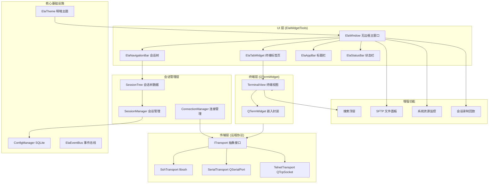
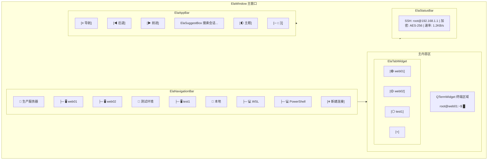
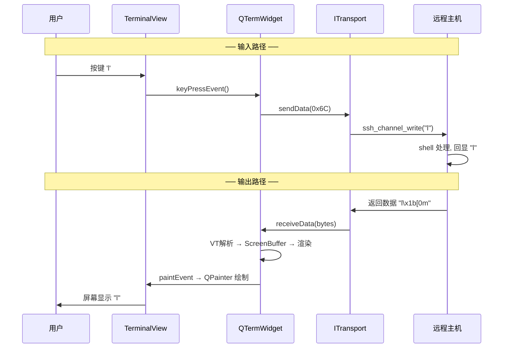
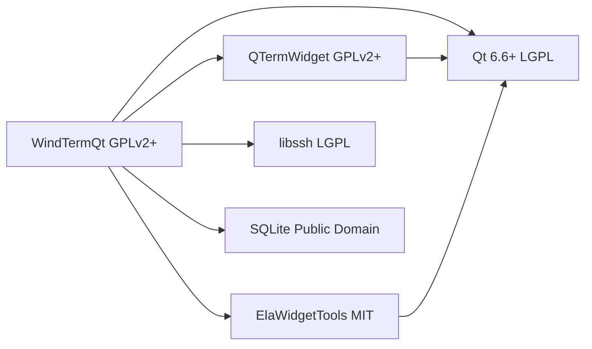
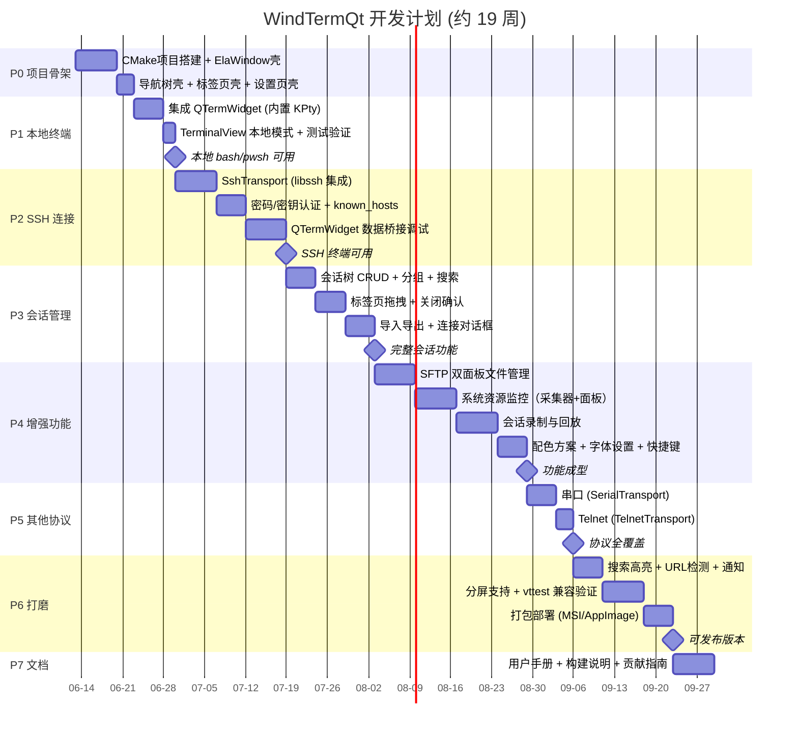

# WindTermQt — 全功能终端 & SSH 客户端设计文档

> **日期**: 2026-06-13  
> **许可证**: GPLv2+  
> **技术栈**: Qt 6.6+ / ElaWidgetTools / QTermWidget / libssh

---

## 1. 项目概述

基于 **ElaWidgetTools** (FluentUI 风格 Qt 组件库) 和 **QTermWidget** (成熟终端仿真控件) 开发一款开源全功能终端模拟器与 SSH 客户端，对标 WindTerm / Xshell。

**目标平台**: Windows + Linux + macOS  
**核心能力**: 多标签终端 | SSH/Telnet/串口/本地Shell | SFTP文件传输 | 远程系统资源监控 | 会话录制回放 | 明暗主题

---

## 2. 整体架构



---

## 3. 模块分层详解

```
┌──────────────────────────────────────────────────────────────────┐
│                         App 入口 (main.cpp)                       │
│                    ElaApplication::init()                         │
└──────────────────────────┬───────────────────────────────────────┘
                           │
┌──────────────────────────▼───────────────────────────────────────┐
│                     UI 层 (ElaWidgetTools)                         │
│  ┌─────────────┐  ┌──────────────┐  ┌─────────────────────────┐  │
│  │ ElaWindow    │  │ Navigation   │  │ ElaTabWidget             │  │
│  │ 无边框主窗口  │  │ Bar 会话树   │  │ 终端多标签(拖拽/关闭确认)│  │
│  └─────────────┘  └──────────────┘  └─────────────────────────┘  │
│  ┌─────────────┐  ┌──────────────┐  ┌─────────────────────────┐  │
│  │ ElaAppBar    │  │ ElaSuggestBox│  │ ElaStatusBar             │  │
│  │ 标题栏+按钮  │  │ 会话快速搜索 │  │ SSH信息/速率/加密状态    │  │
│  └─────────────┘  └──────────────┘  └─────────────────────────┘  │
└──────────────────────────────────────────────────────────────────┘
                           │
┌──────────────────────────▼───────────────────────────────────────┐
│                  会话 & 连接管理层                                  │
│  ┌──────────────────┐  ┌──────────────────┐  ┌──────────────┐   │
│  │ SessionManager   │  │ ConnectionManager│  │ SessionTree  │   │
│  │ CRUD / 搜索 / 分组│  │ 激活连接 / 重连   │  │ Model 树模型  │   │
│  └────────┬─────────┘  └────────┬─────────┘  └──────────────┘   │
│           │                     │                                 │
│  ┌────────▼─────────────────────▼───────────────────────────┐    │
│  │                  Session (数据对象)                        │    │
│  │  id, name, protocol, host, port, creds, group, tags...    │    │
│  └──────────────────────────────────────────────────────────┘    │
└──────────────────────────────────────────────────────────────────┘
                           │
┌──────────────────────────▼───────────────────────────────────────┐
│                   终端层 (QTermWidget 嵌入)                         │
│  ┌─────────────────────────────────────────────────────────────┐ │
│  │                  TerminalView (容器 QWidget)                  │ │
│  │  ┌─────────────────────────────────────────────────────────┐ │ │
│  │  │              QTermWidget (嵌入式终端引擎)                 │ │ │
│  │  │  VT解析 → ScreenBuffer → 渲染 → 选区 → 搜索 → URL检测   │ │ │
│  │  └─────────────────────────────────────────────────────────┘ │ │
│  │  ┌──────────────────────────────────────────────────────────┐ │ │
│  │  │  TerminalView 双模式:                                     │ │ │
│  │  │                                                           │ │ │
│  │  │  ① 本地终端: QTermWidget 内置 KPty ──→ ConPTY/Unix pty   │ │ │
│  │  │     终端IO直接从 KPty 收发，不经过 ITransport              │ │ │
│  │  │                                                           │ │ │
│  │  │  ② 远程终端: ITransport 数据桥接                          │ │ │
│  │  │     QTermWidget::sendData ──→ ITransport::write           │ │ │
│  │  │     ITransport::readyRead ──→ QTermWidget::receiveData     │ │ │
│  │  └──────────────────────────────────────────────────────────┘ │ │
│  └─────────────────────────────────────────────────────────────┘ │
└──────────────────────────────────────────────────────────────────┘
                           │
┌──────────────────────────▼───────────────────────────────────────┐
│                      远程协议传输层                                │
│  ┌──────────────────────────────────────────────────────────┐    │
│  │               ITransport (纯远程协议接口)                    │    │
│  │  connect() / disconnect() / write() / resize()            │    │
│  │  signals: connected / disconnected / readyRead / error    │    │
│  └──────────────────────────────────────────────────────────┘    │
│        ▲              ▲              ▲                           │
│  ┌─────┴─────┐  ┌─────┴──────┐  ┌────┴───────┐                 │
│  │SshTransport│  │SerialTransport│  │TelnetTransport│             │
│  │ libssh     │  │ QSerialPort  │  │ QTcpSocket  │              │
│  │            │  │              │  │             │              │
│  │ 密码/密钥   │  │ 波特率/校验   │  │ 简单TCP     │              │
│  │ SFTP/SCP   │  │ 流控制       │  │ 无加密      │              │
│  └───────────┘  └─────────────┘  └────────────┘                │
│                                                                  │
│  ⚠ 本地终端不经过 ITransport，由 QTermWidget 内置 KPty 直接处理    │
│  (Windows: ConPTY / Unix: pty)                                   │
└──────────────────────────────────────────────────────────────────┘
└──────────────────────────────────────────────────────────────────┘
```

---

## 4. UI 布局设计



### 页面路由 (ElaWindow 导航系统)

```
ElaNavigationBar 节点树:
├── 🖥  终端 (T_Terminal)          ← 主界面 (默认页)
├── 🔗 连接管理器 (T_Connections)   ← 批量管理连接配置
├── 📂 文件传输 (T_FileTransfer)    ← SFTP 双面板
├── 🎬 历史回放 (T_History)        ← 会话录像回放
├── 🔑 密钥管理 (T_KeyManager)     ← SSH 密钥生成/导入/Agent
└── ⚙️  设置 (T_Settings)          ← 外观/终端/键盘/安全性
```

### 终端交互模型

```
┌──────────────────────────────────────────────────────────────┐
│  [ 只读输出区 ]                        ← 历史命令输出         │
│  $ ls -la                                                    │
│  drwxr-xr-x  2 root root 4096 ...                            │
│  ──────────────── 回滚缓冲区边界(可滚动回看) ────────────────    │
│  [ 远程交互区 ]                        ← viewport 可见区域    │
│  $ vim main.cpp                    ← vim 接管全屏              │
│  ~                                                           │
│  █                                          ← 光标在远程控制下  │
├──────────────────────────────────────────────────────────────┤
│  [ 本地命令条 ](可选)                  ← 类似 IDE 终端快捷命令  │
└──────────────────────────────────────────────────────────────┘
```

| 交互行为 | 回滚输出区 | 远程交互区 | 说明 |
|----------|:---:|:---:|------|
| 键盘输入 | ❌ | ✅ 发送远程 | 编码后经 Transport 发出 |
| 鼠标选中 | ✅ | ✅ | 网格坐标选区，复制到剪贴板 |
| 可编辑 | ❌ | 编辑效果由远程控制 | 终端无本地编辑概念 |
| 右键菜单 | 复制/搜索 | 复制/粘贴/搜索 | |

> **为什么不用 Qt 文本控件**：QTextEdit / QPlainTextEdit / ElaPlainTextEdit 都有自己的光标系统和编辑模型，与终端远程控制模型根本冲突。终端的每一像素内容都由远程 shell 控制，本地键盘只是字节管道。**QTermWidget 完整封装了这一模型**——VT 解析、缓冲区、选区、渲染全部内置。

---

## 5. 数据流

### 本地终端数据流 (QTermWidget 内置 KPty)

```
═══════════════ 输入路径 (Qt 键盘 → KPty → Shell进程) ═══════════════

QKeyEvent (用户按键)
  → QTermWidget 内部 KeyHandler
    → KPty::write(bytes)
      → Windows: ConPTY API / Unix: pty slave
        → Shell 进程 stdin

═══════════════ 输出路径 (Shell进程 → KPty → Qt 渲染) ═══════════════

Shell 进程 stdout
  → KPty::read(bytes)
    → QTermWidget 内部 VTParser
      → ScreenBuffer 更新 Cell 矩阵
        → 渲染器脏区标记
          → QWidget::update()
            → paintEvent: QPainter 绘制字符网格

🔑 关键: QTermWidget 通过内置 KPty 封装了 ConPTY(Windows)/pty(Unix)，
        本地终端不需要 ITransport 桥接层。
```

### 远程终端数据流 (ITransport 桥接)

```
═══════════════ 输入路径 (Qt 键盘 → ITransport → 远程) ═══════════════

QKeyEvent (用户按键)
  → TerminalView::keyPressEvent
    → QTermWidget 内部 KeyHandler
      → QTermWidget::sendData 信号
        → ITransport::write(bytes)
          → SshTransport:  ssh_channel_write()
          → SerialTransport: QSerialPort::write()

═══════════════ 输出路径 (远程 → ITransport → Qt 渲染) ═══════════════

远程数据到达
  → ITransport::readyRead(QByteArray) 信号
    → QTermWidget::receiveData(bytes)
      → VTParser 解析序列
        → ScreenBuffer 更新 Cell 矩阵
          → 渲染器脏区标记
            → QWidget::update()
              → paintEvent: QPainter 绘制字符网格
```



---

## 6. SFTP 文件传输面板

```
┌─────────────────────────────────────────────────────────┐
│  SFTP 文件管理器     [🏠 本地目录] [🌐 远程目录] [⬆上传] [⬇下载] │
├──────────────────────┬──────────────────────────────────┤
│ 本地文件系统          │ 远程文件系统 (SFTP)               │
│ ┌──────────────────┐ │ ┌──────────────────────────────┐ │
│ │ 📁 /home/user/   │ │ │ 📁 /var/www/                 │ │
│ │  ├📁 projects/   │ │ │  ├📁 html/                   │ │
│ │  ├📄 config.json │ │ │  ├📄 nginx.conf    2.1KB    │ │
│ │  ├📄 log.txt     │ │ │  ├📄 index.html    4.3KB    │ │
│ │  └📁 downloads/  │ │ │  └📁 logs/                   │ │
│ └──────────────────┘ │ └──────────────────────────────┘ │
├──────────────────────┴──────────────────────────────────┤
│ 📊 传输进度: [████████░░░░░░░░] 45%  ⏸暂停  ✖取消  📌后台│
│ ▸ web-config.tar.gz (12.5/28.3 MB)  ⏱ 剩余 32s         │
│ ▹ backup.sql.gz (0.0/156 MB)       ⏳ 排队中            │
└─────────────────────────────────────────────────────────┘
```

| 组件 | 技术方案 |
|------|----------|
| 文件列表 | `ElaTableView` + 自定义 Model，双面板 |
| 文件图标 | `ElaIcon` 字体图标 (📁 目录 / 📄 文件 / 🔗 链接) |
| 文件操作 | `libssh sftp_*` API — 上传/下载/删除/重命名/chmod |
| 传输队列 | 自定义 `TransferManager`，多任务排队 + 断点续传 |
| 进度条 | `ElaProgressBar` 或自定义绘制，支持暂停/取消/后台 |

---

## 7. 远程系统资源监控（对标 FinalShell / MobaXterm）

### 监控面板布局

```
┌──────────────────────────────────────────────────────────────┐
│  📊 系统资源监控 — web01 (192.168.1.1)        [⚙ 设置] [✖]  │
├──────────────────────────────────────────────────────────────┤
│                                                              │
│  CPU                                                            │
│  ▓▓▓▓▓▓▓▓▓▓▓▓▓▓▓▓▓▓▓▓▓▓▓▓▓▓▓▓▓▓▓▓▓▓▓▓░░░░░░░░  78.3%        │
│  ┌─────────────────────────────────────────────────┐         │
│  │  ▁▂▃▅▄▇▆█▇▅▄▃▂▁▂▃▄▅▆█▇▆▅▄▃▂▁▂▃▄▅▆▇█▇▆▅▄▃  │ ← 实时折线图 │
│  │  CPU0: ████░░ 45%  CPU1: ███░░░ 38%            │         │
│  │  CPU2: ██████ 62%  CPU3: ██████ 65%            │         │
│  └─────────────────────────────────────────────────┘         │
│                                                              │
│  内存                                                          │
│  ▓▓▓▓▓▓▓▓▓▓▓▓▓▓▓▓▓▓▓▓▓▓░░░░░░░░░░░░░░░░░░░░  62.1%           │
│  已用: 9.8 GB / 总共: 15.6 GB    Swap: 512 MB / 2.0 GB        │
│  ┌─────────────────────────────────────────────────┐         │
│  │  ▄▅▆▇█▇▆▅▄▅▆▇█▇▆▅▄▅▆▇█▇▆▅▄▅▆▇█▇▆▅▄▅▆▇█▇▆  │         │
│  └─────────────────────────────────────────────────┘         │
│                                                              │
│  磁盘 (/dev/sda1)                                               │
│  ▓▓▓▓▓▓▓▓▓▓▓▓▓▓▓▓▓▓▓▓▓▓▓▓▓▓▓▓▓▓▓▓░░░░░░░░░░░░  78.5%         │
│  已用: 196 GB / 总共: 250 GB    I/O: R 12MB/s  W 3MB/s        │
│                                                              │
│  网络 (eth0)                                                    │
│  ┌─────────────────────────────────────────────────┐         │
│  │  🔽 下载 ▃▄▅▄▃▂▁▂▃▄▅▆▇█▇▆▅▄▃▂▁▂▃▄▅▆  8.5 MB/s │         │
│  │  🔼 上传 ▁▁▁▁▂▁▁▁▁▁▁▁▂▁▁▁▁▁▁▁▂▁▁▁▁▁▁  1.2 MB/s │         │
│  └─────────────────────────────────────────────────┘         │
│                                                              │
│  系统信息                                                       │
│  系统: Ubuntu 22.04 LTS | 内核: 5.15.0-91 | 运行: 45天        │
│  负载: 1.23 / 0.89 / 0.65 | 进程数: 342                       │
└──────────────────────────────────────────────────────────────┘
```

### 实现原理

```
════════════ 无 Agent 模式（纯 SSH exec 采集） ════════════

┌─────────────┐     SSH Channel (exec)     ┌──────────────┐
│ MonitorAgent│ ──── cat /proc/stat ────→ │ 远程 Linux   │
│ (本地)      │ ←─── cpu_raw_data ─────── │              │
│            │ ──── free -b ────────────→ │              │
│            │ ←─── mem_raw_data ──────── │              │
│            │ ──── df -B1 ─────────────→ │              │
│  QTimer    │ ←─── disk_raw_data ─────── │              │
│  每 2 秒   │ ──── cat /proc/net/dev ──→ │              │
│  轮询      │ ←─── net_raw_data ──────── │   /proc/*   │
│            │ ──── uptime ────────────→  │              │
│            │ ←─── load_data ─────────── │              │
└─────────────┘                           └──────────────┘

════════════ Agent 模式（推送，低开销） ═════════════

┌─────────────┐     SSH Channel (shell)    ┌──────────────┐
│ MonitorAgent│ ←═══ JSON 数据流 ═══════ │  守护脚本     │
│ (本地)      │     {"ts":123,"cpu":78,    │  (Python/Go) │
│            │      "mem":62,"disk":78,   │              │
│            │      "net_rx":8.5,...}     │              │
└─────────────┘                           └──────────────┘
```

### 数据采集命令对照表

| 指标 | Linux 数据源 | macOS 数据源 | Windows (远程) |
|------|-------------|-------------|---------------|
| CPU | `/proc/stat` | `sysctl -n machdep.cpu` | `wmic cpu` |
| 内存 | `/proc/meminfo` | `sysctl -n hw.memsize` + `vm_stat` | `wmic os get FreePhysicalMemory` |
| 磁盘 | `df` + `/proc/diskstats` | `df` + `diskutil` | `wmic logicaldisk` |
| 网络 | `/proc/net/dev` | `netstat -ib` | `Get-NetAdapterStatistics` |
| 负载 | `/proc/loadavg` | `sysctl -n vm.loadavg` | `Get-CimInstance Win32_Processor` |
| 进程 | `ps aux --no-headers \| wc -l` | `ps aux \| wc -l` | `Get-Process` |

### 类设计

```cpp
// 监控数据 → UI 的数据对象
struct MonitorData {
    double cpuPercent;              // CPU 使用率 0-100
    QVector<double> cpuPerCore;     // 每核使用率
    quint64 memTotal, memUsed;      // 内存 (字节)
    quint64 swapTotal, swapUsed;
    struct DiskInfo {
        QString mountPoint, device;
        quint64 total, used;
        quint64 readBytesPerSec, writeBytesPerSec;
    };
    QVector<DiskInfo> disks;
    quint64 netRxBytesPerSec, netTxBytesPerSec;
    double loadAvg1, loadAvg5, loadAvg15;
    int processCount;
    QString osName, kernelVer, uptime;
};

// 采集抽象 — 支持不同采集策略
class IMonitorCollector : public QObject {
    Q_OBJECT
public:
    virtual void start() = 0;
    virtual void stop() = 0;
    virtual void setInterval(int ms) = 0;
signals:
    void dataReady(const MonitorData &data);
    void error(const QString &msg);
};

// SSH exec 采集（无 Agent 模式，兼容性最好）
class SshExecCollector : public IMonitorCollector {
    // 通过 ssh_channel_exec() 执行命令，解析输出
    // 优点：无需远端部署，兼容所有 Linux/macOS
    // 缺点：每次采集建立 exec 通道，有连接开销 (~50ms)
};

// SSH 流式采集（Agent 模式，低开销）
class SshAgentCollector : public IMonitorCollector {
    // 部署轻量脚本到 /tmp，stdout 持续输出 JSON
    // 优点：开销极小，适合长时间监控
    // 缺点：首次需部署脚本（自动完成）
};

// 本地监控（Qt 原生）
class LocalCollector : public IMonitorCollector {
    // QProcess 执行命令 / QStorageInfo / QNetworkInterface
};
```

### 可视化控件

| 数据 | 控件 | 方案 |
|------|------|------|
| CPU/内存/磁盘 百分比 | `ElaProgressBar` | 条形 + 数值标签，颜色随阈值变化 |
| 历史趋势折线图 | 自定义 `SparkLineWidget` | 轻量 QPainter 路径，FIFO 缓冲区 60 点 |
| 网络速率 | `SparkLineWidget` + `ElaText` | 实时数值 + 迷你趋势线 |
| 系统信息 | `ElaText` | 静态信息行 |

```cpp
// 迷你趋势图控件（~60 行）
class SparkLineWidget : public QWidget {
    Q_OBJECT
public:
    void pushValue(double v) {
        m_history.append(v);
        if (m_history.size() > m_maxPoints) m_history.removeFirst();
        update();
    }
protected:
    void paintEvent(QPaintEvent *) override {
        QPainter p(this);
        p.setRenderHint(QPainter::Antialiasing);
        QPainterPath path;
        for (int i = 0; i < m_history.size(); ++i) {
            double x = i * width() / (double)m_maxPoints;
            double y = height() - (m_history[i] / 100.0) * height();
            (i == 0) ? path.moveTo(x, y) : path.lineTo(x, y);
        }
        p.setPen(QPen(ElaThemeColor(...), 1.5));
        p.drawPath(path);
    }
private:
    QVector<double> m_history;
    int m_maxPoints = 60;  // 60 个采样点 ≈ 2 分钟 (2s 间隔)
};
```

### UI 嵌入方式

```
主布局: 终端右侧可展开/收折的监控面板

┌───────────┬──────────────────┬────────────────────┐
│Navigation │  TerminalTabs    │ MonitorPanel       │
│Bar        │                  │ (可收折)            │
│(会话树)    │  QTermWidget     │ ┌────────────────┐ │
│           │                  │ │ 📊 CPU  78%    │ │
│           │                  │ │ ▁▂▃▅▄▇▆█▇▅▄▃  │ │
│           │  root@web01:~$   │ │ 🧠 MEM  62%    │ │
│           │  $ ls -la        │ │ ▄▅▆▇█▇▆▅▄▅▆  │ │
│           │                  │ │ 💾 DISK 78%    │ │
│           │                  │ │ ▓▓▓▓▓▓▓▓▓▓▓░  │ │
│           │                  │ │ 🌐 NET ↓8.5M  │ │
│           │                  │ │ ▃▄▅▄▃▂▁▂▃▄▅  │ │
│           │                  │ └────────────────┘ │
│           │                  │  [📌 钉住] [📋 详细]│
├───────────┴──────────────────┴────────────────────┤
│ ElaStatusBar: SSH:root@web01 | ⬆ 1.2MB/s ⬇ 8.5MB/s │
└────────────────────────────────────────────────────┘
```

---

## 8. 会话录制与回放

```
录制流程:
  ITransport::readyRead(QByteArray)
    → QTermWidget::receiveData     (喂给终端)
    → RecordingManager::appendData (同时写入 ttyrec 文件)
        ├── 时间戳 (epoch ms)
        └── 数据块 (原始 bytes)

回放流程:
  PlaybackWidget
    → 读取 .ttyrec 文件
    → 按时间戳用 QTimer 逐块喂入 QTermWidget
    → 用户看到完整的终端重现
    → 控制: ▶播放 ⏸暂停 ⏩快进 ⏪慢放
```

| 项目 | 方案 |
|------|------|
| 录制格式 | ttyrec (行业标准，可与其他工具互操作) |
| 回放控件 | `ElaSlider` 时间轴 + `ElaPushButton` 播放控制 |
| 速度控制 | 0.5x / 1x / 2x / 5x |
| 导出 | 可选 .cast (asciinema) 或 .gif |

---

## 9. 配置存储方案 (SQLite)

```sql
-- 会话配置表
CREATE TABLE sessions (
    id          INTEGER PRIMARY KEY,
    name        TEXT NOT NULL,
    group_name  TEXT,
    protocol    TEXT NOT NULL,  -- 'ssh', 'local', 'serial', 'telnet'
    host        TEXT,
    port        INTEGER,
    username    TEXT,
    auth_type   TEXT,           -- 'password', 'key', 'agent'
    key_path    TEXT,
    terminal    TEXT DEFAULT 'xterm-256color',
    color_scheme TEXT DEFAULT 'system',
    font_family TEXT,
    font_size   INTEGER DEFAULT 12,
    tags        TEXT,           -- JSON 数组
    sort_order  INTEGER,
    created_at  TEXT,
    updated_at  TEXT
);

-- 外观配置
CREATE TABLE appearance (
    key   TEXT PRIMARY KEY,
    value TEXT
);
-- 示例行: 'theme_mode', 'dark'
--        'language', 'zh_CN'
--        'window_geometry', '...'

-- 快捷键配置
CREATE TABLE keybindings (
    action    TEXT,
    shortcut  TEXT,
    PRIMARY KEY (action)
);

-- 录制历史
CREATE TABLE recordings (
    id          INTEGER PRIMARY KEY,
    session_id  INTEGER,
    file_path   TEXT,
    started_at  TEXT,
    duration_ms INTEGER,
    FOREIGN KEY (session_id) REFERENCES sessions(id)
);
```

---

## 10. 技术选型总结

| 层 | 选型 | 版本要求 | 许可证 | 理由 |
|------|------|:---:|:---:|------|
| **UI 框架** | ElaWidgetTools | 2.0.3 | MIT | FluentUI 风格，70 组件开箱即用 |
| **Qt** | Qt | 6.6+ | LGPL | 跨平台，Ela 依赖 |
| **终端仿真** | QTermWidget | 2.1+ | GPLv2+ | 20 年验证的 Konsole 引擎，内嵌即可 |
| **SSH 协议** | libssh | 0.10+ | LGPL | SFTP/SCP/known_hosts/Agent 全套 |
| **本地终端** | QTermWidget 内置 KPty | — | GPLv2+ | KPty 直接对接 ConPTY(Win)/pty(Unix)，无需额外 PTY 层 |
| **串口** | QSerialPort | — | LGPL | Qt 原生 |
| **配置存储** | SQLite | — | Public Domain | Qt 内置驱动 |
| **构建系统** | CMake | 3.20+ | BSD | Qt 生态标准 |
| **测试** | QtTest + Catch2 | — | Boost/BSL | 单元 + 集成测试 |
| **安装打包** | CPack / WIX | — | — | Windows MSI + Linux AppImage |

**核心依赖关系图**:



---

## 11. 目录结构

```
WindTermQt/
├── CMakeLists.txt                  ← 顶层 CMake
├── README.md
├── README_zh.md
├── LICENSE                         ← GPLv2+
├── CHANGELOG.md
├── .gitignore
│
├── resources/
│   ├── resources.qrc               ← Qt 资源文件
│   ├── icons/                      ← 应用图标
│   │   ├── app.ico
│   │   ├── app.png
│   │   └── tray/
│   └── translations/               ← 国际化
│       ├── windtermqt_zh.ts
│       └── windtermqt_en.ts
│
├── src/
│   ├── CMakeLists.txt
│   ├── main.cpp                    ← 入口
│   │
│   ├── app/                        ← 应用层
│   │   ├── Application.h/cpp       ← ElaApplication 初始化
│   │   └── MainWindow.h/cpp        ← ElaWindow 子类，主窗口
│   │
│   ├── core/                       ← 核心基础设施
│   │   ├── ConfigManager.h/cpp     ← SQLite 配置读写
│   │   ├── Session.h               ← Session 数据对象
│   │   └── Constants.h             ← 全局常量/枚举
│   │
│   ├── sessions/                   ← 会话管理
│   │   ├── SessionManager.h/cpp    ← CRUD/搜索/导入导出
│   │   ├── SessionTreeModel.h/cpp  ← 会话树数据模型
│   │   ├── SessionTreeWidget.h/cpp ← ElaNavigationBar 封装
│   │   └── SessionDialog.h/cpp     ← 新建/编辑会话对话框
│   │
│   ├── monitor/                    ← 系统资源监控
│   │   ├── IMonitorCollector.h     ← 采集器抽象接口
│   │   ├── SshExecCollector.h/cpp  ← SSH exec 采集（无Agent）
│   │   ├── SshAgentCollector.h/cpp ← SSH 流式采集（Agent模式）
│   │   ├── LocalCollector.h/cpp    ← 本地系统采集
│   │   ├── MonitorPanel.h/cpp      ← 监控侧边面板
│   │   └── SparkLineWidget.h/cpp   ← 迷你趋势图控件
│   │
│   ├── terminal/                   ← 终端封装
│   │   ├── TerminalView.h/cpp      ← QTermWidget 容器 + SSH桥接
│   │   ├── TerminalTabWidget.h/cpp ← 多标签管理 (ElaTabWidget)
│   │   └── SearchOverlay.h/cpp     ← Ctrl+F 搜索浮层
│   │
│   ├── transport/                  ← 远程协议传输层
│   │   ├── ITransport.h            ← 纯远程协议抽象接口
│   │   ├── SshTransport.h/cpp      ← libssh 实现
│   │   ├── SerialTransport.h/cpp   ← 串口 (QSerialPort)
│   │   └── TelnetTransport.h/cpp   ← Telnet (QTcpSocket)
│   │   (注: 本地终端由 QTermWidget 内置 KPty 处理，不走 ITransport)
│   │
│   ├── filetransfer/               ← SFTP 文件传输
│   │   ├── SftpPanel.h/cpp         ← 双面板文件管理器
│   │   ├── TransferManager.h/cpp   ← 传输队列管理
│   │   └── SftpModel.h/cpp         ← 远程文件系统 Model
│   │
│   ├── recording/                  ← 会话录制回放
│   │   ├── RecordingManager.h/cpp  ← ttyrec 录制引擎
│   │   └── PlaybackWidget.h/cpp    ← 回放控件
│   │
│   ├── settings/                   ← 设置页面
│   │   ├── SettingsPage.h/cpp      ← 设置主页面壳
│   │   ├── AppearancePage.h/cpp    ← 主题/字体/配色
│   │   ├── TerminalPage.h/cpp      ← 终端仿真配置
│   │   └── KeyBindPage.h/cpp       ← 快捷键编辑器
│   │
│   └── utils/                      ← 工具类
│       ├── KeyringManager.h/cpp    ← 密钥/凭据安全存储
│       └── StringUtils.h/cpp       ← 字符串/编码工具
│
├── tests/
│   ├── CMakeLists.txt
│   ├── tst_transport.cpp           ← Transport 接口测试
│   ├── tst_config.cpp              ← 配置读写测试
│   ├── tst_session.cpp             ← 会话管理测试
│   └── tst_vt_parser.cpp           ← 终端兼容性测试
│
├── third_party/
│   └── qtermwidget/                ← git submodule
│
├── cmake/
│   ├── FindQTermWidget.cmake
│   └── DeployQt.cmake              ← 打包辅助
│
└── packaging/
    ├── windows/
    │   └── installer.wxs           ← WIX 安装包
    └── linux/
        └── appimage.yml            ← AppImage 配置
```

---

## 12. 项目计划 (8 阶段)



| 阶段 | 核心产出 | 时间 |
|:---:|------|:---:|
| **P0** 骨架 | CMake 项目、ElaWindow 带导航/标签页/设置页空壳 | 1.5 周 |
| **P1** 本地终端 | QTermWidget 集成 (内置 KPty → ConPTY/pty)，本地 shell 直接可用 | 1 周 |
| **P2** SSH 连接 | SshTransport 完整实现，密码/密钥认证，SSH 终端可用 | 3 周 |
| **P3** 会话管理 | 会话树 CRUD、分组、搜索、导入导出、连接对话框 | 2 周 |
| **P4** 增强功能 | SFTP 面板、系统资源监控、录制回放、配色/字体、快捷键 | 5.5 周 |
| **P5** 其他协议 | 串口 + Telnet 完整支持 | 1.5 周 |
| **P6** 打磨 | vttest 验证、分屏、打包部署 (MSI/AppImage) | 2.5 周 |
| **P7** 文档 | 用户手册、构建说明、README、贡献指南 | 1 周 |

> **总计约 21 周 (~5.5 个月)**，按单人全职估算。若多人协作，P0-P2 可缩短至 4-6 周出 MVP。

### 里程碑定义

| 里程碑 | 判定标准 |
|------|------|
| ✅ P1 完成 | 在本地 shell 中执行 `vim`、`htop`、`tmux` 显示正常 |
| ✅ P2 完成 | SSH 密码和密钥两种方式连接远程主机，vim/htop 正常 |
| ✅ P3 完成 | 5 个以上会话可分组管理，标签页拖拽切换流畅 |
| ✅ P4 完成 | SFTP 可用，CPU/内存/磁盘/网络实时监控显示正确，录制回放时间轴正常 |
| ✅ P6 完成 | vttest 通过率 ≥95%，Windows MSI 和 Linux AppImage 可安装运行 |

---

## 13. 关键设计决策记录

| 决策 | 选择 | 备选 | 理由 |
|------|:---:|------|------|
| 终端引擎 | QTermWidget | 自研 VT Parser / libvterm 自绘 | 20 年验证，KPty 内置 Windows ConPTY/Unix pty，开箱即用 |
| 本地 PTY | QTermWidget 内置 KPty | winpty / 自调 ConPTY | QTermWidget 自带 KPty 直接对接 ConPTY(Win)+pty(Unix)，零额外依赖；无需 ITransport 桥接 |
| SSH 库 | libssh | libssh2 | SFTP/SCP/Agent/known_hosts 全套，API 更现代 |
| 渲染后端 | QPainter (QWidget) | QOpenGLWidget | 日常使用 60fps 足够，硬件加速已覆盖；留接口未来可切 |
| 录制格式 | ttyrec | 自定义格式 | 行业标准，可与其他工具互操作 |
| 构建系统 | CMake | qmake | Qt 6 官方推荐，ElaWidgetTools 已用 |
| 配置存储 | SQLite | JSON/INI 文件 | 会话量大时查询快，Qt 内置驱动 |
| 许可证 | GPLv2+ | MIT | QTermWidget 要求；开源生态兼容 |
| 架构模式 | 单体分层 | 多进程 | 开发效率优先，崩溃隔离非刚需 |
| 资源监控采集 | SSH exec 优先 | Agent 推送 | 无需远端部署，兼容性好；Agent 模式后续优化 |
| 监控图表 | 自定义 SparkLine | QChart / QCustomPlot | 轻量（~60行），零依赖，终端风格统一 |

---

## 14. 风险与缓解

| 风险 | 概率 | 影响 | 缓解措施 |
|------|:---:|:---:|------|
| QTermWidget SSH 桥接兼容性 | 中 | 高 | P2 预留 3 周调试时间；备选：直接对接 libvterm |
| libssh 线程安全 | 低 | 中 | 所有 I/O 走 Qt 事件循环 + 单独 QThread |
| QTermWidget KPty 跨平台兼容性 | 低 | 中 | QTermWidget 内置 KPty 已封装 ConPTY(Win)/pty(Unix)，由 LXQt 社区维护；CI 矩阵测试 |
| QTermWidget 上游停维 | 低 | 高 | LXQt 项目活跃；备选：fork + 自行维护 |
| Qt 6 版本碎片 | 低 | 低 | 锁定 ≥6.6 LTS，CI 多版本矩阵 |
| 远程系统 /proc 路径差异 | 中 | 中 | 采集命令按 OS 适配表执行；失败自动降级隐藏对应指标 |
| SSH exec 采集开销 | 低 | 低 | 默认 2s 间隔；多 exec 合并为一次复合命令；Agent 模式后期可选 |
